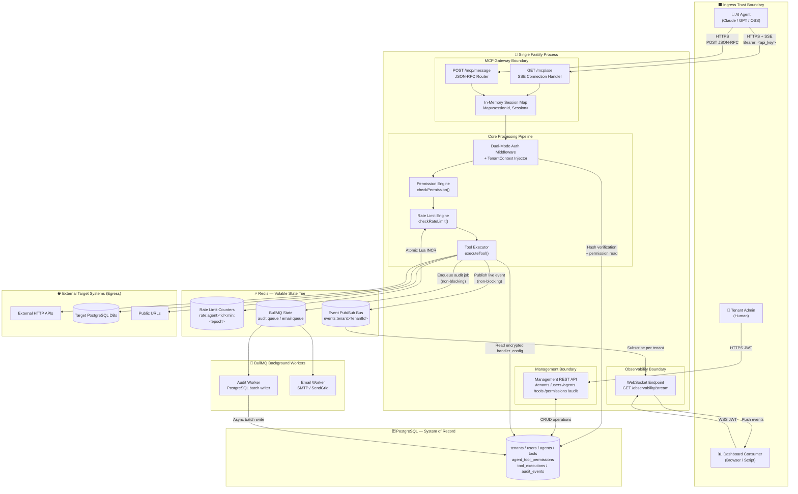
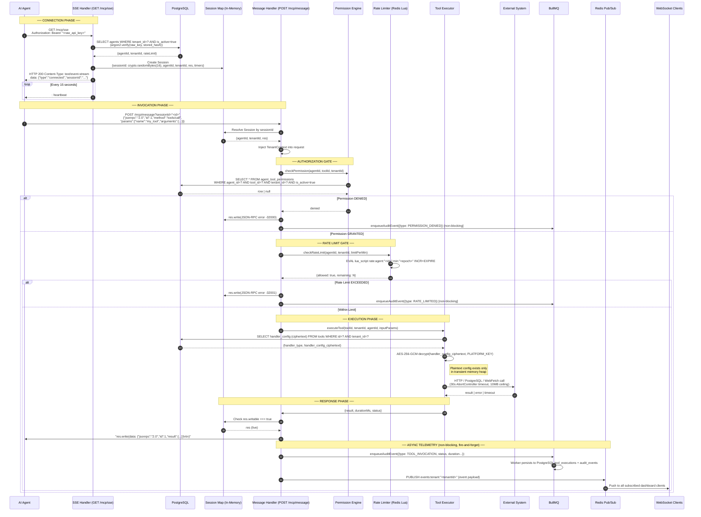

# AgentGate — High-Level Design & MVP Execution Plan

**Document Type:** Principal Architecture Reference
**Scope:** Phase 1 (MVP) — 2-Month Build
**Status:** Authoritative. No contradictions. Supersedes prior drafts.

---

## Table of Contents

1. [System Topology & Boundary Map](#1-system-topology--boundary-map)
2. [tools/call Full Request Lifecycle Diagram](#2-toolscall-full-request-lifecycle-diagram)
3. [The JSON-RPC over SSE State Machine](#3-the-json-rpc-over-sse-state-machine)
4. [MVP Execution Roadmap — Order of Operations](#4-mvp-execution-roadmap--order-of-operations)
5. [The Dependency Chain — Why This Order](#5-the-dependency-chain--why-this-order)
6. [Risk Surface & What to Prove at Each Milestone](#6-risk-surface--what-to-prove-at-each-milestone)

---

## 1. System Topology & Boundary Map

AgentGate is a **single Fastify process** serving two distinct traffic personalities, backed by two distinct storage tiers, and producing two distinct output streams. The five operational boundaries below are the conceptual frame for every design decision in the MVP.



### Boundary Responsibility Summary

| Boundary | Auth Model | Primary Storage | Blocking? |
|---|---|---|---|
| **MCP Gateway** | Agent API Key (hashed Argon2) | In-memory Session Map | No (SSE async) |
| **Management REST** | JWT (access + refresh) | PostgreSQL | No (standard request) |
| **Core Pipeline** | Inherits from middleware | PostgreSQL + Redis | No (all I/O async) |
| **Observability** | User JWT | Redis Pub/Sub | No (push only) |
| **Async (BullMQ)** | Internal trust | PostgreSQL | Off the hot path |

---

## 2. tools/call Full Request Lifecycle Diagram

This is the complete call trace for the most critical path in the system. Every numbered step maps directly to a testable unit in the execution plan.



### Critical Observations from the Lifecycle

**The session map is the architectural linchpin.** The `POST /mcp/message` arrives on a completely different HTTP connection than the `GET /mcp/sse`. The session map is the only bridge between them — the only way `MSG_H` can find `res` to write a response. This is the hardest thing to get right.

**The telemetry fan-out (steps 23–25) must never block the response.** The call to `enqueueAuditEvent` and `PUBLISH` happen *after* the response is written to the SSE stream. They must be fire-and-forget. An audit infrastructure failure must never cause a gateway failure.

**The `res.writable` check (step 20) is not optional.** It is the safety net against writing to a dead stream. Without it, a tool execution that takes 29 seconds could attempt to write to a session that was garbage-collected due to client disconnect at second 28 — crashing the Node.js process.

---

## 3. The JSON-RPC over SSE State Machine

### 3.1 The Core Architectural Challenge

Before presenting the state machine, it is essential to internalize the fundamental tension at the heart of the MCP transport.

**SSE is a unidirectional protocol.** Data flows server → client only. JSON-RPC is inherently bidirectional: the client sends a request, the server sends a response. MCP resolves this by splitting communication across **two separate HTTP channels**:

```
                    ┌─────────────────────────────────────┐
                    │  Single Fastify Process              │
Agent               │                                      │
  │                 │  GET /mcp/sse ──────►  SSE Handler   │
  │ SSE Stream ◄────────────────────────────────────────── │
  │                 │                          ▲  write()  │
  │                 │                          │            │
  │ POST /message ──────►  Msg Handler ────────┘            │
  │                 │     (resolves session,                │
  │                 │      finds res object)                │
  └─────────────────────────────────────────────────────────┘
```

The `POST /message` knows nothing about the `GET /sse` connection by itself. The `sessionId` query parameter is the only shared key. This creates the following non-negotiable architectural constraints:

**Constraint 1 — Single-process for MVP.** The `res` (HTTP response object) is a live Node.js `http.ServerResponse`. It cannot be serialized. It cannot be sent over Redis. It lives in the heap of exactly one process. The in-memory session map therefore creates a hard coupling between the SSE connection and the process instance. **Horizontal scaling requires sticky sessions (load balancer session affinity) as a Phase 2 concern. Document this now.**

**Constraint 2 — The session map is the blast radius.** Every active agent connection is an entry in the session map. Map leaks = memory leaks = OOM. Every code path that can exit the connection lifecycle (disconnect, timeout, error, crash) must call the same `cleanupSession(sessionId)` function. There cannot be multiple cleanup paths — that way lies double-free bugs.

**Constraint 3 — Node.js concurrency model.** The event loop is single-threaded. A slow `executeTool()` call (e.g., 25 seconds waiting on a Postgres query) yields control back to the loop while awaiting. During that 25 seconds, another agent's `POST /message` arrives, is processed, and its result is written to its own SSE stream — correctly. The serialization is natural. The risk is not concurrency corruption; it is **queue depth starvation**: if 50 agents all invoke 30-second tools simultaneously, the Node.js microtask queue backs up. The 30-second timeout on all handlers is the guardrail against this becoming OOM.

---

### 3.2 The SSE Connection State Machine

```
  ┌─────────────────────────────────────────────────────────────────────┐
  │                                                                     │
  │  INITIAL STATE: No Session                                          │
  │                                                                     │
  └────────────────────────────┬────────────────────────────────────────┘
                               │
                               │  Agent sends: GET /mcp/sse
                               │  Authorization: Bearer <raw_key>
                               ▼
  ┌─────────────────────────────────────────────────────────────────────┐
  │  STATE: AUTHENTICATING                                              │
  │  • Hash raw_key with argon2.verify() against stored hash            │
  │  • Validate agent.is_active === true                                │
  │  • Validate tenant is not suspended                                 │
  └──────────────┬──────────────────────────────┬───────────────────────┘
                 │ Auth OK                       │ Auth FAIL
                 ▼                               ▼
  ┌──────────────────────────┐      HTTP 401 Unauthorized
  │  STATE: CONNECTED        │      (stream never opened)
  │                          │
  │  Actions performed:      │
  │  • Set SSE headers       │
  │  • Write sessionId event │◄──────────────────────────────────────┐
  │  • Store in Session Map  │                                        │
  │    {sessionId,           │                                        │
  │     agentId,             │                                        │
  │     tenantId,            │                                        │
  │     res,                 │                                        │
  │     heartbeatTimer,      │                                        │
  │     idleTimer}           │                                        │
  │  • Start heartbeat (15s) │                                        │
  │  • Start idle timer (5m) │                                        │
  └──────────┬───────────────┘                                        │
             │                                                         │
             │  Every 15 seconds                                       │
             ▼                                                         │
  ┌──────────────────────────┐                                         │
  │  HEARTBEAT TICK          │                                         │
  │  res.write(              │                                         │
  │    ': heartbeat\n\n')    │                                         │
  └──────────┬───────────────┘                                         │
             │ (returns to CONNECTED)                                  │
             └─────────────────────────────────────────────────────────┘

  ┌─────────────────────────────────────────────────────────────────────┐
  │  EVENT: POST /message?sessionId=<id> received                      │
  └──────────────────────┬──────────────────────────────────────────────┘
                         │
                         ▼
  ┌─────────────────────────────────────────────────────────────────────┐
  │  STATE: PROCESSING                                                  │
  │  • Reset idleTimer (clear + restart 5-minute countdown)            │
  │  • Resolve session from Map                                         │
  │  • Parse JSON-RPC body                                              │
  │  • Route to tools/list or tools/call handler                        │
  │  • Execute pipeline: checkPermission → checkRateLimit → executeTool │
  │  • Await result (up to 30s timeout)                                 │
  └──────────────────────┬──────────────────────────────────────────────┘
                         │
                         ▼
  ┌─────────────────────────────────────────────────────────────────────┐
  │  STATE: RESPONDING                                                  │
  │                                                                     │
  │  CRITICAL INVARIANT: Before every res.write():                      │
  │    if (!session || !session.res.writable) {                         │
  │      scheduleSessionCleanup(sessionId)                              │
  │      return  // NEVER throw, NEVER crash the process               │
  │    }                                                                │
  │                                                                     │
  │  Write: data: {"jsonrpc":"2.0","id":N,"result":...}\n\n             │
  │  OR:    data: {"jsonrpc":"2.0","id":N,"error":{...}}\n\n            │
  │                                                                     │
  │  After write: enqueueAuditEvent() + Redis PUBLISH (both async)     │
  └──────────────────────┬──────────────────────────────────────────────┘
                         │
                         │ (returns to CONNECTED state, awaiting next POST)
                         ▼
                   [BACK TO CONNECTED]

  ════════════════════════════════════════
  TERMINATION CONDITIONS (Any can trigger)
  ════════════════════════════════════════

  ┌─────────────────────────────────────────────────────────────────────┐
  │  TRIGGER: Client Disconnect (TCP close / ECONNRESET)               │
  │  Handler: req.raw.on('close', () => cleanupSession(sessionId))     │
  └──────────────────────┬──────────────────────────────────────────────┘
                         │
  ┌─────────────────────────────────────────────────────────────────────┐
  │  TRIGGER: Idle Timeout (5 minutes, no POST received)               │
  │  Handler: idleTimer fires → cleanupSession(sessionId)              │
  └──────────────────────┬──────────────────────────────────────────────┘
                         │
  ┌─────────────────────────────────────────────────────────────────────┐
  │  TRIGGER: Graceful Shutdown (SIGTERM received)                     │
  │  Handler: Iterate all sessions → res.end() → cleanupSession()      │
  └──────────────────────┬──────────────────────────────────────────────┘
                         │
                         ▼
  ┌─────────────────────────────────────────────────────────────────────┐
  │  cleanupSession(sessionId) — THE SINGLE CLEANUP FUNCTION           │
  │                                                                     │
  │  1. clearInterval(session.heartbeatTimer)                          │
  │  2. clearTimeout(session.idleTimer)                                │
  │  3. if (session.res.writable) session.res.end()                    │
  │  4. sessionMap.delete(sessionId)                                   │
  │  5. Log: "session closed: {sessionId, agentId, reason}"            │
  └─────────────────────────────────────────────────────────────────────┘
```

### 3.3 Memory Leak Vectors — Explicit Catalog

Every leak vector must be addressed before M6 code review sign-off.

| Vector | Cause | Mitigation |
|---|---|---|
| Session Map growth | Client disconnects but `close` event never fires (proxy drops TCP silently) | Idle timeout (5 min) is the backstop — always fires regardless of TCP state |
| Dangling heartbeat interval | `cleanupSession` not called on disconnect | Single cleanup function clears interval. No other code path closes sessions. |
| Dangling idle timeout | Same as above | Same mitigation |
| Redis pub/sub subscriber leak | WebSocket closes but Redis `UNSUBSCRIBE` not called | WebSocket `close` event triggers Redis unsubscribe + subscriber object GC |
| BullMQ queue backpressure | Audit worker slower than enqueue rate | Monitor queue depth; dead-letter queue; alert threshold at 1000 jobs pending |
| PostgreSQL handler connection leak | External PG connection opened but never closed on timeout | AbortController signal passed to pg driver; `finally` block calls `client.end()` |

---

## 4. MVP Execution Roadmap — Order of Operations

**Governing principle:** Build the systems that say "No" before the systems that say "Yes." Every security boundary must exist before any feature that crosses it.

**Dependency chain:**
```
M1 → M2 → (M3 ∥ M4) → M5 → M6 → M7 → M8
```
M3 and M4 can be built in parallel by two engineers. Everything else is strictly sequential.

---

### Milestone 1 — Platform Skeleton, Multi-Tenancy & Auth Foundation

**Duration target:** Days 1–10
**Why this is first:** Every entity in this system belongs to a tenant. If tenant scoping is not the foundation, isolation becomes a retrofit — the most dangerous kind of security bug. The `TenantContext` middleware is the single point of enforcement for all downstream data access. It must exist before any other endpoint is written. JWT auth must be proven before agents or tools exist.

#### Steps

**1.1 — Project Initialization**
Initialize Fastify with TypeScript strict mode. Configure `tsconfig.json` with `"strict": true`. Set up pino logger (Fastify default). Implement environment variable validation using `zod` on startup — the process must fail fast if `DATABASE_URL`, `REDIS_URL`, `JWT_SECRET`, or `PLATFORM_ENCRYPTION_KEY` are missing.

**1.2 — Prisma + Database Foundation**
Install Prisma, initialize schema, configure `DATABASE_URL`. Define `tenants` and `users` tables only. Run first migration. Verify connection.

**1.3 — Tenant & User Registration**
`POST /auth/register-tenant` (creates tenant + initial owner user). `POST /auth/register-user` (adds user to existing tenant). Password hashing with argon2 on write. Never store plaintext password anywhere, including logs.

**1.4 — Email Verification Pipeline (Stub)**
Add `is_verified: boolean` and `verification_token` to `users`. `GET /auth/verify-email?token=<t>`. BullMQ `email` queue initialized. Worker logs `"email would be sent"` to console. This wires the BullMQ infrastructure without needing real SMTP yet.

**1.5 — JWT Authentication**
`POST /auth/login` → issues access token (15min expiry) + refresh token (7d expiry, stored hash in DB or Redis). `POST /auth/refresh` → validates refresh token, issues new access token. `POST /auth/logout` → invalidates refresh token.

**1.6 — TenantContext Middleware**
JWT verification middleware that decodes the token and injects `{ tenantId, userId, role }` into `request.tenantContext`. This middleware must be applied globally. All route handlers read from `request.tenantContext` — never from the request body or query string for tenant scoping.

**1.7 — Tenant Isolation Proof**
Write one integration test: create two tenants (A and B), create a user in each, login as Tenant A's user, attempt to access any Tenant B resource. Assert `404` or `403`. **This test must pass before M2 begins.**

---

### Milestone 2 — Agent & Tool Registries

**Duration target:** Days 11–20
**Why before the gateway:** The MCP gateway resolves agents and tools by ID. The tool executor reads `handler_config` from the tools table. Neither can exist without stable, encrypted entities. The API key hashing pipeline is non-trivial and must be proven before the gateway uses it to authenticate connections.

#### Steps

**2.1 — Agents CRUD**
Add `agents` table to Prisma. `POST /agents`, `GET /agents`, `GET /agents/:id`, `PATCH /agents/:id`, `DELETE /agents/:id`. All queries include `WHERE tenant_id = $tenantContext.tenantId`. Deactivation sets `is_active = false` (no hard delete).

**2.2 — API Key Generation Pipeline**
On `POST /agents`: generate raw key via `crypto.randomBytes(32).toString('base64url')`. Hash with argon2. Store hash in `agents.api_key_hash`. Return raw key in response body exactly once. The raw key must never be stored, logged, or retrievable again.

**2.3 — API Key Rotation**
`POST /agents/:id/rotate-key`. Generates new raw key, new hash, updates `api_key_hash`. Old key is immediately invalid. Returns new raw key once.

**2.4 — Tools CRUD**
Add `tools` table to Prisma. `POST /tools`, `GET /tools`, `GET /tools/:id`, `PATCH /tools/:id`, `DELETE /tools/:id`. All queries scoped by `tenant_id`.

**2.5 — Input Schema Validation**
On tool create/update: validate that `input_schema` is itself a valid JSON Schema (use `ajv.validateSchema()`). Reject with `400` if the schema is invalid. This prevents garbage schemas from being stored and causing cryptic errors at execution time.

**2.6 — AES-256-GCM Encryption Utility**
Build `encryptConfig(plaintext: string): string` and `decryptConfig(ciphertext: string): string`. Use `PLATFORM_ENCRYPTION_KEY` from environment (32-byte key, hex-encoded). Use a random 12-byte IV per encryption. Store as `iv:ciphertext:authTag` in a single base64 string. Call `encryptConfig` on `handler_config` at write time. Store ciphertext in DB.

**2.7 — Encryption Proof**
Integration test: create a tool with a Postgres connection string in `handler_config`. Query the raw database row directly. Assert the stored value is ciphertext (not the plaintext). Call `decryptConfig` in the test and assert the roundtrip produces the original string. **This test must pass before M4 begins.**

---

### Milestone 3 — Permission Enforcement & Rate Limiting Module

**Duration target:** Days 18–25 (parallel with M4)
**Why before the gateway:** The gateway calls `checkPermission()` and `checkRateLimit()` on every invocation. These are not simple pass-throughs — they are trust boundaries. Building them in isolation, with unit tests, ensures they are correct before any concurrent load touches them. The Lua script for rate limiting is especially subtle; proving it under concurrent test load before integration is mandatory.

#### Steps

**3.1 — agent_tool_permissions CRUD**
Add `agent_tool_permissions` table. `POST /agents/:agentId/permissions` (assign tool), `DELETE /agents/:agentId/permissions/:toolId` (revoke), `GET /agents/:agentId/permissions` (list). All scoped by `tenant_id`. Validate that both `agentId` and `toolId` belong to the same `tenantId` — cross-tenant permission assignment must be rejected at the application layer.

**3.2 — checkPermission() Function**
`checkPermission(agentId: string, toolId: string, tenantId: string): Promise<boolean>`. Pure database query with `WHERE agent_id=? AND tool_id=? AND tenant_id=? AND is_active=true`. Returns `true` or `false`. No side effects. This function must be independently unit-testable.

**3.3 — Redis Client Setup**
Initialize ioredis client. Connection pool configuration. Graceful shutdown handler: on `SIGTERM`, `await redis.quit()`. Health check includes Redis ping.

**3.4 — Atomic Rate Limiter — Lua Script**
Key pattern: `rate:agent:<agentId>:min:<Math.floor(Date.now()/60000)>`. Lua script: `INCR key`, `EXPIRE key 120`, return current count. The EXPIRE of 120 seconds (2x the window) ensures the key is cleaned up shortly after it expires but is not prematurely deleted.

**3.5 — checkRateLimit() Function**
`checkRateLimit(agentId: string, limit: number): Promise<{allowed: boolean, remaining: number}>`. Calls the Lua script. Returns structured result for the gateway to use.

**3.6 — Concurrency Proof for Rate Limiter**
Unit test: fire 20 simultaneous calls to `checkRateLimit` against a single agentId with limit=10. Assert: exactly 10 return `allowed: true`, exactly 10 return `allowed: false`. The count must be exactly right — no race conditions. **This test must pass before M6 begins.**

---

### Milestone 4 — Tool Execution Pipeline

**Duration target:** Days 18–25 (parallel with M3)
**Why before the gateway:** The gateway calls `executeTool()`. This is the most dangerous module in the system: it decrypts secrets, opens connections to external systems, and returns arbitrary data. It must be isolated, tested, and hardened before it sits behind a live HTTP endpoint.

#### Steps

**4.1 — executeTool() Core Dispatcher**
`executeTool(toolId, tenantId, agentId, inputParams): Promise<ExecutionResult>`. Reads tool from DB (with `tenant_id` scope), decrypts `handler_config`, routes to the correct handler based on `handler_type`, returns `{result, durationMs, status}`.

**4.2 — AbortController Wrapper**
All three handlers must accept an `AbortSignal`. Create `withTimeout(fn, 30_000)` that creates an `AbortController`, sets a 30-second timeout, passes the signal to `fn`, and throws `TimeoutError` if the timeout fires before `fn` resolves.

**4.3 — HTTP Handler**
Accepts `{url, method, headers, bodyTemplate}` from decrypted config. Interpolate `bodyTemplate` with `inputParams` using a simple `{{param_name}}` substitution. Execute HTTP call with `got` or `undici`. Pass `AbortSignal` for timeout. Enforce 10MB response ceiling by tracking accumulated buffer size and throwing `PayloadTooLargeError` at the ceiling.

**4.4 — PostgreSQL Query Handler**
Accepts `{connectionString, query}` from decrypted config. Use the `pg` library (not Prisma — this is runtime connection, not schema management). Execute parameterized query using `inputParams` as bound parameters (never string-interpolated). **SQL injection prevention is non-negotiable here.** Open connection, execute, return rows, close connection in `finally`. Each execution gets its own connection — no connection caching for external tenants' databases.

**4.5 — WebFetch Handler**
Accepts `{url}` from decrypted config. `fetch(url, {signal})`. Strip down to text content (basic HTML). Enforce 10MB ceiling.

**4.6 — Error + Truncation Handling**
All handlers must return structured errors, not throw. `ExecutionResult.status` is `success | error | timeout | payload_too_large`. Truncation logs a warning-level audit entry (via `enqueueAuditEvent` — available in M5; use a stub until then).

**4.7 — Handler Isolation Tests**
Unit test each handler with mocked external systems: HTTP handler with `nock`, PG handler with `pg-mock`, WebFetch with `fetchMock`. Test: success path, timeout (mock slow response), 10MB ceiling (mock large response). **All tests must pass before M6 begins.**

---

### Milestone 5 — Audit Logging Infrastructure

**Duration target:** Days 26–32
**Why before the gateway:** The gateway must produce audit events from its very first invocation. Retrofitting audit into a live gateway risks missed events during the transition window. The BullMQ worker must be stable before the gateway depends on it.

#### Steps

**5.1 — audit_events and tool_executions Tables**
Add to Prisma schema. `tool_executions` records every invocation with full fidelity. `audit_events` is the broader append-only log. Both tables: no `UPDATE` endpoint, no `DELETE` endpoint. Application-layer append-only is enforced by the absence of these routes.

**5.2 — Formalize BullMQ Queue Definitions**
Define named queues: `audit`, `email`. Define job data types in TypeScript interfaces. Upgrade the email worker stub from M1 to use proper queue definitions.

**5.3 — Audit Worker**
Dequeue `audit` jobs. Write to `tool_executions` + `audit_events` in a single Prisma transaction. On success: publish to Redis pub/sub channel `events:tenant:<tenantId>`. Retry strategy: 3 attempts, exponential backoff (1s, 5s, 30s). After 3 failures: move to `dead-letter:audit` queue. Log dead-letter events at `error` severity — these must be monitored.

**5.4 — enqueueAuditEvent() Helper**
`enqueueAuditEvent(event: AuditEventPayload): void`. Synchronously adds job to BullMQ queue. Never `await`s. Never throws — wraps in try/catch and logs the failure at `warn` level without propagating. The gateway must never fail because audit infrastructure is degraded.

**5.5 — Audit Read Endpoint**
`GET /audit-events` with query parameters: `agentId`, `toolId`, `status`, `startTime`, `endTime`, `page`, `limit`. Always scoped by `tenantId`. Returns paginated results with cursor-based pagination for performance.

**5.6 — Worker Durability Test**
Integration test: enqueue 100 audit events in rapid burst. Assert: all 100 appear in PostgreSQL within 30 seconds. Separately: enqueue 20 events, kill the worker process after 10 are processed, restart the worker, assert: remaining 10 jobs complete. **Both tests must pass before M6 begins.**

---

### Milestone 6 — MCP Gateway Core Integration

**Duration target:** Days 33–48
**Why sixth:** This is the integration nexus. It calls every module built in M1–M5. It cannot begin until those modules are independently proven. This is the most complex piece of the MVP and requires the most calendar time.

#### Steps

**6.1 — SSE Connection Handler**
`GET /mcp/sse`. Extract Bearer token from `Authorization` header. Argon2 verify against `agents.api_key_hash`. If invalid: `401`, stream never opened. If valid: set SSE response headers (`Content-Type: text/event-stream`, `Cache-Control: no-cache`, `Connection: keep-alive`, `X-Accel-Buffering: no`).

**6.2 — Session Creation**
Generate sessionId via `crypto.randomBytes(16).toString('hex')` (128-bit, opaque). Initialize `Session` object: `{agentId, tenantId, res, heartbeatTimer: null, idleTimer: null}`. Store in `sessionMap`. Write initial SSE event: `data: {"type":"connected","sessionId":"<id>"}\n\n`. Update `agents.last_active_at` asynchronously.

**6.3 — Heartbeat and Idle Timer**
Start heartbeat: `setInterval(() => { if (res.writable) res.write(': heartbeat\n\n') }, 15_000)`. Store interval handle in session. Start idle timer: `setTimeout(() => cleanupSession(sessionId, 'idle_timeout'), 300_000)`. Store handle in session.

**6.4 — Disconnect Handler**
`req.raw.on('close', () => cleanupSession(sessionId, 'client_disconnect'))`. This fires on TCP close regardless of whether it was graceful or abrupt.

**6.5 — Single cleanupSession() Function**
The canonical and only cleanup path. Clears heartbeat interval, clears idle timer, calls `res.end()` if writable, deletes from `sessionMap`. Logs the closure with reason. No other code in the codebase should directly manipulate the session map or close `res` outside this function.

**6.6 — Message Handler**
`POST /mcp/message?sessionId=<id>`. Resolve session from map. If not found: `404`. Check `res.writable`: if false, call cleanup and return `410 Gone`. Parse JSON-RPC 2.0 body. Validate: `jsonrpc === "2.0"`, `method` is a string, `id` is present. Reset idle timer (clear + restart). Route on `method`.

**6.7 — tools/list Handler**
Query `agent_tool_permissions` joined with `tools` where `agent_id = session.agentId AND tenant_id = session.tenantId AND permissions.is_active = true AND tools.is_active = true`. Format as MCP tool descriptor array (name, description, inputSchema). Write as JSON-RPC 2.0 success response to SSE stream.

**6.8 — tools/call Handler**
Extract tool name from `params.name`. Resolve `toolId` from tools table. Call `checkPermission()`. On denial: write `-32000` error, enqueue denial audit event. Call `checkRateLimit()`. On rate limit: write `-32001` error, enqueue rate-limit audit event. Call `executeTool()`. On success or error: write JSON-RPC result/error. After response write: call `enqueueAuditEvent()` and Redis `PUBLISH` (both non-blocking).

**6.9 — Error Boundary**
Every JSON-RPC handler is wrapped in a try/catch. An unhandled exception inside a handler must write a `-32603 Internal Error` JSON-RPC response to the stream — it must **never** crash the Fastify process or leave the SSE stream in an undefined state.

**6.10 — Graceful Shutdown**
On `SIGTERM`: stop accepting new connections (Fastify `close()`), iterate `sessionMap`, call `cleanupSession` on each, drain BullMQ queues (`worker.close({ force: false })`), close Redis and PostgreSQL connections.

**6.11 — Integration Proof with Real MCP Client**
Connect a real MCP client (a test script using `@modelcontextprotocol/sdk`). Perform full flow: connect → `tools/list` → `tools/call` (HTTP tool) → verify result over SSE. Verify the audit event is in PostgreSQL. Trigger rate limit on 11th call, verify `-32001`. Trigger permission denial, verify `-32000` + audit log. **All three scenarios must pass before M7 begins.**

---

### Milestone 7 — Real-Time Observability Stream

**Duration target:** Days 49–54
**Why seventh:** Events exist in Redis pub/sub only after the gateway is live. This milestone is a thin consumer of existing infrastructure.

#### Steps

**7.1 — WebSocket Endpoint**
`GET /observability/stream`. JWT authentication (same `TenantContext` middleware — user token, not API key). Upgrade to WebSocket. Store `ws` reference with `tenantId`.

**7.2 — Redis Pub/Sub Subscription**
Subscribe to `events:tenant:<tenantId>`. On Redis message: parse JSON, forward via `ws.send()` if `ws.readyState === WebSocket.OPEN`.

**7.3 — Backpressure Handling**
Check `ws.bufferedAmount` before each send. If buffered amount exceeds threshold (e.g., 1MB), close the WebSocket gracefully with code `1008` (policy violation). The client is responsible for reconnecting and catching up via the audit log endpoint.

**7.4 — Cleanup on WebSocket Close**
On WebSocket `close` event: unsubscribe from Redis channel. The subscriber object must be GC-eligible. Verify with memory profiling under load.

**7.5 — End-to-End Stream Test**
Open WebSocket connection. Trigger a `tools/call` via MCP client in another process. Assert: the WebSocket receives the execution event within 200ms. **This test passes before M8 begins.**

---

### Milestone 8 — Integration Testing, Hardening & Deployment

**Duration target:** Days 55–60

#### Steps

**8.1 — Core Integration Test Suite**
Write eight end-to-end integration tests covering: agent authentication, `tools/list`, `tools/call` success (all three handler types), permission denial, rate limit enforcement, WebSocket event delivery, audit log completeness, tenant isolation. These run against a live test database and Redis instance.

**8.2 — Tenant Isolation Test**
Create two complete tenant setups (tenants, users, agents, tools, permissions). Assert: Agent from Tenant A cannot discover Tenant B's tools via `tools/list`. Assert: Agent from Tenant A cannot invoke Tenant B's tools via `tools/call` (even if the tool name is known). Assert: Audit log for Tenant A contains zero events from Tenant B.

**8.3 — Concurrency Stress Test**
Simulate 50 concurrent agents, each making 15 `tools/call` requests with a 10 req/min limit. Assert: exactly 600 total calls succeed (50 agents × 10 allowed + 5 rate-limited each × 50), with no session map corruption, no SSE write errors, no process crash.

**8.4 — Graceful Shutdown Test**
Start process with 10 active SSE connections. Send `SIGTERM`. Assert: all 10 connections receive `close` event (SSE stream ends cleanly), no orphaned timers or Redis subscribers, BullMQ drains pending jobs before exit.

**8.5 — Dockerfile**
Multi-stage build: `node:22-alpine` builder + runtime. Non-root user (`node`). `HEALTHCHECK` instruction pointing to `/health`. `.dockerignore` excludes `node_modules`, `.env`, migration source files.

**8.6 — Docker Compose**
`platform` service (the Fastify app), `postgres:16-alpine` with volume, `redis:7-alpine` with volume. Migration runs on startup via `prisma migrate deploy` as an entrypoint command before the server starts.

**8.7 — Health Check Endpoint**
`GET /health`. Performs `SELECT 1` against PostgreSQL and `PING` against Redis. Returns `{"status":"healthy"}` or `{"status":"degraded","details":{...}}` with appropriate HTTP status codes. Required for Railway/Render container health monitoring.

**8.8 — Environment Variable Documentation**
Every required and optional environment variable documented in README: name, type, example value, description, whether required or optional.

**8.9 — Deploy to Railway or Render**
Configure environment variables. Verify migration runs on first deploy. Verify health check endpoint responds. Document the live URL.

**8.10 — README with Working Examples**
Full setup instructions (local + Docker). Working `curl` examples for: register tenant, register user, login, create agent, create tool, assign tool, connect MCP client, invoke tool. Expected output for each. A developer unfamiliar with the project must be able to run the full stack and hit the gateway in under 30 minutes.

---

## 5. The Dependency Chain — Why This Order

```
  M1 (Auth + Multi-Tenancy Foundation)
   │
   │  Nothing can be built safely without tenant isolation
   │  enforced at the middleware layer. All DB writes must
   │  be scoped from day one.
   │
   ▼
  M2 (Registries + Encryption)
   │
   │  The gateway authenticates agents by API key hash.
   │  The executor reads encrypted tool configs. Both must
   │  exist and be proven before either M3/M4 can call them.
   │
   ├─────────────────────────────────────────────────┐
   │                                                 │
   ▼                                                 ▼
  M3 (Permissions + Rate Limiting)          M4 (Tool Executor)
   │                                                 │
   │  These are independent modules that             │
   │  call only M1 and M2 artifacts.                 │
   │  Build and prove in parallel.                   │
   │                                                 │
   └─────────────────┬───────────────────────────────┘
                     │
                     │  Both M3 and M4 must pass all their
                     │  isolation tests before M5 begins.
                     │
                     ▼
                    M5 (Audit Infrastructure)
                     │
                     │  The gateway must log from first call.
                     │  BullMQ worker must be stable and
                     │  durable before the gateway depends on it.
                     │
                     ▼
                    M6 (MCP Gateway — Integration Nexus)
                     │
                     │  The most complex module. Calls:
                     │  M1 (auth), M2 (agents/tools),
                     │  M3 (permissions + rate limit),
                     │  M4 (executor), M5 (audit).
                     │  Cannot begin until all upstream
                     │  modules are proven stable.
                     │
                     ▼
                    M7 (Observability WebSocket)
                     │
                     │  Consumes events generated by M6.
                     │  A thin layer on top of existing
                     │  Redis pub/sub infrastructure.
                     │
                     ▼
                    M8 (Integration, Hardening, Deploy)
```

---

## 6. Risk Surface & What to Prove at Each Milestone

| Milestone | Primary Risk | Proof Checkpoint | Blocking Condition for Next Milestone |
|---|---|---|---|
| **M1** | Tenant isolation middleware not enforced universally | User from Tenant A gets 403/404 on Tenant B resources | Isolation test passes |
| **M2** | Plaintext secrets stored in DB; API key retrievable after creation | DB query shows ciphertext; raw API key not in any log or response after initial creation | Encryption roundtrip test passes |
| **M3** | Rate limiter double-counts or under-counts under concurrency | 20 concurrent calls with limit=10 → exactly 10 allowed | Concurrency count is exactly correct |
| **M4** | External PG connection leak on timeout; SQL injection via interpolation | Timeout test leaves no orphaned connections; parameterized query test cannot inject | All handlers pass under mock failure conditions |
| **M5** | Audit events dropped under load; worker not restartable | 100-burst enqueue test; worker kill-and-restart test | 100% delivery confirmed; restart resumes from checkpoint |
| **M6** | SSE stream left open after client disconnect (FD leak); `res.write` crash on dead stream | 100 connect+disconnect cycles → 0 remaining sessions in map | All three gateway scenarios pass with real MCP client |
| **M7** | Redis subscriber not cleaned up on WebSocket close | Memory stable after 100 WebSocket open+close cycles | End-to-end event delivery under 200ms |
| **M8** | Tenant isolation breach under concurrency; process crash under concurrent load | Concurrent tenant isolation test; 50-agent stress test | All integration tests green; deployed live URL accessible |

---