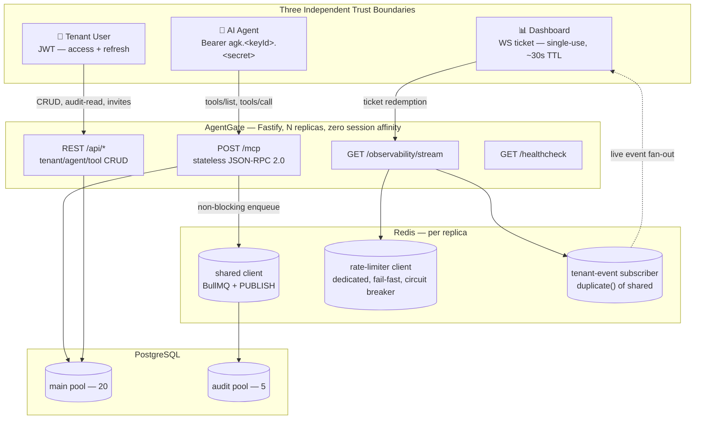
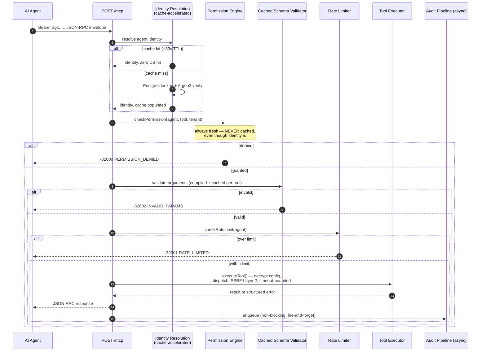
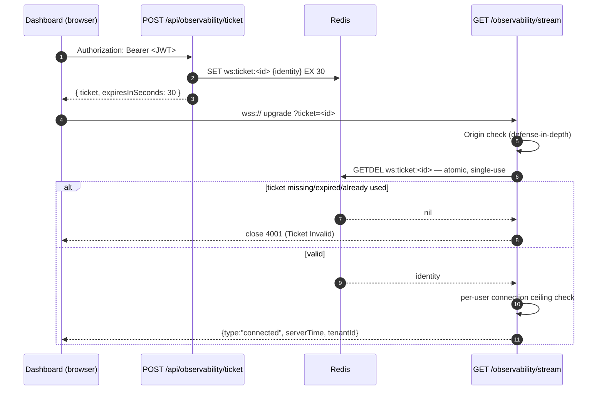
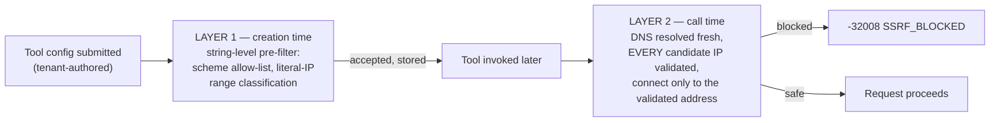
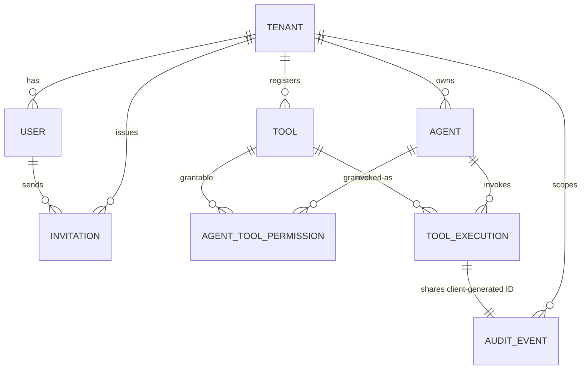
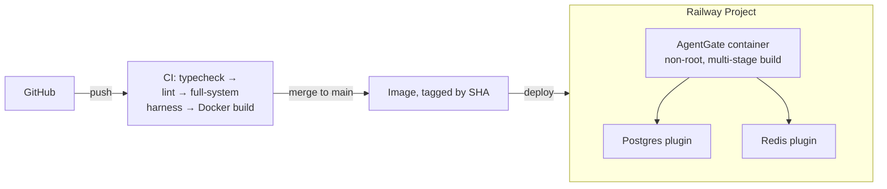

# AgentGate — High-Level Design Document (v2.0)

**Status:** Authoritative. Supersedes every prior HLD draft, including the original SSE/Session-Map design, which is now fully retired.
**Scope:** Full system architecture as actually shipped, Weeks 1–9.
**Audience:** Engineers doing technical review, future-you six months from now, and yes — recruiters who click the link and actually read past the README.

---

## 0. Read This First

AgentGate is a multi-tenant **MCP (Model Context Protocol) gateway** — infrastructure that sits between AI agents and the internal systems they need to touch, so companies don't have to choose between "give the agent root" and "build bespoke integration code per agent per system." It authenticates agents, enforces permissions, rate-limits calls, logs everything, and streams what's happening live to a dashboard — all with real tenant isolation, not the honor system.

This document is not a chronological build log (that's what `PROGRESS.md` and 30+ daily roadmap docs are for). It describes **the system as it exists today**, post-deployment, with the reasoning kept where it earns its place.

A few honest numbers before you scroll further, because HLDs that open with vibes instead of substance don't get read:

| | |
|---|---|
| Build duration | 9 weeks, solo |
| Independent trust boundaries | 3 (agent API key, user JWT, dashboard WS ticket) |
| Tenant-isolation surfaces independently proven | 4 (REST, MCP JSON-RPC, WebSocket, audit-read) |
| Mid-project protocol pivot | 1 (MCP deprecated the transport this was built on, mid-Week-6 — see §2) |
| Times "an infra fault got mistaken for a policy decision" was caught and fixed | 11, across 9 weeks, in 11 different subsystems (§8) |
| Load-test-discovered production bug that two rounds of AI-assisted "fixes" got wrong first | 1 (§13 — genuinely my favorite story in this whole project) |
| Deployment target | Railway, Docker multi-stage, CI-gated |

If you read one section, make it **§8 (Resilience Philosophy)** — it's the closest thing this project has to a thesis statement.

---

## Table of Contents

1. Problem Statement & Scope
2. The Origin Story: How the Architecture Actually Evolved
3. System Topology
4. Core Concepts & Terminology
5. Request Lifecycle Deep-Dives
6. Multi-Tenant Isolation Architecture
7. Security Architecture
8. Resilience Philosophy: "An Infra Fault Is Not a Policy Decision"
9. Data Model
10. Async & Real-Time Infrastructure
11. Protocol Specifications (Error Taxonomies)
12. Deployment Architecture
13. Measured Performance & the Load-Test Bug Story
14. Deliberately Not Built (Phase 2 Backlog)
15. Engineering Principles Reference Card
16. Appendix

---

## 1. Problem Statement & Scope

### 1.1 The problem

Giving an AI agent direct access to internal systems — databases, internal APIs, Slack, whatever — is dangerous by default. There's no controlled surface: the agent can call anything, with any parameters, at machine speed, with no audit trail and no rate limit. And the alternative — hand-rolled integration glue per agent per system — doesn't scale and turns permissions into an afterthought.

Agents aren't users. Users log in through a UI that limits what they can even attempt. Agents authenticate programmatically and can call anything callable, as fast as the network allows. Existing auth/authz patterns were built for the first case, not the second.

### 1.2 The solution, one line

A platform that sits between agents and the systems they need, exposing a standard MCP interface, and owning every cross-cutting concern (auth, permissions, rate limits, audit, observability) so the agent only has to know what tools exist.

```
AI Agent (Claude, GPT, any MCP-conformant client)
          │  HTTPS · JSON-RPC 2.0
          ▼
   ┌─────────────────────┐
   │     AgentGate       │
   │  auth · permissions │
   │  rate limits · audit│
   │  live observability │
   └─────────────────────┘
          │
          ▼
   Registered Tools → External Systems
```

### 1.3 Explicit non-goals

AgentGate is not a chatbot, not an LLM wrapper, not a workflow-automation tool a human clicks through, and not a RAG pipeline. It has no opinion about which model is calling it. It is backend infrastructure — a controlled, observable, permissioned service layer, the same category as an API gateway, just built for agent-speed traffic instead of human-speed traffic.

---

## 2. The Origin Story: How the Architecture Actually Evolved

A résumé line says "built an MCP gateway." What actually happened is closer to "built an MCP gateway, then the protocol changed underneath it, and the fix shipped in the same week the problem was found." That's a better story, and it's true, so here it is.

| Milestone | Week | What shipped | The thing that almost got missed |
|---|---|---|---|
| **M1 — Multi-tenant bedrock** | 1 | Tenants, users, JWT auth, `TenantContext` middleware, isolation proof test | Fastify isn't Express — middleware-as-hooks had to be learned correctly the first time or every downstream week inherits the bug |
| **M2 — Registries & crypto** | 2 | Agent/tool CRUD, `agk.<keyId>.<secret>` API keys, AES-256-GCM config encryption w/ per-tenant HKDF subkeys, SSRF Layer 1 | A naive single-token API key design would've required an O(n) Argon2 sweep to identify the agent — caught before it shipped |
| **M3 — Guardrails** | 3 | Permission engine (fail-closed), Redis rate limiter, hybrid circuit breaker | Two Redis clients were needed, not one — the rate limiter's fail-fast settings directly conflict with BullMQ's requirement of infinite retry on the *same* connection |
| **M4 — Execution pipeline** | 4 | HTTP/Postgres/WebFetch tool handlers, SSRF Layer 2 (DNS-resolution-time) | Layer 1 alone doesn't stop DNS rebinding — a hostname can resolve safely at creation time and unsafely at call time |
| **M5 — Audit pipeline** | 5 | Idempotent dual-table audit writes, dead-letter queue, two independent redaction passes | A string-pattern secret redactor silently fails on JSON-quoted values — needed a *structural* redactor as a second, independent layer |
| **M6 — MCP Gateway** | 6 | The gateway itself | **The MCP spec deprecated the transport this was designed against, three days before the build started.** See §2.1. |
| **M7 — Live observability** | 7 | Ticket-authenticated WebSocket stream, tenant-scoped fan-out | A browser can't read *why* a pre-upgrade WebSocket connection failed (spec-mandated), so every rejection has to complete the handshake first — the opposite of how REST auth rejection normally works |
| **M8 — Hardening** | 8 | Full-system chaos testing, load testing, real email delivery, invite-based signup | A load test surfaced a genuine correctness bug (not a perf issue) — see §13 |
| **W9 — Ship it** | 9 | Deploy, docs, the doc you're reading | A chaos-suite failure traced back to the *one* unguarded DB call Week 8's own fix didn't reach — 11th instance of the pattern in §8 |

### 2.1 The pivot that actually mattered

Going into Week 6, the plan (and the original PRD) was HTTP+SSE — the MCP transport that was standard at the time the project was scoped. Three days before that week's build started, the actual spec state was re-checked (not assumed — this project has a whole discipline about that, see §15), and it turned out the ecosystem had already moved to a **stateless Streamable HTTP** model: no session concept, no `Mcp-Session-Id`, every request self-contained, protocol version carried per-request instead of negotiated once.

The old design (`GET /mcp/sse` + `POST /mcp/message`, bridged by an in-memory Session Map with heartbeats and idle timers) was rebuilt from scratch, inside the same week, as a single stateless `POST /mcp` endpoint. This wasn't a downgrade — the new design is *simpler* (no session lifecycle to leak, no sticky-session requirement for horizontal scaling) and *more secure* (no session token to steal or fixate; every request re-proves itself). The one thing the old design gave away for free — amortizing the ~100–300ms Argon2 cost across a session — got rebuilt deliberately as an **auth-accelerator cache** (§5.3), which turned out to be a cleaner solution anyway.

This is the single best "how do you handle scope changing mid-flight" story in the whole project, and it's real, not hypothetical.

---

## 3. System Topology

### 3.1 The three trust boundaries

Every request into AgentGate enters through exactly one of three independently-authenticated surfaces. None of them share a credential type, and none of them can be used to reach another boundary's data.



**Why three separate auth models, not one.** Agents aren't interactive — a long-lived API key with server-side hash storage is correct for them the way it's correct for Stripe/GitHub/AWS keys. Users are interactive and session-bounded — JWT fits. The dashboard needed a credential a *browser* could carry, and a browser's `WebSocket` constructor can't attach a custom `Authorization` header — so it needed something that could live briefly in a URL without being a long-lived secret. Rather than invent a fourth pattern, the WS ticket reuses the exact shape of the refresh-token design from Week 1: short-lived, single-use, server-stored, atomically redeemed.

### 3.2 Component responsibility summary

| Boundary | Auth model | Primary storage | Statefulness |
|---|---|---|---|
| REST management API | JWT (access + refresh) | PostgreSQL | Stateless |
| MCP Gateway | Agent API key (Argon2-hashed) | PostgreSQL + Redis cache | **Fully stateless** — no session, any replica answers any request |
| Observability WS | Single-use ticket → resolves to JWT identity | In-process registry (per replica) + Redis pub/sub | Stateful *per connection*, never persisted |
| Async pipeline (BullMQ) | Internal trust, no external auth | Redis (queue) → PostgreSQL (system of record) | Durable, at-least-once delivery |

---

## 4. Core Concepts & Terminology

| Term | Definition |
|---|---|
| **Tenant** | A company/team. Fully isolated — own tool registry, agent registry, permissions, audit log. |
| **User** | A human managing the platform for a tenant. Authenticates via email/password + JWT. Roles: Owner, Member. |
| **Agent** | An AI/automated system calling tools through the gateway. Authenticates via API key. |
| **Tool** | A named, typed, permissioned action a tenant registers — an HTTP call, a Postgres query, or a public URL fetch. |
| **Tool Execution** | One invocation of one tool by one agent — atomic, logged, durably recorded. |
| **Permission** | A declared grant: agent X may call tool Y. Checked fresh, on every single call — never cached. |
| **Audit Event** | An immutable, append-only record of a significant action. No UPDATE or DELETE route exists for this table, at any layer, by design. |
| **Ticket** | A short-lived, single-use credential minted for exactly one purpose: redeeming a WebSocket upgrade. |

---

## 5. Request Lifecycle Deep-Dives

### 5.1 `tools/call` — the full pipeline

This is the critical path — every module built since Week 1 converges here.



**Why permission checks after identity resolution but never cached alongside it.** Identity resolution is cached because Argon2 is *deliberately* expensive (100–300ms) and re-verifying it on every call would blow the 300ms gateway-overhead budget on its own. Permission is never cached because the whole point of a permission system is that revocation takes effect on the *next call*, not after some TTL elapses. The auth cache's ~30s staleness window is acceptable specifically *because* the permission check downstream is unconditionally fresh — the fast, cacheable front door is backstopped by a slow, always-honest wall.

**Why permission is checked before schema validation.** An agent with zero grant on a tool could otherwise send garbage arguments and read the schema-validation error back — leaking the tool's parameter shape (required fields, patterns) to someone never authorized to see it via discovery either. Authorization gates before *anything* tool-specific is revealed, full stop.

### 5.2 Dashboard WebSocket — ticket issuance and redemption



The JWT itself never touches this surface — only a randomly-generated, opaque, single-use ticket does, and it's atomically consumed via Redis `GETDEL` so two concurrent redemption attempts against the same ticket can never both succeed. Because a browser's native `WebSocket` API can't read *why* a pre-upgrade connection was rejected (this is a deliberate WHATWG spec choice, meant to stop a page from port-scanning a user's local network), every rejection path — bad Origin, invalid ticket, over-ceiling — completes the handshake and closes with a documented application code instead of failing the HTTP upgrade itself.

### 5.3 The auth-accelerator cache, precisely

This is worth being precise about because it looks like a session and isn't one. A session is a server-issued token the client must present on every request. This cache is the inverse: the client presents its **real, full credential** every single time, exactly as a stateless design requires — the cache only ever short-circuits the *slow verification step* for a credential it's already seen recently. The client never knows it exists, never receives anything derived from it, and gets bit-for-bit identical behavior whether the cache is warm, cold, or disabled outright.

---

## 6. Multi-Tenant Isolation Architecture

Isolation isn't one mechanism — it's proven independently at four different surfaces, because a leak at any one of them is a real incident regardless of how well the other three are locked down.

| Surface | Enforcement mechanism | What it prevents |
|---|---|---|
| **REST** | `TenantContext` middleware injects `{tenantId, userId, role}` from the verified JWT; every query filters on it | A request body/param can't override which tenant's data is touched |
| **MCP (JSON-RPC)** | Tool name → ID resolution is `(name, tenantId)`-scoped; permission check re-verifies tenant status fresh | Cross-tenant tool-name guessing can't resolve to another tenant's tool |
| **WebSocket** | Live events fan out only to sockets registered under the *resolved* tenant ID from the redeemed ticket — never a client-supplied field | A stolen or guessed channel name can't be joined; delivery is registry-driven, not request-driven |
| **Audit-read** | Every read filters `tenantId` on both sides of any join, never trusting a shared primary key alone | A known, valid event ID under the wrong tenant returns nothing — not even a 403 that confirms existence |

**The layer this project treats as load-bearing rather than incidental:** `checkPermission()` re-derives tenant scope from the database on *every single call*, with zero caching, specifically so a permission revocation or a tenant suspension takes effect on the very next request — not after some cache TTL. Everything upstream of it (the identity cache, the tools/list cache) is allowed to be briefly stale precisely because this one check never is.

---

## 7. Security Architecture

### 7.1 SSRF — two independent layers, not one

A tool handler that fetches an HTTP URL, queries a Postgres database, or hits a public webhook is configured by the *tenant* — meaning the target is untrusted input pointed at real infrastructure. One check isn't enough because a hostname can look safe when the tool is created and resolve somewhere unsafe by the time it's actually called (DNS rebinding).



Layer 1 catches the obvious cases cheaply at write time (literal loopback, cloud metadata IPs, private ranges — including decimal/hex/octal-obfuscated forms). Layer 2 is the actual boundary: DNS is re-resolved at the moment of the call, every returned address is checked (a mixed response with one safe and one unsafe IP fails closed on the whole set), and the connection is made directly to the validated IP — nothing downstream is allowed to re-resolve the hostname and reopen the window.

### 7.2 Encryption at rest

Tool `handler_config` (which can contain connection strings, API keys, webhook secrets) is encrypted with AES-256-GCM. The key isn't a single platform-wide secret — each tenant's data is encrypted under a **subkey derived via HKDF** from the master key plus the tenant ID. This isn't a boundary against a compromised master key (tenant IDs aren't secret), but it does mean a leak scoped to one request or one tenant's key material doesn't expose every other tenant's secrets by association — pure defense-in-depth, priced correctly as such.

### 7.3 Credential handling

- Passwords and API key secrets: Argon2, deliberately expensive (100–300ms), paid once at login/connect and amortized via the accelerator cache — never optimized away.
- API keys are split `agk.<keyId>.<secret>` specifically because Argon2 hashes can't be looked up by value — the public `keyId` gives an indexed lookup; the secret is the thing actually verified.
- Raw secrets (API keys, refresh tokens, invitation tokens) are shown/logged exactly once at creation and never persisted or retrievable again.
- WebSocket tickets are scrubbed from structured request logs via a dedicated log serializer — the one new credential type in the whole system that travels in a URL, treated with the same "never let it reach a log line" discipline as every other secret.

### 7.4 Public-surface abuse resistance

Every endpoint reachable *before* a credential exists (`register-tenant`, `login`, the MCP coarse pre-auth path, WebSocket connect attempts) carries its own independently-bucketed, IP-keyed rate throttle — reusing one proven Redis-backed primitive rather than inventing a new one per surface.

---

## 8. Resilience Philosophy: "An Infra Fault Is Not a Policy Decision"

If this document has a thesis, this is it. A rate limit exceeded, a permission denied, and a database connection dropping mid-query are three completely different things, and conflating any two of them is a real bug — not a cosmetic one. If a Redis outage gets reported to a client as "you're rate-limited," or a severed Postgres connection gets reported as "your tool's configuration is broken," the client draws exactly the wrong conclusion and takes exactly the wrong corrective action.

This distinction got drawn, independently, **eleven times**, in eleven different subsystems, across nine weeks — which is either a sign of a project with a real architectural spine, or a sign that the same mistake kept almost happening and kept getting caught. Both are true, and both are worth saying out loud:

| # | Where | The fault | The (correct) code | Week |
|---|---|---|---|---|
| 1 | Permission engine | Postgres error during grant lookup | `reason: "error"`, distinct from a real denial | 3 |
| 2 | Rate limiter | Circuit breaker open / Redis unreachable | `degraded: true`, distinct from a real limit hit | 3/5 |
| 3 | MCP error mapping | Formalized the above two into JSON-RPC codes | `-32002 SERVICE_DEGRADED` vs `-32001`/`-32000` | 6 |
| 4 | Audit layer | A degraded rate-limit result | Never written to the audit trail as a real denial | 6 |
| 5 | Ticket issuance | Redis write failure after a passed rate check | `503`, never a fabricated `200` with a dead ticket | 7 |
| 6 | Ticket redemption | `GETDEL` throwing vs. returning nil | New `4005` close code, distinct from `4001` | 7 |
| 7 | Audit-read throttle | A previously-shipped bug where the result was never even checked | Fixed to branch correctly, `503` vs `429` | 7 |
| 8 | Public-auth throttle | Same split, applied to pre-credential routes | `503` vs `429`, no audit row (no tenant scope exists yet) | 8 |
| 9 | Load-test tallying | Own measurement methodology needed the same rigor | Three-bucket tally, never two | 8 |
| 10 | `executeTool()` | Postgres fault during the tool's own defense-in-depth re-lookup | New `INFRA_UNAVAILABLE` code → `-32002` | 8 |
| 11 | Identity resolution | The one unguarded DB call Week 8's own fix didn't reach | Same fix, one layer earlier | 9 |

### 8.1 The hybrid circuit breaker

Rate-limit checks specifically need a **bounded fail-open, then fail-closed** posture — not the fail-closed-always posture the permission engine uses — because a rate limit is a policy, not an identity check, and a full outage should degrade throughput protection gracefully rather than take down the whole gateway.

- **CLOSED** (healthy): normal atomic checking.
- **OPEN** (tripped, after 3 consecutive failures): fails closed immediately, no Redis attempted, for a cooldown window.
- **HALF_OPEN** (probing): one call allowed through after cooldown; success resets to CLOSED, failure re-trips OPEN.

Two imprecisions are accepted and **documented precisely rather than glossed over**: the fail-open window is bounded by *time*, not by exact call count (concurrency makes "first N calls" undefined), and concurrent HALF_OPEN probes resolve last-writer-wins. Stating a real limitation exactly beats implying a stronger guarantee that isn't actually there.

---

## 9. Data Model

High-level entity relationships — not full DDL, this is an architecture doc, not a migration file.



Design decisions worth flagging:

- **Deactivation is soft, never a hard delete.** Agents and tools get `isActive: false`, never removed — a hard delete would either cascade-destroy audit history or get blocked by a foreign key and fail confusingly the first time it matters.
- **Audit tables are append-only by construction** — no UPDATE or DELETE route exists, at any layer, for `tool_executions` or `audit_events`. Enforced by the absence of the code path, not a database trigger.
- **`tool_executions` and `audit_events` share a client-generated UUID as primary key.** The ID is minted once at the point of invocation and threaded into both tables inside one transaction — this is what makes the whole audit pipeline idempotent under BullMQ's at-least-once delivery: a redelivered job hits the same primary key, the write no-ops, and nothing duplicates.

---

## 10. Async & Real-Time Infrastructure

### 10.1 Why three separate Redis connections, not one

| Client | Tuning | Why it's separate |
|---|---|---|
| `redis` (shared) | `maxRetriesPerRequest: null` | BullMQ requires this for its own internal blocking reads — retrying indefinitely is correct here |
| `rateLimiterRedis` (dedicated) | `maxRetriesPerRequest: 1`, short `commandTimeout`, owns the circuit breaker | Directly conflicts with the shared client's settings — a rate-limit check needs to fail *fast*, not retry indefinitely |
| `tenantEventSubscriber` (duplicated from shared) | inherits shared's settings | Once a connection issues `SUBSCRIBE`, Redis restricts it to pub/sub commands only — a structurally separate connection is required, not a preference |

Total, per replica: **5 connections** — the 3 above, plus one BullMQ-internal blocking-read duplicate each for the audit worker and the email worker. This number was a stated hypothesis for most of the project and got empirically confirmed (not assumed) during the Week 8 full-system harness build.

### 10.2 The BullMQ pattern, applied twice

Both the audit pipeline and the email pipeline follow the identical shape: a job is enqueued fire-and-forget (never awaited, never throws back to the caller), processed by a worker with a real retry/backoff schedule, and — critically — **failures are classified before they're retried**. A permanent failure (a malformed payload, a rejected recipient) dead-letters on the first attempt with zero retries burned. A transient failure (a network blip, a 5xx) gets the full backoff schedule and only dead-letters once genuinely exhausted. Retrying a permanent failure three times just delays an inevitable dead-letter for no benefit — the classification is what makes the retry logic actually useful instead of just noisy.

### 10.3 WebSocket fan-out — reference-counted, not per-connection

The dashboard stream doesn't give every connected socket its own Redis subscription (that doesn't scale past a handful of viewers). Instead, one dedicated subscriber connection per replica backs a reference-counted, in-process `Map<tenantId, Set<WebSocket>>` registry: the *first* viewer for a tenant triggers a real `SUBSCRIBE`, every subsequent viewer for that same tenant just joins the existing `Set`, and the *last* viewer leaving triggers the matching `UNSUBSCRIBE`. Delivery is registry-driven — a tenant with zero current viewers never has its events even parsed locally, let alone delivered.

---

## 11. Protocol Specifications

### 11.1 JSON-RPC error taxonomy (`POST /mcp`)

A closed, documented vocabulary — no internal failure signal is allowed to fall through to a generic, unhelpful code.

| Code | Meaning | Code | Meaning |
|---|---|---|---|
| `-32700`/`-32600`/`-32601`/`-32602`/`-32603` | Standard JSON-RPC (parse/invalid request/method/params/internal) | `-32006` | Payload Too Large |
| `-32000` | Permission Denied | `-32007` | Unsupported Media Type |
| `-32001` | Rate Limited | `-32008` | SSRF Blocked |
| `-32002` | **Service Degraded** — the code that carries §8's whole principle | `-32009` | Identity Invalid |
| `-32003` | Tool Not Found | `-32010` | Message Rate Limited |
| `-32004` | Tool Execution Error | `-32011` | Unsupported Protocol Version |
| `-32005` | Tool Execution Timeout | `-32012` | Origin Not Allowed |

### 11.2 WebSocket close-code taxonomy (`/observability/stream`)

| Code | Meaning | Code | Meaning |
|---|---|---|---|
| `1000` | Normal closure | `4002` | Origin Not Allowed |
| `1001` | Going away (server shutdown) | `4003` | Connection Ceiling Exceeded |
| `1008` | Policy violation (backpressure) | `4004` | Heartbeat Timeout |
| `4001` | Ticket Invalid | `4005` | Service Degraded |
| — | | `4006` | Too Many Connection Attempts |

---

## 12. Deployment Architecture



- **Multi-stage Docker build:** a builder stage compiles TypeScript and generates the Prisma client; the runtime stage ships only `dist/` and production dependencies, runs as a non-root user, and carries a `HEALTHCHECK` pointed at `GET /healthcheck`.
- **Migrations run on boot**, as an entrypoint step (`prisma migrate deploy`), before the server process starts — never a manual out-of-band step.
- **A two-layer config-safety check runs before anything else.** Zod validates every env var's shape and presence at boot (existing since Week 1). A second, independent guard — production-only — checks that present, correctly-shaped secrets *aren't* known placeholder values or loopback-targeted connection strings, and refuses to boot if they are. Shape validation and safety validation are deliberately separate checks, the same split SSRF Layer 1/Layer 2 already established.
- **`AGENTGATE_TRUST_PROXY_HOPS`** is a mandatory production setting, and it's the one that's easiest to forget precisely because it does nothing wrong locally: with no reverse proxy in front of the app, every client's real IP resolves correctly by default. The moment a real edge proxy (Railway's) sits in front of it, every client silently collapses onto the proxy's own IP unless this is set — which would have merged every real user into one shared rate-limit bucket. Caught and fixed during the actual Week 9 deploy, not found in a design review after the fact.

---

## 13. Measured Performance & the Load-Test Bug Story

### 13.1 The headline numbers

Measured under real concurrent load (5 tenants × 10 agents = 50 agents, background REST traffic, live WebSocket viewers, all concurrent — not the gateway in isolation):

- **Gateway overhead:** p50 ≈ 15–25ms, p95 ≈ 19–45ms, against a 300ms budget. Comfortable headroom.
- **Redis connections:** confirmed at exactly 5 per replica, matching the formula in §10.1 empirically, not just on paper.
- **Zero session/registry corruption** across bursts of 3,000+ concurrent requests.

### 13.2 The bug that mattered more than the numbers

The load test's actual value wasn't the latency numbers — it was catching a real **correctness** bug wearing a performance costume. With the Postgres main pool sized at 10, connection queueing under load stretched a call burst's wall-clock duration long enough that some of an agent's deliberately-over-limit calls landed in a *fresh* rate-limit window instead of the one they were supposed to be denied in — the rate limiter was silently over-admitting requests (65 succeeded instead of the strictly-enforced 59). Not a slowdown. A security control quietly failing to enforce its own limit, and it took real concurrent load to surface it — no unit test would have found this.

The fix (raising the pool, not lowering the strictness) was applied as a measured, evidence-backed change, not a guess — and the pool-sizing tool's own naive heuristic (which reasoned from the configured ceiling rather than observed saturation) was explicitly overridden in favor of reading what the actual run showed. Knowing when to distrust your own tooling is part of the job.

Separately, two rounds of AI-assisted "fixes" for the *symptom* (a test-teardown FK-violation flood) proposed changes that would have made things worse — one would have silently disabled SSRF protection for the entire test suite by bypassing loopback blocking under a `NODE_ENV=test` carve-out; the other pre-emptively jumped the pool to an arbitrary `150`, defeating the entire measurement purpose of the day. Both were traced, understood, and rejected in favor of finding the actual root cause (an async audit-queue drain racing tenant deletion in the test harness itself — nothing wrong with production code at all).

---

## 14. Deliberately Not Built (Phase 2 Backlog)

Every item below was considered, and explicitly deferred with a stated reason — not silently skipped. That distinction is itself part of the engineering discipline this project tries to demonstrate.

| Item | Why it's not in scope for launch |
|---|---|
| Workflow chaining (tool A's output → tool B's input) | Real Phase 3 feature; no MVP consumer exists yet to justify the complexity |
| Tool marketplace / pre-built templates | Depends on workflow chaining landing first |
| Role-based access beyond Owner/Member | MVP scope per the original PRD; the `requireRole()` primitive exists and is proven, just not applied project-wide |
| OAuth / Enterprise-Managed Auth | Agents aren't interactive — API keys are the right model for them; OAuth solves a problem this platform doesn't have yet |
| Global per-agent concurrency ceiling | The existing per-minute rate limiter is judged sufficient for MVP traffic; a real concurrency cap is a clean, additive future change |
| System-wide Row-Level Security | Application-layer isolation is proven across all four surfaces independently; RLS on the audit path specifically remains a scoped, shippable stretch item with a one-flag rollback |
| `/metrics` (Prometheus) | The health-check subsystems already compute everything a `/metrics` endpoint would expose — this is a formatting exercise, not new capability, and stayed a "nice to have" rather than a blocker |
| Verification-token expiry | Named and deferred twice (email verification, invitations) — needs a migration and route changes, correctly scoped as its own piece of work rather than rushed in |
| API versioning scheme | No breaking change has occurred yet to force the question |
| Multi-region / HA database topology | Managed-service HA (via the deploy platform) is assumed, not built — building it yourself is a different, much bigger project |

---

## 15. Engineering Principles Reference Card

These recurred often enough, independently, across nine weeks, that they're worth stating as principles rather than leaving implicit in the code:

1. **Fail-closed on trust, bounded fail-open on availability — and never confuse the two.** (§8)
2. **Layered defense over a single check, when the check can go stale between validation and use.** (SSRF Layers 1/2, §7.1)
3. **Dedicated resources only when properties genuinely conflict — reuse otherwise.** (Redis clients, §10.1)
4. **Empirical verification over assumption**, especially for third-party library internals (AJV draft defaults, ioredis subscriber-mode command whitelist, undici dispatcher precedence — each confirmed by test, not by reading docs and hoping).
5. **Never trust a shared/unique key alone across a tenant boundary** — always double-filter tenant ID, even when a primary key alone would technically be enough.
6. **Every EventEmitter gets an explicit `.on('error', ...)`** — an unguarded error event on an idle Redis/Postgres client throws synchronously and takes the whole process down. Checked, not assumed, as a matter of course.
7. **A single, named cleanup authority per resource lifecycle** — never two code paths that can both plausibly tear down the same connection.
8. **Deferred scope is always named, with a reason — never silently dropped.** (§14 is the living proof of this.)

---

## 16. Appendix

### 16.1 Glossary

- **MCP** — Model Context Protocol. The open standard this platform speaks to AI agents.
- **JSON-RPC 2.0** — The request/response envelope format MCP uses over HTTP.
- **SSRF** — Server-Side Request Forgery. An attacker tricking a server into making a request it shouldn't (e.g., to internal infrastructure).
- **HKDF** — HMAC-based Key Derivation Function. Turns one master key into many distinct, context-bound subkeys.
- **Dead-letter queue** — Where a job goes after it's genuinely exhausted its retries, so it can be inspected instead of silently vanishing.
- **Idempotent** — Doing the same operation twice produces the same result as doing it once. Load-bearing property of the audit pipeline under at-least-once delivery.

### 16.2 Tech stack, for the skimmers

Node.js 22 · TypeScript (strict) · Fastify · PostgreSQL · Prisma · Redis (ioredis) · BullMQ · Zod · AJV (JSON Schema) · Argon2 · Docker · Railway · GitHub Actions.

### 16.3 Document history

This is v2.0 — a full rewrite. v1.0 described the original HTTP+SSE transport design and is retired in full; nothing in that version reflects the shipped system. If you find a stray reference to `GET /mcp/sse` or a "Session Map" anywhere else in this repo, it's a documentation bug, not an alternate architecture — please file it.