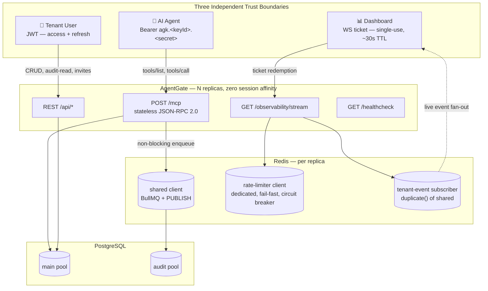
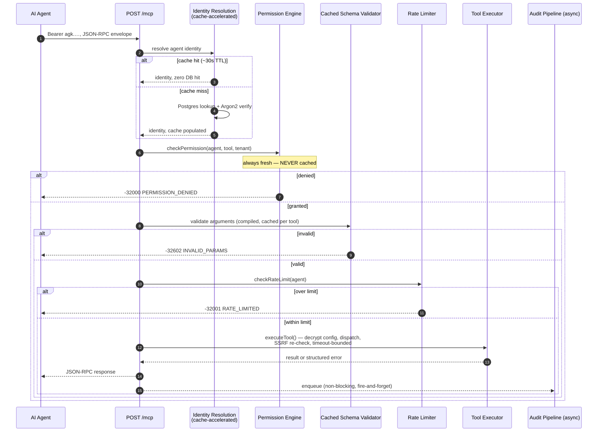
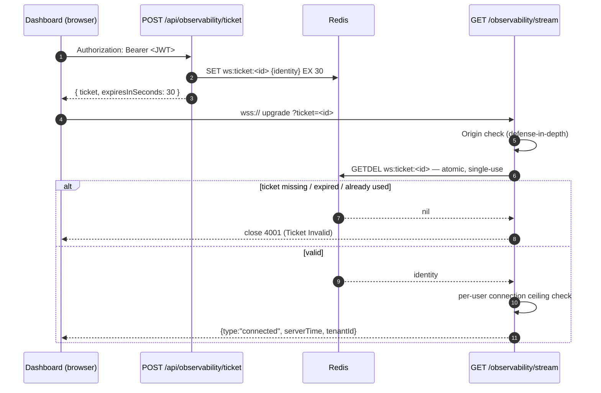
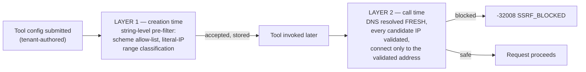
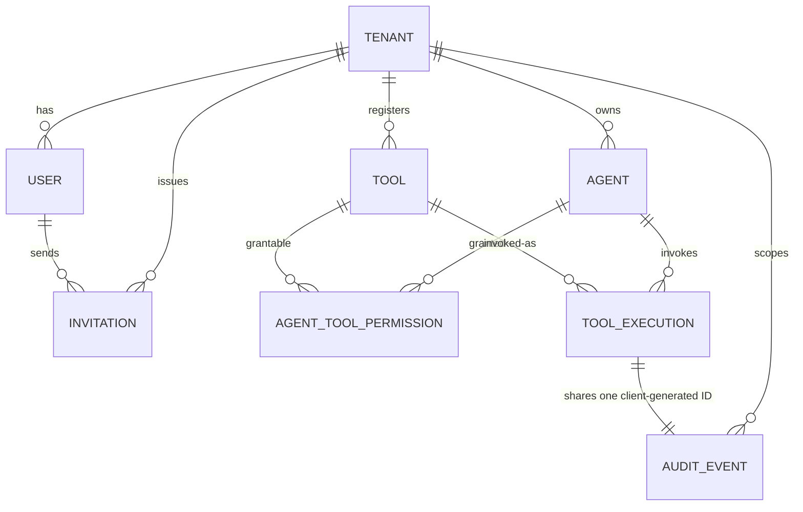
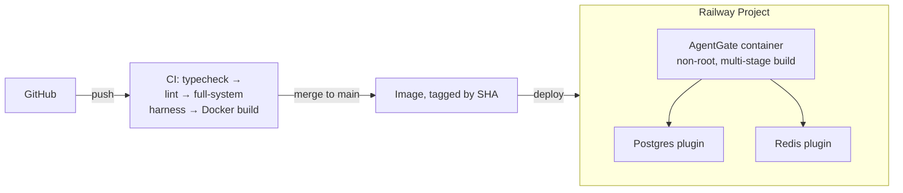

# AgentGate — Product Requirements Document (v2.0)

**Status:** Authoritative. Replaces the original `PRD.md` in full — that version still describes an HTTP+SSE transport that got deprecated by the actual MCP spec mid-project and no longer exists anywhere in the shipped system. This one describes the thing that's actually running.

**One-line summary:** A multi-tenant gateway that lets AI agents securely discover and invoke real tools against real systems — with permissions, rate limits, audit logging, and live observability built in, not bolted on.

---

## 0. Read This First

If you're skimming (no judgment, we all skim), here's the whole pitch in one table:

| | |
|---|---|
| **What it is** | Infrastructure that sits between AI agents and the internal systems they need to touch, so a company doesn't have to choose between "give the agent root" and "write bespoke glue code per agent per system" |
| **Build time** | 9 weeks, solo |
| **Independent trust boundaries** | 3 — agent API key, human JWT, dashboard WebSocket ticket |
| **Tenant-isolation surfaces independently proven** | 4 — REST, MCP/JSON-RPC, WebSocket, audit-read |
| **Mid-build protocol pivot survived** | 1 — the MCP spec deprecated the transport this was built on, mid-Week-6, and the fix shipped inside the same week |
| **Times "infra fault mistaken for policy decision" got caught before it shipped** | 11, across 9 weeks, in 11 different subsystems |
| **A load test that found a real security bug instead of just a slow number** | 1, and it's a good story (§13) |
| **Deployed** | Yes. Docker, Railway, CI-gated, actually reachable over the internet |

If you read exactly one more section after this, make it **§8 (Resilience Philosophy)**. It's the closest thing this project has to a thesis, and it's the section that best explains *how* this thing got built, not just *what* got built.

Everything below is organized so you can jump straight to whatever you actually care about — architecture, security, the pivot story, the numbers, whatever. It doesn't need to be read top to bottom.

---

## 1. The Problem

Giving an AI agent direct access to internal systems — a database, an internal API, Slack, whatever — is a genuinely bad idea by default. There's no controlled surface. The agent can call anything, with any parameters, at machine speed, with zero audit trail and zero rate limiting. When something inevitably goes sideways, there's no record of what actually happened.

The obvious alternative — hand-rolling integration code per agent per system — doesn't scale either. Every new agent needs new glue. Every new system needs a new connector. Permissions get hardcoded somewhere nobody remembers, and the audit log (if it exists) is an afterthought bolted on in month four.

The actual root issue: **agents aren't users.** A human logs in through a UI that structurally limits what they can even attempt. An agent authenticates programmatically and can call anything callable, as fast as the network allows. The auth/authz patterns companies already have were built for the first case. Nobody had really built the second one — a real infrastructure layer, not a per-project workaround.

## 2. The Solution

A platform that sits in the middle, speaks a standard protocol (MCP) to any conformant agent, and owns every cross-cutting concern — auth, permissions, rate limits, audit, live observability — so the agent only ever needs to know what tools exist and what they do.

```
AI Agent (Claude, GPT, any MCP-conformant client)
          │  HTTPS · JSON-RPC 2.0
          ▼
   ┌──────────────────────┐
   │       AgentGate      │
   │  auth · permissions  │
   │  rate limits · audit │
   │  live observability  │
   └──────────────────────┘
          │
          ▼
   Registered Tools → External Systems (DB, HTTP, webhooks…)
```

**What this explicitly is not:** a chatbot, an LLM wrapper, a workflow-automation tool a human clicks through, or a RAG pipeline. It has no opinion about which model is calling it. It's backend infrastructure — the same category as an API gateway, just built for agent-speed traffic instead of human-speed traffic.

---

## 3. Who This Is Actually For

Four distinct "users," none of whom share a credential type, none of whom can reach another one's data:

| Persona | What they do | How they authenticate |
|---|---|---|
| **Tenant Owner / Admin** | Registers the org, invites teammates, registers agents and tools, sets permissions, reads the audit log | Email + password → JWT (access + refresh) |
| **AI Agent** | Discovers permitted tools, invokes them, gets rate-limited and logged doing it | Long-lived API key (`agk.<keyId>.<secret>`), verified server-side |
| **Dashboard Viewer** | Watches tool calls, denials, and rate-limit hits happen live | JWT → short-lived, single-use WebSocket ticket |
| **Platform Operator (me, and eventually whoever runs this)** | Deploys it, watches `/healthcheck`, reads the audit trail when something's weird | Infra-level access, not an app-level role |

Three genuinely separate auth models for three genuinely different threats — not three implementations of the same idea for no reason. More on why in §7.

---

## 4. Scope

### 4.1 MVP — what's actually shipped and load-bearing

- **Tenant & user management** — registration, email verification (real delivery, not a stub — see §14), JWT auth with refresh, an invitation-based flow for adding teammates to an existing org (no open self-registration into someone else's tenant)
- **Agent registry** — CRUD, API key issuance shown exactly once, rotation
- **Tool registry** — CRUD for HTTP / PostgreSQL / public-URL-fetch handler types, tenant-authored JSON Schema for tool arguments, encrypted handler configs
- **Authorization** — per-`(agent, tool)` permission grants, checked fresh on *every single call*, never cached (§6)
- **Rate limiting** — Redis-backed, atomic, per-agent, with a circuit breaker that degrades gracefully instead of taking the whole gateway down
- **The MCP Gateway** — a single, stateless `POST /mcp` endpoint speaking JSON-RPC 2.0 over the current (2026-07-28) MCP spec
- **Audit log** — append-only, idempotent, durable, queryable, correctly attributed
- **Live observability** — a ticket-authenticated WebSocket stream showing tool calls, denials, and rate-limit hits as they happen
- **Management REST API** — full CRUD for everything above, tenant-scoped, JWT-gated
- **Deployment** — Dockerized, CI-gated, actually live on the public internet with a working health check

### 4.2 Explicit non-goals (this week's version)

Named on purpose — a scope decision without a written reason is just a gap nobody admits to. Full table with reasoning in §16.

Short version: no workflow chaining, no tool marketplace, no OAuth for agents, no role model beyond Owner/Member, no global concurrency ceiling, no system-wide row-level security, no `/metrics` endpoint, no API versioning, no multi-region HA. Every one of these was considered and deliberately punted, not forgotten.

---

## 5. System Architecture

### 5.1 The three trust boundaries

Every request enters through exactly one of three independently-authenticated doors. None of them share a credential type, and — this is the part that actually matters — none of them can be used to reach through to another door's data. This isn't assumed; it's proven independently for all four surfaces in §6.



**Why three auth models, not one.** Agents aren't interactive — a long-lived, server-hashed API key is correct for them the same way it's correct for Stripe/GitHub/AWS keys. Users are interactive and session-bounded — JWT fits that shape naturally. The dashboard needed a credential a *browser* could carry, and a browser's native `WebSocket` constructor literally cannot attach a custom `Authorization` header from JS. So instead of inventing a fourth pattern from scratch, the WS ticket reuses the exact shape already proven for refresh tokens: short-lived, single-use, server-stored, atomically redeemed. Same primitive, new context — not a new risk.

### 5.2 `tools/call` — the critical path

Every module built since week one converges here. This is the request that actually matters.



Two ordering decisions that look arbitrary until you think about the threat model for five seconds:

- **Permission before schema validation.** An agent with zero grant on a tool could otherwise send garbage arguments on purpose and read the validation error back — which leaks the tool's parameter shape (required fields, patterns) to someone who was never authorized to see it via discovery either. Authorization gates *before* anything tool-specific is revealed. No exceptions.
- **Identity is cached; permission never is.** Argon2 is deliberately slow (100–300ms) — re-verifying it on every single call would blow the entire gateway-overhead budget on identity checking alone. But the whole point of a permission system is that revocation takes effect on the *next* call, not after some cache TTL wanders off. So identity gets a fast, cacheable front door, and permission stays a slow, always-honest wall right behind it. The front door being briefly stale is fine *because* the wall never is.

### 5.3 The auth-accelerator cache (worth being precise about)

This is easy to mistake for a session, and it isn't one. A session is a server-issued token the client is handed and must present back. This cache is the inverse: the client presents its **real, full credential** on every single request, exactly like a stateless design requires — the cache only ever short-circuits the *slow verification step* for a credential it's already seen recently. The client has no idea it exists, gets nothing derived from it, and the behavior is bit-for-bit identical whether the cache is warm, cold, or turned off entirely. It only ever affects latency, never correctness.

### 5.4 Dashboard WebSocket — ticket issuance and redemption



The JWT itself never touches this surface — only a random, opaque, single-use ticket does, atomically consumed via Redis `GETDEL` so two concurrent redemption attempts can never both win. One genuinely interesting constraint here: a browser's native `WebSocket` API can't read *why* a pre-upgrade connection got rejected — that's a deliberate WHATWG spec choice, meant to stop a malicious page from port-scanning a user's local network via connection-outcome timing. So every rejection path (bad Origin, invalid ticket, too many connections) has to *complete the handshake* and close with a documented application code, instead of failing the HTTP upgrade the "normal" way. Small detail, real design constraint.

---

## 6. Multi-Tenant Isolation

Isolation isn't one mechanism wearing four hats — it's proven **independently** at four separate surfaces, because a leak at any one of them is a real incident regardless of how airtight the other three are.

| Surface | Enforcement | What it actually prevents |
|---|---|---|
| **REST** | `TenantContext` middleware injects `{tenantId, userId, role}` from the verified JWT; every query filters on it | A request body/param can't override which tenant's data gets touched |
| **MCP (JSON-RPC)** | Tool-name → ID resolution is `(name, tenantId)`-scoped; permission re-verifies tenant status fresh, every call | Cross-tenant tool-name guessing can't resolve to another tenant's tool |
| **WebSocket** | Live events fan out only to sockets registered under the *server-resolved* tenant ID from the redeemed ticket — never a client-supplied field | A guessed or stolen channel name can't be joined; delivery is registry-driven, not request-driven |
| **Audit-read** | Every read filters `tenantId` on *both* sides of any join — never trusts a shared primary key alone | A known, valid event ID under the wrong tenant returns nothing. Not even a 403 that would confirm the record exists. |

The one thing this project treats as genuinely load-bearing, not just nice-to-have: **`checkPermission()` re-derives tenant scope from the database on every single call, with zero caching**, specifically so a revoked permission or a suspended tenant takes effect on the *very next request* — not after some TTL wanders off. Everything upstream of it (the identity cache, the tool-list cache) is allowed to be briefly stale precisely *because* this one check never is.

---

## 7. Security Architecture

### 7.1 SSRF — two independent layers, not one

A tool that fetches a URL, queries a database, or hits a webhook is configured by the *tenant* — meaning the target is untrusted input pointed at real infrastructure. One check isn't enough, because a hostname can look perfectly safe at tool-creation time and resolve somewhere unsafe by the time it's actually called (DNS rebinding is a real, not theoretical, attack shape here).



Layer 1 catches the obvious stuff cheaply at write time — literal loopback, cloud metadata IPs, private ranges, including decimal/hex/octal-obfuscated encodings of the same. Layer 2 is the actual boundary: DNS gets re-resolved at the *moment of the call*, every returned candidate address gets validated (a mixed response with one safe and one unsafe IP fails the whole set closed), and the connection goes straight to the validated address — nothing downstream is ever allowed to re-resolve the hostname and reopen the window.

### 7.2 Encryption at rest

Tool `handler_config` — which can contain connection strings, API keys, webhook secrets — is encrypted with AES-256-GCM. The key isn't one flat platform-wide secret: each tenant's data is encrypted under a **subkey derived via HKDF** from the master key plus the tenant ID. To be precise about what this does and doesn't buy: it's not a boundary against a *compromised master key* (tenant IDs aren't secret), but it does mean a leak scoped to one request or one tenant's key material doesn't drag every other tenant's secrets down with it. Priced honestly as defense-in-depth, not oversold as a silver bullet.

### 7.3 Credential handling, in one table

| Credential | Storage | Notes |
|---|---|---|
| User password | Argon2 hash | Deliberately expensive (100–300ms), paid once at login |
| Agent API key secret | Argon2 hash, keyed lookup via public `keyId` | Split `agk.<keyId>.<secret>` specifically because Argon2 can't be looked up by value |
| Refresh token | Hashed, single-use rotation | Never logged, never re-shown |
| Invitation token | HMAC-SHA256 (deterministic, lookup-by-value) | Argon2 was considered and rejected — its random per-hash salt structurally can't serve a "find the row this token belongs to" query |
| WS ticket | Redis key, atomic `GETDEL` | Scrubbed from structured logs by a dedicated serializer, same discipline as every other secret |

### 7.4 Public-surface abuse resistance

Every endpoint reachable **before** a credential exists — tenant registration, login, invitation acceptance, the MCP coarse pre-auth path, WebSocket connect attempts — carries its own independently-bucketed, IP-keyed rate throttle, all built on one proven Redis primitive instead of a new bespoke mechanism per surface. This isn't decorative: unauthenticated tenant-creation spam and unthrottled credential stuffing are both real, boring, entirely preventable attacks against exactly these routes.

---

## 8. Resilience Philosophy: "An Infra Fault Is Not a Policy Decision"

If this document has a thesis, this is it, so it gets its own section instead of a bullet point.

A rate limit being hit, a permission being denied, and a database connection dropping mid-query are three *completely different things*, and treating any two of them the same is a real bug, not a cosmetic one. If a Redis blip gets reported to a client as "you're rate-limited," or a severed Postgres connection gets reported as "your tool's config is broken," the client draws exactly the wrong conclusion and takes exactly the wrong corrective action — retrying a thing that was never actually wrong, or giving up on a thing that was never actually broken.

This distinction got drawn, independently, **eleven times**, in eleven different subsystems, across nine weeks. That's either a sign of a project with a real architectural spine, or a sign that the same near-miss kept almost happening. Both are true, and honestly, that's kind of the point — a principle that only has to be stated once and never revisited again probably wasn't load-bearing to begin with.

| # | Subsystem | The fault | The correct outcome |
|---|---|---|---|
| 1 | Permission engine | Postgres error during a grant lookup | Distinct `reason: "error"`, never confused with a real denial |
| 2 | Rate limiter | Circuit breaker open / Redis unreachable | `degraded: true`, distinct from an actual limit hit |
| 3 | MCP error mapping | Formalized #1 and #2 into wire-level codes | `-32002 SERVICE_DEGRADED` vs. `-32001` / `-32000` |
| 4 | Audit layer | A degraded rate-limit result | Never written to the audit trail as a real policy denial |
| 5 | Ticket issuance | Redis write failure right after a passed rate check | Real `503`, never a fabricated `200` with a dead ticket |
| 6 | Ticket redemption | `GETDEL` throwing vs. legitimately returning nil | A distinct close code, never conflated with "ticket doesn't exist" |
| 7 | Audit-read throttle | A shipped bug where the result was never even checked | Fixed to actually branch: `503` vs `429` |
| 8 | Public-auth throttle | Same split, applied pre-credential | `503` vs `429` — no audit row, since no tenant scope exists yet |
| 9 | Load-test tallying | The test's own measurement needed the same rigor | Three-bucket tally, never collapsed into two |
| 10 | Tool executor | Postgres fault during its own defense-in-depth re-lookup | New `INFRA_UNAVAILABLE` code → `-32002` |
| 11 | Identity resolution | The one unguarded DB call an earlier fix didn't reach | Same pattern, applied one layer earlier |

### 8.1 The hybrid circuit breaker

Rate-limit checks specifically need a **bounded fail-open, then fail-closed** posture — not the always-fail-closed posture the permission engine uses — because a rate limit is a *policy*, not an identity check, and a total outage should degrade throughput protection gracefully rather than take the whole gateway down with it.

- **CLOSED** (healthy) — normal atomic checking.
- **OPEN** (tripped, 3 consecutive failures) — fails closed immediately, doesn't even attempt Redis, for a cooldown window.
- **HALF_OPEN** (probing) — one call let through after cooldown; success resets to CLOSED, failure re-trips OPEN.

Two known imprecisions here are **documented exactly**, not glossed over: the fail-open window is bounded by *time*, not exact call count (concurrency makes "the first N calls" an undefined concept), and concurrent `HALF_OPEN` probes resolve last-writer-wins. Stating a real limitation precisely beats implying a stronger guarantee that doesn't actually hold.

---

## 9. Data Model (the shape, not the DDL)



Three decisions worth flagging, because none of them are the "obvious" choice:

- **Deactivation is always soft, never a hard delete.** Agents and tools get `isActive: false`, never removed. A hard delete would either cascade-destroy audit history or get blocked by a foreign key and fail confusingly the first time it actually mattered.
- **Audit tables are append-only by construction.** No UPDATE or DELETE route exists for `tool_executions` or `audit_events`, at *any* layer. Enforced by the absence of the code path — not a database trigger someone could forget to add.
- **`tool_executions` and `audit_events` share one client-generated UUID as their primary key.** Minted once at the point of invocation, threaded into both tables inside one transaction. This one detail is what makes the whole audit pipeline idempotent under BullMQ's at-least-once delivery — a redelivered job hits the same primary key, the write no-ops, and nothing ever duplicates.

---

## 10. Async & Real-Time Infrastructure

### 10.1 Why three Redis connections, not one

| Client | Tuning | Why it can't share a connection |
|---|---|---|
| `redis` (shared) | `maxRetriesPerRequest: null` | BullMQ needs infinite retry on its own internal blocking reads |
| `rateLimiterRedis` (dedicated) | fail-fast, short timeout, owns the circuit breaker | Directly contradicts the shared client's settings — a rate check needs to fail *fast*, not retry forever |
| `tenantEventSubscriber` (duplicated) | inherits the shared client's settings | Once a connection issues `SUBSCRIBE`, Redis restricts it to pub/sub commands only — structurally can't double as a general-purpose client |

**Total per replica: 5 connections** — the three above, plus one BullMQ-internal blocking-read duplicate each for the audit worker and the email worker. This started as a stated hypothesis and got **empirically confirmed**, not assumed, once the full system ran together for the first time.

### 10.2 The BullMQ pattern, applied twice

Both the audit pipeline and the email pipeline follow the identical shape: enqueue fire-and-forget (never awaited, never throws back to the caller), a worker with a real retry/backoff schedule, and — the part that actually matters — **failures classified before they're retried.** A permanent failure (malformed payload, rejected recipient) dead-letters on the first attempt, zero retries burned. A transient failure (network blip, a 5xx) gets the full backoff schedule and only dead-letters once genuinely exhausted. Retrying a permanent failure three times just delays an inevitable dead-letter for no reason.

### 10.3 WebSocket fan-out — reference-counted, not per-connection

The dashboard doesn't give every connected socket its own Redis subscription — that doesn't scale past a handful of viewers. One dedicated subscriber connection per replica backs an in-process, reference-counted `Map<tenantId, Set<WebSocket>>`: the *first* viewer for a tenant triggers a real `SUBSCRIBE`, every following viewer just joins the existing set, and the *last* one leaving triggers the matching `UNSUBSCRIBE`. Delivery is registry-driven — a tenant with zero current viewers never has its events even parsed locally, let alone delivered.

---

## 11. Protocol Contracts

A closed, documented vocabulary on both wire protocols — nothing is allowed to silently fall through to a generic, unhelpful code.

**JSON-RPC (`POST /mcp`)**

| Code | Meaning | Code | Meaning |
|---|---|---|---|
| `-32700`…`-32603` | Standard JSON-RPC (parse/invalid-request/method/params/internal) | `-32006` | Payload Too Large |
| `-32000` | Permission Denied | `-32007` | Unsupported Media Type |
| `-32001` | Rate Limited | `-32008` | SSRF Blocked |
| `-32002` | **Service Degraded** — the code carrying §8's whole principle | `-32009` | Identity Invalid |
| `-32003` | Tool Not Found | `-32010` | Message Rate Limited |
| `-32004` | Tool Execution Error | `-32011` | Unsupported Protocol Version |
| `-32005` | Tool Execution Timeout | `-32012` | Origin Not Allowed |

**WebSocket (`/observability/stream`)**

| Code | Meaning | Code | Meaning |
|---|---|---|---|
| `1000` | Normal closure | `4002` | Origin Not Allowed |
| `1001` | Going away (server shutdown) | `4003` | Connection Ceiling Exceeded |
| `1008` | Policy violation (backpressure) | `4004` | Heartbeat Timeout |
| `4001` | Ticket Invalid | `4005` | Service Degraded |
| — | | `4006` | Too Many Connection Attempts |

---

## 12. Non-Functional Requirements & Measured Performance

| Requirement | Target | Measured |
|---|---|---|
| Gateway overhead (excluding downstream call time) | p95 < 300ms | p50 ≈ 15–25ms, p95 ≈ 19–45ms — real headroom, under actual concurrent load |
| Redis connections per replica | 5 (formula, §10.1) | Confirmed at exactly 5, empirically |
| Session/registry corruption under load | Zero | Zero, across bursts of 3,000+ concurrent requests |
| Multi-tenant isolation under adversarial pivot | Zero cross-tenant leakage, sequential *and* concurrent | Proven — one attacker persona, all four surfaces, both orderings |

**The load test's real find wasn't a number — it was a bug wearing a performance costume.** With the Postgres main pool undersized, connection queueing under real concurrent load stretched a call burst's wall-clock duration long enough that some of an agent's deliberately-over-limit calls landed in a **fresh** rate-limit window instead of the one they were supposed to be denied in. The rate limiter was silently over-admitting requests — not slow, *wrong*. A unit test would never have caught this; it only showed up under genuine concurrency. The fix was to raise the pool size based on measured saturation, not a guessed round number — and the sizing tool's own naive heuristic (which reasoned from the configured ceiling instead of what actually happened) got explicitly overridden once the real data disagreed with it.

Two rounds of AI-suggested "fixes" for the *symptom* (a test-teardown race that looked like a pool problem) were traced and rejected — one would have silently disabled SSRF protection for the entire test suite via an environment carve-out; the other pre-emptively jumped the pool to an arbitrary number, defeating the entire point of measuring anything. The actual root cause was a test harness racing its own background cleanup against itself. Nothing wrong with production code at all — which is its own useful lesson about not trusting the first plausible-sounding diagnosis.

---

## 13. Deployment & Operations



A few things worth calling out explicitly:

- **Migrations run on boot**, as an entrypoint step, before the server process starts — never a manual, easy-to-forget out-of-band step.
- **Config safety is a two-layer check.** Zod validates every env var's shape and presence at boot. A second, independent, production-only guard checks that present, correctly-shaped secrets *aren't* known placeholder values or loopback-targeted connection strings, and refuses to boot if they are. Same "shape check vs. safety check" split SSRF Layer 1/Layer 2 already established — reused, not reinvented.
- **`AGENTGATE_TRUST_PROXY_HOPS` is the setting that's easiest to forget precisely because it does nothing wrong locally.** With no reverse proxy in front of the app, every client's real IP resolves correctly by default. The moment a real edge proxy sits in front of it — which happens the instant this actually deploys — every client silently collapses onto the proxy's own IP unless this is set, which would've merged every real user into one shared rate-limit bucket. Caught and fixed during the actual deploy, not in a design review after the fact — the kind of thing you only find by actually shipping.

---

## 14. The Origin Story — How This Actually Got Built

A résumé line can say "built an MCP gateway." What actually happened is closer to: "built an MCP gateway, the protocol changed underneath it mid-build, and the fix shipped inside the same week." That's a better story, and it's true, so it gets a table.

| Milestone | What shipped | The thing that almost got missed |
|---|---|---|
| **M1 — Multi-tenant bedrock** | Tenants, users, JWT, tenant-context middleware, isolation proof | Fastify isn't Express — middleware-as-hooks had to be learned right the first time or every downstream week inherits the bug |
| **M2 — Registries & crypto** | Agent/tool CRUD, split API keys, AES-256-GCM + HKDF | A naive single-token key design would've needed an O(n) Argon2 sweep just to identify *which* agent — caught before it shipped |
| **M3 — Guardrails** | Permission engine, Redis rate limiter, circuit breaker | Two Redis clients were needed, not one — conflicting reliability requirements on the same connection |
| **M4 — Execution pipeline** | HTTP/Postgres/WebFetch handlers, SSRF Layer 2 | Layer 1 alone doesn't stop DNS rebinding |
| **M5 — Audit pipeline** | Idempotent dual-table writes, dead-letter queue, two redaction passes | A string-pattern redactor silently fails on JSON-quoted secrets — needed a *structural* second pass |
| **M6 — MCP Gateway** | The gateway itself | **The MCP spec deprecated the transport this was designed against, days before the build started.** Rebuilt from a stateful SSE/session model to stateless Streamable HTTP, inside the same week, with zero backward-incompatible gaps in the error taxonomy. |
| **M7 — Live observability** | Ticket-auth WebSocket, tenant-scoped fan-out | A browser can't see *why* a pre-upgrade WS connection failed — every rejection has to complete the handshake first, the opposite of normal REST rejection |
| **M8 — Hardening** | Full-system chaos testing, load testing, real email, invite-based signup | A load test found a genuine correctness bug, not a perf issue (§12) |
| **W9 — Ship it** | Deploy, docs, this document | A chaos-suite failure traced to the *one* unguarded DB call an earlier fix didn't reach — the 11th instance of §8's pattern |

The pivot is the best "requirements changed mid-flight, here's what I actually did about it" story in the whole build, and it's a genuine one — not a hypothetical asked in an interview, an actual thing that happened and got handled inside a single week.

---

## 15. Success Metrics / Go-Live Gate

| Requirement | Proven by |
|---|---|
| MCP-compatible agent connects, lists tools, invokes end to end | Full-system harness |
| p95 gateway overhead comfortably under budget | Real concurrent-load measurement |
| Tenant A's credentials can never see/call Tenant B's anything | Adversarial matrix, all four surfaces, sequential + concurrent |
| Permission denial + rate limiting fire correctly and are audited | Full-system harness |
| Audit log captures every invocation with correct attribution | Full-system harness |
| A real user can register, verify, and log in | Real email delivery, end to end |
| Public endpoints resist unauthenticated abuse | Adversarial matrix |
| System survives real infra faults (Postgres/Redis/WS/worker) | Whole-system chaos suite — real severed connections, not mocks |
| Deployed, documented, reproducible from a clean machine | Docker + CI + live URL |
| Governing docs match the running system | This document |

Every row here checks out against the shipped system, not an aspiration.

---

## 16. Phase 2 Backlog (Deliberately Deferred)

Every item below was considered and explicitly punted with a stated reason — not quietly forgotten. That distinction is itself part of the engineering discipline this project is trying to demonstrate: knowing what *not* to build yet is a skill, not a gap.

| Item | Why it's not in v1 |
|---|---|
| Workflow chaining (tool A's output → tool B's input) | Real Phase 3 feature; no MVP consumer justifies the complexity yet |
| Tool marketplace / templates | Depends on workflow chaining landing first |
| Role-based access beyond Owner/Member | MVP scope per original design; the `requireRole()` primitive exists and is proven — just not applied project-wide yet |
| OAuth / Enterprise-Managed Auth | Agents aren't interactive; API keys are the right model for the problem that actually exists today |
| Global per-agent concurrency ceiling | Per-minute rate limiting is judged sufficient for MVP traffic; a clean, additive future change |
| System-wide Row-Level Security | Application-layer isolation is proven at all four surfaces independently; a scoped RLS pass on the audit path specifically remains a shippable stretch item with a one-flag rollback |
| `/metrics` (Prometheus) | The health-check subsystems already compute everything it would expose — pure formatting exercise, not new capability |
| Verification-token expiry | Named and deferred twice already (email + invitations); needs a migration and route changes, correctly scoped as its own piece of work |
| API versioning scheme | No breaking change has happened yet to force the question |
| Multi-region / HA database topology | Managed-service HA is assumed at the platform layer, not built by hand — a genuinely different, much bigger project |

---

## 17. Engineering Principles (the reusable takeaways)

Stated as principles because they recurred often enough, independently, that leaving them implicit in the code would've undersold them:

1. **Fail-closed on trust, bounded fail-open on availability — and never mix the two up.** (§8)
2. **Layered defense beats a single check, whenever the check can go stale between validation and use.** (SSRF, §7.1)
3. **Dedicated resources only when properties genuinely conflict — reuse otherwise.** (Redis clients, §10.1)
4. **Empirical verification over assumption**, especially for third-party library internals — confirmed by test, not by reading docs and hoping.
5. **Never trust a shared/unique key alone across a tenant boundary**, even when a primary key alone would technically work.
6. **Every EventEmitter gets an explicit error listener** — an unguarded error on an idle client throws synchronously and takes the whole process down. Checked as a matter of course, not an afterthought.
7. **One named cleanup authority per resource lifecycle** — never two code paths that can both plausibly tear down the same connection.
8. **Deferred scope is always named, with a reason.** (§16 is the living proof.)

---

## 18. Appendix

### 18.1 Glossary

- **MCP** — Model Context Protocol, the open standard this platform speaks to AI agents.
- **JSON-RPC 2.0** — The request/response envelope MCP uses over HTTP.
- **SSRF** — Server-Side Request Forgery; tricking a server into requesting something it shouldn't (e.g. internal infra).
- **HKDF** — HMAC-based Key Derivation Function; turns one master key into many distinct, context-bound subkeys.
- **Dead-letter queue** — Where a job goes once it's genuinely exhausted its retries, so it can be inspected instead of silently vanishing.
- **Idempotent** — Doing the same operation twice produces the same result as doing it once. Load-bearing property of the audit pipeline under at-least-once delivery.

### 18.2 Tech Stack

Node.js 22 · TypeScript (strict) · Fastify · PostgreSQL · Prisma · Redis (ioredis) · BullMQ · Zod · AJV (JSON Schema) · Argon2 · Docker · Railway · GitHub Actions.

### 18.3 Document History

This is v2.0 — a full rewrite reflecting the shipped system, not the plan the system started from. v1.0 described the original HTTP+SSE transport and is fully retired; if you find a stray reference to a `Session Map` or `GET /mcp/sse` anywhere else in this repo, that's a documentation bug, not an alternate architecture — it should get filed and fixed, same as any other bug.