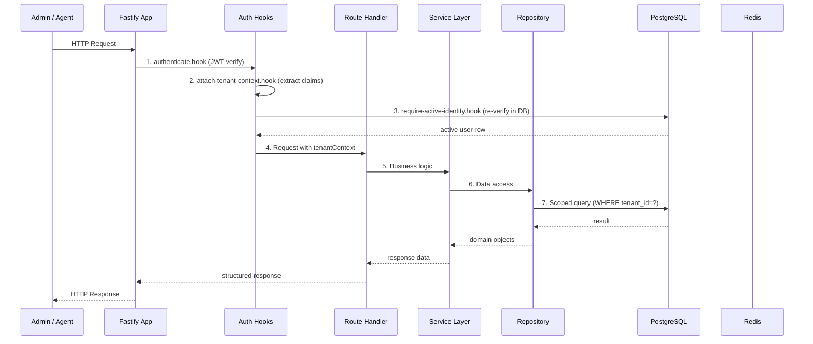
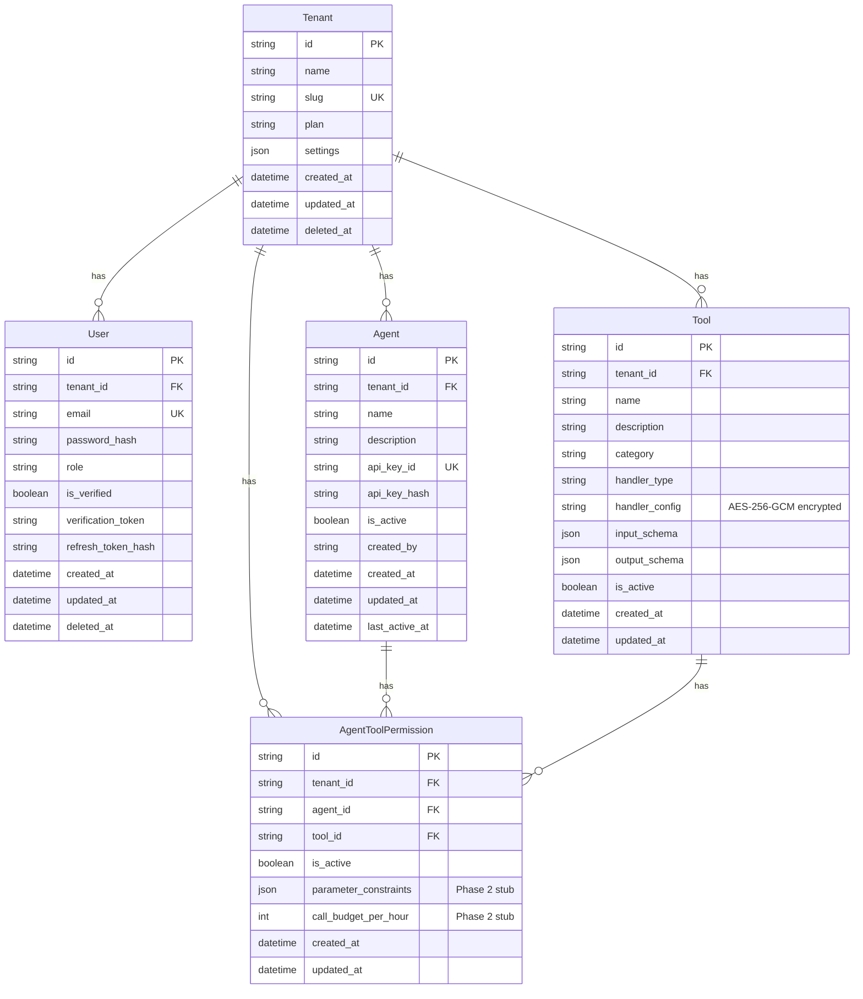

# AgentGate — Multi-Tenant MCP Agent Infrastructure Platform

> A gateway platform that lets AI agents securely authenticate, discover, and invoke registered tools with enforced permissions, rate limits, audit logging, and real-time observability.

**Status:** MVP in development — Milestone 3/4 complete (Permission Engine, Rate Limiter, Tool Execution Pipeline, SSRF/DNS Security)
**Stack:** TypeScript (strict) · Fastify · PostgreSQL 16 · Redis 7 · BullMQ · Prisma
**Protocol:** MCP (Model Context Protocol) via HTTP + SSE _(Week 6)_

---

## Table of Contents

1. [Project Overview](#project-overview)
2. [System Architecture](#system-architecture)
3. [Directory Structure](#directory-structure)
4. [Layer-by-Layer Breakdown](#layer-by-layer-breakdown)
5. [Data Model](#data-model)
6. [Key Design Decisions](#key-design-decisions)
7. [Running the Project](#running-the-project)
8. [Environment Variables](#environment-variables)
9. [License](#license)

---

## Project Overview

AgentGate sits between AI agents (Claude, GPT, open-source models) and the systems they need to interact with. It provides a controlled, observable, permissioned service layer — analogous to an API gateway but for AI agent consumption via the MCP protocol.

### Core Concepts

| Concept        | Description                                                                        |
| -------------- | ---------------------------------------------------------------------------------- |
| **Tenant**     | An isolated company/team using the platform. Full data isolation.                  |
| **User**       | A human administrator (authenticates via JWT). Manages agents, tools, permissions. |
| **Agent**      | An AI agent (authenticates via API key). Invokes tools through the platform.       |
| **Tool**       | A registered capability — HTTP call, DB query, web fetch.                          |
| **Permission** | Declares which agent can call which tool, under what conditions.                   |

### Current Milestone Status

| Milestone | Status      | What's Built                                                                                                                |
| --------- | ----------- | --------------------------------------------------------------------------------------------------------------------------- |
| M1        | ✅ Complete | Multi-tenancy, Auth (register/login/refresh/logout), TenantContext middleware, email verification pipeline                  |
| M2        | ✅ Complete | Agent CRUD + API key generation, Tool CRUD + config encryption (AES-256-GCM), schema validation                             |
| M3        | ✅ Complete | Permission engine, Atomic Redis rate limiter, Circuit breaker, Concurrency-safe Lua scripts                                 |
| M4        | ✅ Complete | Tool execution pipeline: HTTP handler, PostgreSQL query handler, WebFetch handler, SSRF/DNS security, timeout/abort control |
| M5        | 🚧 Week 5   | Audit logging infrastructure (BullMQ worker, audit_events table)                                                            |
| M6        | ⏳ Week 6   | MCP Gateway (SSE connection handler, JSON-RPC router)                                                                       |
| M7        | ⏳ Week 7   | Real-time observability WebSocket stream                                                                                    |
| M8        | ⏳ Week 8   | Integration testing, hardening, Docker deployment                                                                           |

---

## System Architecture

```mermaid
graph TB
    subgraph INGRESS["🔄 Ingress Layer"]
        AGENT["🤖 AI Agent (Future MCP)"]
        ADMIN["👤 Tenant Admin (Human via REST)"]
    end

    subgraph FASTIFY["🔷 Fastify Application Server"]
        direction TB

        subgraph PLUGINS["Plugins & Middleware"]
            JWT["@fastify/jwt - JWT Sign/Verify"]
            SENS["@fastify/sensible - HTTP Helpers"]
            TCTX["tenant-context.plugin - request.decorate"]
        end

        subgraph HOOKS["Hooks (preHandler)"]
            AUTH["authenticate.hook - JWT Verification"]
            ATTACH["attach-tenant-context.hook - Extract JWT -> Context"]
            REQACT["require-active-identity.hook - DB Re-verify"]
        end

        subgraph ROUTES["Route Handlers"]
            HEALTH["healthcheck.ts - GET /healthcheck"]
            REGISTER["auth/register.ts - POST /auth/register-tenant"]
            LOGIN["auth/login.ts - POST /auth/login"]
            REFRESH["auth/refresh.ts - POST /auth/refresh"]
            LOGOUT["auth/logout.ts - POST /auth/logout"]
            AGENTS["agents.ts - CRUD /api/agents"]
            TOOLS["tools.ts - CRUD /api/tools"]
            PERMS["permissions.ts - /api/agents/:id/permissions"]
        end
    end

    subgraph SERVICES["🧠 Service Layer"]
        AS["auth.service.ts - Registration, Login, Email Verify"]
        AGS["agent.service.ts - Agent CRUD, Key Generation & Rotation"]
        TS["tool.service.ts - Tool CRUD, Config Encryption, Schema Validation"]
        PS["permission.service.ts - Assign, List, Revoke Permissions"]
    end

    subgraph REPOS["🗄️ Repository Layer"]
        TR["tenant.repository.ts"]
        UR["user.repository.ts"]
        AR["agent.repository.ts - findByKeyId (API key lookup)"]
        TLR["tool.repository.ts"]
        PR["permission.repository.ts - findGrantWithContext"]
    end

    subgraph LIBS["🔧 Library / Utility Layer"]
        PRISMA["prisma.ts - PrismaClient Singleton"]
        REDIS["redis.ts - ioredis Singleton"]
        RATELIMIT["rate-limiter.ts - Lua INCR + Circuit Breaker"]
        BREAKER["circuit-breaker.ts - 3-State Circuit Breaker"]
        PERMENG["permission-engine.ts - checkPermission()"]
        APIKEY["api-key.ts - Generate, Hash, Verify"]
        ENCRYPT["encryption.ts - AES-256-GCM HKDF Key Derivation"]
        NETSAFE["network-safety.ts - SSRF Prevention (IP Ranges)"]
        DNSEC["dns-security.ts - DNS Resolution + Validation"]
        LOOKUP["safe-lookup.ts - net.LookupFunction Factory"]
        SAGENT["safe-agent.ts - Undici Agent with Safe DNS"]
        SCHEMA["schema-validator.ts - JSON Schema 3-Gate Validation"]
        SAFETY["schema-safety.ts - Complexity & ReDoS Detection"]
        EXEC["execute-tool.ts - Tool Dispatcher + Audit Stub"]
        HCONFIG["handler-config.schema.ts - Zod Schemas for Handler Configs"]
        STREAM["stream-utils.ts - Bounded Async Stream Reader"]
        TIMEOUT["timeout.ts - AbortSignal Composition for Timeouts"]
        CONTENT["content-utils.ts - Media Type Parsing, HTML Stripping"]
        ERR_REDACT["error-redaction.ts - Secrets Redaction in Errors"]
        PGS["postgres-stream.ts - Streaming PG Query with Row Guard"]
        PGU["postgres-utils.ts - PG Target Parsing, Socket Factory"]
        REQCTX["request-context.ts - getTenantContext() Accessors"]
        ROLE["role.ts - Role Validation (owner/admin/member)"]
    end

    subgraph HANDLERS["⚡ Tool Execution Handlers"]
        HTTP_H["http-handler.ts - HTTP/HTTPS via Undici"]
        PG_H["postgres-handler.ts - Parametrized PG Queries"]
        WEBFETCH_H["webfetch-handler.ts - Web Content Fetcher"]
        HTYPES["types.ts - HandlerResult, Error Classes"]
    end

    subgraph QUEUE["📨 Async Queue"]
        EQ["email.queue.ts - BullMQ Queue"]
        EW["email.worker.ts - Email Worker (Stub)"]
    end

    subgraph DATA["💾 Data Stores"]
        PG[("PostgreSQL 16 - System of Record")]
        RDS[("Redis 7 - Rate Limit Counters, BullMQ Queue State")]
    end

    subgraph CONFIG["⚙️ Configuration"]
        ENV["env.ts - Zod Schema Validation - All env vars + hex key parsing"]
    end

    subgraph TYPES["📐 Type Definitions"]
        FT["fastify.d.ts - Module Augmentation"]
        COM["common.ts - Shared Interfaces"]
        DB["db-client.type.ts - DbClient Union"]
    end

    ADMIN -->|HTTPS JWT| ROUTES
    PLUGINS --> HOOKS
    HOOKS --> ROUTES
    ROUTES --> SERVICES
    SERVICES --> REPOS
    REPOS --> LIBS
    SERVICES --> LIBS
    LIBS -->|Rate Limiting| RDS
    LIBS -->|Execution| HANDLERS
    QUEUE --> RDS
    REPOS --> PG
    CONFIG --> SERVICES
    CONFIG --> LIBS
    TYPES --> FASTIFY
```



### Core Pipeline (Request Lifecycle)



---

## Directory Structure

```
agentgate/
│
├── 📄 package.json              # Project manifest: dependencies, scripts, metadata
├── 📄 tsconfig.json             # TypeScript strict-mode config
├── 📄 vitest.config.ts          # Vitest test runner config
├── 📄 docker-compose.yml        # PostgreSQL 16 + Redis 7 local dev stack
├── 📄 Makefile                  # Infra commands: infra/start, db/migrate, test, dev
├── 📄 prisma.config.ts          # Prisma configuration file
├── 📄 HLD.md                    # High-Level Design & MVP Execution Plan
├── 📄 PRD.md                    # Product Requirements Document
├── 📄 PROGRESS.md               # Development progress tracking
├── 📄 app-structure.md          # (Legacy) Application structure reference
├── 📄 roadmap.md                # Overall roadmap
├── 📄 roadmap_w1.md             # Week 1 roadmap
├── 📄 roadmap_w2.md             # Week 2 roadmap
├── 📄 roadmap_w3.md             # Week 3 roadmap
├── 📄 roadmap_w4.md             # Week 4 roadmap
├── 📄 roadmap_w4_d1.md          # Day 1 of Week 4
├── 📄 roadmap_w4_d2.md          # Day 2 of Week 4
├── 📄 roadmap_w4_d3.md          # Day 3 of Week 4
├── 📄 roadmap_w4_d4.md          # Day 4 of Week 4
├── 📄 roadmap_w4_d5.md          # Day 5 of Week 4
│
├── 📁 prisma/
│   ├── 📄 schema.prisma          # Database schema (4 models: Tenant, User, Agent, Tool, AgentToolPermission)
│   └── 📁 migrations/            # Prisma migration files
│       ├── 📄 migration_lock.toml
│       ├── 📁 20260702105237_init/              # Initial schema: tenants & users
│       ├── 📁 20260707203949_create_refresh_token_index/
│       ├── 📁 20260710173059_create_agent_table/
│       ├── 📁 20260712091550_create_tools_table/
│       └── 📁 20260717004842_create_agent_tool_permission_table/
│
├── 📁 src/
│   ├── 📄 app.ts                 # 🎯 APP FACTORY — Fastify instance creation, plugin registration,
│   │                             #     route mounting, global error handler, protected scope
│   │
│   ├── 📄 server.ts              # 🚀 ENTRY POINT — HTTP listen, graceful shutdown (SIGTERM/SIGINT),
│   │                             #     closes DB/Redis/workers
│   │
│   ├── 📁 config/
│   │   └── 📄 env.ts             # Zod schema — validates ALL environment variables on startup,
│   │                             #     parses hex keys (pepper, encryption, refresh token secret)
│   │
│   ├── 📁 plugins/               # Fastify plugins (decorators, global middleware)
│   │   ├── 📄 sensible.plugin.ts     # @fastify/sensible — reply.badRequest(), .notFound(), etc.
│   │   └── 📄 tenant-context.plugin.ts  # Declares request.tenantContext decorator (null default)
│   │
│   ├── 📁 hooks/                 # Reusable preHandler functions (middleware chain)
│   │   ├── 📄 authenticate.hook.ts           # Verifies JWT via request.jwtVerify()
│   │   ├── 📄 attach-tenant-context.hook.ts  # Reads decoded JWT payload → request.tenantContext
│   │   └── 📄 require-active-identity.hook.ts # DB re-verify: user + tenant not deleted
│   │
│   ├── 📁 routes/                # Route handlers (HTTP layer)
│   │   ├── 📄 healthcheck.ts     # GET /healthcheck — public, rate-limiter health
│   │   ├── 📄 agents.ts          # CRUD /api/agents — create, list, get, update, deactivate,
│   │   │                         #     reactivate, rotate-key
│   │   ├── 📄 tools.ts           # CRUD /api/tools — create, list, get, update, deactivate
│   │   ├── 📄 permissions.ts     # /api/agents/:agentId/permissions — assign, list, revoke
│   │   │                         #     + per-user rate limit (30 req/min)
│   │   └── 📁 auth/
│   │       ├── 📄 register.ts    # POST /auth/register-tenant (tenant + owner creation)
│   │       │                     #     GET /auth/verify-email (email verification)
│   │       ├── 📄 login.ts       # POST /auth/login (password + argon2 + JWT)
│   │       ├── 📄 refresh.ts     # POST /auth/refresh (HMAC refresh token → new access token)
│   │       └── 📄 logout.ts      # POST /auth/logout (invalidate refresh token hash)
│   │
│   ├── 📁 services/              # Business logic layer (no HTTP, no direct DB access)
│   │   ├── 📄 auth.service.ts    # registerTenant, verifyEmail, login, refresh, logout
│   │   ├── 📄 agent.service.ts   # createAgent (API key gen), list, get, update, deactivate,
│   │   │                         #     reactivate, rotateKey
│   │   ├── 📄 tool.service.ts    # createTool (schema validation + config encryption),
│   │   │                         #     list, get, getDecryptedConfig, update, deactivate
│   │   └── 📄 permission.service.ts # assignPermission, listPermissions, revokePermission
│   │
│   ├── 📁 repositories/          # Data access layer (ALL queries tenant-scoped)
│   │   ├── 📄 tenant.repository.ts   # findById, findBySlug, create
│   │   ├── 📄 user.repository.ts     # findByEmail, findById, findByRefreshTokenHash, etc.
│   │   ├── 📄 agent.repository.ts    # create, findById, findByKeyId, list, updateProfile, etc.
│   │   ├── 📄 tool.repository.ts     # create, findById, list, updateProfile, setActiveStatus
│   │   └── 📄 permission.repository.ts # create, listByAgentId, deactivate, findGrantWithContext
│   │
│   ├── 📁 handlers/              # Tool execution handlers
│   │   ├── 📄 types.ts           # HandlerResult, ExecutionResult, error classes, constants
│   │   ├── 📄 http-handler.ts    # HTTP/HTTPS tool execution via undici (SSRF-safe)
│   │   ├── 📄 postgres-handler.ts # PostgreSQL query execution (streaming, SSRF-safe)
│   │   └── 📄 webfetch-handler.ts # Web content fetcher (HTML, JSON, plain text)
│   │
│   ├── 📁 lib/                   # Stateless utilities (zero Fastify dependency)
│   │   ├── 📄 prisma.ts          # PrismaClient singleton (PgAdapter, connection pool)
│   │   ├── 📄 redis.ts           # ioredis singleton (BullMQ-compatible config)
│   │   ├── 📄 api-key.ts         # generateApiKey (prefix+keyId+secret), parseApiKey,
│   │   │                         #     hashApiKeySecret (argon2), verifyApiKeySecret
│   │   ├── 📄 encryption.ts      # AES-256-GCM encryptConfig/decryptConfig
│   │   │                         #     HKDF key derivation per tenant
│   │   ├── 📄 rate-limiter.ts    # Dedicated Redis client + Lua script (rateLimitIncr),
│   │   │                         #     CircuitBreaker, checkRateLimit(), checkRateLimitByKey()
│   │   ├── 📄 circuit-breaker.ts # CircuitBreaker class — CLOSED → OPEN → HALF_OPEN
│   │   ├── 📄 permission-engine.ts # checkPermission() — pure DB query + status cascading
│   │   ├── 📄 request-context.ts # getTenantContext() + getActiveUser() — typed accessors
│   │   ├── 📄 handler-config.schema.ts # Zod schemas: http, postgres, webFetch handler configs
│   │   ├── 📄 network-safety.ts  # Hostname/IP safety checks — SSRF prevention
│   │   ├── 📄 dns-security.ts    # DNS resolution (resolve4/resolve6) + IP validation
│   │   ├── 📄 safe-lookup.ts     # net.LookupFunction factory with DNS security
│   │   ├── 📄 safe-agent.ts      # Shared undici Agent with safe DNS lookup
│   │   ├── 📄 schema-validator.ts # JSON Schema validation via AJV (3 gates)
│   │   ├── 📄 schema-safety.ts   # Schema complexity limits, regex ReDoS scanning
│   │   ├── 📄 execute-tool.ts    # Tool dispatcher — routes to handler, audit stub
│   │   ├── 📄 audit-stub.ts      # Fire-and-forget audit stub (console.log, Week 5 placeholder)
│   │   ├── 📄 stream-utils.ts    # Bounded async stream reader (10MB ceiling)
│   │   ├── 📄 timeout.ts         # AbortSignal composition for tool execution timeouts
│   │   ├── 📄 content-utils.ts   # Media type parsing, HTML stripping, text extraction
│   │   ├── 📄 error-redaction.ts # Secrets redaction in error messages
│   │   ├── 📄 postgres-stream.ts # Streaming PG query execution with row/byte limits
│   │   ├── 📄 postgres-utils.ts  # PG URL parsing, safe socket factory, force terminate
│   │   └── 📄 role.ts            # VALID_ROLES constant + assertValidRole() helper
│   │
│   ├── 📁 queue/                 # BullMQ queue definitions
│   │   └── 📄 email.queue.ts     # "email" Queue — verification emails (typed jobs)
│   │
│   ├── 📁 workers/               # BullMQ background workers
│   │   └── 📄 email.worker.ts    # Email worker (stub — logs to console, SMTP in Phase 2)
│   │
│   ├── 📁 types/                 # TypeScript type definitions
│   │   ├── 📄 fastify.d.ts       # Module augmentation: request.tenantContext, JWT payload
│   │   ├── 📄 common.ts          # ExecutionResult, PaginationParams, DateRangeFilter
│   │   └── 📄 db-client.type.ts  # DbClient = PrismaClient | Prisma.TransactionClient
│   │
│   └── 📁 __tests__/             # Test suite (Vitest) — 46+ test files
│       ├── 📁 helpers/
│       │   ├── 📄 setup.ts       # Global afterEach DB cleanup, test setup
│       │   └── 📄 test-tenant.factory.ts # Tenant+user creation helper
│       │
│       ├── 📄 health.test.ts                   # Health check endpoint
│       ├── 📄 database.test.ts                 # DB connectivity
│       ├── 📄 auth.register.test.ts            # Registration flow
│       ├── 📄 auth.register-edge-cases.test.ts # Registration edge cases (P2002, slugs)
│       ├── 📄 auth.session.test.ts             # Session management
│       ├── 📄 auth.e2e.test.ts                 # Auth end-to-end lifecycle
│       ├── 📄 attach-tenant-context.test.ts    # Tenant context middleware
│       ├── 📄 tenant-isolation.test.ts         # Tenant data isolation proofs
│       ├── 📄 encryption.test.ts               # AES-256-GCM roundtrip
│       ├── 📄 api-key.test.ts                  # API key generation/verification
│       ├── 📄 agents.test.ts                   # Agent CRUD
│       ├── 📄 tools.route.test.ts              # Tool CRUD routes
│       ├── 📄 agent_tool.integration.test.ts   # Agent-tool integration
│       ├── 📄 schema-safety.test.ts            # Schema safety checks
│       ├── 📄 network-safety.test.ts           # SSRF prevention tests
│       ├── 📄 dns-security.test.ts             # DNS resolution safety
│       ├── 📄 handler-config.schema.test.ts    # Handler config validation
│       ├── 📄 permission-engine.test.ts        # Permission engine unit tests
│       ├── 📄 permission.repository.test.ts    # Permission repository
│       ├── 📄 permission.service.test.ts       # Permission service
│       ├── 📄 permissions.e2e.test.ts          # Permissions end-to-end
│       ├── 📄 permission-latency.test.ts       # Permission check latency
│       ├── 📄 circuit-breaker.test.ts          # Circuit breaker states
│       ├── 📄 rate-limiter.atomicity.test.ts   # Redis atomicity proofs
│       ├── 📄 rate-limit-concurrency.test.ts   # Concurrent rate limit proofs
│       ├── 📄 rate-limit-latency.test.ts       # Rate limit latency
│       ├── 📄 rate-limit-tenant-scope.test.ts  # Tenant-scoped rate limiting
│       ├── 📄 rate-limit-decision.test.ts      # Rate limit decision logic
│       ├── 📄 rate-limiter-health.test.ts      # Rate limiter health check
│       ├── 📄 rate-limit-breaker.integration.test.ts # Rate limiter + breaker
│       ├── 📄 http-handler.test.ts             # HTTP handler
│       ├── 📄 postgres-handler.test.ts         # Postgres handler
│       ├── 📄 postgres-stream.test.ts          # Postgres streaming
│       ├── 📄 postgres-utils.test.ts           # Postgres utilities
│       ├── 📄 webfetch-handler.test.ts         # WebFetch handler
│       ├── 📄 execute-tool.test.ts             # Tool execution dispatcher
│       ├── 📄 content-utils.test.ts            # Content utilities
│       ├── 📄 stream-utils.test.ts             # Stream utilities
│       ├── 📄 timeout.test.ts                  # Timeout composition
│       ├── 📄 error-redaction.test.ts          # Error redaction
│       ├── 📄 schema-safety.test.ts            # Schema safety
│       ├── 📄 week3-checkpoint.test.ts         # Week 3 integration checkpoint
│       └── 📄 ... (more M4-specific tests)
│
├── 📄 .gitignore
├── 📄 .env                         # (Not committed — local env vars)
└── 📄 .env.example                 # (Committed — all keys with placeholder values)
```

---

## Layer-by-Layer Breakdown

### 1. Application Core (`src/app.ts` + `src/server.ts`)

| File        | Purpose                                                                                                                                                                                                                                                                                                                  |
| ----------- | ------------------------------------------------------------------------------------------------------------------------------------------------------------------------------------------------------------------------------------------------------------------------------------------------------------------------ |
| `app.ts`    | Creates and configures the Fastify instance. Registers plugins (sensible, JWT, tenant-context). Mounts routes in order: public (health, auth) → protected (agents, tools, permissions). Sets up global error handler (hides 500 internals, passes through 4xx). Defines proof endpoints `/api/me` and `/api/me/details`. |
| `server.ts` | Entry point. Calls `createApp()`, initializes email worker, sets up graceful shutdown (SIGTERM/SIGINT). Shutdown order: app → email worker → email queue → rate limiter Redis → main Redis → Prisma.                                                                                                                     |

### 2. Configuration (`src/config/env.ts`)

Validates all environment variables using Zod on startup. **Parses** hex-encoded binary keys into `Buffer` objects:

- `AGENTGATE_PASSWORD_PEPPER` — Argon2 password pepper (32 bytes)
- `AGENTGATE_API_KEY_PEPPER` — Argon2 API key pepper (32 bytes)
- `AGENTGATE_PLATFORM_ENCRYPTION_KEY` — AES-256-GCM key (32 bytes)
- `AGENTGATE_REFRESH_TOKEN_SECRET` — HMAC key for refresh tokens (32 bytes)

### 3. Plugins Layer (`src/plugins/`)

| Plugin                     | What it does                                                                                                                                      |
| -------------------------- | ------------------------------------------------------------------------------------------------------------------------------------------------- |
| `sensible.plugin.ts`       | Registers `@fastify/sensible` — HTTP helper methods (`reply.badRequest()`, `reply.notFound()`, `reply.unauthorized()`, `reply.conflict()`, etc.)  |
| `tenant-context.plugin.ts` | Decorates `FastifyRequest` with `tenantContext: null` and `activeUser: null`. Must be registered before hooks/routes can access these properties. |

### 4. Hooks Layer (`src/hooks/`)

Applied as `preHandler` on the protected route scope. Runs in order:

1. **`authenticate.hook.ts`** — Calls `request.jwtVerify()`. Returns 401 if token is invalid/expired.
2. **`attach-tenant-context.hook.ts`** — Reads decoded JWT payload, validates role (owner/admin/member whitelist), writes `request.tenantContext = { tenantId, userId, role }`.
3. **`require-active-identity.hook.ts`** — Queries PostgreSQL to ensure user and tenant are not soft-deleted. Caches result as `request.activeUser`.

### 5. Route Handlers (`src/routes/`)

| Route File         | HTTP Endpoints                                                                                                                     | Auth                               |
| ------------------ | ---------------------------------------------------------------------------------------------------------------------------------- | ---------------------------------- |
| `healthcheck.ts`   | `GET /healthcheck`                                                                                                                 | Public                             |
| `auth/register.ts` | `POST /auth/register-tenant`, `GET /auth/verify-email`                                                                             | Public                             |
| `auth/login.ts`    | `POST /auth/login`                                                                                                                 | Public                             |
| `auth/refresh.ts`  | `POST /auth/refresh`                                                                                                               | Public                             |
| `auth/logout.ts`   | `POST /auth/logout`                                                                                                                | Public                             |
| `agents.ts`        | `POST/GET /api/agents`, `GET/PATCH/DELETE /api/agents/:id`, `POST /api/agents/:id/reactivate`, `POST /api/agents/:id/rotate-key`   | JWT                                |
| `tools.ts`         | `POST/GET /api/tools`, `GET/PATCH/DELETE /api/tools/:id`                                                                           | JWT                                |
| `permissions.ts`   | `POST /api/agents/:agentId/permissions`, `GET /api/agents/:agentId/permissions`, `DELETE /api/agents/:agentId/permissions/:toolId` | JWT + per-user rate limit (30/min) |

### 6. Service Layer (`src/services/`)

| Service                 | Responsibilities                                                                                                                                                                                                                      |
| ----------------------- | ------------------------------------------------------------------------------------------------------------------------------------------------------------------------------------------------------------------------------------- |
| `auth.service.ts`       | Tenant + user registration (transactional), password hashing (argon2 with pepper), email verification token management, login (timing-safe comparison), JWT access token generation, refresh token rotation (HMAC + DB hash), logout. |
| `agent.service.ts`      | Agent CRUD, API key generation (argon2-hashed, returned once), key rotation, activation/deactivation/reactivation.                                                                                                                    |
| `tool.service.ts`       | Tool CRUD with input schema validation (AJV + safety gates), handler config encryption (AES-256-GCM), handler config decryption for execution.                                                                                        |
| `permission.service.ts` | Assign permission (validates agent+tool exist in tenant), list paginated permissions, revoke (soft-deactivate).                                                                                                                       |

### 7. Repository Layer (`src/repositories/`)

Every repository function accepts an optional `client` parameter (defaulting to the singleton `prisma`), enabling transaction participation. **All queries are tenant-scoped** via `WHERE tenantId = ?`.

Key functions:

- **`agent.repository.findByKeyId(apiKeyId)`** — The ONE lookup without tenantId. Used during MCP SSE connection where tenant is unknown until agent is resolved.
- **`permission.repository.findGrantWithContext()`** — Hot-path lookup for permission checks. Returns agent.isActive, tool.isActive, tenant.deletedAt in a single query.

### 8. Library Layer (`src/lib/`)

Stateless utilities, zero Fastify dependency, independently testable:

| Library                    | What It Does                                                                                                                                                                                                                       |
| -------------------------- | ---------------------------------------------------------------------------------------------------------------------------------------------------------------------------------------------------------------------------------- |
| `prisma.ts`                | PrismaClient singleton with `@prisma/adapter-pg` connection pool. Cached on `globalThis` in non-production.                                                                                                                        |
| `redis.ts`                 | ioredis singleton configured for BullMQ (`maxRetriesPerRequest: null`). Reconnect with backoff.                                                                                                                                    |
| `rate-limiter.ts`          | **Dedicated Redis client** for rate limiting (short timeouts, limited retries). Custom `rateLimitIncr` Lua command (INCR + EXPIRE in one atomic op). `checkRateLimit()` + `checkRateLimitByKey()`. Integrated with CircuitBreaker. |
| `circuit-breaker.ts`       | Three-state circuit breaker: CLOSED → OPEN (on 3 failures) → HALF_OPEN (after 15s cooldown, single probe attempt). Used by the rate limiter.                                                                                       |
| `api-key.ts`               | API key format: `agk.<12-byte-keyId-hex>.<32-byte-secret-hex>`. Generate, parse, hash (argon2 with pepper), verify.                                                                                                                |
| `encryption.ts`            | AES-256-GCM encryption/decryption of tool handler configs. Tenant-specific key derivation via HKDF. Output format: `iv:ciphertext:authTag` (base64 segments).                                                                      |
| `permission-engine.ts`     | Pure `checkPermission()` function. Queries `findGrantWithContext()` and cascades through: tenant deleted? → permission inactive? → agent inactive? → tool inactive?                                                                |
| `network-safety.ts`        | SSRF prevention. Blocks private IP ranges, localhost, metadata endpoints. Validates HTTP URLs and PostgreSQL connection strings.                                                                                                   |
| `dns-security.ts`          | DNS resolution using `resolve4()`/`resolve6()` (not `dns.lookup()`, which shares libuv threadpool with argon2). Resolves and validates ALL candidate IPs before allowing connection.                                               |
| `safe-lookup.ts`           | Creates a `net.LookupFunction` that uses `dns-security.ts` for validation, usable as `lookup` option in `net.connect()` or undici's `Agent`.                                                                                       |
| `safe-agent.ts`            | Shared undici `Agent` instance with SSRF-safe DNS lookup. Single instance reused across all HTTP/WebFetch handlers.                                                                                                                |
| `handler-config.schema.ts` | Zod discriminated union schemas for `http`, `postgres`, and `web_fetch` handlers. SSRF-safe URL validation via `network-safety.ts`.                                                                                                |
| `schema-validator.ts`      | Three-gate JSON Schema validation: structural (AJV) → complexity (size/depth) → pattern safety (ReDoS detection).                                                                                                                  |
| `schema-safety.ts`         | `checkSchemaComplexity()` — max 20KB serialized, max depth 20. `scanForUnsafeRegexPatterns()` — max pattern length 200, safe-regex validation.                                                                                     |
| `execute-tool.ts`          | Tool dispatcher: reads tool from DB, decrypts config, validates with Zod, routes to appropriate handler. Wraps execution in `withTimeout()`. Produces audit events via stub.                                                       |
| `audit-stub.ts`            | Fire-and-forget audit stub (logs to console). Week 5 replaces this with BullMQ enqueue without changing the interface.                                                                                                             |
| `stream-utils.ts`          | `readBoundedStream()` — reads an async byte stream up to a max byte limit, throws `PayloadTooLargeError` on overflow.                                                                                                              |
| `timeout.ts`               | `withTimeout()` — composes an AbortSignal from a timeout duration and optional external signal, races the handler against it.                                                                                                      |
| `content-utils.ts`         | `parseMediaType()`, `assertSupportedMediaType()`, `stripHtml()`, `extractReadableText()` — parses and extracts text from web responses.                                                                                            |
| `error-redaction.ts`       | `redactSecrets()` — strips URL credentials, Bearer tokens, and API key patterns from error messages before returning to callers.                                                                                                   |
| `postgres-stream.ts`       | `executePostgresStreamingQuery()` — uses `pg-query-stream` for row-by-row iteration with `MAX_POSTGRES_ROWS` (1,000) and `MAX_POSTGRES_PAYLOAD_BYTES` (10MB) guards.                                                               |
| `postgres-utils.ts`        | `parsePostgresUrl()`, `createSafePostgresStreamFactory()`, `forceTerminateClient()`, `redactConnectionString()`.                                                                                                                   |
| `request-context.ts`       | `getTenantContext(request)` and `getActiveUser(request)` — typed accessors that throw if hook ordering is violated.                                                                                                                |
| `role.ts`                  | `VALID_ROLES = ["owner", "admin", "member"]`. `assertValidRole()` for JWT payload hardening.                                                                                                                                       |

### 9. Handler Layer (`src/handlers/`)

| Handler                | File                  | Description                                                                                                                                                                                                                                                                                                                                                                           |
| ---------------------- | --------------------- | ------------------------------------------------------------------------------------------------------------------------------------------------------------------------------------------------------------------------------------------------------------------------------------------------------------------------------------------------------------------------------------- |
| **HTTP Handler**       | `http-handler.ts`     | Executes HTTP requests via undici with SSRF-safe DNS. Interpolates body templates with `{{param}}` syntax. Enforces 10MB response ceiling. Returns `{ statusCode, headers, body }`.                                                                                                                                                                                                   |
| **PostgreSQL Handler** | `postgres-handler.ts` | Opens a dedicated pg.Client (per-execution, no pooling). Uses streaming query with row/byte limits. SSRF-safe DNS validation. Connection-level timeout via `forceTerminateClient()`.                                                                                                                                                                                                  |
| **WebFetch Handler**   | `webfetch-handler.ts` | GET-only web content fetcher. Strips HTML to text. Enforces media type whitelist (HTML, XHTML, plain text, JSON). 2MB ceiling.                                                                                                                                                                                                                                                        |
| **Types**              | `types.ts`            | `HandlerResult`, `ExecutionResult`, `HandlerStatus`, `ToolExecutionErrorCode`. Error classes: `TimeoutError`, `PayloadTooLargeError`, `SsrfBlockedError`, `UnsupportedMediaTypeError`, `RowLimitExceededError`, `ByteLimitExceededError`. Constants: `MAX_PAYLOAD_BYTES`, `MAX_WEBFETCH_BYTES`, `MAX_POSTGRES_ROWS`, `DEFAULT_TIMEOUT_MS`, `DNS_TIMEOUT_MS`, `CONNECTION_TIMEOUT_MS`. |

### 10. Queue & Workers (`src/queue/` + `src/workers/`)

| File              | Purpose                                                                                   |
| ----------------- | ----------------------------------------------------------------------------------------- |
| `email.queue.ts`  | BullMQ `email` Queue. Job type: `{ type: "verification", email: string, token: string }`. |
| `email.worker.ts` | Email worker (currently a stub that logs to console). Real SMTP/SendGrid in Phase 2.      |

### 11. Type Definitions (`src/types/`)

| File                | Contents                                                                                                              |
| ------------------- | --------------------------------------------------------------------------------------------------------------------- | ------------------------------------------------------------------------------------------- |
| `fastify.d.ts`      | Module augmentation for Fastify: `request.tenantContext`, `request.activeUser`, `FastifyInstance`, JWT payload shape. |
| `common.ts`         | `ExecutionResult`, `PaginationParams`, `DateRangeFilter` interfaces.                                                  |
| `db-client.type.ts` | `DbClient = PrismaClient                                                                                              | Prisma.TransactionClient` — enables both singleton and transactional usage in repositories. |

### 12. Test Suite (`src/__tests__/`)

46+ test files covering the entire codebase with unit, integration, and end-to-end tests:

| Category           | Files                                                                                                                                               | What's Tested                                                                          |
| ------------------ | --------------------------------------------------------------------------------------------------------------------------------------------------- | -------------------------------------------------------------------------------------- |
| **Health**         | `health.test.ts`, `database.test.ts`                                                                                                                | Server responds, DB connects                                                           |
| **Auth**           | 5 files                                                                                                                                             | Registration, edge cases, sessions, E2E flow                                           |
| **Multi-tenancy**  | `tenant-isolation.test.ts`, `attach-tenant-context.test.ts`                                                                                         | Strict data isolation                                                                  |
| **Security**       | `encryption.test.ts`, `api-key.test.ts`, `schema-safety.test.ts`, `network-safety.test.ts`, `dns-security.test.ts`, `handler-config.schema.test.ts` | Crypto roundtrip, key verification, SSRF prevention, ReDoS                             |
| **Agents & Tools** | `agents.test.ts`, `tools.route.test.ts`, `agent_tool.integration.test.ts`                                                                           | CRUD operations                                                                        |
| **Permissions**    | 4 files                                                                                                                                             | Engine, repository, service, E2E, latency                                              |
| **Rate Limiting**  | 5+ files                                                                                                                                            | Atomicity, concurrency, latency, circuit-breaker, tenant-scope, decision logic, health |
| **Handlers**       | 4+ files                                                                                                                                            | HTTP, Postgres, WebFetch, stream utilities                                             |
| **Execution**      | `execute-tool.test.ts`, `timeout.test.ts`, `content-utils.test.ts`, `stream-utils.test.ts`, `error-redaction.test.ts`                               | Dispatcher, timeout, content parsing, streams, error redaction                         |
| **Integration**    | `week3-checkpoint.test.ts`                                                                                                                          | Week 3 integration checkpoint                                                          |

---

## Data Model



### Key Schema Decisions

- **Soft deletes** on Tenant and User (`deletedAt`) — agents and tools are deactivated (`isActive = false`), never deleted.
- **`@@unique([tenantId, name])`** on Agent and Tool — names are unique within a tenant but can repeat across tenants.
- **`@@unique([agentId, toolId])`** on AgentToolPermission — one permission row per agent-tool pair.
- **Indexes** on `tenantId` for every tenant-scoped table, plus `refreshTokenHash` and `verificationToken` on users.
- **Handler config** is encrypted at rest with AES-256-GCM using a tenant-specific key (HKDF-derived from the platform master key).

---

## Key Design Decisions

### Architecture

- **Single Fastify process** — The in-memory session map (required by MCP's split HTTP channels: GET /sse + POST /message) cannot be serialized across processes. Horizontal scaling requires sticky sessions (Phase 2).
- **Two Redis clients** — Main Redis (for BullMQ, configured with `maxRetriesPerRequest: null`) and a separate rate-limiter Redis client (short timeouts, limited retries, command timeout). This prevents rate-limiting operations from being blocked by BullMQ's indefinite retry policy.
- **Layer isolation** — Routes → Services → Repositories → Prisma. Services know nothing about HTTP. Repositories accept optional transaction clients.

### Security

- **API keys**: Format `agk.<96-bit-keyId>.<256-bit-secret>`. KeyId is public (in the token), secret is argon2-hashed with a pepper. Raw secret returned once at creation, never stored.
- **Encryption at rest**: Tool handler configs (which may contain DB connection strings, API keys) encrypted with AES-256-GCM. Tenant-specific key derived via HKDF from a platform master key.
- **SSRF prevention**: Two-layer defense. Layer 1 — URL/connection string safety checks at tool creation time (block private IP ranges, localhost, metadata endpoints). Layer 2 — DNS resolution and IP validation at execution time, using `resolve4()`/`resolve6()` (not `dns.lookup()` to avoid threadpool contention with argon2).
- **Schema safety**: Three-gate validation on tool input schemas — structural (AJV), complexity (20KB max, depth 20), and ReDoS pattern scanning (safe-regex library).

### Rate Limiting

- **Atomic Lua script**: `INCR key` + `EXPIRE key 120` in one Redis eval call. Key pattern: `rate:agent:<agentId>:min:<epochMinute>`.
- **Circuit breaker**: Integrated with the rate limiter. After 3 Redis failures, the circuit opens for 15 seconds, then allows a single probe. On continued failure, stays open; on success, resets.
- **Degradation modes**: If Redis is down but the circuit hasn't tripped (below 3 failures), the rate limiter fails **open** (allows requests). If the circuit is OPEN, it fails **closed** (denies requests). Both paths set `degraded: true`.

### Tenant Isolation

Enforced at three layers:

1. **JWT** — The token contains `tenantId`. Middleware extracts it into `request.tenantContext`.
2. **Hook** — `require-active-identity.hook` re-verifies user+tenant are active via DB.
3. **Repository** — Every query includes `WHERE tenant_id = ?`.

---

## Running the Project

### Prerequisites

- Node.js >= 22
- Docker (for PostgreSQL + Redis)
- Docker Compose

### Quick Start

```bash
# 1. Start infrastructure (PostgreSQL + Redis)
make infra/start

# 2. Install dependencies
npm install

# 3. Set up environment variables
cp .env.example .env
# Edit .env with your values (or use defaults)

# 4. Run database migrations
make db/migrate

# 5. Start development server
make dev
```

### Available Make Commands

```bash
make infra/start     # Start DB + Redis containers
make infra/stop      # Stop containers (preserves volumes)
make infra/reset     # Wipe all data and restart
make db/migrate      # Create + apply Prisma migrations
make db/studio       # Open Prisma Studio (visual DB inspector)
make dev             # Start dev server (tsx watch)
make test            # Run all tests
make build           # Typecheck + compile TypeScript
```

---

## Environment Variables

| Variable                            | Description                                          | Required |
| ----------------------------------- | ---------------------------------------------------- | -------- |
| `AGENTGATE_DATABASE_URL`            | PostgreSQL connection string                         | Yes      |
| `AGENTGATE_REDIS_URL`               | Redis connection string                              | Yes      |
| `AGENTGATE_JWT_SECRET`              | JWT signing secret (min 32 chars)                    | Yes      |
| `AGENTGATE_PASSWORD_PEPPER`         | 64-char hex (32 bytes) — argon2 password pepper      | Yes      |
| `AGENTGATE_API_KEY_PEPPER`          | 64-char hex (32 bytes) — argon2 API key pepper       | Yes      |
| `AGENTGATE_REFRESH_TOKEN_SECRET`    | 64-char hex (32 bytes) — HMAC key for refresh tokens | Yes      |
| `AGENTGATE_PLATFORM_ENCRYPTION_KEY` | 64-char hex (32 bytes) — AES-256 master key          | Yes      |
| `AGENTGATE_NODE_ENV`                | Environment: `development` or `production`           | Yes      |
| `AGENTGATE_PORT`                    | HTTP listen port (default: 3000)                     | No       |
| `AGENTGATE_LOG_LEVEL`               | Pino log level: `info`, `debug`, `warn`, `error`     | No       |

---

## License

MIT
