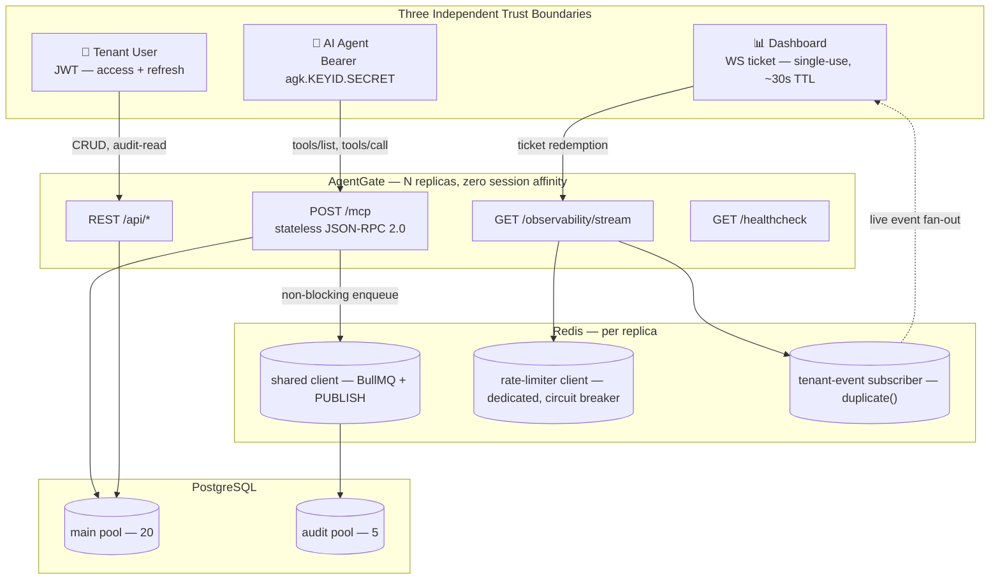
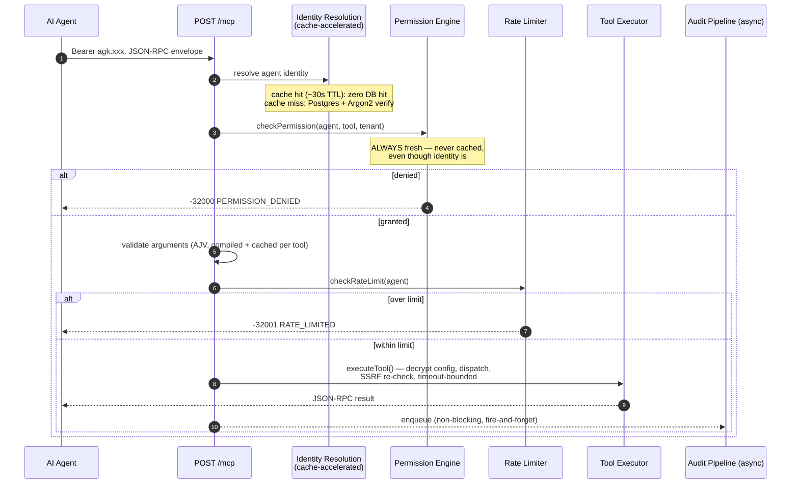
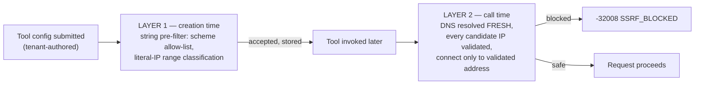

# AgentGate

**A multi-tenant gateway that stands between your AI agents and your actual infrastructure — so "just give the agent database access" doesn't have to be the plan.**


<!--  -->

---

Somewhere between *"let the agent call whatever it wants"* and *"hand-write bespoke integration glue for every agent × every system combo"* there's a gap nobody really filled. AgentGate is my attempt at filling it: a standard [MCP](https://modelcontextprotocol.io) interface that owns auth, permissions, rate limits, audit logging, and live observability, so the AI agent only ever needs to know what tools exist — not how to behave itself.

Built solo, over 9 weeks, with zero shortcuts on the parts that are actually hard (tenant isolation, SSRF, chaos testing, all of it). This README is long on purpose — it's the receipts, not the vibes.

**🔗 Live instance:** **[zoological-sparkle-production.up.railway.app](https://zoological-sparkle-production.up.railway.app)** — `GET /healthcheck` and go poke it.

> *Free-tier Railway hosting, so give it a second to wake up if it's been idle. It's a portfolio project, not a Series B.*

---

## The 30-Second Version

| | |
|---|---|
| **Build time** | 9 weeks, solo, evenings-and-weekends energy |
| **What it actually is** | An MCP gateway — auth, permissions, rate limiting, audit trail, live dashboard, all owned by the platform, not the agent |
| **Independent trust boundaries** | 3 — agent API key, human JWT, dashboard WebSocket ticket. None share a credential type. |
| **Tenant-isolation surfaces independently proven** | 4 — REST, MCP/JSON-RPC, WebSocket, audit-read |
| **Mid-build "the ground just moved" moment** | 1 — the MCP spec deprecated the transport this was designed against, days before I started building it. See below. |
| **Times "an infra fault got mistaken for a policy decision" got caught and fixed** | 11, across 9 weeks, in 11 different subsystems |
| **Load test that found a real bug, not just a slow number** | Yes — a silently over-permissive rate limiter, caught under real concurrency, not a unit test (§ [The Bug](#the-load-test-caught-a-real-bug)) |
| **Gateway overhead @ p95, 50 concurrent agents** | **45ms**, against a 300ms budget |
| **Deployed and reachable right now** | ✅ Yes |

---

## Table of Contents

- [What This Actually Solves](#what-this-actually-solves)
- [The Origin Story](#the-origin-story-aka-the-week-the-ground-moved)
- [Architecture at a Glance](#architecture-at-a-glance)
- [What Happens When an Agent Calls a Tool](#what-happens-when-an-agent-calls-a-tool)
- [Security, Seriously](#security-seriously)
- [The Thesis: An Infra Fault Is Not a Policy Decision](#the-thesis-an-infra-fault-is-not-a-policy-decision)
- [Multi-Tenant Isolation, Proven Not Assumed](#multi-tenant-isolation-proven-not-assumed)
- [Measured Performance](#measured-performance)
- [The Load Test Caught a Real Bug](#the-load-test-caught-a-real-bug)
- [Protocol Contracts](#protocol-contracts)
- [Tech Stack](#tech-stack)
- [Project Structure](#project-structure)
- [Running It Locally](#running-it-locally)
- [Take It for a Spin (curl walkthrough)](#take-it-for-a-spin-curl-walkthrough)
- [What I Deliberately Did Not Build](#what-i-deliberately-did-not-build)
- [The 9-Week Build Log](#the-9-week-build-log)
- [Engineering Principles I Kept Relearning](#engineering-principles-i-kept-relearning)
- [License](#license)

---

## What This Actually Solves

Giving an AI agent direct access to internal systems — a database, an internal API, Slack, whatever — is a genuinely bad idea by default. There's no controlled surface. The agent can call anything, with any parameters, at machine speed, with zero audit trail and zero rate limiting. When something inevitably goes sideways, there's no record of what actually happened.

The obvious alternative — hand-rolling integration code per agent per system — doesn't scale either. Every new agent needs new glue. Permissions get hardcoded somewhere nobody remembers. The audit log, if it exists at all, gets bolted on in month four as an afterthought.

The actual root issue: **agents aren't users.** A human logs in through a UI that structurally limits what they can even attempt. An agent authenticates programmatically and can call anything callable, as fast as the network allows. The auth/authz patterns companies already have were built for the first case. Nobody had really built the second one as real infrastructure, rather than a per-project workaround.

```
AI Agent (Claude, GPT, any MCP-conformant client)
          │  HTTPS · JSON-RPC 2.0
          ▼
   ┌──────────────────────┐
   │       AgentGate      │
   │  auth · permissions  │
   │  rate limits · audit │
   │  live observability  │
   └──────────────────────┘
          │
          ▼
   Registered Tools → Real Systems (DB, HTTP, webhooks…)
```

**What this is explicitly not:** a chatbot, an LLM wrapper, a workflow-automation tool a human clicks through, or a RAG pipeline. It has no opinion about which model is calling it. It's backend infrastructure — same category as an API gateway, just built for agent-speed traffic instead of human-speed traffic.

---

## The Origin Story (aka the week the ground moved)

A résumé line can say "built an MCP gateway." What actually happened is closer to: *"built an MCP gateway, then the protocol deprecated the transport it was designed against, mid-build, and the fix shipped inside the same week."* That's the better story, and it's true.

Going into Week 6, the plan was the standard MCP transport at the time: HTTP+SSE, a Session Map, heartbeats, idle timers. Three days before that week's build started, the spec's actual current state got re-checked (not assumed — this project has a whole discipline built around not assuming, more on that below), and the ecosystem had already moved to a **stateless Streamable HTTP** model: no session concept, no `Mcp-Session-Id`, every request self-contained.

The old design got fully rebuilt, inside the same week, as a single stateless `POST /mcp` endpoint. Not a downgrade — the new design is *simpler* (no session lifecycle to leak, no sticky-session requirement to scale horizontally) and *more secure* (no session token to steal or fixate; every request re-proves itself). The one thing the old design gave away for free — amortizing the ~100–300ms Argon2 verification cost across a session — got rebuilt deliberately as an **auth-accelerator cache**, which turned out to be a cleaner solution anyway.

| Milestone | Week | What shipped | The thing that almost got missed |
|---|---|---|---|
| **M1 — Multi-tenant bedrock** | 1 | Tenants, users, JWT auth, tenant-context middleware | Fastify isn't Express — middleware-as-hooks had to be learned right the first time or every downstream week inherits the bug |
| **M2 — Registries & crypto** | 2 | Split API keys, AES-256-GCM + per-tenant HKDF subkeys | A naive single-token key design would've needed an O(n) Argon2 sweep just to identify *which* agent — caught before it shipped |
| **M3 — Guardrails** | 3 | Fail-closed permission engine, Redis rate limiter, circuit breaker | Two Redis clients were needed, not one — conflicting reliability requirements on the same connection |
| **M4 — Execution pipeline** | 4 | HTTP/Postgres/WebFetch handlers, SSRF Layer 2 | Layer 1 alone doesn't stop DNS rebinding |
| **M5 — Audit pipeline** | 5 | Idempotent dual-table writes, dead-letter queue, two redaction passes | A string-pattern redactor silently fails on JSON-quoted secrets — needed a *structural* second pass |
| **M6 — MCP Gateway** | 6 | The gateway itself | **The spec moved out from under it. Full rebuild, same week.** |
| **M7 — Live observability** | 7 | Ticket-authed WebSocket, tenant-scoped fan-out | A browser can't see *why* a pre-upgrade WS connection failed (spec-mandated) — every rejection has to complete the handshake first |
| **M8 — Hardening** | 8 | Full-system chaos testing, load testing, real email + invites | A load test found a genuine correctness bug, not a slow number |
| **W9 — Ship it** | 9 | Deploy, docs, this README | A chaos-suite failure traced to the *one* unguarded DB call an earlier fix didn't reach — the 11th instance of the pattern below |

---

## Architecture at a Glance

Three independently-authenticated surfaces, zero shared credential types, and — the part that took actual engineering, not just endpoints — none of them can be used to reach through to another one's data.



**Why three separate auth models instead of one clever one:** agents aren't interactive — a long-lived, server-hashed API key is correct for them the same way it's correct for Stripe/GitHub/AWS keys. Users are interactive and session-bounded — JWT fits naturally. The dashboard needed a credential a *browser* could carry, and a browser's `WebSocket` constructor literally can't attach a custom `Authorization` header. Rather than invent a fourth pattern from scratch, the WS ticket reuses the exact shape already proven for refresh tokens: short-lived, single-use, server-stored, atomically redeemed. Same primitive, new context.

**Why three separate Redis connections:** once a connection issues `SUBSCRIBE`, Redis restricts it to pub/sub commands only — that one's structural, not a choice. The other split (shared vs. rate-limiter) exists because BullMQ needs infinite retry on its connection and the rate limiter needs to fail *fast* — directly conflicting settings that can't live on the same client. Total: **5 connections per replica**, confirmed empirically, not just assumed.

---

## What Happens When an Agent Calls a Tool

This is the critical path — every module built since Week 1 converges here.



Two ordering decisions that look arbitrary until you think about the threat model for five seconds:

- **Permission checked before schema validation.** An agent with zero grant on a tool could otherwise send garbage arguments on purpose and read the validation error back — leaking the tool's parameter shape to someone never authorized to see it via discovery either. Auth gates before anything tool-specific is revealed. No exceptions.
- **Identity is cached; permission never is.** Argon2 is deliberately slow (100–300ms) — re-verifying it on every call would blow the entire latency budget on identity checking alone. But the whole point of a permission system is that revocation takes effect on the *next* call, not after some TTL wanders off. So identity gets a fast, cacheable front door, and permission stays a slow, always-honest wall right behind it.

---

## Security, Seriously

### SSRF — two independent layers, not one

A tool that fetches a URL, queries a database, or hits a webhook is configured by the *tenant* — meaning the target is untrusted input pointed at real infrastructure. One check isn't enough, because a hostname can look perfectly safe at tool-creation time and resolve somewhere unsafe by the time it's actually called (DNS rebinding is a real attack shape, not a theoretical one).



Layer 1 catches the obvious stuff cheaply at write time — literal loopback, cloud metadata IPs, private ranges, including decimal/hex/octal-obfuscated encodings of the same. Layer 2 is the actual boundary: DNS gets re-resolved at the *moment of the call*, every returned candidate address gets validated (a mixed response with one safe and one unsafe IP fails the whole set closed), and the connection goes straight to the validated address — nothing downstream ever gets to re-resolve the hostname and reopen the window.

### Credential handling

| Credential | Storage | Notes |
|---|---|---|
| User password | Argon2 hash | Deliberately expensive (100–300ms), paid once at login |
| Agent API key secret | Argon2 hash, indexed lookup via public `keyId` | Split `agk.<keyId>.<secret>` specifically because Argon2 hashes can't be looked up by value |
| Refresh token | Hashed, single-use rotation | Never logged, never re-shown |
| Invitation token | HMAC-SHA256 | Argon2 was rejected here — its random per-hash salt structurally can't serve a "find the row this token belongs to" query |
| WS ticket | Redis key, atomic `GETDEL` | Scrubbed from structured logs by a dedicated serializer — same discipline as every other secret |

### Encryption at rest

Tool `handler_config` (connection strings, API keys, webhook secrets) is AES-256-GCM encrypted — but not under one flat platform-wide key. Each tenant's data is encrypted under a **subkey derived via HKDF** from the master key plus the tenant ID. Priced honestly: it's not a boundary against a *compromised master key* (tenant IDs aren't secret), but it does mean a leak scoped to one request or one tenant's key material doesn't drag every other tenant's secrets down with it.

### Public-surface abuse resistance

Every endpoint reachable **before** a credential exists — tenant registration, login, invitation acceptance, the MCP pre-auth path, WebSocket connect attempts — carries its own independently-bucketed, IP-keyed rate throttle, all built on one proven Redis primitive instead of a bespoke mechanism per surface.

---

## The Thesis: An Infra Fault Is Not a Policy Decision

If this project has one idea running through all nine weeks of it, this is it.

A rate limit being hit, a permission being denied, and a database connection dropping mid-query are *completely different things*. Conflating any two of them is a real bug, not a cosmetic one. If a Redis blip gets reported to a client as "you're rate-limited," or a severed Postgres connection gets reported as "your tool's config is broken," the client draws exactly the wrong conclusion and takes exactly the wrong corrective action.

This distinction got drawn, independently, **11 times**, in 11 different subsystems, across 9 weeks. That's either a sign of a project with a real architectural spine, or a sign that the same near-miss kept almost happening. Both are true, and honestly, that's kind of the point.

| # | Subsystem | The fault | The correct outcome |
|---|---|---|---|
| 1 | Permission engine | Postgres error during a grant lookup | Distinct `reason: "error"`, never confused with a real denial |
| 2 | Rate limiter | Circuit breaker open / Redis unreachable | `degraded: true`, distinct from an actual limit hit |
| 3 | MCP error mapping | Formalized #1 and #2 into wire-level codes | `-32002 SERVICE_DEGRADED` vs. `-32001` / `-32000` |
| 4 | Audit layer | A degraded rate-limit result | Never written to the audit trail as a real policy denial |
| 5 | Ticket issuance | Redis write failure right after a passed rate check | Real `503`, never a fabricated `200` with a dead ticket |
| 6 | Ticket redemption | `GETDEL` throwing vs. legitimately returning nil | A distinct close code, never conflated with "ticket doesn't exist" |
| 7 | Audit-read throttle | A shipped bug where the result was never even checked | Fixed to actually branch: `503` vs `429` |
| 8 | Public-auth throttle | Same split, applied pre-credential | `503` vs `429` — no audit row, since no tenant scope exists yet |
| 9 | Load-test tallying | The test's own measurement needed the same rigor | Three-bucket tally, never collapsed into two |
| 10 | Tool executor | Postgres fault during its own defense-in-depth re-lookup | New `INFRA_UNAVAILABLE` code → `-32002` |
| 11 | Identity resolution | The one unguarded DB call an earlier fix didn't reach | Same pattern, applied one layer earlier — found by a real chaos test, not a code review |

### The hybrid circuit breaker

Rate-limit checks specifically need a **bounded fail-open, then fail-closed** posture — not the always-fail-closed posture the permission engine uses — because a rate limit is a *policy*, not an identity check, and a total outage should degrade throughput protection gracefully instead of taking the whole gateway down with it.

- **CLOSED** (healthy) — normal atomic checking.
- **OPEN** (tripped, 3 consecutive failures) — fails closed immediately, doesn't even attempt Redis, for a cooldown window.
- **HALF_OPEN** (probing) — one call let through after cooldown; success resets to CLOSED, failure re-trips OPEN.

Two known imprecisions here are **documented exactly**, not glossed over: the fail-open window is bounded by *time*, not exact call count (concurrency makes "the first N calls" an undefined concept), and concurrent `HALF_OPEN` probes resolve last-writer-wins. Stating a real limitation precisely beats implying a stronger guarantee that doesn't actually hold.

---

## Multi-Tenant Isolation, Proven Not Assumed

Isolation isn't one mechanism wearing four hats — it's proven **independently** at four separate surfaces, because a leak at any one of them is a real incident regardless of how airtight the other three are.

| Surface | Enforcement | What it actually prevents |
|---|---|---|
| **REST** | `TenantContext` middleware injects `{tenantId, userId, role}` from the verified JWT; every query filters on it | A request body/param can't override which tenant's data gets touched |
| **MCP (JSON-RPC)** | Tool-name → ID resolution is `(name, tenantId)`-scoped; permission re-verifies tenant status fresh, every call | Cross-tenant tool-name guessing can't resolve to another tenant's tool |
| **WebSocket** | Live events fan out only to sockets registered under the *server-resolved* tenant ID — never a client-supplied field | A guessed or stolen channel name can't be joined; delivery is registry-driven, not request-driven |
| **Audit-read** | Every read filters `tenantId` on *both* sides of any join — never trusts a shared primary key alone | A known, valid event ID under the wrong tenant returns nothing. Not even a 403 that confirms it exists. |

The one thing this project treats as genuinely load-bearing rather than nice-to-have: `checkPermission()` re-derives tenant scope from the database on **every single call**, with zero caching, specifically so a revoked permission or a suspended tenant takes effect on the very next request. Proven adversarially, too — a full cross-surface attack matrix pivots one attacker's real credentials across REST, MCP, and WebSocket simultaneously (via genuine `Promise.all` concurrency, not a sequential loop) and confirms zero leakage either way.

---

## Measured Performance

Numbers, because vibes aren't proof. Captured under real concurrent load: **50 agents across 5 tenants, background REST traffic, and live WebSocket viewers, all running at the same time** — not the gateway tested in isolation.

### Gateway overhead (the actual metric the 300ms budget targets)

This is the platform's own processing time — resolved identity → permission → validation → rate limit → dispatch — measured *before* the downstream tool call, per the architecture's own audit instrumentation:

| Percentile | Time | Budget | Headroom |
|---|---|---|---|
| p50 | 29ms | — | — |
| **p95** | **45ms** | **300ms** | **~85% under budget** |
| p99 | 46ms | — | — |
| max | 46ms | — | — |

### Per-route latency, full run (3,500+ MCP calls in the burst)

| Route | Requests | Avg | p50 | p95 | Max |
|---|---|---|---|---|---|
| `POST /mcp` | 3,500 | 102ms | 100ms | 136ms | 297ms |
| `GET /api/agents` | 259 | 26ms | 20ms | 61ms | 124ms |
| `GET /api/tools` | 259 | 26ms | 20ms | 62ms | 118ms |
| `POST /auth/login` | 10 | 67ms | 61ms | 116ms | 116ms |
| `POST /auth/register-tenant` | 10 | 82ms | 69ms | 175ms | 175ms |
| `GET /auth/verify-email` | 10 | 5ms | 5ms | 11ms | 11ms |
| `POST /api/observability/ticket` | 5 | 18ms | 23ms | 23ms | 23ms |
| `GET /healthcheck` | 1 | 2ms | 2ms | 2ms | 2ms |

> The `/mcp` route's raw latency (~100ms) is noticeably higher than the gateway-overhead figure above (~29ms) — that gap isn't platform slop, it's the real network round trip against the test tool's target (a deliberately-blocked address, verified via the SSRF layer above) plus HTTP overhead outside the gateway's own control. The gateway-overhead metric isolates specifically the part this project is actually responsible for, which is the number that matters against the PRD budget.

Also confirmed in the same run: **zero session/registry corruption** across the full burst, Redis connections landed at exactly the predicted 5-per-replica formula, and every advisory health subsystem reported clean afterward.

---

## The Load Test Caught a Real Bug

The load test's actual value wasn't the latency numbers — it was catching a real **correctness** bug wearing a performance costume.

With the Postgres main pool undersized, connection queueing under real concurrent load stretched a call burst's wall-clock duration long enough that some of an agent's deliberately-over-limit calls landed in a **fresh** rate-limit window instead of the one they were supposed to be denied in. The rate limiter was silently over-admitting requests — not slow, *wrong*. 65 calls succeeded where exactly 59 should have. No unit test would have ever caught this; it only showed up under genuine concurrency.

The fix was to raise the pool size based on *measured saturation*, not a guessed round number — and the sizing tool's own naive heuristic (which reasoned from the configured ceiling, not what actually happened) got explicitly overridden once the real data disagreed with it.

Separately, two rounds of AI-assisted "fixes" proposed for the *symptom* (a test-teardown FK-violation flood that looked adjacent to this) were traced and rejected — one would have silently disabled SSRF protection for the entire test suite via an environment carve-out; the other pre-emptively jumped the pool to an arbitrary `150`, defeating the entire point of measuring anything. The real root cause was a test harness racing its own async cleanup against itself — nothing wrong with production code at all, which is its own useful lesson about not trusting the first plausible-sounding diagnosis.

---

## Protocol Contracts

A closed, documented vocabulary on both wire protocols — nothing silently falls through to a generic, unhelpful code.

**JSON-RPC (`POST /mcp`)**

| Code | Meaning | Code | Meaning |
|---|---|---|---|
| `-32700`…`-32603` | Standard JSON-RPC (parse / invalid-request / method / params / internal) | `-32006` | Payload Too Large |
| `-32000` | Permission Denied | `-32007` | Unsupported Media Type |
| `-32001` | Rate Limited | `-32008` | SSRF Blocked |
| `-32002` | **Service Degraded** — the code carrying the whole thesis above | `-32009` | Identity Invalid |
| `-32003` | Tool Not Found | `-32010` | Message Rate Limited |
| `-32004` | Tool Execution Error | `-32011` | Unsupported Protocol Version |
| `-32005` | Tool Execution Timeout | `-32012` | Origin Not Allowed |

**WebSocket (`/observability/stream`)**

| Code | Meaning | Code | Meaning |
|---|---|---|---|
| `1000` | Normal closure | `4002` | Origin Not Allowed |
| `1001` | Going away (server shutdown) | `4003` | Connection Ceiling Exceeded |
| `1008` | Policy violation (backpressure) | `4004` | Heartbeat Timeout |
| `4001` | Ticket Invalid | `4005` | Service Degraded |
| — | | `4006` | Too Many Connection Attempts |

---

## Tech Stack

**Runtime & framework:** Node.js 22 · TypeScript (strict — `noUncheckedIndexedAccess`, `exactOptionalPropertyTypes`) · Fastify

**Data layer:** PostgreSQL 16 · Prisma + `@prisma/adapter-pg` · Redis (ioredis) · BullMQ

**Security & crypto:** Argon2 · AES-256-GCM · HKDF · HMAC-SHA256

**Validation:** Zod · AJV (JSON Schema, with an LRU-bounded compiled-validator cache)

**Testing:** Vitest, real-infrastructure integration tests (no mocked Postgres/Redis for anything load-bearing), whole-system chaos injection, concurrency load testing

**Deployment:** Docker (multi-stage, non-root runtime), Railway, GitHub Actions CI

---

## Project Structure

```
src/
├── app.ts / server.ts        # Fastify bootstrap, graceful shutdown sequence
├── config/env.ts              # Zod-validated environment, fail-fast on boot
├── lib/                       # Crypto, rate limiter, encryption, SSRF layers, audit core
├── handlers/                  # Tool execution handlers (HTTP / Postgres / WebFetch)
├── mcp/
│   ├── auth/                  # Identity resolution + accelerator cache
│   ├── tools/                 # tools/list, tools/call pipeline + error mapping
│   ├── cache/                 # Compiled AJV validator cache
│   └── errors/                # JSON-RPC error taxonomy, single source of truth
├── observability/              # WS tickets, tenant-channel registry, heartbeat
├── repositories/               # Tenant-scoped data access, one file per entity
├── services/                   # Business logic layer
├── routes/                     # REST + MCP + WS route registration
├── workers/                    # BullMQ audit + email workers
└── queue/                      # BullMQ queue definitions, dead-letter routing

prisma/
└── schema.prisma

Dockerfile                      # Multi-stage: builder → lean non-root runtime
docker-compose.yml               # Local parity: platform + Postgres + Redis
.github/workflows/ci.yml          # typecheck → tests → Docker build
```

---

## Running It Locally

```bash
git clone <this-repo>
cd agentgate

cp .env.example .env
# generate real secrets, don't ship the placeholders:
node -e "console.log(require('crypto').randomBytes(32).toString('hex'))"

docker compose up --build
```

That brings up the platform, Postgres, and Redis as sibling services, runs migrations automatically as an entrypoint step, and exposes the app on `:3000`.

```bash
curl localhost:3000/healthcheck
```

Should come back `200`. If it doesn't, check that every secret-shaped env var actually got filled in — the app refuses to boot in production mode against a placeholder value or a loopback-targeted connection string, on purpose.

---

## Take It for a Spin (curl walkthrough)

The full core flow, against either your local instance or the [live deployment](https://zoological-sparkle-production.up.railway.app):

```bash
BASE_URL="https://zoological-sparkle-production.up.railway.app"

# 1. Register a tenant (this really does send you a verification email in production)
curl -X POST "$BASE_URL/auth/register-tenant" \
  -H "Content-Type: application/json" \
  -d '{"tenantName":"Test Co","slug":"test-co","ownerEmail":"you@example.com","password":"SomethingStrong123!"}'

# 2. Verify (check your inbox for the token)
curl "$BASE_URL/auth/verify-email?token=<TOKEN_FROM_EMAIL>"

# 3. Log in
curl -X POST "$BASE_URL/auth/login" \
  -H "Content-Type: application/json" \
  -d '{"email":"you@example.com","password":"SomethingStrong123!"}'
# → { accessToken, refreshToken }

# 4. Register an agent (the API key is shown exactly once — save it)
curl -X POST "$BASE_URL/api/agents" \
  -H "Authorization: Bearer <ACCESS_TOKEN>" -H "Content-Type: application/json" \
  -d '{"name":"my-first-agent"}'
# → { agent: {...}, apiKey: "agk.xxxxx.xxxxx" }

# 5. Register a tool
curl -X POST "$BASE_URL/api/tools" \
  -H "Authorization: Bearer <ACCESS_TOKEN>" -H "Content-Type: application/json" \
  -d '{"name":"status-check","handlerType":"web_fetch","handlerConfig":{"handlerType":"web_fetch","url":"https://example.com"},"inputSchema":{"type":"object","properties":{}}}'

# 6. Grant the agent access to it
curl -X POST "$BASE_URL/api/agents/<AGENT_ID>/permissions" \
  -H "Authorization: Bearer <ACCESS_TOKEN>" -H "Content-Type: application/json" \
  -d '{"toolId":"<TOOL_ID>"}'

# 7. Call it as the agent — real MCP JSON-RPC, over the actual protocol
curl -X POST "$BASE_URL/mcp" \
  -H "Authorization: Bearer <API_KEY>" -H "Content-Type: application/json" \
  -d '{"jsonrpc":"2.0","id":"1","method":"tools/call","params":{"name":"status-check"},"_meta":{"protocolVersion":"2026-07-28"}}'
```

Then open a WebSocket to `wss://<host>/observability/stream?ticket=<TICKET>` (minted via `POST /api/observability/ticket`) and watch that same call land live, in real time, scoped to your tenant only.

---

## What I Deliberately Did Not Build

Every item below was considered and explicitly punted, with a written reason — not quietly forgotten. Knowing what *not* to build yet is also engineering.

| Item | Why it's not in v1 |
|---|---|
| Workflow chaining (tool A's output → tool B's input) | Real Phase 3 feature; no MVP consumer justifies the complexity yet |
| Tool marketplace / templates | Depends on workflow chaining landing first |
| OAuth / Enterprise-Managed Auth for agents | Agents aren't interactive — API keys are the right model for the problem that exists today |
| Global per-agent concurrency ceiling | Per-minute rate limiting is judged sufficient for MVP traffic; a clean, additive future change |
| System-wide Row-Level Security | Application-layer isolation is proven independently at all four surfaces; a scoped RLS pass on the audit path remains a shippable stretch item with a one-flag rollback |
| `/metrics` (Prometheus) | The health-check subsystems already compute everything it would expose — pure formatting exercise, not new capability |
| Verification-token expiry | Named and deferred twice already; needs a migration + route changes, correctly scoped as its own piece of work |
| API versioning scheme | No breaking change has happened yet to force the question |
| Multi-region / HA database topology | Managed-service HA is assumed at the platform layer, not hand-built — a different, much bigger project |

---

## The 9-Week Build Log

| Week | Focus |
|---|---|
| 1 | Multi-tenant bedrock — JWT auth, tenant context middleware, isolation proof |
| 2 | Agent/tool registries — split API keys, AES-256-GCM + HKDF encryption |
| 3 | Permission engine, Redis rate limiter, circuit breaker |
| 4 | Tool execution pipeline, SSRF Layer 2 |
| 5 | Async audit infrastructure — idempotent, durable, dead-lettered |
| 6 | The MCP Gateway — including the mid-week transport rebuild |
| 7 | Live WebSocket observability |
| 8 | Full-system hardening — chaos engineering, load testing, real email + invites |
| 9 | Ship it — bug fixes, deployment, this document |

Every one of those weeks has a full daily engineering log behind it — every non-trivial decision written down with the *why*, not just the *what*. That's a big part of the point of this project: not just "can I build it," but "can I reason about it correctly under pressure, and leave a trail."

---

## Engineering Principles I Kept Relearning

1. **Fail-closed on trust, bounded fail-open on availability — and never mix the two up.**
2. **Layered defense beats a single check, whenever the check can go stale between validation and use.**
3. **Dedicated resources only when properties genuinely conflict — reuse otherwise.**
4. **Empirical verification over assumption**, especially for third-party library internals. Confirmed by test, not by reading docs and hoping.
5. **Never trust a shared/unique key alone across a tenant boundary**, even when a primary key alone would technically work.
6. **Every `EventEmitter` gets an explicit error listener** — an unguarded error on an idle client throws synchronously and takes the whole process down.
7. **One named cleanup authority per resource lifecycle** — never two code paths that can both plausibly tear down the same connection.
8. **Deferred scope is always named, with a reason.** The table above is the living proof of this.

---

## License

MIT. Do whatever you want with it — just don't blame me if your agent finds a creative new way to SSRF something I haven't thought of yet.

---

### 📬 Get In Touch

Built solo. Currently job hunting for backend / platform / infrastructure engineering roles.

- **LinkedIn:** [https://www.linkedin.com/in/si-alif/](https://www.linkedin.com/in/si-alif/)
- **GitHub:** [https://github.com/si-Alif](https://github.com/si-Alif)
- **Email:** [shahrierislamalif@gmail.com](mailto:shahrierislamalif@gmail.com)


If you read this far — hi, and thanks. Yes, I actually killed the Postgres container mid-request to see what would happen. It degraded gracefully. I was very relieved.