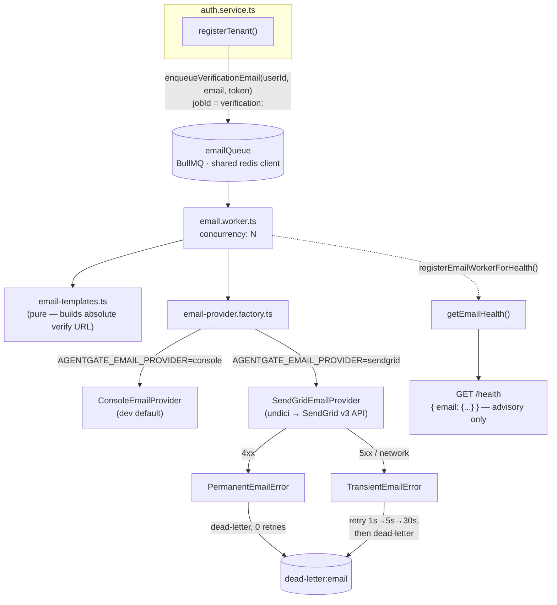

# AgentGate — Email Delivery: Context, Diagnosis, and Full Implementation

## Part 1 — Where the Project Actually Stands

Seven-plus weeks in, AgentGate has built a genuinely disciplined system: multi-tenant isolation proven at every boundary, a stateless MCP gateway with a formal error taxonomy, an idempotent append-only audit pipeline, and a ticket-authenticated WebSocket surface — each milestone re-applying the same small set of principles (fail-closed on trust vs. bounded-fail-open on availability, dedicated Redis connections only when properties genuinely conflict, EventEmitter `.on("error", ...)` discipline, empirical verification over assumption). Week 8's own retrospective is right to call this "unusually disciplined for its stage."

**Email is the one thread that never got this treatment.** Tracing it explicitly:

- **Week 1, Day 3, ~90 minutes of work:** the BullMQ `email` queue and a worker whose entire body is `console.log(...)`, explicitly commented *"STUB: Replace with real email sending in production."* This wired the infrastructure, not the feature.
- **Weeks 2–4:** never touched.
- **Week 5:** the *audit* pipeline — a conceptually similar "queue → worker → deliver" shape — gets a full week: idempotent transactional writes, retry/backoff, a dead-letter queue, health reporting, bounded shutdown. Email, sitting right next to it in the same infra, gets none of this.
- **Weeks 6–7:** untouched. The WS ticket system (Week 7 Day 1) deliberately reuses the *refresh-token* pattern, not email, for its own auth — email never even becomes a dependency of anything else.
- **Week 8's own planning documents finally name this directly:** `roadmap_w8.md` Finding W8-1 (🔴 **launch-blocking**): *"a real self-service tenant signup can never complete... nobody can log in after registering, because nobody can retrieve their verification link."* Decision 8.11 schedules a real integration for **Day 4**. The Day 1 harness document (which you just handed me) explicitly declines to build it early: *"the harness brings up whatever `email.worker.ts` currently exports (the still-stub Week 1 body) — never a hypothetical 'post-8.11' worker that doesn't exist until Day 4"* (Decision 8.21).

So: this isn't an oversight so much as a **deliberately deferred, now-overdue** piece of work, sitting on the critical path of the platform's actual onboarding flow. You're right to pull it forward — Day 3 (load testing) and later days don't mean much if Day 1's own harness is (correctly) testing against a worker that can't really deliver anything.

---

## Part 2 — Current-State Diagnosis (reading the actual files you pasted)

Two concrete, verifiable findings from the real `email.queue.ts`/`email.worker.ts`:

**1. One good surprise.** `roadmap_w8_d1.md`'s own Finding F4 flagged real uncertainty about whether the email worker still uses Week 1's *original* sketch — a separately-constructed `IORedis` instance — which would make the project's own "≈5 Redis connections per replica" budget (W8-4) wrong by one. **It doesn't.** Your actual shipped files already import `redis` from `../lib/redis.ts` in both the queue and the worker. That ambiguity is resolved: no migration needed here, and the connection math holds —

```
redis (shared, non-blocking ops)        = 1
auditWorker's internal blocking dup     = 1   (BullMQ Worker always duplicates for blocking reads)
emailWorker's internal blocking dup     = 1   (same reason — confirmed, not assumed)
rateLimiterRedis (dedicated, fail-fast) = 1
tenantEventSubscriber (duplicate())     = 1
                                         ─────
                                         = 5 per replica ✓ matches W8-4 exactly
```

**2. The actual break, precisely.** `authService.registerTenant()` (Week 1 Day 3) creates the user with `isVerified: false` and enqueues a job whose only consumer prints to a server log. `authService.login()` (Week 1 Day 4) throws `EMAIL_NOT_VERIFIED` for any unverified user. **There is no code path by which a real external user can ever see the verification link.** This is a closed loop with no exit — not a degraded experience, a hard stop.

**3. Silent secondary gaps**, once you look past "it just logs":
- `emailQueue` has **no `defaultJobOptions`** at all — no `attempts`, no backoff, no retention. A transient failure today isn't retried; it's just gone.
- No dead-letter path — a permanently-bad recipient and a transient SendGrid 503 would (once real) be indistinguishable failures.
- No `jobId` — nothing stops a retried registration request from enqueueing two jobs for the same user.
- No provider abstraction — swapping providers or unit-testing delivery logic means editing the worker body directly.
- The verification link is built as a bare relative path (`/auth/verify-email?token=...`) — meaningless inside an actual email client, which has no origin.
- No `/health` signal for this subsystem, unlike every other queue/worker pair in the project.
- No tests exist for this path anywhere in the project's history.

None of this needs new tenant-facing capability, and — importantly — **no new Postgres migration**. `User.verificationToken` already exists; this is purely a delivery-layer build-out.

---

## Part 3 — Decision Log (continuing `roadmap_w8.md`'s `8.x` numbering, fully specifying Decision 8.11)

| # | Decision | Why |
|---|---|---|
| 8.27 | Delivery goes through a small `EmailProvider` interface (`send(message): Promise<EmailSendResult>`). The queue/worker never call a concrete provider directly. | Same "pure interface, swappable implementation" discipline as `DnsResolver` (W4) and `executeTool()`'s handler dispatch. |
| 8.28 | The real provider is **SendGrid**, called via `undici`'s `request()` directly against the v3 Mail Send REST API — **zero new npm dependency**. | Matches `roadmap_w8.md`'s own Decision 8.11 (SES or SendGrid); `undici` is already a project dependency, mirroring Week 6 Day 1's exact reasoning for choosing it over a heavier client. |
| 8.29 | A `ConsoleEmailProvider` remains the **default outside production** (`AGENTGATE_EMAIL_PROVIDER=console`). Swapping to real delivery is a one-line env change, never a code change. | Preserves today's log-visible dev flow; the abstraction pays for itself immediately. |
| 8.30 | New required env var `AGENTGATE_APP_BASE_URL` (no default) — a mailed link cannot be relative. | Closes the "meaningless link" gap. Feeds directly into Day 5's config-safety guard (Decision 8.10) as one more variable to check isn't left at a placeholder. |
| 8.31 | `emailQueue` gets `defaultJobOptions`: `attempts: 3`, backoff `1s → 5s → 30s`, bounded `removeOnComplete`/`removeOnFail`. | Currently absent entirely — a real, silent gap. Reuses the exact schedule already proven for the audit queue (Week 5). |
| 8.32 | A `dead-letter:email` queue mirrors the audit dead-letter split: **permanent** provider errors (bad recipient, malformed request) dead-letter on the first attempt with zero retries burned; **transient** errors (network, 5xx, rate-limit) exhaust the full backoff first. | Same "an infra fault is not a policy decision" split this project has now drawn seven times — an eighth, applied here via `PermanentEmailError`/`TransientEmailError`. |
| 8.33 | Deterministic `jobId` per intent (`verification:<userId>`). | A retried registration request or an at-least-once redelivery can't double-enqueue while the original job is still pending — mirrors the audit queue's `jobId: payload.id` pattern exactly. |
| 8.34 | Templates are pure, dependency-free functions in one module. | Same testability discipline as `redactSecrets`/`evaluateRateLimit` — zero I/O, trivially unit-tested. |
| 8.35 | `getEmailHealth()` mirrors `getAuditHealth()`'s exact shape (`healthy`, typed `reason`, `queueDepth`, `deadLetterCount`), wired into `/health` as a new, distinct `email` field. **Advisory only** — never flips the endpoint's top-level status, same posture as `audit`/`observabilityStream`. | Consistency with the project's established Option-A health posture. |
| 8.36 | Every new `Queue`/`Worker` gets an explicit `.on("error", ...)` listener at construction. | This exact footgun has already bitten the project's own components multiple times — checked as a matter of course, not an afterthought. |
| 8.37 | **No new Redis connection.** Confirmed the current code already shares `lib/redis.ts`'s client — nothing to migrate. | Resolves Finding F4 from `roadmap_w8_d1.md` definitively, with a concrete number (5/replica). |
| 8.38 | `AGENTGATE_SENDGRID_API_KEY` is validated at boot via the existing zod env schema, fail-fast — required when the provider is `sendgrid`, and `console` is refused outright when `NODE_ENV=production`. | Same credential-handling discipline as `JWT_SECRET`/`PLATFORM_ENCRYPTION_KEY`; closes the "silently ships without real delivery in prod" failure mode at the boot boundary, not at runtime. |

---

## Part 4 — Architecture



No new Postgres migration. No new Redis connection.

---

## Part 5 — Implementation

### 5.1 — `src/config/env.ts` (additions)

```typescript
// ── Email delivery (closes Finding W8-1) ──────────────────────────
AGENTGATE_EMAIL_PROVIDER: z.enum(["console", "sendgrid"]).default("console"),
AGENTGATE_SENDGRID_API_KEY: z.string().min(1).optional(),
AGENTGATE_EMAIL_FROM_ADDRESS: z.string().email().default("noreply@agentgate.dev"),
AGENTGATE_EMAIL_FROM_NAME: z.string().min(1).default("AgentGate"),
AGENTGATE_APP_BASE_URL: z.string().url(), // no default — a mailed link needs a real origin
AGENTGATE_EMAIL_WORKER_CONCURRENCY: z.coerce.number().int().positive().default(5),
```

Wrap the existing `envSchema.parse(process.env)` call in a `.superRefine` (adapt to wherever your real parse call sits):

```typescript
export const env = envSchema
  .superRefine((val, ctx) => {
    if (val.AGENTGATE_EMAIL_PROVIDER === "sendgrid" && !val.AGENTGATE_SENDGRID_API_KEY) {
      ctx.addIssue({
        code: z.ZodIssueCode.custom,
        path: ["AGENTGATE_SENDGRID_API_KEY"],
        message: "AGENTGATE_SENDGRID_API_KEY is required when AGENTGATE_EMAIL_PROVIDER=sendgrid",
      });
    }
    if (val.AGENTGATE_NODE_ENV === "production" && val.AGENTGATE_EMAIL_PROVIDER === "console") {
      ctx.addIssue({
        code: z.ZodIssueCode.custom,
        path: ["AGENTGATE_EMAIL_PROVIDER"],
        message: "AGENTGATE_EMAIL_PROVIDER cannot be 'console' in production — real users could never verify an account",
      });
    }
  })
  .parse(process.env);
```

`.env.example` additions:
```
AGENTGATE_EMAIL_PROVIDER=console
AGENTGATE_SENDGRID_API_KEY=
AGENTGATE_EMAIL_FROM_ADDRESS=noreply@agentgate.dev
AGENTGATE_EMAIL_FROM_NAME=AgentGate
AGENTGATE_APP_BASE_URL=http://localhost:3000
AGENTGATE_EMAIL_WORKER_CONCURRENCY=5
```

### 5.2 — `src/lib/email/email-provider.ts`

```typescript
export interface OutboundEmail {
  to: string;
  subject: string;
  html: string;
  text: string;
}

export interface EmailSendResult {
  provider: string;
  messageId?: string;
}

/**
 * A permanent failure (bad recipient, malformed request, revoked key)
 * should NEVER be retried — retrying it three times with backoff just
 * delays an inevitable dead-letter by 36 seconds. A transient failure
 * (network blip, 5xx, provider rate limit) SHOULD go through the
 * queue's normal backoff. Mirrors the audit worker's own
 * SCHEMA_VALIDATION_FAILED vs. INFRA_FAILURE_EXHAUSTED split (Week 5),
 * applied here to provider-level errors instead of payload errors.
 */
export class PermanentEmailError extends Error {
  constructor(message: string, public readonly cause?: unknown) {
    super(message);
    this.name = "PermanentEmailError";
  }
}

export class TransientEmailError extends Error {
  constructor(message: string, public readonly cause?: unknown) {
    super(message);
    this.name = "TransientEmailError";
  }
}

export interface EmailProvider {
  readonly name: string;
  send(message: OutboundEmail): Promise<EmailSendResult>;
}
```

### 5.3 — `src/lib/email/providers/console-email.provider.ts`

```typescript
import type { EmailProvider, OutboundEmail, EmailSendResult } from "../email-provider.js";

/** Dev/test default (Decision 8.29). Swapping to real delivery is one env var, never a code change. */
export class ConsoleEmailProvider implements EmailProvider {
  readonly name = "console";

  async send(message: OutboundEmail): Promise<EmailSendResult> {
    console.log(`\n[EMAIL:CONSOLE] ─────────────────────────────`);
    console.log(`  To:      ${message.to}`);
    console.log(`  Subject: ${message.subject}`);
    console.log(`  ${message.text}`);
    console.log(`──────────────────────────────────────────\n`);
    return { provider: this.name };
  }
}
```

### 5.4 — `src/lib/email/providers/sendgrid-email.provider.ts`

```typescript
import { request } from "undici";
import { env } from "../../../config/env.js";
import { PermanentEmailError, TransientEmailError } from "../email-provider.js";
import type { EmailProvider, OutboundEmail, EmailSendResult } from "../email-provider.js";

const SENDGRID_ENDPOINT = "https://api.sendgrid.com/v3/mail/send";

/**
 * Calls SendGrid's v3 Mail Send API directly via undici — zero new
 * npm dependency (Decision 8.28). Failure classification mirrors the
 * audit worker's dead-letter split: a 4xx is a PermanentEmailError
 * (retrying changes nothing); a 5xx or network-level failure is a
 * TransientEmailError (the queue's own backoff is the right tool).
 */
export class SendGridEmailProvider implements EmailProvider {
  readonly name = "sendgrid";

  async send(message: OutboundEmail): Promise<EmailSendResult> {
    if (!env.AGENTGATE_SENDGRID_API_KEY) {
      // Unreachable in practice — env.ts's own superRefine already
      // fails boot before this combination is possible. Defensive only.
      throw new PermanentEmailError("AGENTGATE_SENDGRID_API_KEY is not configured");
    }

    let response;
    try {
      response = await request(SENDGRID_ENDPOINT, {
        method: "POST",
        headers: {
          authorization: `Bearer ${env.AGENTGATE_SENDGRID_API_KEY}`,
          "content-type": "application/json",
        },
        body: JSON.stringify({
          personalizations: [{ to: [{ email: message.to }] }],
          from: { email: env.AGENTGATE_EMAIL_FROM_ADDRESS, name: env.AGENTGATE_EMAIL_FROM_NAME },
          subject: message.subject,
          content: [
            { type: "text/plain", value: message.text },
            { type: "text/html", value: message.html },
          ],
        }),
        // A send must never hang the worker indefinitely — same
        // AbortController discipline established Week 4.
        signal: AbortSignal.timeout(10_000),
      });
    } catch (err) {
      throw new TransientEmailError("SendGrid request failed at the network layer", err);
    }

    if (response.statusCode >= 200 && response.statusCode < 300) {
      const messageId = response.headers["x-message-id"];
      await response.body.dump(); // drain the (empty, on success) body
      return { provider: this.name, messageId: typeof messageId === "string" ? messageId : undefined };
    }

    const bodyText = await response.body.text().catch(() => "");

    if (response.statusCode >= 500) {
      throw new TransientEmailError(`SendGrid returned ${response.statusCode}: ${bodyText.slice(0, 500)}`);
    }
    // 4xx — malformed request, bad recipient, unauthorized. Never worth retrying as-is.
    throw new PermanentEmailError(`SendGrid rejected the request (${response.statusCode}): ${bodyText.slice(0, 500)}`);
  }
}
```

### 5.5 — `src/lib/email/email-provider.factory.ts`

```typescript
import { env } from "../../config/env.js";
import { ConsoleEmailProvider } from "./providers/console-email.provider.js";
import { SendGridEmailProvider } from "./providers/sendgrid-email.provider.js";
import type { EmailProvider } from "./email-provider.js";

let cachedProvider: EmailProvider | null = null;

/** The single seam through which the worker ever obtains a provider — never a concrete class directly. */
export function getEmailProvider(): EmailProvider {
  if (cachedProvider) return cachedProvider;
  cachedProvider = env.AGENTGATE_EMAIL_PROVIDER === "sendgrid" ? new SendGridEmailProvider() : new ConsoleEmailProvider();
  return cachedProvider;
}

/** Test-only seam. Never called in production. */
export function resetEmailProviderForTest(): void {
  cachedProvider = null;
}
```

### 5.6 — `src/lib/email/email-templates.ts`

```typescript
import { env } from "../../config/env.js";

export interface RenderedEmail {
  subject: string;
  html: string;
  text: string;
}

/**
 * Pure, dependency-free — same discipline as redactSecrets /
 * evaluateRateLimit: no I/O, trivially unit-testable.
 *
 * The link is built from AGENTGATE_APP_BASE_URL, never a relative
 * path — a relative "/auth/verify-email?token=..." is meaningless
 * inside an email client, which has no notion of "this server's own
 * origin" the way a browser tab does.
 */
export function renderVerificationEmail(params: { token: string }): RenderedEmail {
  const verifyUrl = new URL("/auth/verify-email", env.AGENTGATE_APP_BASE_URL);
  verifyUrl.searchParams.set("token", params.token);
  const link = verifyUrl.toString();

  const subject = "Verify your AgentGate account";

  const text = [
    "Welcome to AgentGate.",
    "",
    "Verify your email address to finish setting up your account:",
    link,
    "",
    "If you didn't request this, you can safely ignore this email.",
  ].join("\n");

  const html = `
    <div style="font-family: -apple-system, sans-serif; max-width: 480px; margin: 0 auto;">
      <h2>Welcome to AgentGate</h2>
      <p>Verify your email address to finish setting up your account.</p>
      <p>
        <a href="${link}" style="display:inline-block;padding:10px 20px;background:#111;color:#fff;
           text-decoration:none;border-radius:6px;">Verify email</a>
      </p>
      <p style="color:#666;font-size:13px;">Or paste this link into your browser:<br/>${link}</p>
      <p style="color:#999;font-size:12px;">If you didn't request this, you can safely ignore this email.</p>
    </div>
  `.trim();

  return { subject, html, text };
}
```

> Note: I deliberately did **not** claim a link-expiry window in the copy ("expires in 24 hours") — nothing in the current schema enforces one (`verificationToken` has no expiry column). See Part 7.

### 5.7 — `src/lib/email/email-health.ts`

```typescript
import type { Worker } from "bullmq";
import { emailQueue, deadLetterEmailQueue } from "../../queue/email.queue.js";
import { withTimeout } from "../timeout.js";
import { TimeoutError } from "../../handlers/types.js";

export type EmailHealthReason =
  | "WORKER_NOT_RUNNING" | "METRICS_TIMEOUT" | "METRICS_ERROR"
  | "DEAD_LETTERS_PRESENT" | "QUEUE_BACKPRESSURE" | "HEALTHY";

export interface EmailHealth {
  healthy: boolean;
  reason: EmailHealthReason;
  workerRunning: boolean;
  queueDepth: number;
  deadLetterCount: number;
}

let workerRef: Worker | null = null;
export function registerEmailWorkerForHealth(worker: Worker): void { workerRef = worker; }

const METRICS_TIMEOUT_MS = 2_000; // matches getAuditHealth()'s precedent, Week 5
const BACKPRESSURE_THRESHOLD = 1000;

export async function getEmailHealth(): Promise<EmailHealth> {
  try {
    const workerRunning = workerRef?.isRunning() ?? false;
    if (!workerRunning) {
      return { healthy: false, reason: "WORKER_NOT_RUNNING", workerRunning, queueDepth: 0, deadLetterCount: 0 };
    }

    let waiting: number, active: number, delayed: number, deadWaiting: number;
    try {
      [waiting, active, delayed, deadWaiting] = await withTimeout(
        () => Promise.all([
          emailQueue.getWaitingCount(),
          emailQueue.getActiveCount(),
          emailQueue.getDelayedCount(),
          deadLetterEmailQueue.getWaitingCount(),
        ]),
        METRICS_TIMEOUT_MS
      );
    } catch (err) {
      const reason: EmailHealthReason = err instanceof TimeoutError ? "METRICS_TIMEOUT" : "METRICS_ERROR";
      return { healthy: false, reason, workerRunning, queueDepth: 0, deadLetterCount: 0 };
    }

    const queueDepth = waiting + active + delayed;
    if (deadWaiting > 0) {
      return { healthy: false, reason: "DEAD_LETTERS_PRESENT", workerRunning, queueDepth, deadLetterCount: deadWaiting };
    }
    if (queueDepth > BACKPRESSURE_THRESHOLD) {
      return { healthy: false, reason: "QUEUE_BACKPRESSURE", workerRunning, queueDepth, deadLetterCount: deadWaiting };
    }
    return { healthy: true, reason: "HEALTHY", workerRunning, queueDepth, deadLetterCount: deadWaiting };
  } catch {
    return { healthy: false, reason: "METRICS_ERROR", workerRunning: false, queueDepth: 0, deadLetterCount: 0 };
  }
}
```

### 5.8 — `src/queue/email.queue.ts` (rewritten)

```typescript
import { Queue } from "bullmq";
import { redis } from "../lib/redis.js";

export const EMAIL_QUEUE_NAME = "email";
export const DEAD_LETTER_EMAIL_QUEUE_NAME = "dead-letter:email";

export type EmailJobType = "verification";

export interface EmailQueueJob {
  type: EmailJobType;
  email: string;
  token: string;
}

export type EmailDeadLetterReasonCode =
  | "PERMANENT_PROVIDER_ERROR" | "TRANSIENT_FAILURE_EXHAUSTED" | "UNKNOWN_JOB_TYPE";

export interface EmailDeadLetterJobData {
  reasonCode: EmailDeadLetterReasonCode;
  detail: string;
  originalJobId: string;
  rawData: EmailQueueJob;
}

const COMPLETED_RETENTION = { count: 500, age: 24 * 3600 };
const FAILED_RETENTION = { count: 500, age: 7 * 24 * 3600 };

function logQueueError(name: string) {
  return (err: Error) => console.error(`[${name}] queue-level connection error:`, err.message);
}

export const emailQueue = new Queue<EmailQueueJob, void, EmailJobType>(EMAIL_QUEUE_NAME, {
  connection: redis,
  defaultJobOptions: {
    attempts: 3,
    backoff: { type: "custom" }, // resolved by the WORKER's backoffStrategy — mirrors audit.worker.ts (Week 5)
    removeOnComplete: COMPLETED_RETENTION,
    removeOnFail: FAILED_RETENTION,
  },
});

export const deadLetterEmailQueue = new Queue<EmailDeadLetterJobData>(DEAD_LETTER_EMAIL_QUEUE_NAME, {
  connection: redis,
});

emailQueue.on("error", logQueueError(EMAIL_QUEUE_NAME));
deadLetterEmailQueue.on("error", logQueueError(DEAD_LETTER_EMAIL_QUEUE_NAME));

/**
 * Deterministic per-intent jobId (Decision 8.33). Re-enqueuing the
 * SAME logical email while the original job is still waiting/active/
 * delayed is naturally deduplicated by BullMQ — mirrors the audit
 * queue's jobId: payload.id pattern. Once the original job COMPLETES
 * and is removed, the same jobId is free again — a legitimate resend
 * still works.
 */
export function verificationEmailJobId(userId: string): string {
  return `verification:${userId}`;
}

/**
 * The one safe entry point for enqueueing a verification email.
 * Fire-and-forget, mirrors enqueueAuditEvent()'s contract exactly:
 * never awaited on the hot path, never throws.
 */
export function enqueueVerificationEmail(params: { userId: string; email: string; token: string }): void {
  const payload: EmailQueueJob = { type: "verification", email: params.email, token: params.token };
  emailQueue.add("verification", payload, { jobId: verificationEmailJobId(params.userId) }).catch((err) => {
    console.warn(`[email] failed to enqueue verification email for user ${params.userId}:`, err);
  });
}
```

### 5.9 — `src/workers/email.worker.ts` (rewritten)

```typescript
import { Worker } from "bullmq";
import type { Job } from "bullmq";
import { redis } from "../lib/redis.js";
import { env } from "../config/env.js";
import { EMAIL_QUEUE_NAME, deadLetterEmailQueue } from "../queue/email.queue.js";
import type { EmailQueueJob, EmailDeadLetterJobData, EmailDeadLetterReasonCode } from "../queue/email.queue.js";
import { getEmailProvider } from "../lib/email/email-provider.factory.js";
import { PermanentEmailError, TransientEmailError } from "../lib/email/email-provider.js";
import { renderVerificationEmail } from "../lib/email/email-templates.js";
import { registerEmailWorkerForHealth } from "../lib/email/email-health.js";

const EMAIL_BACKOFF_MS = [1_000, 5_000, 30_000] as const; // matches audit.worker.ts (Week 5)

function resolveBackoffMs(attemptsMade: number): number {
  return EMAIL_BACKOFF_MS[attemptsMade - 1] ?? EMAIL_BACKOFF_MS[EMAIL_BACKOFF_MS.length - 1];
}

async function writeDeadLetter(
  reasonCode: EmailDeadLetterReasonCode,
  detail: string,
  originalJobId: string,
  rawData: EmailQueueJob
): Promise<void> {
  const data: EmailDeadLetterJobData = { reasonCode, detail, originalJobId, rawData };
  try {
    await deadLetterEmailQueue.add("dead-letter", data, { jobId: originalJobId });
  } catch (err) {
    // A failed diagnostic write must never change what happens to the
    // original job — mirrors audit.worker.ts's own guarded write.
    console.error(`[email-worker] failed to write dead-letter record for ${originalJobId} (${reasonCode}):`, err);
  }
}

async function processJob(job: Job<EmailQueueJob>): Promise<void> {
  const provider = getEmailProvider();

  // Defensive runtime check, not a TS-reachable branch today — job
  // data crosses a Redis/JSON boundary and doesn't inherit compile-
  // time guarantees (the same lesson Week 5 learned from Date
  // coercion on audit jobs). A future second job type, or a stale/
  // legacy payload, lands here rather than crashing the worker.
  if ((job.data.type as string) !== "verification") {
    await writeDeadLetter("UNKNOWN_JOB_TYPE", `Unrecognized email job type: ${job.data.type}`, job.id ?? "unknown", job.data);
    return;
  }

  const rendered = renderVerificationEmail({ token: job.data.token });

  try {
    await provider.send({ to: job.data.email, subject: rendered.subject, html: rendered.html, text: rendered.text });
  } catch (err) {
    if (err instanceof PermanentEmailError) {
      // Dead-letter immediately — zero retries burned on a failure
      // retrying can never fix (mirrors Week 5 Decision 5.9).
      await writeDeadLetter("PERMANENT_PROVIDER_ERROR", err.message, job.id ?? "unknown", job.data);
      return;
    }
    if (err instanceof TransientEmailError) {
      // Rethrow — BullMQ's attempts/backoff (configured on the Queue)
      // drives the retry; the 'failed' listener below dead-letters
      // only once attempts are genuinely exhausted.
      throw err;
    }
    // Unclassified — default to the safer path rather than silently
    // dropping it (same instinct as the audit worker's own outer
    // try/catch, Week 5 Decision 5.37).
    throw new TransientEmailError(`Unclassified provider error: ${(err as Error).message}`, err);
  }
}

export function createEmailWorker(): Worker<EmailQueueJob> {
  const worker = new Worker<EmailQueueJob>(EMAIL_QUEUE_NAME, processJob, {
    connection: redis,
    concurrency: env.AGENTGATE_EMAIL_WORKER_CONCURRENCY,
    settings: {
      backoffStrategy: (attemptsMade: number) => resolveBackoffMs(attemptsMade),
    },
  });

  worker.on("error", (err) => {
    console.error("[email-worker] worker-level connection error:", err.message);
  });

  worker.on("failed", async (job, err) => {
    console.error(`[email-worker] job ${job?.id} failed (attempt ${job?.attemptsMade}):`, err.message);
    // Only TransientEmailError/unclassified errors ever reach here —
    // PermanentEmailError already resolved (not threw) inside
    // processJob, so 'failed' only fires once real retries are spent.
    if (job && job.attemptsMade >= (job.opts.attempts ?? 1)) {
      await writeDeadLetter("TRANSIENT_FAILURE_EXHAUSTED", err.message, job.id ?? "unknown", job.data);
    }
  });

  registerEmailWorkerForHealth(worker);
  return worker;
}
```

### 5.10 — Wiring diffs

**`src/routes/healthcheck.ts`**
```diff
 import { getRateLimiterHealth } from "../lib/rate-limiter.js";
 import { getAuditHealth } from "../lib/audit-health.js";
+import { getEmailHealth } from "../lib/email/email-health.js";
 import { getObservabilityStreamHealth } from "../observability/ws-tenant-registry.js";

   const rateLimiter = getRateLimiterHealth();
   const audit = await getAuditHealth();
+  const email = await getEmailHealth();
   const observabilityStream = await getObservabilityStreamHealth();
   ...
   return reply.status(isCoreHealthy ? 200 : 503).send({
     status: isCoreHealthy ? "ok" : "degraded",
     timestamp: new Date().toISOString(),
     rateLimiter,
     audit,
+    email,          // NEW — advisory only, same posture as `audit`
     mcpGatewayCache: rateLimiter,
     observabilityStream,
   });
```

**`src/server.ts`**
```diff
+import { deadLetterEmailQueue } from "./queue/email.queue.js";
 ...
       await emailWorker.close();
       await emailQueue.close();
+      await deadLetterEmailQueue.close();
```

**`src/services/auth.service.ts`** (the Week 1 Day 3 call site)
```diff
-import { emailQueue } from '../workers/email.worker.js'
+import { enqueueVerificationEmail } from '../queue/email.queue.js'
 ...
-    emailQueue
-      .add('verification', {
-        type: 'verification',
-        email: data.ownerEmail,
-        token: verificationToken,
-      })
-      .catch((err) => console.error('[EMAIL QUEUE] Failed to enqueue:', err))
+    enqueueVerificationEmail({
+      userId: result.user.id,
+      email: data.ownerEmail,
+      token: verificationToken,
+    })
```

No route files, no Prisma schema, no shutdown *ordering* changes — only one new line inserted at the existing email-teardown step.

---

## Part 6 — Tests

```typescript
// src/__tests__/email-templates.test.ts
import { describe, it, expect } from "vitest";
import { renderVerificationEmail } from "../lib/email/email-templates.js";

describe("renderVerificationEmail", () => {
  it("builds an ABSOLUTE verification URL, never a relative path", () => {
    const rendered = renderVerificationEmail({ token: "abc123token" });
    expect(rendered.text).toMatch(/^https?:\/\//m);
  });

  it("embeds the exact token as a query parameter, in both html and text", () => {
    const rendered = renderVerificationEmail({ token: "unique-token-xyz" });
    expect(rendered.text).toContain("token=unique-token-xyz");
    expect(rendered.html).toContain("token=unique-token-xyz");
  });
});
```

```typescript
// src/__tests__/email-provider.factory.test.ts
import { describe, it, expect, beforeEach } from "vitest";
import { getEmailProvider, resetEmailProviderForTest } from "../lib/email/email-provider.factory.js";
import { ConsoleEmailProvider } from "../lib/email/providers/console-email.provider.js";
import { SendGridEmailProvider } from "../lib/email/providers/sendgrid-email.provider.js";
import { env } from "../config/env.js";

describe("getEmailProvider", () => {
  beforeEach(() => resetEmailProviderForTest());

  it("returns ConsoleEmailProvider by default", () => {
    (env as any).AGENTGATE_EMAIL_PROVIDER = "console";
    expect(getEmailProvider()).toBeInstanceOf(ConsoleEmailProvider);
  });

  it("returns SendGridEmailProvider when configured", () => {
    (env as any).AGENTGATE_EMAIL_PROVIDER = "sendgrid";
    (env as any).AGENTGATE_SENDGRID_API_KEY = "test-key";
    expect(getEmailProvider()).toBeInstanceOf(SendGridEmailProvider);
  });

  it("caches the instance across calls", () => {
    (env as any).AGENTGATE_EMAIL_PROVIDER = "console";
    expect(getEmailProvider()).toBe(getEmailProvider());
  });
});
```

```typescript
// src/__tests__/sendgrid-email.provider.test.ts
import { describe, it, expect, vi, afterEach } from "vitest";
import * as undici from "undici";
import { SendGridEmailProvider } from "../lib/email/providers/sendgrid-email.provider.js";
import { PermanentEmailError, TransientEmailError } from "../lib/email/email-provider.js";
import { env } from "../config/env.js";

describe("SendGridEmailProvider", () => {
  afterEach(() => vi.restoreAllMocks());

  it("resolves on a 2xx", async () => {
    (env as any).AGENTGATE_SENDGRID_API_KEY = "test-key";
    vi.spyOn(undici, "request").mockResolvedValue({
      statusCode: 202, headers: { "x-message-id": "msg-123" },
      body: { dump: vi.fn().mockResolvedValue(undefined) },
    } as any);
    const result = await new SendGridEmailProvider().send({ to: "a@b.com", subject: "s", html: "h", text: "t" });
    expect(result).toEqual({ provider: "sendgrid", messageId: "msg-123" });
  });

  it("GATE — a 4xx throws PermanentEmailError", async () => {
    (env as any).AGENTGATE_SENDGRID_API_KEY = "test-key";
    vi.spyOn(undici, "request").mockResolvedValue({
      statusCode: 400, headers: {}, body: { text: vi.fn().mockResolvedValue("bad recipient") },
    } as any);
    await expect(new SendGridEmailProvider().send({ to: "bad", subject: "s", html: "h", text: "t" }))
      .rejects.toThrow(PermanentEmailError);
  });

  it("GATE — a 5xx throws TransientEmailError", async () => {
    (env as any).AGENTGATE_SENDGRID_API_KEY = "test-key";
    vi.spyOn(undici, "request").mockResolvedValue({
      statusCode: 503, headers: {}, body: { text: vi.fn().mockResolvedValue("unavailable") },
    } as any);
    await expect(new SendGridEmailProvider().send({ to: "a@b.com", subject: "s", html: "h", text: "t" }))
      .rejects.toThrow(TransientEmailError);
  });

  it("GATE — a network-level failure throws TransientEmailError", async () => {
    (env as any).AGENTGATE_SENDGRID_API_KEY = "test-key";
    vi.spyOn(undici, "request").mockRejectedValue(new Error("ECONNRESET"));
    await expect(new SendGridEmailProvider().send({ to: "a@b.com", subject: "s", html: "h", text: "t" }))
      .rejects.toThrow(TransientEmailError);
  });
});
```

```typescript
// src/__tests__/email.queue.test.ts
import { describe, it, expect, vi } from "vitest";
import crypto from "node:crypto";
import { emailQueue, deadLetterEmailQueue, enqueueVerificationEmail, verificationEmailJobId } from "../queue/email.queue.js";

describe("email.queue", () => {
  it("defaultJobOptions: 3 attempts, custom backoff, bounded retention", async () => {
    const job = await emailQueue.add("verification", { type: "verification", email: "a@b.com", token: "t" }, {
      jobId: verificationEmailJobId(crypto.randomUUID()),
    });
    expect(job.opts.attempts).toBe(3);
    expect(job.opts.backoff).toEqual({ type: "custom" });
    await job.remove();
  });

  it("GATE — enqueueVerificationEmail dedupes by userId while the original job is pending", async () => {
    const userId = crypto.randomUUID();
    enqueueVerificationEmail({ userId, email: "a@b.com", token: "first-token" });
    await new Promise((r) => setTimeout(r, 20));
    enqueueVerificationEmail({ userId, email: "a@b.com", token: "second-token" }); // no-op
    await new Promise((r) => setTimeout(r, 20));

    const job = await emailQueue.getJob(verificationEmailJobId(userId));
    expect(job?.data.token).toBe("first-token");
    await job?.remove();
  });

  it("never throws even when queue.add() rejects", async () => {
    const spy = vi.spyOn(emailQueue, "add").mockRejectedValue(new Error("redis unreachable"));
    expect(() => enqueueVerificationEmail({ userId: crypto.randomUUID(), email: "a@b.com", token: "t" })).not.toThrow();
    await new Promise((r) => setTimeout(r, 20));
    spy.mockRestore();
  });

  it("both queues survive a synthetic 'error' emit", () => {
    const errorSpy = vi.spyOn(console, "error").mockImplementation(() => {});
    expect(() => emailQueue.emit("error", new Error("blip"))).not.toThrow();
    expect(() => deadLetterEmailQueue.emit("error", new Error("blip"))).not.toThrow();
    errorSpy.mockRestore();
  });
});
```

```typescript
// src/__tests__/email.worker.test.ts
import { describe, it, expect, vi, beforeEach, afterEach } from "vitest";
import crypto from "node:crypto";
import { createEmailWorker } from "../workers/email.worker.js";
import { emailQueue, deadLetterEmailQueue, verificationEmailJobId } from "../queue/email.queue.js";
import * as providerFactory from "../lib/email/email-provider.factory.js";
import { PermanentEmailError, TransientEmailError } from "../lib/email/email-provider.js";

async function waitFor(assertion: () => Promise<void> | void, timeoutMs = 10_000): Promise<void> {
  const start = Date.now();
  while (true) {
    try { await assertion(); return; } catch (err) {
      if (Date.now() - start > timeoutMs) throw err;
      await new Promise((r) => setTimeout(r, 100));
    }
  }
}

describe("email worker — real BullMQ queue", () => {
  let worker: ReturnType<typeof createEmailWorker>;
  beforeEach(() => { worker = createEmailWorker(); });
  afterEach(async () => { await worker.close(); vi.restoreAllMocks(); });

  it("GATE — a PermanentEmailError dead-letters on the FIRST attempt, zero retries burned", async () => {
    vi.spyOn(providerFactory, "getEmailProvider").mockReturnValue({
      name: "fake", send: vi.fn().mockRejectedValue(new PermanentEmailError("bad recipient")),
    });
    const userId = crypto.randomUUID();
    await emailQueue.add("verification", { type: "verification", email: "bad", token: "t" }, {
      jobId: verificationEmailJobId(userId),
    });

    await waitFor(async () => {
      const match = (await deadLetterEmailQueue.getJobs(["waiting", "completed"]))
        .find((j) => j.data.originalJobId === verificationEmailJobId(userId));
      expect(match?.data.reasonCode).toBe("PERMANENT_PROVIDER_ERROR");
    });
  });

  it("GATE — a TransientEmailError exhausts all 3 attempts, then dead-letters", async () => {
    vi.spyOn(providerFactory, "getEmailProvider").mockReturnValue({
      name: "fake", send: vi.fn().mockRejectedValue(new TransientEmailError("upstream 503")),
    });
    const userId = crypto.randomUUID();
    await emailQueue.add("verification", { type: "verification", email: "a@b.com", token: "t" }, {
      jobId: verificationEmailJobId(userId),
    });

    await waitFor(async () => {
      const match = (await deadLetterEmailQueue.getJobs(["waiting", "completed"]))
        .find((j) => j.data.originalJobId === verificationEmailJobId(userId));
      expect(match?.data.reasonCode).toBe("TRANSIENT_FAILURE_EXHAUSTED");
    }, 12_000);
  }, 15_000);

  it("a successful send produces zero dead-letter writes", async () => {
    vi.spyOn(providerFactory, "getEmailProvider").mockReturnValue({
      name: "fake", send: vi.fn().mockResolvedValue({ provider: "fake" }),
    });
    const userId = crypto.randomUUID();
    await emailQueue.add("verification", { type: "verification", email: "a@b.com", token: "t" }, {
      jobId: verificationEmailJobId(userId),
    });

    await waitFor(async () => {
      const job = await emailQueue.getJob(verificationEmailJobId(userId));
      expect(job === null || (await job.isCompleted())).toBe(true);
    });
    const dl = await deadLetterEmailQueue.getJobs(["waiting", "completed"]);
    expect(dl.filter((j) => j.data.originalJobId === verificationEmailJobId(userId))).toHaveLength(0);
  });
});
```

```typescript
// src/__tests__/email-health.test.ts
import { describe, it, expect, vi, beforeEach } from "vitest";
import { getEmailHealth, registerEmailWorkerForHealth } from "../lib/email/email-health.js";
import { emailQueue, deadLetterEmailQueue } from "../queue/email.queue.js";
import type { Worker } from "bullmq";

function mockWorker(isRunning: boolean): Worker {
  return { isRunning: () => isRunning } as unknown as Worker;
}

describe("getEmailHealth", () => {
  beforeEach(() => { vi.restoreAllMocks(); registerEmailWorkerForHealth(null as unknown as Worker); });

  it("WORKER_NOT_RUNNING when unregistered", async () => {
    expect((await getEmailHealth()).reason).toBe("WORKER_NOT_RUNNING");
  });

  it("HEALTHY under normal conditions", async () => {
    registerEmailWorkerForHealth(mockWorker(true));
    vi.spyOn(emailQueue, "getWaitingCount").mockResolvedValue(1);
    vi.spyOn(emailQueue, "getActiveCount").mockResolvedValue(0);
    vi.spyOn(emailQueue, "getDelayedCount").mockResolvedValue(0);
    vi.spyOn(deadLetterEmailQueue, "getWaitingCount").mockResolvedValue(0);
    expect(await getEmailHealth()).toMatchObject({ healthy: true, reason: "HEALTHY" });
  });

  it("DEAD_LETTERS_PRESENT when dead-letters exist", async () => {
    registerEmailWorkerForHealth(mockWorker(true));
    vi.spyOn(emailQueue, "getWaitingCount").mockResolvedValue(0);
    vi.spyOn(emailQueue, "getActiveCount").mockResolvedValue(0);
    vi.spyOn(emailQueue, "getDelayedCount").mockResolvedValue(0);
    vi.spyOn(deadLetterEmailQueue, "getWaitingCount").mockResolvedValue(2);
    expect(await getEmailHealth()).toMatchObject({ healthy: false, reason: "DEAD_LETTERS_PRESENT", deadLetterCount: 2 });
  });
});
```

---

## Part 7 — Checkpoint

- [ ] `AGENTGATE_APP_BASE_URL`/`AGENTGATE_SENDGRID_API_KEY`/etc. added; boot fails fast on `sendgrid` without a key, and on `console` in production
- [ ] A real `register-tenant` → `enqueueVerificationEmail` → worker → `ConsoleEmailProvider` round-trip produces a **correct, absolute, clickable link** locally
- [ ] Switching `AGENTGATE_EMAIL_PROVIDER=sendgrid` (real key) delivers a real inbox message with no code change
- [ ] A permanent SendGrid rejection dead-letters on attempt 1; a transient one retries 1s→5s→30s then dead-letters
- [ ] Re-enqueuing the same user's verification while the job is still pending produces **one** job, not two
- [ ] `GET /health` reports `email` distinctly, degrading advisory-only (never flips top-level status)
- [ ] `server.ts` shutdown closes `deadLetterEmailQueue` alongside the existing `emailQueue`/`emailWorker` steps
- [ ] `npx tsc --noEmit` — zero errors

## Part 8 — Deliberately Not Done Today (named, not silent)

- **Verification-token expiry.** `verificationToken` has no TTL/expiry column today — a leaked or old link works forever. Worth a near-term follow-up (`verificationTokenExpiresAt`, or a Redis-backed TTL token instead of a Postgres column), but it's an *auth-model* change, not a *delivery* one — out of this task's scope.
- **"Resend verification" endpoint.** Not built. The `jobId` dedup (8.33) makes it safe to add later without touching the queue/worker.
- **Password-reset email, bounce/complaint webhooks, digest emails.** All explicitly Phase 2 per PRD §5.1/§8 — not MVP.
- **`AGENTGATE_SENDGRID_API_KEY` added to the Day 5 production config-safety guard** (`roadmap_w8.md` Decision 8.10) — that guard doesn't exist yet; flagging it as one more variable for it to check once built.
- **Sender-domain authentication (SPF/DKIM) with SendGrid** — an operational/DNS step outside the codebase, needed before `sendgrid` mode is trustworthy in production; noted for the deployment runbook, not implemented here.