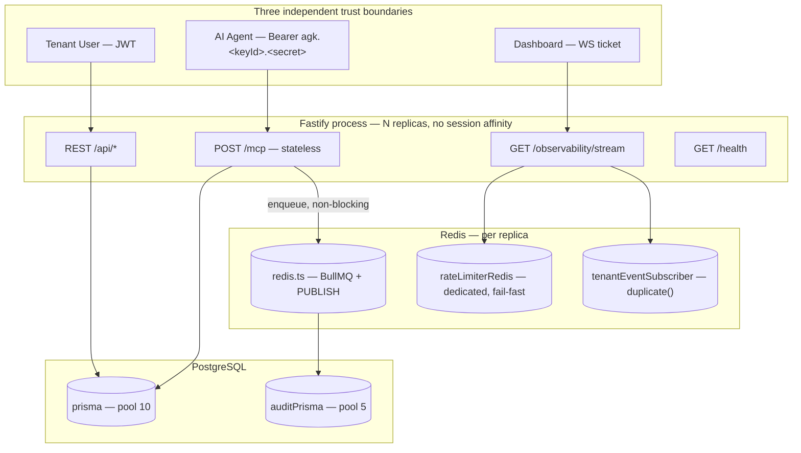
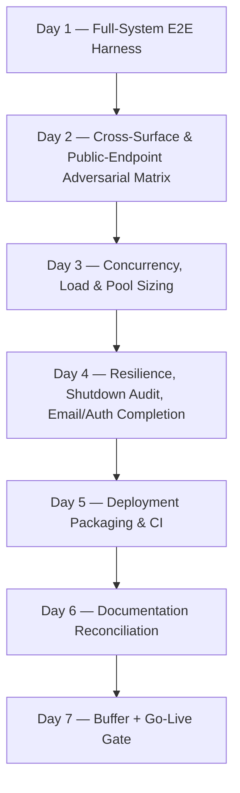
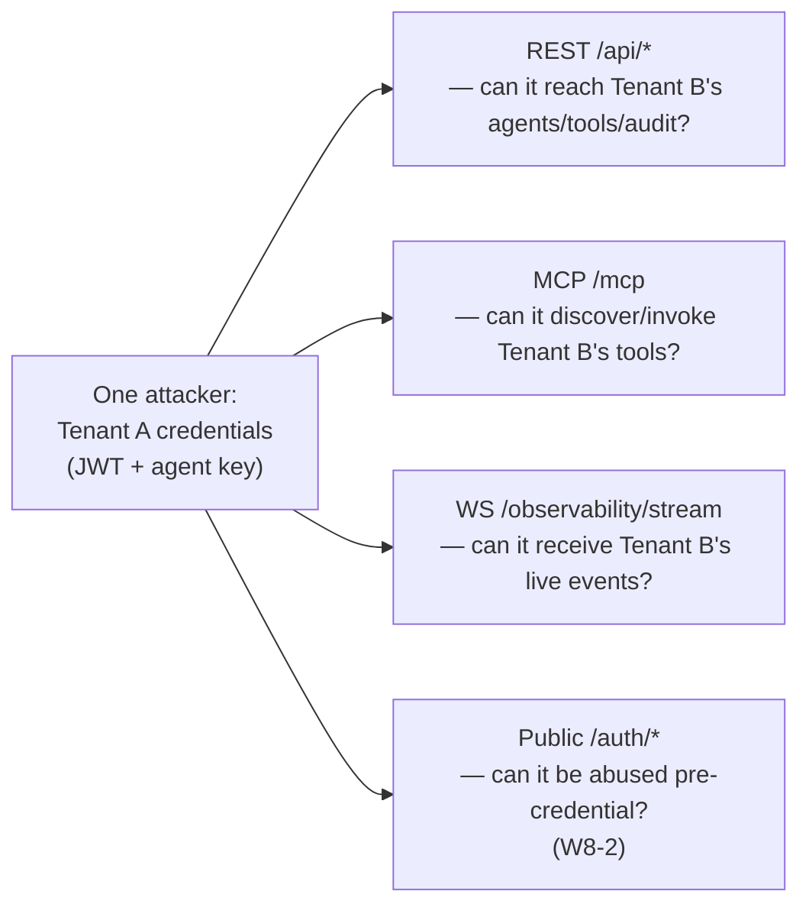
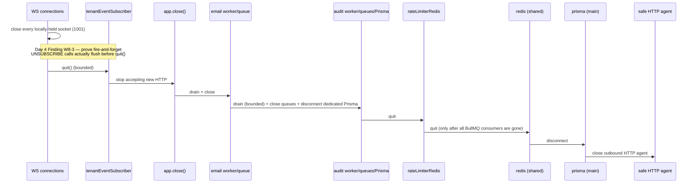

# AgentGate — Week 8: Final Hardening & Go-Live Roadmap

## Preface

This response does two things, in the order you asked for: it analyzes the handed-off Week 8 strategic memo against the actual as-built system (not just against its own internal logic), and then converts the confirmed direction into a full day-by-day roadmap. Per the framing for this task, everything below stays at the architecture/topology/protocol level — no Fastify routes, no Dockerfile syntax, no SQL DDL. Where a build step needs to be precise (Docker stages, CI stages, a config-safety policy), I describe its shape and behavior rather than writing it.

One thing worth saying up front: this is the week where "correct in a test suite" has to become "correct in front of the public internet." That reframes a few judgment calls in the strategic memo — not because its reasoning is wrong, but because the cost of an unverified assumption is different the day before launch than it was the day before Week 3.

---

## Part 1 — Retrospective: The System Week 8 Inherits

Seven weeks in, AgentGate isn't a collection of features bolted together — it's a system that has re-applied a small number of disciplines so consistently they've become load-bearing architecture rather than style:

| Discipline | Where it was established | Where it recurred |
|---|---|---|
| **Fail-closed on trust, bounded fail-open on availability — always distinguished, never conflated** | `checkPermission()`'s `{granted, reason}` shape (Week 3) | `RateLimitResult.degraded` (W3/W5), JSON-RPC mapping (W6 D4), audit-layer filtering (W6 D5), ticket issuance HTTP status (W7 D1), `GETDEL`-throws case (W7 D2), `audit-events` rate limit (W7 D5) — **seven independent applications of one principle** |
| **Never trust a shared/unique key alone across a tenant boundary** | `findGrantWithContext` (W3) | Audit read-repository double-filtering (W5), MCP cache keys including both `tenantId`+`agentId` (W6 D3), WS registry keyed by resolved identity only (W7) |
| **Layered defense, not duplicated defense** | SSRF Layer 1 (creation-time) + Layer 2 (DNS-resolution-time) (W2/W4) | Structural + string-pattern redaction as two independent passes (W5 D6) |
| **Empirical verification over assumption** | undici dispatcher precedence, pg internals (W4) | AJV draft mismatch (W6 D4), ioredis subscriber-mode `PING` (W7 D5), `autoResubscribe` defaults (W7 D3) |
| **Deliberate, named non-decisions** | Phase-2 stub columns (W3) | `callBudgetPerHour` (W3), global concurrency ceiling (W6/W7), Tasks/MRTR (W6) — every deferral has a name and a reason, none were silently dropped |
| **Protocol correctness over inertia** | — | The mid-Week-6 pivot away from the deprecated two-channel SSE transport to stateless Streamable HTTP, discovered and executed inside a single week rather than shipped stale |

The as-built topology, stripped of anything Week 8 doesn't need to touch:

**Verdict going into Week 8:** the system is unusually disciplined for its stage. Its own weekly review process (each week's "Day 6/7" catching real bugs against the prior day's own code, not just against prose) has already done a lot of the hardening work incrementally. That changes what Week 8 should be: **the job is to prove the system, not extend it.** Every new capability introduced this week is a new, unreviewed surface shipping with zero runway before it faces real traffic — the opposite of what a final week should do.

---

## Part 2 — Auditing the Incoming Plan

The strategic memo you're working from (Option C — Disciplined Hardening + Truth Reconciliation) gets the framing right, and I'm not overturning it. Its own gap register (Categories A–E) is accurate and I'm not re-deriving it. What I did was re-read the actual shipped code — not the strategic memo's summary of it — looking specifically for the class of gap a strategic-level pass tends to miss: things that are quietly broken in production even though every test around them passes. That surfaced four findings the memo doesn't carry.

### Finding W8-1 (🔴 Launch-blocking) — Email verification has never left stub state

Week 1 Day 3 built the BullMQ `email` queue with a worker whose entire body is a `console.log` of the verification URL — explicitly commented *"STUB: Replace with real email sending in production."* Nothing in Weeks 2–7 revisits it. Meanwhile, Week 1 Day 4's login path throws `EMAIL_NOT_VERIFIED` for any user whose `isVerified` flag is still false, and the only way that flag ever flips is `GET /auth/verify-email?token=` — a token the user has no way to see, because it only ever reaches a server-side log line.

Put together: **in the current build, a real self-service tenant signup can never complete.** Nobody can log in after registering, because nobody can retrieve their verification link. This isn't a hardening nice-to-have — it's the literal first step of the onboarding flow the platform is about to expose publicly, and it doesn't work.

### Finding W8-2 (🟠 High) — Public, pre-auth endpoints carry zero rate limiting

This project has independently invented the same defense three times: a coarse, IP-keyed, pre-auth throttle in front of anything a client can hit before it has a credential (Week 6 Day 2's `/mcp` message-rate pre-check; Week 7 Day 2's WS connect-attempt throttle). `POST /auth/register-tenant`, `POST /auth/register-user`, and `POST /auth/login` are the only three public-facing endpoints in the whole system that were never given this treatment. Today that means unauthenticated tenant-creation spam and unthrottled credential-stuffing against `/login` are both wide open. Given the pattern already exists and is already proven three times over, this is a same-day, low-risk fix, not new design work.

### Finding W8-3 (🟡 Medium) — An unverified interaction in the shutdown sequence

Reading `server.ts` top-to-bottom (which is exactly Category A4's stated job) surfaces one interaction worth treating as a real verification item rather than assuming safe: `closeAllObservabilityConnections()` triggers each socket's `deregisterTenantViewer()`, which fires an **un-awaited** `UNSUBSCRIBE` against `tenantEventSubscriber` (Week 7 Day 3's own documented fire-and-forget contract). Immediately afterward, `closeTenantEventSubscriber()` calls `.quit()` on that same connection, bounded by a 3-second timeout. `.quit()` (versus `.disconnect()`) is documented to flush the pending command queue before closing — so this is *very likely* fine — but "very likely fine by reading the docs" is exactly the standard this project has explicitly refused to accept everywhere else (M4's dispatcher-precedence finding, M6's AJV-draft finding). This needs an actual empirical proof, not a re-read.

### Finding W8-4 (🟢 Low, but worth promoting) — The Redis connection budget needs to be a real number, not a footnote

The memo names this gap (A5) but doesn't turn it into a deliverable. Given N replicas, each one holds: `redis` (shared), `rateLimiterRedis` (dedicated), `tenantEventSubscriber` (duplicated), plus BullMQ's own internal blocking-read connections for the audit worker and the email worker — **≈5 connections per replica**. Before a managed Redis instance gets provisioned for public traffic, this needs to be a stated formula (`max_connections ≥ 5N + headroom`) in the deployment documentation, not something an operator discovers at the connection-limit error.

None of these four findings ask for new tenant-facing capability — W8-1 and W8-2 are completions of already-designed-but-unfinished flows, W8-3 is a test, W8-4 is a number. They fit Option C's own stated boundary and I'm folding all four into the day plan below rather than adding an eighth day.

---

## Part 3 — Decision Log (8.11–8.17, continuing the memo's 8.1–8.10)

| # | Decision | Rationale |
|---|---|---|
| 8.11 | The BullMQ email worker's stub consumer is replaced with a real transactional-email integration (a single provider — SES or SendGrid, whichever the deployment target makes cheaper) before Day 7's Go-Live gate. The queue, retry, and dead-letter infrastructure Week 1/5 already built is reused unchanged — only the worker's own body changes. | Closes W8-1. This is the one finding in this document that is an actual hard blocker, not a hardening preference. |
| 8.12 | A coarse, per-IP `checkRateLimitByNameSpace` throttle (new namespace, e.g. `"public-auth"`) is applied to `register-tenant`, `register-user`, and `login`, mirroring the exact pattern already proven at W6D2/W7D2. | Closes W8-2. Reuses an existing primitive; zero new design surface. |
| 8.13 | Day 4's shutdown audit includes an explicit, instrumented proof that every fire-and-forget `UNSUBSCRIBE` issued during teardown is actually flushed before `tenantEventSubscriber.quit()` resolves — not inferred from `.quit()`'s documented contract. | Closes W8-3. |
| 8.14 | The exact Redis-connections-per-replica formula is computed, stated, and published in the deployment documentation (Day 5/6), alongside the equivalent Postgres pool-count-per-replica figure. | Closes W8-4 and gives Day 3's stress test a concrete number to validate against, not just "seems fine." |
| 8.15 | Postgres RLS is adopted **only** on the audit write path (`tool_executions`/`audit_events`, inside the already-`$transaction`-wrapped `persistAuditEvent()`), as an explicitly optional Day 7 item — endorsed as stated in the memo's D2/8.5, with one addition: it ships with a documented, one-step rollback (the policy can be disabled without a code deploy) so a Day-7 discovery never becomes a Day-7 outage. |Confirms the memo's own reasoning; adds a safety valve appropriate to doing this in the final week. |
| 8.16 | `/metrics` remains unbuilt, per the memo's 8.6 — reaffirmed, with one addition: `/health`'s existing advisory fields (`rateLimiter`, `audit`, `mcpGatewayCache`, `observabilityStream`) are confirmed wired into whatever external uptime/alerting the deployment target provides, so the operational value already built isn't sitting unused post-launch. | Zero new build, closes the gap between "we built health signals" and "someone is actually watching them." |
| 8.17 | `callBudgetPerHour`, parameter constraints, and the global per-agent concurrency ceiling remain untouched — reaffirmed per the memo's 8.7. | No change; restated for completeness of this decision log. |

---

## Part 4 — Posture, Finalized

| | Do only the literal M8 charter | Maximalist (RLS everywhere, `/metrics`, full CI/CD, new auth model) | **Disciplined Hardening + Truth Reconciliation (chosen)** |
|---|---|---|---|
| New tenant-facing capability | None | Several | **None** |
| Closes real launch blockers (W8-1/2) | No | Yes, incidentally | **Yes, by design** |
| Risk profile for the final week before public exposure | Low, but ships an app that can't actually onboard a user | Highest — new mechanisms with zero runway | **Low — hardening and completing existing designs, not adding new ones** |
| Consistent with 7 weeks of demonstrated restraint on Phase-2 scope | Yes | No | **Yes** |

The pre-launch lens doesn't change the memo's chosen direction — it sharpens why it's correct. A public launch raises the cost of an unverified assumption; it does not raise the value of a new feature nobody asked for yet. Option C, extended with 8.11–8.17, is what ships.

---

## Part 5 — The Week 8 Roadmap

### Day 1 — Full-System E2E Harness

**Objective.** Assemble one real, cross-module integration harness that stands up the actual stack (real Postgres, real Redis, real BullMQ workers, a real listening Fastify instance) and drives all eight of the roadmap's original core flows through it in one continuous run, rather than the per-milestone harnesses each week has used independently until now.

**Why it matters pre-launch.** Every milestone's own Day 6 checkpoint proved its module in isolation, against helper factories built for that module. None of them have ever proven that milestone M3's rate limiter, M4's executor, M5's audit worker, M6's gateway, and M7's WS fan-out all correctly cooperate *inside the same process, against the same database, at the same time* — which is the only condition real traffic will ever actually produce.

**Design.**
- One `beforeAll` bring-up: real app instance, real audit worker, real email worker (post-8.11), one listening port.
- The eight flows already named in the original roadmap (agent auth → tools/list → tools/call → permission denial → rate limit → WS delivery → audit completeness → tenant isolation) run as one ordered suite against the same running instance, not eight isolated test files.
- Each flow's assertions are the ones already proven individually in prior weeks — this day is about **composition**, not new assertions.

**Proof checkpoint.** All eight flows pass back-to-back in one process lifecycle, with zero teardown/setup between them, and zero cross-flow interference (a rate-limit counter from flow 5 doesn't bleed into flow 2's assertions, etc.).

---

### Day 2 — Cross-Surface & Public-Endpoint Adversarial Matrix

**Objective.** Prove tenant isolation and abuse-resistance as one attacker persona working across every entry point, not three (now four) independently-tested doors.

**Why it matters pre-launch.** The actual threat model the day this goes public isn't "someone attacks the MCP gateway" — it's one actor with one JWT and one stolen agent key trying every door in sequence. Each surface has proven its own isolation; nobody has proven the *combination*.

**Design.**

- Each of the three authenticated surfaces gets one pivot test in sequence, then all three concurrently, against the same two tenants, in the same test run — this is the genuinely new thing Day 2 adds, since it's never been tested this way.
- The public-endpoint dimension (Finding W8-2 / Decision 8.12) is folded in here rather than as a separate day: prove the new `"public-auth"` throttle actually degrades gracefully (`503` on infra fault, never a silent bypass, matching the seven-times-repeated fault/decision split) and actually blocks a burst past its configured limit.

**Proof checkpoint.** Tenant A's credential, in every combination and every ordering across REST/MCP/WS, never observes or affects Tenant B's data. The new public-auth throttle fires correctly and is itself audited by `checkRateLimitByNameSpace`'s existing degraded/denied distinction.

---

### Day 3 — Concurrency, Load & Pool Sizing

**Objective.** Get real numbers for the platform's two unverified headline claims: PRD §12's p95 <300ms gateway overhead, and whether the current Postgres/Redis pool sizes actually hold under realistic concurrent load.

**Why it matters pre-launch.** This is the platform's own stated performance contract. It has never been measured under concurrency — only under single, sequential calls with deliberately loose bounds. Shipping a public claim that's never been checked under the condition it's actually claimed for is the single highest-value thing left to verify.

**Design — the corrected stress-test math.** HLD's original spec (*"50 concurrent agents, 15 calls each, 10/min limit → exactly 600 total calls succeed"*) doesn't reconcile with its own parenthetical. The correct figures:

| Quantity | Value |
|---|---|
| Total call attempts | 50 agents × 15 calls = **750** |
| Calls that succeed | 50 agents × 10 allowed = **500** |
| Calls rate-limited | 50 agents × 5 over-limit = **250** |
| Check | 500 + 250 = 750 ✓ |

- This load runs **concurrently** with ordinary REST management traffic and a set of live WS observability viewers watching — not the MCP gateway in isolation. This is the only way to get a truthful answer for pool sizing, since a gateway-only test under-counts real production concurrency.
- `gatewayOverheadMs` (already computed and audited per M6 Day 5) is sampled across the full run and its real p95 is reported against the 300ms budget for the first time.
- Postgres pool sizing (`AGENTGATE_DB_POOL_MAX=10`, `AGENTGATE_AUDIT_DB_POOL_MAX=5`) is tuned from what this run actually shows, not left at its original, never-load-tested defaults.
- The Redis-connections-per-replica formula (Decision 8.14) is validated against what the running process actually opens.

**Proof checkpoint.** Exactly 500/250/750 as computed above, no session/registry corruption, no crashes. `gatewayOverheadMs` p95 measured and reported, whether or not it clears 300ms — this day's job is to know the number, not to force it under budget by any means necessary. Pool sizes either confirmed sufficient or revised with a stated new value and reasoning.

---

### Day 4 — Resilience, Shutdown Audit, and Completing Two Unfinished Flows

**Objective.** Three things converge on this day because they're all "make what's already designed actually work" items: the chaos/resilience pass, the first-ever top-to-bottom read of the consolidated shutdown sequence, and closing Findings W8-1/W8-2.

**Why it matters pre-launch.** A platform that survives a killed Postgres connection but can't actually onboard a user, or shuts down cleanly but leaves an orphaned Redis subscription, isn't actually ready — it just looks ready in the parts that were tested.

**Design.**
- **Chaos injection**, whole-system this time (not per-module as every prior week did it): kill the Postgres connection mid-request, kill Redis mid-tool-call, kill the audit worker mid-drain, kill the WS subscriber connection — each independently, against the full running stack from Day 1's harness, confirming the same fail-closed/fail-open distinctions hold under a real severed connection, not just a mocked rejection.
- **The consolidated shutdown-order review** (Category A4/Decision 8.9): read `server.ts`'s full eleven-step sequence end-to-end as one artifact for the first time, since each week only ever reasoned about the one step it was adding.

  This day's actual deliverable is the **instrumented proof** for Finding W8-3: force a burst of `UNSUBSCRIBE` calls right before shutdown, then measure — not assume — that they complete before `.quit()` resolves.
- **Finding W8-1**: swap the email worker's stub body for a real provider call. This is the smallest possible diff — the queue, the retry/backoff, the dead-letter path are already fully built and tested; only the consumer function's own body changes.
- **Finding W8-2**: wire the new `"public-auth"` namespace throttle into the three public endpoints (this is the implementation half of what Day 2 already validated the behavior of).

**Proof checkpoint.** Every chaos scenario degrades per its already-established fault/decision split, never crashes the process. The shutdown sequence is proven correct end-to-end with zero orphaned Redis subscriptions. A real registration → real email delivery → real verification → real login round-trip succeeds for the first time in the project's history.

---

### Day 5 — Deployment Packaging & CI

**Objective.** Everything in Category C, closed.

**Why it matters pre-launch.** This is, quite literally, the difference between "the code exists" and "the public can reach it."

**Design (described, not written).**
- **Multi-stage image build**: a builder stage (full dependency graph, TypeScript compilation to a `dist/` output) followed by a lean runtime stage (only `dist/` and production dependencies, non-root user, a `HEALTHCHECK` pointed at `GET /health`, `.dockerignore` excluding source/tests/dev tooling).
- **Compose topology**: the platform service plus Postgres and Redis as sibling services with named volumes; migrations run as an entrypoint step (`prisma migrate deploy`) before the server process starts, not as a manual out-of-band step.
- **Production config-safety guard** (Decision 8.10): on boot, if `NODE_ENV=production`, the process refuses to start if `JWT_SECRET`, `PLATFORM_ENCRYPTION_KEY`, `API_KEY_PEPPER`, or any other secret-shaped variable matches its documented `.env.example` placeholder value or falls under a minimum length/entropy threshold. This is a pure startup-time policy check, layered on top of the environment validation that's existed since Week 1 — it closes a real, currently-open misconfiguration path with essentially zero new surface.
- **Dependency audit**: a full `npm audit`-equivalent pass, with any high/critical findings triaged before Day 7's gate.
- **Minimal CI pipeline**: typecheck → lint → the Day 1 harness (against ephemeral Postgres/Redis service containers) on every push; image build (no push) on pull requests; image build-and-push, tagged by commit SHA, on merges to the main branch.
- **The Redis/Postgres connection-budget figures** (Decisions 8.14) go into the deployment documentation here, as the concrete operator-facing artifact.

**Proof checkpoint.** A clean-machine `docker compose up` brings the full stack up, runs migrations automatically, and passes `GET /health`. CI is green on a fresh push. The config-safety guard is proven to actually refuse to boot against a placeholder secret. `npm audit` findings are triaged to zero unresolved high/critical items.

---

### Day 6 — Documentation Reconciliation

**Objective.** Make `HLD.md` and `PRD.md` describe the system that actually exists.

**Why it matters pre-launch.** `HLD.md` §1–§3 still describe the retired two-channel SSE transport (`GET /mcp/sse`, a Session Map, heartbeat/idle timers) — none of which exists. Anyone reading only the governing documents would design against an architecture the project itself replaced in Week 6. Before this goes public, that has to stop being true.

**Design.**
- **HLD §1–§3 amendment**: replace the SSE topology/lifecycle/state-machine sections with the actual stateless Streamable HTTP design (auth-accelerator cache, the resolve→permission→AJV→rate-limit→execute→respond→audit pipeline), and fold in the WS observability boundary from Week 7.
- **PRD §4/§6 amendment**: correct the "SSE is the standard MCP HTTP transport" language to reflect the 2026-07-28 spec revision; correct the tech-stack "Real-Time" row to note WebSocket is used for dashboard observability only.
- **A consolidated error-code appendix** — the two taxonomies this project built, gathered into one authoritative reference for the first time:

  **JSON-RPC (`/mcp`):**

  | Code | Meaning | Code | Meaning |
  |---|---|---|---|
  | -32700/-32600/-32601/-32602/-32603 | Standard JSON-RPC | -32006 | Payload Too Large |
  | -32000 | Permission Denied | -32007 | Unsupported Media Type |
  | -32001 | Rate Limited | -32008 | SSRF Blocked |
  | -32002 | Service Degraded | -32009 | Identity Invalid |
  | -32003 | Tool Not Found | -32010 | Message Rate Limited |
  | -32004 | Tool Execution Error | -32011 | Unsupported Protocol Version |
  | -32005 | Tool Execution Timeout | -32012 | Origin Not Allowed |

  **WebSocket (`/observability/stream`):**

  | Code | Meaning | Code | Meaning |
  |---|---|---|---|
  | 1000 | Normal Closure | 4002 | Origin Not Allowed |
  | 1001 | Going Away (shutdown) | 4003 | Connection Ceiling Exceeded |
  | 1008 | Policy Violation (backpressure) | 4004 | Heartbeat Timeout |
  | 4001 | Ticket Invalid | 4005 | Service Degraded |
  | — | | 4006 | Too Many Connection Attempts |

- **README**: setup instructions plus a working example for every core flow (register → verify → login → create agent → create tool → assign → connect an MCP client → invoke → open a dashboard WS connection), meeting the original "runnable in under 30 minutes by a stranger" bar for the first time.

**Proof checkpoint.** A person with zero prior context can read HLD/PRD and correctly describe the current architecture without contradiction. Every error code either surface can emit has exactly one entry in the appendix.

---

### Day 7 — Buffer + The Go-Live Gate

**Objective.** Absorb overflow from Days 1–6, then run the actual, final release gate.

**Design.**
- Catch-up on anything incomplete.
- **Optional, clearly-scoped stretch**: audit-write-path RLS (Decision 8.5/8.15) — a session-scoped tenant predicate wrapped around the already-`$transaction`-bound `persistAuditEvent()`, applied only to `tool_executions`/`audit_events`. Ships with a one-flag rollback so a late discovery never turns into a launch delay.
- `PROGRESS.md` consolidation and a Phase 2 handoff document, listing every deliberately-deferred item from Part 6 below with its original rationale intact.

---

## Part 6 — Explicit Non-Goals (carried forward, unchanged)

- No new tool handler types, workflow chaining, or Tasks/MRTR activation
- No OAuth / Enterprise-Managed Auth
- No `callBudgetPerHour`, parameter constraints, or global per-agent concurrency ceiling
- No system-wide RLS, no `/metrics`, no auth-cache single-flight coalescing
- No API versioning scheme
- No multi-region/HA database topology (managed-service HA assumed, not built)

---

## Part 7 — The Go-Live Gate

The actual release checklist, mapped directly to PRD §7's stated success metrics plus this week's hardening additions:

| PRD §7 / Hardening requirement | Proven by |
|---|---|
| MCP-compatible agent connects, lists tools, invokes end to end | Day 1 harness |
| p95 gateway overhead < 300ms | Day 3, measured under real concurrency, first time ever |
| Tenant A's key cannot see/call Tenant B's anything | Day 2, across all four surfaces, individually and combined |
| Permission denial + rate limiting fire correctly and are audited | Day 1/Day 2 |
| Audit log captures every invocation with correct attribution | Day 1 |
| A real user can register, verify, and log in | Day 4 (Finding W8-1 closed) |
| Public endpoints resist unauthenticated abuse | Day 2/Day 4 (Finding W8-2 closed) |
| Deployed, documented, reproducible from a clean machine | Day 5 |
| Governing documents match the running system | Day 6 |

When every row above is checked, AgentGate is ready for the public — not because new capability was added this week, but because everything already built has finally been made to prove itself under the conditions it was always meant to face.