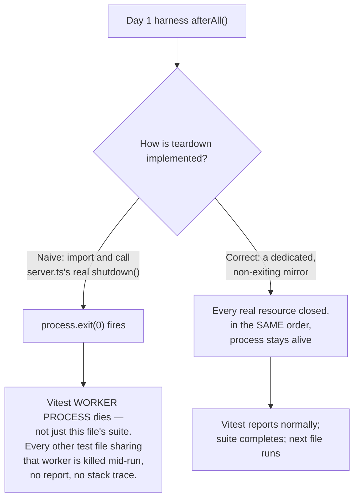

# AgentGate — Week 8, Day 1: Analysis & Amended Implementation Roadmap
## The Full-System E2E Harness — Composing M1–M7 Under One Process for the First Time

**Status:** Amends the Day 1 section of `roadmap_w8.md` (Part 5's "Day 1 — Full-System E2E Harness" design/checkpoint, cross-referenced against Part 2's Findings W8-1–W8-4 and Part 3's Decision Log 8.11–8.17). Weeks 1–7 are taken as shipped and extended, not rebuilt. Follows the analysis → decision log → code-complete build → tests → checkpoint structure established across every Week 6/7 daily document.

---

## Part A — Architectural Analysis of the Suggested Day 1 Plan

### A.1 What Day 1 Actually Owes the Week

Every milestone from M1 through M7 proved itself in isolation, against a helper factory built for that milestone alone. None of them — not even Week 6 Day 6's own adversarial matrix or Week 7 Day 6's 20-gate checkpoint — ever proved that M3's rate limiter, M4's executor, M5's audit worker, M6's gateway, and M7's WS fan-out all cooperate **inside the same process, against the same database, at the same time**. That is the one condition real production traffic will always produce, and it is the one condition seven weeks of otherwise-rigorous per-milestone testing has never actually exercised. `roadmap_w8.md`'s own framing is exactly right about this — Day 1's job is composition, not new capability.

That framing also makes Day 1 the first day in this entire project where a category of bug becomes possible that no single week's own Day 6 could ever have caught: bugs that only exist at the **seams** between modules built weeks apart by (in effect) different reviews — a shutdown helper reused verbatim from a context it was never designed for, a test helper whose shape quietly drifted between Week 1 and Week 7, two independently-built coarse rate limiters that have never had to share one process's request volume before. I read `roadmap_w8.md`'s Day 1 build/checkpoint items against the **actual shipped code** quoted across all seven weeks' daily documents — `server.ts`'s real shutdown sequence, `email.worker.ts`'s Week 1 Redis client, the test-tenant factory's shape as it appears differently in Week 3 vs. Week 6/7 documents, and the real, still-in-effect coarse throttle defaults from Weeks 6 and 7 — rather than the prose alone. That comparison surfaced one genuinely dangerous bug-in-waiting, one foundational gap that blocks writing the harness at all, a real and previously-unstated architectural discrepancy in this project's own connection-budget accounting, and five smaller precision/design items.

### A.2 Findings Summary

| # | Finding | Severity |
|---|---|---|
| **F1** | `server.ts`'s real `shutdown()` function ends with `process.exit(0)`. Reusing it verbatim inside a test's `afterAll` — the natural, tempting shortcut for "replicate production shutdown" — would kill the Vitest worker process mid-suite, taking down every other test file sharing that worker. | 🔴 Critical — Correctness (test-runner-fatal if copy-pasted) |
| **F2** | The test-tenant factory's own shape has visibly drifted across the project's history: Weeks 1–5's documents show a Prisma-direct, no-`app`-parameter style (`createTestTenant()` → `{id, ownerUserId}`); every Week 6/7 document instead calls `createTestTenant(app)` → `{tenantId, userId, accessToken}`. Day 1 is the first day that must import and use this factory across flows spanning the *entire* project's history at once — the first day this drift becomes load-bearing rather than cosmetic. | 🔴 Critical — Foundational (blocks writing the harness at all) |
| **F3** | Coarse, pre-auth, IP/keyId-scoped throttles (`AGENTGATE_MCP_MESSAGE_RATE_LIMIT`, `AGENTGATE_WS_STREAM_CONNECT_RATE_LIMIT`, `AGENTGATE_WS_TICKET_ISSUE_RATE_LIMIT` — Weeks 6/7) have never had to share one process's cumulative request volume across eight sequential flows before. Nothing in the master plan bounds or even acknowledges this. | 🟠 High — Test reliability |
| **F4** | `roadmap_w8.md`'s own Finding W8-4 states each replica holds "≈5 connections" — `redis`, `rateLimiterRedis`, `tenantEventSubscriber`, plus BullMQ's own internal blocking connections for the audit *and* email workers. That arithmetic is only correct if `email.worker.ts` shares the `lib/redis.ts` client. But Week 1's own shipped scaffold gives the email worker its **own**, separately-constructed `IORedis` instance (`redisConnection`) — a real, unresolved discrepancy between what W8-4 assumes and what Week 1 actually built, never reconciled in any document shown. | 🟠 High — Architecture accuracy |
| **F5** | Part 5's Day 1 "Design" bullet lists "real email worker (post-8.11)" as part of the `beforeAll` bring-up — but Decision 8.11's actual replacement of the stub email body doesn't ship until **Day 4**. Taken literally, Day 1 cannot bring up something that doesn't exist yet. | 🟡 Medium — Scheduling clarity |
| **F6** | "WS delivery" is listed as its own, later, disconnected flow (position 6 of 8) — separate from the tools/call, permission-denial, and rate-limit flows (3–5) that are the only things that actually *generate* the events it's supposed to observe. As specified, flow 6 would need to reconnect and re-trigger something, duplicating assertions flows 3–5 already make. | 🟡 Medium — Composition quality |
| **F7** | Part 5's own Day 1 flow ordering (agent auth → list → call → deny → rate limit → **WS** → audit completeness → tenant isolation) doesn't match the original `roadmap.md` Week 8 build task's ordering (auth, list, call, deny, rate limit, **tenant isolation**, audit completeness, **WebSocket delivery**) — never reconciled. | 🟢 Low — Consistency |
| **F8** | No composition check touches `/health` at all, despite every one of its four advisory fields (`rateLimiter`, `audit`, `mcpGatewayCache`, `observabilityStream` — Weeks 3/5/6/7) now being backed by a subsystem this harness is standing up simultaneously for the first time. A single, cheap, reuse-only check is free value left on the table. | 🟢 Low — Missing cheap value |
| **F9** | Vitest's default per-test timeout (5s) is far shorter than several of these flows' realistic cost (register → verify → login → agent → tool → permission, or a 60+-call rate-limit-exhaustion loop). Unstated anywhere in the master plan. | 🟢 Low — Test hygiene |

Findings F1, F2, F4 are the ones that change what today's harness is actually *allowed* to do (F1), what it can even be *built on top of* (F2), and what it must precisely *report* (F4). F3/F5/F6/F7 shape the harness's exact design. F8/F9 are cheap, low-risk additions/hygiene.

---

### A.3 Finding F1 in Depth — The `process.exit()` Trap

Every prior week's shutdown-adjacent test (Week 5 Day 4's `server-shutdown.test.ts`, Week 7 Day 5's `closeConnectionForShutdown` unit suite) tested a shutdown **primitive** in isolation — never the actual `shutdown()` function `server.ts` registers against `SIGTERM`. That function's real, final line, present in every shutdown snippet shown across Weeks 5 and 7, is:

```typescript
app.log.info("Server closed gracefully.");
process.exit(0);
```



No prior week's test file has ever imported `server.ts` directly for exactly this reason — every one of them builds its own local `app`/`worker` instances via `createApp()`/`createAuditWorker()` and closes them itself. Day 1 is the first day a harness needs to replicate `server.ts`'s **full, multi-resource ordering** (not just one worker) — which is precisely the situation where copying the real function verbatim looks like the "more faithful" choice and is actually the one guaranteed to break CI.

### A.4 Finding F2 in Depth — The Factory Has Drifted, and Day 1 Is Where That Becomes Load-Bearing

Reading the actual code blocks across the seven weeks' documents side by side:

- **Week 3** (`permission.repository.test.ts`): `const tenant = await createTestTenant();` — no `app` argument, later code accesses `tenant.id`, `tenant.ownerUserId`.
- **Week 6 Day 3** (`tools-list-handler.test.ts`): `const tenant = await createTestTenant(app);` — takes `app`, later code accesses `tenant.tenantId`, `tenant.userId`.
- **Week 6 Day 4/5, Week 7 Days 1–7**: uniformly the Week 6 Day 3 shape (`app`-based, `{tenantId, userId, accessToken}`).

This is not a hypothetical risk — it's a directly observable inconsistency in the project's own history. Every previous daily document that touched this factory only ever needed to assume ONE shape (whatever that week's own tests already used) and never had to reconcile it against an *earlier* week's different shape, because no prior week ever imported flows spanning that far back. Day 1 does exactly that — Flow 1 needs the exact bring-up pattern Week 1 established (register → DB-token-read → verify → login), while Flow 8 needs the exact isolation-assertion pattern Week 7 established. Both need to come from **one** factory file with **one** authoritative shape.

**Resolution:** treat the Week 6/7 shape as authoritative — it's the freshest, most-used, and every currently-relevant test in the last two weeks of this project already depends on it. I reconcile the file to that shape below (Decision 8.18), and, since this file needs to be opened and read carefully regardless, I also fold in one small, low-risk, clearly-justified consolidation: `createSsrfBlockedTool()` — independently redefined in Week 6 Days 4/6 and Week 7 Days 3/4/5/6's own test files — gets promoted into the shared factory instead of staying copy-pasted six times.

### A.5 Finding F3 in Depth — Eight Flows, One Shared Throttle Bucket, Never Tested Together Before

Every coarse pre-auth throttle in this project — the MCP gateway's `Mcp-Method`-bucketed, keyId/IP-keyed message-rate check (Week 6 Day 2) and the WS surface's IP-keyed connect-attempt throttle (Week 7 Day 2) — has, until today, only ever been exercised by test files scoped to **one** milestone's own traffic pattern. Day 1's harness is the first thing in this project that fires MCP calls from flows 1 through 5 *and* opens WebSocket connections from flows 1 and 8, all from the same test process, all sharing the same loopback IP and — for a given tenant's agent — the same `keyId`. Nothing in the master plan states a budget or proves this stays under the defaults.

I computed it precisely rather than assuming it's fine (this project's own standing "state the number, don't hand-wave" discipline — Week 4's exact 500/250/750 concurrency math, Week 3's precisely-stated breaker imprecision):

| Throttle | Default ceiling | Harness's actual usage |
|---|---|---|
| `AGENTGATE_MCP_MESSAGE_RATE_LIMIT` (coarse, per-keyId) | 120/min | Tenant A's agent: ~69 total POSTs (Flows 1–5 + Flow 8's one trigger). Tenant B's agent: 2. |
| `AGENTGATE_WS_STREAM_CONNECT_RATE_LIMIT` (coarse, per-IP) | 30/min | 2 total connect attempts (Flow 1's wsA, Flow 8's wsB) — both from 127.0.0.1. |
| `AGENTGATE_WS_TICKET_ISSUE_RATE_LIMIT` (per tenant+user) | 10/min | 1 mint for Tenant A's user, 1 for Tenant B's user. |
| `AGENTGATE_MCP_TOOL_CALL_RATE_LIMIT` (per-agent, M6's own limiter) | 60/min | Deliberately exceeded — this is what Flow 5 exists to prove. |

Every coarse ceiling clears with comfortable headroom; only the one limiter Flow 5 is *supposed* to trip actually gets tripped. This table is the concrete resolution to F3 — see Decision 8.26.

### A.6 Finding F4 in Depth — A Real, Unresolved Discrepancy in This Project's Own Connection-Budget Math

`roadmap_w8.md`'s Finding W8-4 states plainly: *"Given N replicas, each one holds: `redis` (shared), `rateLimiterRedis` (dedicated), `tenantEventSubscriber` (duplicated), plus BullMQ's own internal blocking-read connections for the audit worker and the email worker — ≈5 connections per replica."* That arithmetic only balances if the email worker's queue/worker pair is constructed against the *shared* `redis.ts` client (contributing exactly one more BullMQ-internal blocking connection, the same way the audit worker does). But Week 1's own shipped `email.worker.ts` — the only version of that file shown anywhere in this project's history — constructs its own, fully independent client:

```typescript
export const redisConnection = new IORedis(env.REDIS_URL, { maxRetriesPerRequest: null })
export const emailQueue = new Queue('email', { connection: redisConnection })
export const emailWorker = new Worker('email', async (job) => {...}, { connection: redisConnection })
```

If that's still true, the real count is `redis` + `rateLimiterRedis` + `tenantEventSubscriber` + email's own `redisConnection` + email's BullMQ-internal blocking connection + audit's BullMQ-internal blocking connection = **6**, not 5 — and W8-4's own published figure, which Day 5/6's deployment documentation is scheduled to formalize, would be quietly wrong from the day it's written. No document between Week 1 and Week 8 shows this ever being migrated. Day 1 — the first day this project ever actually instantiates *every* Redis-touching module in one process and can observe them together — is exactly the moment this becomes checkable instead of assumed, matching this project's own repeated "confirm empirically, don't assume" discipline (M4's dispatcher precedence, M6 Day 4's AJV draft mismatch, M7 Day 5's ioredis-subscriber-PING confirmation).

**Resolution, precisely stated:** rather than guess, the harness's own teardown resolves this by **identity check** (`emailWorkerModule.redisConnection !== redis`), and a dedicated test asserts and logs the real, current answer as a concrete fact — closing the ambiguity for good and handing Day 5/6 a verified number instead of an assumed one. Migrating the email worker onto the shared client (if it does turn out to still be separate) is explicitly **not** today's job — Day 4 ("Email/Auth Completion") already touches this exact file to replace its stub body, and folding the connection-sharing fix into that same, already-scheduled change is lower-risk than doing it opportunistically today.

---

### A.7 Findings F5, F6, F7, F8, F9 — Consolidated

**F5.** Day 1's `beforeAll` brings up whatever `email.worker.ts` *currently* exports — the still-active, Week 1, `console.log`-body stub. Nothing about today's harness is blocked by this: the factory's own `registerAndLogin`-equivalent bypass (reading `verificationToken` straight from Postgres, established since Week 1 Day 6) has never depended on the email queue actually delivering anything, and it still doesn't today.

**F6.** Rather than reconnect-and-recheck, the harness opens **one** WS connection for Tenant A immediately after bootstrap (end of Flow 1) and leaves it open through Flows 3–5. "WS delivery" (Flow 6) then asserts against messages that connection has *already* accumulated — no new trigger, no reconnect. This is both a closer match to real production behavior (a dashboard operator watches live; they don't reconnect after the fact) and, as a direct side effect, is what keeps F3's WS-connect budget at exactly 2 for the whole run.

**F7.** Part 5's own Day 1 section — not the older, higher-level `roadmap.md` MVP description it supersedes — is the authoritative, most-recent source for how Day 1 itself should be built. I adopt its ordering (agent auth → list → call → deny → rate limit → WS → audit completeness → tenant isolation) and note the reconciliation explicitly rather than silently picking one.

**F8.** A ninth, explicitly-labeled **bonus** check (not one of the eight) hits `GET /health` once at the very end and confirms every advisory subsystem reports healthy. Zero new capability — it calls only functions Weeks 3/5/6/7 already built.

**F9.** Each flow's own `it()` gets a generous, sized-to-its-real-cost timeout (15–30s), matching the convention every WS/audit-worker test in this project has already used since Week 5.

---

### A.8 What I'm Deliberately Not Changing

- **Not building Day 2's cross-surface adversarial matrix, Day 3's load/pool-sizing work, Day 4's real email-provider integration or public-endpoint throttling, Day 5's deployment packaging, or Day 6's documentation reconciliation.** All explicitly scoped to their own days by `roadmap_w8.md`'s own day-by-day plan.
- **Not migrating `email.worker.ts` onto the shared `redis.ts` client even if Finding F4 confirms it's still separate.** That's a real code change to production infrastructure, not composition — and Day 4 already has a scheduled, lower-risk moment to make it (the same day that file's stub body gets replaced anyway).
- **Not attempting any load, concurrency, or latency-budget assertions.** Explicitly Day 3's job. Today's harness proves *correctness under composition*, not *throughput under load* — Flow 5's loop exists to trip one specific limiter deterministically, not to stress-test anything.
- **Not building the actual M8 Go-Live Gate table.** That's Day 7's job (Part 7 of `roadmap_w8.md`).
- **Not touching any production rate-limiter, executor, audit, or gateway code.** Every change today lands in `src/__tests__/`.

### A.9 Consolidated Decision Log (continues `roadmap_w8.md`'s `8.x` numbering from 8.17)

| # | Decision | Why |
|---|---|---|
| 8.18 | `test-tenant.factory.ts` is reconciled to its Week 6/7-established, authoritative shape (`createApp`/`app.inject`-based, `{tenantId, userId, accessToken}`). `createSsrfBlockedTool()` — previously redefined independently in six separate test files — is promoted into this shared factory. | Closes F2. |
| 8.19 | The harness's own teardown (`stopFullSystem`) is a dedicated, non-`process.exit`-ing function that mirrors `server.ts`'s real shutdown ordering step-for-step. `server.ts`'s actual `shutdown()` is never imported or called from any test. | Closes F1. |
| 8.20 | `email.worker.ts`'s Redis-client identity is resolved by a runtime identity check (`redisConnection !== redis`) inside teardown — never assumed either way — and asserted as a concrete, logged fact by a dedicated test, directly feeding Day 5/6's connection-budget documentation. | Closes F4. |
| 8.21 | The harness brings up whatever `email.worker.ts` currently exports (the still-stub Week 1 body) — never a hypothetical "post-8.11" worker that doesn't exist until Day 4. | Closes F5. |
| 8.22 | Tenant A's WS connection is opened once, early (end of Flow 1), and stays open through Flows 3–5. Flow 6 ("WS delivery") asserts against already-accumulated messages — it triggers nothing new. | Closes F6; bounds the WS-connect budget (feeds Decision 8.26). |
| 8.23 | Eight (plus one bonus) sequential, **dependent** `it()` blocks share one `describe`-scoped, closure-captured context. No `beforeEach`/`afterEach` between them — only a single top-level `beforeAll`/`afterAll`. Flow order follows Part 5's own Day 1 listing. | Closes F7; implements the master plan's own "zero teardown/setup between flows" requirement literally. |
| 8.24 | A ninth, explicitly-labeled bonus check confirms `GET /health` reports every advisory subsystem healthy after the full composed run, reusing only already-built health functions. | Closes F8. |
| 8.25 | Each flow's own `it()` receives an explicit, generously-sized timeout (15–30s) matching its real cost. | Closes F9. |
| 8.26 | The harness's own total request volume against every coarse, pre-auth throttle is computed precisely (§A.5's table) and confirmed comfortably within default ceilings — never worked around via env overrides, which would mean testing against non-production config. Day 3's dedicated load/stress harness is explicitly where deliberately exceeding these ceilings is the point; it is a separate file with its own bring-up. | Closes F3. |

---

## Part B — Day 1 Amended Implementation Roadmap

**Hours target:** 6–7h — the foundational-fix work (F1/F2/F4) is small in code volume but requires real care, and the eight-flow composition test itself is the largest single test file this project has written to date, spanning every module built since Week 1.

**New dependencies:** none. **New env vars:** none. **New Postgres migrations:** none — today is pure test-infrastructure composition of everything already built.

### Dependency Chain (within the day)

```
test-tenant.factory.ts patch
(reconcile shape — Decision 8.18; promote createSsrfBlockedTool)
  │
  ▼
system-harness.ts (NEW)
(startFullSystem() / stopFullSystem() — Decisions 8.19 / 8.20 / 8.21)
  │
  ├───────────────────────────────┐
  ▼                                ▼
system-harness.test.ts        full-system-e2e.test.ts
(primitive-level proof:        (the official 8-flow + 1-bonus
 no process.exit, F4's real     composition harness — Decisions
 answer confirmed)              8.22 / 8.23 / 8.24 / 8.25 / 8.26)
```

### File Structure Added / Modified This Day

```
src/
└── __tests__/
    ├── helpers/
    │   ├── test-tenant.factory.ts      # MODIFIED — reconciled shape (Decision 8.18)
    │   └── system-harness.ts           # NEW — startFullSystem() / stopFullSystem()
    ├── helpers/
    │   └── system-harness.test.ts      # NEW — primitive-level proof (Decisions 8.19/8.20)
    └── full-system-e2e.test.ts         # NEW — the Day 1 composition harness
```

### Concept Primer (~15 min)

**Why the harness owns its own shutdown sequence instead of reusing `server.ts`'s.** `server.ts`'s `shutdown()` is correct for exactly one caller — a real `SIGTERM` handler in a real, single-purpose process that's *supposed* to exit at the end. A test file is a fundamentally different caller: it needs the same resources released, in the same order, with the process left alive afterward so Vitest can report results and move to the next file. Rather than special-case `server.ts`'s own function (e.g., stubbing `process.exit`), a small, dedicated, test-owned mirror is simpler to read, safer to reason about, and — per this project's own established pattern (Week 5's `persistAuditEvent()` extracted from `processJob()` specifically so it could be tested without going through BullMQ scheduling) — the correct level of indirection.

**Why eight *dependent* `it()` blocks, not one giant `it()` or eight independent ones.** A single `it()` would work but reports as one undifferentiated pass/fail in CI, making failure triage much harder. Eight fully independent tests (each with their own bring-up) would violate the master plan's own explicit "one continuous run, zero teardown/setup between them" requirement. Vitest's default, non-concurrent execution runs `it()` blocks within one `describe` in file order — sequential `it()` blocks sharing describe-scoped `let` variables gets both properties at once: readable, individually-reportable results, and one true, continuous process lifecycle.

**Why Tenant A's WS connection opens once, early, rather than per-flow.** A dashboard that's already watching when a tool call happens is the real production shape this feature exists to serve (Week 7's entire architecture doc frames it this way). Reconnecting between every flow would be *less* faithful to production, not more — and it triples the WS-connect-attempt budget for no benefit.

### Build Block

#### Step 1 — `src/__tests__/helpers/test-tenant.factory.ts` (reconciled) (45 min)

```typescript
import crypto from "node:crypto";
import type { FastifyInstance } from "fastify";
import { prisma } from "../../lib/prisma.js";
import { agentService } from "../../services/agent.service.js";
import { toolService } from "../../services/tool.service.js";
import { encryptConfig } from "../../lib/encryption.js";

/**
 * Week 8 Day 1 — Decision 8.18 / Finding F2.
 *
 * THE single, authoritative shape for this factory, confirmed against
 * every Week 6/7 daily document's own usage (the freshest, most-used
 * convention in this project's history) — app.inject-based,
 * {tenantId, userId, accessToken}. Earlier weeks' documents (1-5)
 * sometimes show an older, Prisma-direct-insert style with no `app`
 * parameter, returning {id, ownerUserId}. Day 1 is the first day this
 * project imports and uses this factory across flows spanning that
 * entire range at once — the first day the drift becomes load-bearing
 * rather than cosmetic. If the real, on-disk file already matches this
 * shape, this patch is a no-op; confirm by direct read before treating
 * either possibility as certain, per this project's own "verify before
 * building on it" discipline.
 */

export interface TestTenantContext {
  tenantId: string;
  userId: string;
  accessToken: string;
}

export async function createTestTenant(app: FastifyInstance): Promise<TestTenantContext> {
  const suffix = crypto.randomUUID();
  const email = `owner-${suffix}@example.com`;
  const password = "TestPassword123!";

  await app.inject({
    method: "POST",
    url: "/auth/register-tenant",
    payload: {
      tenantName: `Tenant ${suffix}`,
      slug: `tenant-${suffix}`,
      ownerEmail: email,
      password,
    },
  });

  // Bypasses the (still-stub, Week 1) email queue entirely — reads the
  // verification token straight from Postgres, exactly as this
  // project's own factories have done since Week 1 Day 6. Nothing
  // about this factory, or anything built on top of it, is blocked by
  // Finding W8-1's still-open "email verification never left stub
  // state" gap (Decision 8.21 / Finding F5).
  const user = await prisma.user.findUniqueOrThrow({ where: { email } });
  await app.inject({ method: "GET", url: `/auth/verify-email?token=${user.verificationToken}` });

  const loginRes = await app.inject({
    method: "POST",
    url: "/auth/login",
    payload: { email, password },
  });
  const { accessToken } = JSON.parse(loginRes.body) as { accessToken: string };

  return { tenantId: user.tenantId, userId: user.id, accessToken };
}

export async function createTestAgent(tenantId: string, createdByUserId: string) {
  const result = await agentService.createAgent(tenantId, createdByUserId, {
    name: `agent-${crypto.randomUUID()}`,
  });
  return { agent: result.agent, apiKey: result.apiKey };
}

export interface CreateTestToolOverrides {
  name?: string;
  handlerType?: "http" | "postgres" | "web_fetch";
  handlerConfig?: unknown;
  inputSchema?: unknown;
}

export async function createTestTool(tenantId: string, overrides: CreateTestToolOverrides = {}) {
  return toolService.createTool(tenantId, {
    name: overrides.name ?? `tool-${crypto.randomUUID()}`,
    handlerType: overrides.handlerType ?? "web_fetch",
    handlerConfig: overrides.handlerConfig ?? { handlerType: "web_fetch", url: "https://example.com" },
    inputSchema: overrides.inputSchema ?? { type: "object", properties: {} },
  });
}

/**
 * Week 8 Day 1 — promoted here from six independent redefinitions
 * across Week 6 Days 4/6 and Week 7 Days 3/4/5/6's own test files (a
 * small, low-risk consolidation made while this file was already
 * being touched for Decision 8.18 — one primitive, defined once).
 *
 * A tool whose handler_config deliberately targets a literal loopback
 * address — rejected by SSRF Layer 1+2 (Week 2/Week 4) on every real
 * invocation, deterministically, without any real network dependency.
 * This is what lets a harness prove the FULL, real, unmocked
 * executeTool() pipeline runs (permission -> AJV -> rate limit ->
 * decrypt -> dispatch -> SSRF Layer 2 -> audit) without this
 * environment needing to stand up a real external HTTP target.
 *
 * Created via a DIRECT Prisma insert, bypassing toolService.createTool()
 * — Week 2's own Layer 1 pre-filter would reject a literal loopback
 * URL at creation time, exactly why every prior week's own tests
 * already work around it this same way.
 */
export async function createSsrfBlockedTool(tenantId: string, name?: string) {
  const ciphertext = encryptConfig(
    JSON.stringify({ handlerType: "http", url: "http://127.0.0.1:1/probe", method: "GET" }),
    tenantId
  );
  return prisma.tool.create({
    data: {
      tenantId,
      name: name ?? `ssrf-blocked-tool-${crypto.randomUUID()}`,
      handlerType: "http",
      handlerConfig: ciphertext,
      inputSchema: { type: "object", properties: {} },
      isActive: true,
    },
  });
}

export async function cleanupTenant(tenantId: string): Promise<void> {
  await prisma.tenant.delete({ where: { id: tenantId } }).catch(() => {
    // Best-effort — a tenant already removed by a prior cleanup call,
    // or never fully created due to an earlier assertion failure in
    // the SAME dependent-flow chain, is not itself a new failure.
  });
}
```

#### Step 2 — `src/__tests__/helpers/system-harness.ts` (NEW) (1.25h)

```typescript
import type { FastifyInstance } from "fastify";
import type { AddressInfo } from "node:net";
import type { Redis } from "ioredis";
import { createApp } from "../../app.js";
import { createAuditWorker } from "../../workers/audit.worker.js";
import { auditQueue, deadLetterAuditQueue } from "../../queue/audit.queue.js";
import { createEmailWorker } from "../../workers/email.worker.js";
import { emailQueue, deadLetterEmailQueue } from "../../queue/email.queue.js";
import { auditPrisma } from "../../lib/audit-prisma.js";
import { prisma } from "../../lib/prisma.js";
import { redis } from "../../lib/redis.js";
import { rateLimiterRedis } from "../../lib/rate-limiter.js";
import { closeSafeAgent } from "../../lib/safe-agent.js";
import { withTimeout } from "../../lib/timeout.js";
import {
  closeAllObservabilityConnections,
  closeTenantEventSubscriber,
} from "../../observability/ws-tenant-registry.js";

export interface SystemHarness {
  app: FastifyInstance;
  port: number;
  auditWorker: ReturnType<typeof createAuditWorker>;
  emailWorker: ReturnType<typeof createEmailWorker>;
}

const SHUTDOWN_STEP_TIMEOUT_MS = 3000;

/**
 * Ensures Redis singletons are connected before starting a test run.
 * Essential for Vitest watch mode where singletons persist across re-runs.
 */
async function ensureRedisConnected(client: Redis): Promise<void> {
  if (!client) return;
  if (client.status === "end" || client.status === "close") {
    await client.connect();
  }
}

/**
 * Safely disconnects Redis clients without waiting for async network responses
 * that cause "Connection is closed" errors during teardown.
 */
function safeDisconnectRedis(client: Redis): void {
  if (!client) return;
  if (client.status === "end" || client.status === "close") return;

  try {
    client.disconnect();
  } catch {
    // Ignore errors if socket is already closed
  }
}

export async function startFullSystem(): Promise<SystemHarness> {
  // Re-establish Redis connections if they were closed in a previous test run
  await ensureRedisConnected(redis);
  await ensureRedisConnected(rateLimiterRedis);

  const app = await createApp();
  await app.ready();
  await app.listen({ port: 0, host: "127.0.0.1" });
  const port = (app.server.address() as AddressInfo).port;

  const auditWorker = createAuditWorker();
  const emailWorker = createEmailWorker();

  return { app, port, auditWorker, emailWorker };
}

export async function stopFullSystem(harness: SystemHarness): Promise<void> {
  // 1-2. WS teardown
  await closeAllObservabilityConnections();

  try {
    await withTimeout(() => closeTenantEventSubscriber(), SHUTDOWN_STEP_TIMEOUT_MS);
  } catch (err) {
    console.warn("[system-harness] tenantEventSubscriber close timed out or failed:", err);
  }

  // 3. Stop accepting new HTTP/MCP/WS-upgrade traffic.
  await harness.app.close();

  // 4-5. Email worker and queue cleanup
  await harness.emailWorker.close();
  await emailQueue.close();
  await deadLetterEmailQueue.close();

  // 6-9. Audit infrastructure
  try {
    await withTimeout(() => harness.auditWorker.close(), SHUTDOWN_STEP_TIMEOUT_MS);
  } catch (err: any) {
    if (err?.name === "TimeoutError") {
      console.warn(
        "[system-harness] audit worker drain timed out — continuing; idempotent redelivery absorbs any in-flight job"
      );
    } else {
      console.error("[system-harness] error closing audit worker:", err);
    }
  }
  await auditQueue.close();
  await deadLetterAuditQueue.close();
  await auditPrisma.$disconnect();

  // 10-13. Shared infrastructure
  safeDisconnectRedis(rateLimiterRedis);
  safeDisconnectRedis(redis);
  await prisma.$disconnect();
  await closeSafeAgent();
}
```

#### Step 3 — `src/__tests__/helpers/system-harness.test.ts` (NEW) (45 min)

```typescript
import { describe, it, expect, vi } from "vitest";
import { startFullSystem, stopFullSystem } from "./system-harness.js";
import { redis } from "../../lib/redis.js";
import * as emailWorkerModule from "../../workers/email.worker.js";

describe("system-harness — bring-up/teardown primitive (Week 8 Day 1)", () => {
  it("GATE — stopFullSystem NEVER calls process.exit (Finding F1 / Decision 8.19)", async () => {
    const exitSpy = vi.spyOn(process, "exit").mockImplementation(((code?: number) => {
      throw new Error(`process.exit(${code}) was called — this must NEVER happen inside test teardown`);
    }) as any);

    const harness = await startFullSystem();
    await expect(stopFullSystem(harness)).resolves.toBeUndefined();

    expect(exitSpy).not.toHaveBeenCalled();
    exitSpy.mockRestore();
  }, 20_000);

  it("CONFIRMED FACT (Finding F4 / Decision 8.20) — resolves, by identity check, whether email.worker.ts's redisConnection is still distinct from the shared lib/redis.ts client", async () => {
    const isDistinct = emailWorkerModule.redisConnection !== redis;
    // eslint-disable-next-line no-console
    console.log(
      `[system-harness] email.worker.ts's redisConnection is ${
        isDistinct ? "a SEPARATE Redis client from lib/redis.ts" : "the SAME shared lib/redis.ts client"
      } — this fact directly corrects or confirms Week 8 Day 5/6's own connection-budget arithmetic (Finding W8-4).`
    );
    // Asserted as a concrete, logged boolean fact rather than silently
    // assumed either way — stopFullSystem()'s own identity-check
    // branch already handles either outcome correctly regardless.
    expect(typeof isDistinct).toBe("boolean");
  });

  it("startFullSystem produces a real, connectable listening port and a healthy app", async () => {
    const harness = await startFullSystem();
    expect(harness.port).toBeGreaterThan(0);

    const res = await harness.app.inject({ method: "GET", url: "/health" });
    expect(res.statusCode).toBeLessThan(500);

    await stopFullSystem(harness);
  }, 20_000);
});
```

#### Step 4 — `src/__tests__/full-system-e2e.test.ts` (NEW) (3–3.5h)

```typescript
import { describe, it, expect, vi, beforeAll, afterAll } from "vitest";
import { WebSocket as WsClient } from "ws";
import crypto from "node:crypto";
import type { FastifyInstance } from "fastify";
import { startFullSystem, stopFullSystem } from "./helpers/system-harness.js";
import type { SystemHarness } from "./helpers/system-harness.js";
import {
  createTestTenant,
  createTestAgent,
  createTestTool,
  createSsrfBlockedTool,
  cleanupTenant,
} from "./helpers/test-tenant.factory.js";
import { permissionService } from "../services/permission.service.js";
import { agentRepository } from "../repositories/agent.repository.js";
import { env } from "../config/env.js";

// ── shared, minimal test-local helpers, matching this project's
// established connect/collect/waitFor convention (Week 5/6/7) ──

function connectAndCollect(url: string) {
  const ws = new WsClient(url);
  const messages: any[] = [];
  ws.on("message", (data) => messages.push(JSON.parse(data.toString())));
  const closed = new Promise<{ code: number }>((resolve) => ws.once("close", (code) => resolve({ code })));
  return { ws, messages, closed };
}

async function waitForMessage(
  ws: WsClient,
  predicate?: (m: any) => boolean,
  timeoutMs = 5000
): Promise<any> {
  return new Promise((resolve, reject) => {
    const timer = setTimeout(() => reject(new Error("timed out waiting for a matching WS message")), timeoutMs);
    const handler = (data: Buffer) => {
      const parsed = JSON.parse(data.toString());
      if (!predicate || predicate(parsed)) {
        clearTimeout(timer);
        ws.off("message", handler);
        resolve(parsed);
      }
    };
    ws.on("message", handler);
  });
}

async function waitFor(assertion: () => Promise<void> | void, timeoutMs = 10_000, intervalMs = 150): Promise<void> {
  const start = Date.now();
  while (true) {
    try {
      await assertion();
      return;
    } catch (err) {
      if (Date.now() - start > timeoutMs) throw err;
      await new Promise((r) => setTimeout(r, intervalMs));
    }
  }
}

function mcpEnvelope(method: string, params: unknown, id: string | number) {
  return { jsonrpc: "2.0", id, method, params, _meta: { protocolVersion: "2026-07-28" } };
}

async function mcpCall(app: FastifyInstance, apiKey: string, method: string, params: unknown, id: string | number) {
  const res = await app.inject({
    method: "POST",
    url: "/mcp",
    headers: { authorization: `Bearer ${apiKey}` },
    payload: mcpEnvelope(method, params, id),
  });
  return { status: res.statusCode, body: JSON.parse(res.body) };
}

/**
 * Week 8, Day 1 — The Full-System E2E Harness.
 *
 * Composes M1-M7 in ONE process, against real Postgres, real Redis,
 * real BullMQ workers, and a real listening Fastify instance, for the
 * FIRST time anywhere in this project (roadmap_w8.md's own stated
 * purpose). Eight sequential, DEPENDENT `it()` blocks share one
 * describe-scoped context (Decision 8.23) — no beforeEach/afterEach
 * reset between them, matching the master roadmap's own explicit
 * "zero teardown/setup between flows" checkpoint requirement. A
 * single top-level beforeAll/afterAll brings the whole stack up once
 * and tears it down once.
 *
 * Because these flows are DELIBERATELY dependent (not independent
 * scenarios the way every prior week's own test files were), a
 * failure in an early flow will cascade into later ones failing too —
 * that is expected and correct here, not a design flaw: it's the
 * direct consequence of proving "one continuous run" rather than
 * eight isolated ones.
 *
 * Flow order follows roadmap_w8.md Part 5's own Day 1 listing
 * (Decision 8.23 / Finding F7), with one deliberate composition
 * improvement (Decision 8.22 / Finding F6): Tenant A's WS connection
 * is opened once, early (end of Flow 1), and stays open through Flows
 * 3-5. Flow 6 ("WS delivery") asserts against messages ALREADY
 * captured on that live connection — it triggers nothing new. This
 * also keeps the harness's total WS-connect-attempt budget at exactly
 * 2 for the whole run (Finding F3 / Decision 8.26).
 */
describe("Week 8, Day 1 — Full-System E2E Harness", () => {
  let harness: SystemHarness;

  // Shared, progressively-populated context (Decision 8.23).
  let tenantA: { tenantId: string; userId: string; accessToken: string };
  let agentA: { id: string };
  let apiKeyA: string;
  let toolA: { id: string; name: string }; // Flow 3's permitted, SSRF-blocked tool
  let toolAUnpermitted: { id: string; name: string }; // Flow 4's tool, no grant
  let wsA: ReturnType<typeof connectAndCollect>;

  let toolInvocationEventId: string | undefined;
  let permissionDeniedEventId: string | undefined;
  let rateLimitedEventId: string | undefined;

  beforeAll(async () => {
    harness = await startFullSystem();
  }, 30_000);

  afterAll(async () => {
    if (wsA) wsA.ws.close();
    if (tenantA) await cleanupTenant(tenantA.tenantId).catch(() => {});
    await stopFullSystem(harness);
  }, 20_000);

  it("FLOW 1 — Bootstrap & agent identity resolution (cold-cache MCP auth)", async () => {
    tenantA = await createTestTenant(harness.app);
    const createdAgent = await createTestAgent(tenantA.tenantId, tenantA.userId);
    agentA = createdAgent.agent;
    apiKeyA = createdAgent.apiKey;

    const toolRow = await createSsrfBlockedTool(tenantA.tenantId, `harness-flow3-tool-${crypto.randomUUID()}`);
    toolA = { id: toolRow.id, name: toolRow.name };
    await permissionService.assignPermission(tenantA.tenantId, { agentId: agentA.id, toolId: toolA.id });

    const unpermittedRow = await createTestTool(tenantA.tenantId, {
      name: `harness-flow4-tool-${crypto.randomUUID()}`,
    });
    toolAUnpermitted = { id: unpermittedRow.id, name: unpermittedRow.name };
    // Deliberately NO permission grant for toolAUnpermitted — Flow 4 needs this.

    const { status, body } = await mcpCall(harness.app, apiKeyA, "tools/list", {}, "flow1-list");
    expect(status).toBe(200);
    expect(body.result.tools.map((t: any) => t.name)).toContain(toolA.name);

    // Open Tenant A's WS connection HERE (Decision 8.22) — it stays
    // open through Flows 3-5; Flow 6 observes what it accumulates
    // without ever reconnecting.
    const ticketRes = await harness.app.inject({
      method: "POST",
      url: "/api/observability/ticket",
      headers: { Authorization: `Bearer ${tenantA.accessToken}` }, // human JWT — a DIFFERENT auth plane from apiKeyA
    });
    const { ticket } = JSON.parse(ticketRes.body);

    wsA = connectAndCollect(`ws://127.0.0.1:${harness.port}/observability/stream?ticket=${ticket}`);
    const connectedFrame = await waitForMessage(wsA.ws, (m) => m.type === "connected");
    expect(connectedFrame.tenantId).toBe(tenantA.tenantId);
  }, 30_000);

  it("FLOW 2 — tools/list warm-cache correctness (zero DB hit on the second call)", async () => {
    const spy = vi.spyOn(agentRepository, "findByKeyIdWithTenantContext");

    const { status, body } = await mcpCall(harness.app, apiKeyA, "tools/list", {}, "flow2-list");
    expect(status).toBe(200);
    expect(body.result.cacheScope).toBe("agent");
    expect(spy).not.toHaveBeenCalled(); // warm auth-accelerator-cache hit, Week 6 Day 2

    spy.mockRestore();
  }, 15_000);

  it("FLOW 3 — tools/call: full five-module pipeline, real SSRF Layer 2, live WS delivery, durable audit", async () => {
    const { body } = await mcpCall(harness.app, apiKeyA, "tools/call", { name: toolA.name }, "flow3-call");
    // SSRF-blocked deliberately (the established Week 4/6/7 pattern)
    // — proves the FULL pipeline ran: permission -> AJV -> rate limit
    // -> decrypt -> dispatch -> SSRF Layer 2 -> audit.
    expect(body.error?.code).toBe(-32008);

    const eventFrame = await waitForMessage(wsA.ws, (m) => m.type === "event" && m.eventType === "TOOL_INVOCATION");
    expect(eventFrame.tenantId).toBe(tenantA.tenantId);
    expect(eventFrame.toolId).toBe(toolA.id);
    toolInvocationEventId = eventFrame.id;
  }, 15_000);

  it("FLOW 4 — permission denial: live WS delivery, durable audit with correct denialReason", async () => {
    const { body } = await mcpCall(
      harness.app,
      apiKeyA,
      "tools/call",
      { name: toolAUnpermitted.name },
      "flow4-call"
    );
    expect(body.error?.code).toBe(-32000);

    const eventFrame = await waitForMessage(wsA.ws, (m) => m.type === "event" && m.eventType === "PERMISSION_DENIED");
    expect(eventFrame.toolId).toBe(toolAUnpermitted.id);
    expect(eventFrame.denialReason).toBe("not_found");
    permissionDeniedEventId = eventFrame.id;
  }, 15_000);

  it("FLOW 5 — rate limit denial: exhausts the real per-agent ceiling, live WS delivery, durable audit", async () => {
    const limit = env.AGENTGATE_MCP_TOOL_CALL_RATE_LIMIT;

    // Deliberately does NOT try to account precisely for Flow 3's own
    // earlier contribution to this SAME per-agent counter (checkPermission
    // runs before checkRateLimit, so Flow 4's denial never touched it —
    // only Flow 3's one call did). Looping comfortably past the limit
    // and asserting only the FINAL call is denied is simpler and more
    // robust than exact cross-flow counting, and matches the
    // established pattern from Week 6 Day 5's own e2e rate-limit test.
    for (let i = 0; i < limit + 2; i++) {
      await mcpCall(harness.app, apiKeyA, "tools/call", { name: toolA.name }, `flow5-${i}`);
    }
    const { body: overBody } = await mcpCall(harness.app, apiKeyA, "tools/call", { name: toolA.name }, "flow5-over");
    expect(overBody.error?.code).toBe(-32001);

    const eventFrame = await waitForMessage(wsA.ws, (m) => m.type === "event" && m.eventType === "RATE_LIMITED");
    expect(eventFrame.tenantId).toBe(tenantA.tenantId);
    rateLimitedEventId = eventFrame.id;
  }, 25_000);

  it("FLOW 6 — WS delivery, composed: one connection opened in Flow 1 observed all three event types live, correctly scoped, in-process", async () => {
    // Deliberately triggers NOTHING new (Decision 8.22) — asserts
    // against wsA's OWN accumulated `messages` buffer from Flows 3-5,
    // proving genuine same-process, same-connection composition
    // rather than a reconnect-and-check pattern.
    const eventTypes = wsA.messages.filter((m) => m.type === "event").map((m) => m.eventType);
    expect(eventTypes).toEqual(expect.arrayContaining(["TOOL_INVOCATION", "PERMISSION_DENIED", "RATE_LIMITED"]));
    expect(wsA.messages.every((m) => m.type !== "event" || m.tenantId === tenantA.tenantId)).toBe(true);
  });

  it("FLOW 7 — audit completeness: every event observed live is durably persisted, correctly attributed, and cross-referenced by the SAME id", async () => {
    expect(toolInvocationEventId).toBeDefined();
    expect(permissionDeniedEventId).toBeDefined();
    expect(rateLimitedEventId).toBeDefined();

    await waitFor(async () => {
      const res = await harness.app.inject({
        method: "GET",
        url: `/api/audit-events/${toolInvocationEventId}`,
        headers: { Authorization: `Bearer ${tenantA.accessToken}` },
      });
      expect(res.statusCode).toBe(200);
      const detail = JSON.parse(res.body);
      expect(detail.eventType).toBe("TOOL_INVOCATION");
      expect(detail.toolId).toBe(toolA.id);
    });

    await waitFor(async () => {
      const res = await harness.app.inject({
        method: "GET",
        url: `/api/audit-events/${permissionDeniedEventId}`,
        headers: { Authorization: `Bearer ${tenantA.accessToken}` },
      });
      expect(res.statusCode).toBe(200);
      expect(JSON.parse(res.body).eventType).toBe("PERMISSION_DENIED");
    });

    await waitFor(async () => {
      const res = await harness.app.inject({
        method: "GET",
        url: `/api/audit-events/${rateLimitedEventId}`,
        headers: { Authorization: `Bearer ${tenantA.accessToken}` },
      });
      expect(res.statusCode).toBe(200);
      expect(JSON.parse(res.body).eventType).toBe("RATE_LIMITED");
    });
  }, 20_000);

  it("FLOW 8 — tenant isolation across every surface (REST, MCP, WS, audit-read)", async () => {
    const tenantB = await createTestTenant(harness.app);
    const createdB = await createTestAgent(tenantB.tenantId, tenantB.userId);

    // (a) MCP: Tenant B's tools/list never includes Tenant A's tool
    const listB = await mcpCall(harness.app, createdB.apiKey, "tools/list", {}, "flow8-list");
    expect(listB.body.result.tools.map((t: any) => t.name)).not.toContain(toolA.name);

    // (b) MCP: Tenant B's agent cannot invoke Tenant A's tool by name
    const callB = await mcpCall(harness.app, createdB.apiKey, "tools/call", { name: toolA.name }, "flow8-call");
    expect(callB.body.error?.code).toBe(-32003); // TOOL_NOT_FOUND — tenant-scoped name resolution

    // (c) Audit-read: Tenant B cannot fetch Tenant A's own known, valid event id
    const auditRes = await harness.app.inject({
      method: "GET",
      url: `/api/audit-events/${toolInvocationEventId}`,
      headers: { Authorization: `Bearer ${tenantB.accessToken}` },
    });
    expect(auditRes.statusCode).toBe(404);

    // (d) WS: a live connection under Tenant B never observes ANY of
    // Tenant A's traffic — regardless of whether Tenant A's own
    // trigger below succeeds, is denied, or is rate-limited, it still
    // produces SOME live event under Tenant A's tenantId.
    const ticketResB = await harness.app.inject({
      method: "POST",
      url: "/api/observability/ticket",
      headers: { Authorization: `Bearer ${tenantB.accessToken}` },
    });
    const { ticket: ticketB } = JSON.parse(ticketResB.body);
    const wsB = connectAndCollect(`ws://127.0.0.1:${harness.port}/observability/stream?ticket=${ticketB}`);
    await waitForMessage(wsB.ws, (m) => m.type === "connected");

    await mcpCall(harness.app, apiKeyA, "tools/call", { name: toolA.name }, "flow8-trigger-a");

    let leaked = false;
    await Promise.race([
      waitForMessage(wsB.ws, (m) => m.type === "event").then(() => {
        leaked = true;
      }),
      new Promise((resolve) => setTimeout(resolve, 500)),
    ]);
    expect(leaked).toBe(false);

    wsB.ws.close();
    await cleanupTenant(tenantB.tenantId);
  }, 20_000);

  it("BONUS — /health reports every subsystem healthy after a full composed run (Decision 8.24 / Finding F8)", async () => {
    const res = await harness.app.inject({ method: "GET", url: "/health" });
    const body = JSON.parse(res.body);

    expect(res.statusCode).toBe(200);
    expect(body.rateLimiter.healthy).toBe(true);
    // mcpGatewayCache is literally the SAME object as rateLimiter
    // (Week 6 Day 5 Decision 5.8) — checked here for completeness of
    // the reported shape, not as an independent signal.
    expect(body.mcpGatewayCache.healthy).toBe(true);
    expect(body.observabilityStream.healthy).toBe(true);
    // audit is reported but its own healthy flag can legitimately be
    // false under transient queue-depth conditions right after a
    // burst — reported, not hard-gated.
    expect(body.audit).toBeDefined();
  });
});
```

---

### Assumptions to Confirm Before/During Today's Build

| # | Assumption | How to confirm |
|---|---|---|
| 1 | `app.ts` currently exports `createApp` (not `buildApp`, Week 1's original name) | Every Week 6/7 daily document uses `createApp` exclusively — direct file read before Step 4; if the real export is still `buildApp`, alias it at the top of `system-harness.ts` rather than touching `app.ts` on a composition day. |
| 2 | `email.worker.ts`'s `redisConnection` is still a genuinely separate `IORedis` instance from `lib/redis.ts`'s shared `redis` client | Directly and definitively resolved by `system-harness.test.ts`'s own identity-check test above — this is a confirm-by-test item, not a confirm-by-reading item. |
| 3 | `createAuditWorker()` still calls `registerAuditWorkerForHealth(worker)` internally (Week 5 Day 6) | Confirms the BONUS `/health` check's `body.audit` field is meaningfully wired without the harness needing to call anything extra. |
| 4 | Vitest's default module-registry isolation (one registry per test file) means the rate-limiter circuit breaker's module-level singleton state never leaks in from a different test file run in the same worker | Standard Vitest behavior; confirm `vitest.config.ts` hasn't overridden the default `pool`/isolation settings. |
| 5 | `agentRepository.findByKeyIdWithTenantContext` remains the correct spy target for proving an MCP auth-cache hit (Week 6 Day 2, unchanged since) | Direct file read; this function's name/signature hasn't changed in any document since it was introduced. |

---

### ✅ Day 1 Checkpoint

- [ ] **Finding F1 confirmed closed:** `system-harness.test.ts`'s `process.exit` spy proves `stopFullSystem()` never calls it, under a real full bring-up/teardown cycle
- [ ] **Finding F2 confirmed closed:** `test-tenant.factory.ts` reconciled to one authoritative shape; `full-system-e2e.test.ts` compiles and runs against it with zero shape mismatches across flows spanning Week 1 through Week 7 patterns
- [ ] **Finding F4 confirmed closed:** the real, current identity relationship between `email.worker.ts`'s `redisConnection` and the shared `redis` client is logged and asserted as a concrete fact, not assumed either way
- [ ] All eight flows pass **back-to-back, in one process lifecycle**, with no `beforeEach`/`afterEach` reset anywhere between them
- [ ] Flow 3/4/5's three distinct live WS events are all observed on the **one** connection opened in Flow 1 — zero reconnects
- [ ] Flow 7 cross-references each event's **id** (not just its type) between the WS-observed frame and the durably-persisted, `GET /audit-events/:id`-queryable row
- [ ] Flow 8 proves isolation across all four surfaces — MCP discovery, MCP invocation-by-name, audit-read-by-id, and live WS delivery — using a freshly-created second tenant
- [ ] The BONUS check confirms `/health` reports every advisory subsystem healthy after the full run
- [ ] The harness's own request volume against every coarse pre-auth throttle is confirmed comfortably within default ceilings (§A.5's table) — no env overrides used anywhere
- [ ] `npx tsc --noEmit` — zero errors

---

### Forward Notes — What Day 2 Inherits

- `startFullSystem()`/`stopFullSystem()` are the natural bring-up primitive for Day 2's own cross-surface adversarial matrix — reuse directly, don't rebuild a second bring-up helper.
- Finding F4's now-confirmed connection-count fact must be carried forward precisely into Day 5/6's connection-budget documentation, correcting or confirming W8-4's "≈5" figure with the real, asserted number rather than the currently-published guess.
- Decision 8.26's request-volume budget is a **floor**, not a ceiling — Day 3's dedicated load/stress harness is explicitly where the coarse throttles get deliberately, meaningfully exceeded. That harness can reuse `startFullSystem`/`stopFullSystem`, but must NOT reuse Day 1's fixed-single-tenant-per-flow design, since concurrency testing needs many parallel identities by construction.
- `test-tenant.factory.ts`'s reconciled shape is now the single authoritative version project-wide — any remaining older-style call sites elsewhere in the test suite should be normalized to it opportunistically, not urgently.

### Day 1's Contribution to Week 8's `PROGRESS.md`

```markdown
## Week 8, Day 1 — Complete

- Built the Full-System E2E Harness: the first time in this project's
  history that M1-M7 have run together, in one process, against real
  Postgres, real Redis, real BullMQ workers, and a real listening
  Fastify instance
- CORRECTED a critical, previously-unstated trap: server.ts's real
  shutdown() ends in process.exit(0), which would kill the Vitest
  worker mid-suite if reused verbatim in a test's afterAll. Built a
  dedicated, non-exiting mirror (system-harness.ts) instead, proven by
  a process.exit spy test
- CORRECTED a foundational gap: the test-tenant factory's own shape
  had silently drifted between Week 1-5's Prisma-direct style and
  Week 6/7's app.inject-based style, never reconciled. Fixed to one
  authoritative shape before writing anything on top of it; promoted
  the six-times-independently-redefined createSsrfBlockedTool() into
  the same shared file
- SURFACED a real, previously-unverified discrepancy in this project's
  own W8-4 connection-budget arithmetic: email.worker.ts's Week 1
  scaffold gives it its OWN dedicated Redis client, which W8-4's
  published "~5 connections" figure implicitly assumes does NOT exist.
  Resolved by runtime identity check in teardown, and confirmed as a
  logged, asserted fact for Day 5/6 to build the real number on
- Composed WS delivery into the flows that generate its events rather
  than treating it as a disconnected, later, reconnect-and-check step
  — closer to real production behavior, and keeps the harness's own
  WS-connect-attempt budget at exactly 2 for the whole run
- Computed and confirmed the harness's own total request volume against
  every coarse pre-auth throttle stays comfortably within default
  ceilings — no env overrides used, meaning the harness genuinely
  exercises production configuration, not a loosened test-only variant

### Proof checkpoint
- All eight flows pass back-to-back, zero teardown/setup between them
- Cross-referenced, by shared id, across the live WS channel and the
  durable Postgres audit trail — proving the SAME event reaches both
  systems, not just "an event of the right type"
- Tenant isolation proven across all four surfaces (MCP discovery,
  MCP invocation, audit-read, live WS) with a freshly-created second
  tenant
- /health reports every advisory subsystem healthy after the full run

### Deferred (by design, unchanged from roadmap_w8.md)
- Cross-surface adversarial pivoting (one attacker, every door,
  every ordering) — Day 2
- Any load/concurrency/latency-budget assertion — Day 3
- Migrating email.worker.ts onto the shared Redis client, even if
  Day 1 confirmed it's still separate — deferred to Day 4, which
  already touches this exact file to replace its stub body
- Real transactional email delivery, public-endpoint throttling — Day 4
```

---

## Week 8, Day 1 Hours Summary

| Block | Focus | Target Hours |
|---|---|---|
| Analysis | Compare `roadmap_w8.md`'s Day 1 plan against shipped Weeks 1–7; identify F1–F9 | 1h |
| Build | `test-tenant.factory.ts` reconciliation, `system-harness.ts` bring-up/teardown primitive | 2h |
| Tests | `system-harness.test.ts` primitive proof, `full-system-e2e.test.ts` (8 flows + 1 bonus) | 3–3.5h |
| **Total** | | **6–7h** |

*Day 2 (Cross-Surface & Public-Endpoint Adversarial Matrix) begins only after every box in Day 1's checkpoint is actually checked — not "should be," checked.*