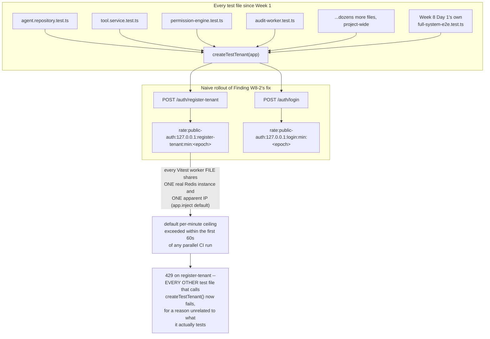

# AgentGate — Week 8, Day 2: Analysis & Amended Implementation Roadmap
## Cross-Surface & Public-Endpoint Adversarial Matrix

**Status:** Amends the Day 2 section of `roadmap_w8.md` (Part 5's "Day 2 — Cross-Surface & Public-Endpoint Adversarial Matrix" design/checkpoint, cross-referenced against Part 2's Finding W8-2 and Part 3's Decision 8.12). Continues the Decision Log at **8.39**, following `roadmap_w8_d1.md`'s 8.18–8.26 and `email-integration-roadmap.md`'s 8.27–8.38 — the latter a standalone deep-dive that closed **Finding W8-1** (email verification) ahead of its originally-scheduled Day 4 slot, which changes what Day 4 still owes the project (noted in Forward Notes). Weeks 1–7 and Week 8 Day 1 are taken as shipped and extended, not rebuilt. Follows the analysis → decision log → code-complete build → tests → checkpoint structure established across every Week 6/7/8 daily document.

---

## Part A — Architectural Analysis of the Suggested Day 2 Plan

### A.1 What Day 2 Actually Owes the Week

Day 1 proved that M1–M7 cooperate correctly *inside one process* — composition, not adversity. Day 2 is the first day this project asks a genuinely different question: not "do these modules work together," but **"does one hostile actor, holding one real credential set, ever get more than that credential set is entitled to, no matter which door they try, in what order, or how many doors at once?"** Every surface built since Week 1 has already proven its *own* isolation in isolation — Week 1 Day 6's REST proof, Week 6 Day 6's MCP adversarial matrix, Week 7 Day 6's 20-gate WS checkpoint. What none of them has ever proven is the **combination** — and per `roadmap_w8.md`'s own framing, that gap is exactly what makes the day before public launch different from every prior Day 6: the threat model that actually matters on day one isn't "someone attacks the MCP gateway," it's one actor pivoting across every door in sequence, then trying several at once.

`roadmap_w8.md`'s own Day 2 section folds a second, structurally unrelated concern into the same day: closing **Finding W8-2** (the three public, pre-credential endpoints — `register-tenant`, `register-user`, `login` — carry zero rate limiting, despite this exact defensive pattern having been independently invented and proven twice already, at Week 6 Day 2 and Week 7 Day 2). That's a reasonable pairing — both are "prove the system resists an adversary" work — but it means Day 2 has two genuinely different jobs: an **isolation** proof (read-only, purely verification) and a **new production capability** (the throttle itself, which has to be designed, built, and wired before it can be proven).

I read `roadmap_w8.md`'s Day 2 design/checkpoint text against the **actual shipped code** — the real `test-tenant.factory.ts` and `system-harness.ts` from Day 1, the real `rate-limiter.ts`'s `checkRateLimitByNameSpace`/`buildNamespacedRateLimitKey` (Week 6 Day 2, corrected Week 6 Day 3), the real Fastify route/plugin topology from `app.ts` (Week 1, amended Week 6 Day 2), and the real shape of `createTestTenant()` as it's been called by essentially every test file in this project's history — rather than the prose alone. That comparison surfaced one genuinely dangerous rollout risk this project has never had to think about before (because no prior coarse throttle sat on a route this universally depended-upon), a real scheduling contradiction between Day 2's and Day 4's own text about who actually builds the throttle, two design-precision gaps in how the throttle should attach to Fastify's route topology, and three smaller composition/hygiene items.

### A.2 Findings Summary

| # | Finding | Severity |
|---|---|---|
| **F1** | `createTestTenant(app)` — the single most pervasively-reused helper in this project's entire test suite, called from nearly every test file since Week 1 — calls **both** `POST /auth/register-tenant` and `POST /auth/login`, the exact two endpoints Finding W8-2 is about to put a coarse, per-IP throttle on. Every test in this project's history runs from the same apparent IP (Fastify's `app.inject()` default remote address), against the same real (not mocked) Redis instance, very possibly across many parallel Vitest worker files sharing that one backend. Shipped naively, the new throttle risks intermittently breaking *every other test file in the project* — for a reason that has nothing to do with what those files are actually testing. | 🔴 Critical — Regression risk |
| **F2** | `roadmap_w8.md`'s own Day 2 design text says today proves the new `"public-auth"` throttle "actually degrades gracefully... and actually blocks a burst past its configured limit" — i.e., a live, wired, testable mechanism. But the same document's own **Day 4** section says: *"wire the new `"public-auth"` namespace throttle into the three public endpoints (this is the **implementation half** of what Day 2 already validated the behavior of)."* Taken literally, Day 4 believes the routes are still unthrottled after Day 2. This is a real, unresolved contradiction about who actually closes Finding W8-2 — and if left unresolved, W8-2 (a 🟠 High security gap: unauthenticated tenant-creation spam, unthrottled credential stuffing) stays open for two more days of "final hardening." | 🟠 High — Scheduling/scope contradiction |
| **F3** | The three named endpoints span **two** existing plugin files (`register.ts`: `register-tenant` + `verify-email`; `login.ts`: `login` + `refresh` + `logout`), and in both files at least one route is explicitly **out of scope** for this throttle (verify-email, refresh, the already-JWT-protected logout). A plugin-scope-wide `addHook("onRequest", ...)` — the pattern Week 6 Day 2 used for `/mcp`, appropriate there because *every* route in that scope needed the same treatment — would either leak onto excluded routes or require awkward per-route opt-outs. This is the same class of Fastify-encapsulation trap Week 6 Day 2's own Finding F2 named for `/mcp` vs. `/observability/stream`, recurring here one level more granular. | 🟠 High — Correctness of the wiring mechanism |
| **F4** | Nothing in the master plan specifies whether the three endpoints share **one** IP-wide throttle bucket or three **independent** ones. A shared bucket means a burst of registration spam against `register-tenant` also silently exhausts a legitimate user's `login` budget on a shared corporate/NAT IP — a real availability cost with no security upside. | 🟡 Medium — Fairness/efficiency |
| **F5** | "The public-auth throttle... is itself audited by `checkRateLimitByNameSpace`'s existing degraded/denied distinction" is imprecise as written. At this point in the pipeline there is no resolved `tenantId`/`agentId` — registration/login hasn't succeeded yet — so unlike *every other* rate-limited surface in this project, there is no M5 `audit_events` row this can write to (`PERMISSION_DENIED`/`RATE_LIMITED` both require a real tenant scope). Left unclarified, an implementer could spend real effort trying to force this into the M5 audit pipeline where it structurally doesn't fit. | 🟡 Medium — Precision, prevents wasted effort |
| **F6** | Day 1's own Flow 8 already proved tenant isolation across REST/MCP/WS/audit-read using a freshly-created second tenant — but as a series of independent, per-surface assertions, not as *one continuous attacker session* pivoting sequentially and then concurrently, which is what `roadmap_w8.md`'s own Day 2 design text specifically asks for ("one pivot test per surface... then all three concurrently"). Left unclarified, Day 2 risks either duplicating Flow 8 verbatim (wasted effort) or silently skipping the "same attacker, same session, sequential-then-concurrent" framing that's the actual point of today. | 🟡 Medium — Composition/completeness |
| **F7** | The throttle-abuse tests (which deliberately burst past the new limit and force the shared circuit breaker OPEN) and the tenant-isolation pivot tests (which incidentally also call `register-tenant`/`login` via the shared factory) both touch the *same* Redis-backed rate-limiter state within one test run. Left unmanaged, a throttle test that trips the breaker could leak a degraded state into an isolation test running afterward in the same file/process. | 🟢 Low — Test hygiene |

Findings F1–F3 change what gets built and how it's wired today; F4/F5 are precision fixes that prevent real waste or fairness problems; F6/F7 shape today's test design.

---

### A.3 Finding F1 in Depth — The Throttle That Could Quietly Break the Entire Test Suite



Every previous coarse throttle this project has built (`AGENTGATE_MCP_MESSAGE_RATE_LIMIT`, Week 6 Day 2; `AGENTGATE_WS_STREAM_CONNECT_RATE_LIMIT`/`AGENTGATE_WS_TICKET_ISSUE_RATE_LIMIT`, Week 7) sits in front of a surface only a handful of *specialized* test files ever touch. `register-tenant` and `login` are categorically different: they are the bootstrap primitive for the entire project's test suite. `test-tenant.factory.ts`'s own `createTestTenant()` — reconciled and made canonical just yesterday, Week 8 Day 1 Decision 8.18 — is imported by essentially every test file that needs a tenant, which is most of them. The rate limiter's fixed-window key is `Math.floor(Date.now()/60000)` — a genuine 60-second window, not a lifetime budget — but Vitest's default parallel-worker execution model means many test *files* can be mid-flight simultaneously, all resolving to the same apparent IP, all landing on the same real Redis instance, all within the same 60-second window during the busiest part of a CI run.

This isn't hypothetical risk-aversion for its own sake — it's the same class of catch this project's own Day 6/Day 1 reviews exist to make (the `process.exit()` trap, the AJV draft mismatch, the `checkRateLimitByKey`-never-branched-on bug). The fix has to hold two things simultaneously: **production's real per-IP ceiling must be completely untouched** (Decision 8.26's own stated philosophy: never work around a throttle via env overrides, since that means testing against non-production config), and **the test suite must not become intermittently, non-deterministically flaky** the moment this ships. Those two goals only reconcile at one place: the *one* shared call site that both introduces all of the test suite's exposure to this new throttle and is best positioned to clear its own specific path immediately before consuming it (§A.9, Decision 8.44).

### A.4 Finding F2 in Depth — Resolving the Day 2/Day 4 Contradiction

`roadmap_w8.md`'s own text pulls in two directions:

> Day 2: *"prove the new `"public-auth"` throttle actually degrades gracefully... and actually blocks a burst past its configured limit."*
> Day 4: *"wire the new `"public-auth"` namespace throttle into the three public endpoints (this is the implementation half of what Day 2 already validated the behavior of)."*

Read together, Day 4's phrasing implies Day 2 only proves the *primitive's* behavior (something already fully proven at Week 6 Day 2/Week 7 Day 1 — `checkRateLimitByNameSpace` doesn't need re-proving) while the actual routes stay unthrottled until Day 4. But Day 2's own checkpoint text — "the new public-auth throttle **fires correctly**" — only means something if it's live on real HTTP endpoints. Leaving Finding W8-2 open through Day 3 (concurrency/load testing, which itself hits these same endpoints) and most of Day 4 contradicts the memo's own posture that "given the pattern already exists and is already proven three times over, this is a same-day, low-risk fix, not new design work."

**Resolution:** Day 2 fully designs, builds, wires, and proves the throttle end-to-end today — closing Finding W8-2 in full, not partially. Day 4's own bullet describing this as unfinished "implementation half" work is superseded; Day 4 inherits a closed, tested gap and has nothing further to build here (Forward Notes, §Part B).

### A.5 Finding F3 in Depth — Route-Level, Not Plugin-Scope-Wide

Week 6 Day 2 already lived through the consequence of getting Fastify's hook-scoping wrong: nesting `/observability/stream` inside the wrong plugin scope would have silently inherited JWT-requiring hooks that route was never supposed to need. The inverse risk applies here: `register.ts` holds both `register-tenant` (needs the throttle) and `verify-email` (explicitly out of scope, per Finding W8-2's own precise wording — only three endpoints are named); `login.ts` holds `login` (needs it), `refresh` (out of scope — a refresh token isn't a guessable credential, so brute-force risk is structurally different) and `logout` (already behind the `authenticate` preHandler, a different trust boundary entirely). A single `addHook` at either file's plugin-registration level cannot cleanly separate these.

Fastify's route-definition API supports exactly the tool this needs: a **per-route** `onRequest` array, independent of any plugin-wide hook. `app.post("/register-tenant", { onRequest: [hook] }, handler)` attaches the check to that one route only, runs before Fastify's own JSON body parser (same "cheapest check first" ordering Week 6 Day 2 established), and leaves every sibling route in the same file completely untouched. This is the correct level of granularity — three routes need it, out of five across two files; the right tool is the one that targets exactly three.

### A.6 Finding F4/F5 — Bucketing and the Audit-Trail Clarification

**F4.** The same reasoning that justified Week 6 Day 2's own `Mcp-Method`-bucketed message throttle (Decision 2.10 — "a flood of `tools/call` can't starve a legitimate `tools/list` from the same agent") applies directly here: `register-tenant`, `register-user`, and `login` get **independent** buckets, keyed `(request.ip, routeName)`, sharing one numeric limit and one namespace but never one counter. A registration-spam burst against `register-tenant` must never cost a legitimate user their `login` attempts on a shared IP.

**F5.** "Audited" for this surface means exactly what it already means for Week 6 Day 2's coarse `/mcp` pre-auth throttle and Week 7 Day 1's ticket-issuance HTTP-status mapping: a correct, distinct HTTP response (`429` vs. `503`), server-logged, **never** a fabricated M5 `audit_events` row — because no tenant scope exists yet to attribute one to. This is the **eighth** time this project has drawn the "an infra fault is not a policy decision" line (`checkPermission`'s `reason` shape, `RateLimitResult.degraded`, Week 6 Day 4's JSON-RPC mapping, Week 6 Day 5's audit-layer filtering, Week 7 Day 1's ticket-issuance mapping, Week 7 Day 2's `GETDEL`-throws case, Week 7 Day 5's `audit-events` read-throttle fix) — now applied at the one surface in this entire project with no tenant identity to hang an audit record on at all.

### A.7 Finding F6 — What "Sequential, Then Concurrent" Actually Means Today

Day 1's Flow 8 already proved: Tenant B's tools never appear in Tenant A's `tools/list`; Tenant A cannot invoke Tenant B's tool by name; Tenant A cannot read Tenant B's audit event by ID; a live WS connection under Tenant B never observes Tenant A's traffic. That work is not repeated today. What Day 2 adds, and what Flow 8 explicitly did not attempt, is the **framing**: one attacker, one credential set (Tenant A's real JWT + real agent key), one continuous session, three doors tried **in sequence** and then — genuinely, via `Promise.all`, not a loop — **all three at once**. This is the "prove the combination, not three separately-tested doors" instruction from `roadmap_w8.md`'s own Day 2 prose, made concrete.

### A.8 Finding F7 — Isolating the Throttle-Abuse Tests from the Isolation Pivot Tests

The throttle-abuse tests need to deliberately trip the shared circuit breaker and exhaust real counters — behavior the isolation pivot tests must never see leak in. Mirrors the discipline already used throughout Weeks 6/7 (`breaker.reset()` after any test that forces a degraded state): the throttle-specific test file resets both its own consumed rate-limit keys and the shared breaker in `beforeEach`/`afterEach`, and lives in its own file, physically separate from the adversarial-matrix file, so neither can bleed into the other regardless of file execution order.

---

### A.9 What I'm Deliberately Not Changing

- **Not throttling `verify-email`, `refresh`, or `logout`.** Finding W8-2 names exactly three endpoints. A verification-token brute-force surface and a refresh-token replay surface are real but structurally different risks (both credentials are high-entropy, unguessable — the opposite of a password or a slug), and not part of today's scoped fix. Named here, not silently dropped, per this project's own habit of stating non-decisions explicitly.
- **Not adding Origin validation to the public-auth endpoints.** `isOriginAllowed()` exists specifically to defend the ambient-credential/CSWSH threat model of `/mcp` and the WS surface — `/auth/*` doesn't carry an ambient credential a browser attaches automatically, and Finding W8-2 never asked for this. Out of scope.
- **Not giving `register-tenant`/`register-user`/`login` three independently-*configurable* limits.** One shared `AGENTGATE_PUBLIC_AUTH_RATE_LIMIT` value, applied to three independent buckets (Finding F4) — matches Decision 8.12's own singular framing ("A coarse, per-IP... throttle"). Per-route-tunable limits are a reasonable future refinement, not required today.
- **Not rebuilding Day 1's Flow 1–8 or the BONUS `/health` check.** Fully reused via `startFullSystem`/`stopFullSystem`, per Day 1's own Forward Note.
- **Not touching Day 3's load-testing scope, Day 5's deployment packaging, or Day 6's documentation pass.** All remain their own days' jobs.

### A.10 Consolidated Decision Log (continues at 8.39)

| # | Decision | Why |
|---|---|---|
| 8.39 | Day 2 fully designs, builds, wires, and proves the `"public-auth"` throttle **today**, closing Finding W8-2 in full. `roadmap_w8.md`'s own Day 4 bullet describing this as unfinished "implementation half" work is superseded. | Closes F2. |
| 8.40 | The throttle attaches via Fastify's **per-route** `onRequest` option, on exactly `register-tenant`, `register-user`, and `login` — never a plugin-wide `addHook`. | Closes F3. |
| 8.41 | Bucketed per `(request.ip, routeName)` via one small, shared `createPublicAuthThrottleHook(routeName)` factory — never one shared IP-wide bucket across all three routes. | Closes F4. |
| 8.42 | Degraded (breaker-open/Redis-unreachable) → `503 service_degraded`; a genuine denial → `429 rate_limited` — never conflated. No M5 `audit_events` row is written for this surface; there is no resolved tenant scope to attribute one to. This is the eighth application of the project's standing fault-vs-decision rule. | Closes F5. |
| 8.43 | New env var `AGENTGATE_PUBLIC_AUTH_RATE_LIMIT`, default `20` per minute per `(IP, route)` — generous for any legitimate shared-IP registration/login pattern, meaningfully bounding a brute-force/spam actor to a small per-minute search space. | Concrete default, matching common real-world practice for public auth-endpoint throttling. |
| 8.44 | A new, test-only seam — `resetRateLimitKeyForTest(namespace, identifier)` in `rate-limiter.ts` — deletes one specific rate-limit key outright. `createTestTenant()` (Week 8 Day 1's own canonical helper) calls it for its own two consumed paths (`register-tenant`, `login`) immediately before every invocation. | Closes F1 — without weakening the real production ceiling anywhere, and without a test-mode bypass of the throttle itself. |
| 8.45 | The cross-surface adversarial matrix runs as **one continuous attacker session**: a sequential pivot (REST → MCP → WS) followed by a second, genuinely concurrent (`Promise.all`) pivot across all three, against the same two tenants established once at the top of the file. Extends, not duplicates, Day 1's own Flow 8. | Closes F6. |
| 8.46 | The throttle-abuse tests live in their **own** file, with their own `beforeEach`/`afterEach` resetting both the specific rate-limit keys they're about to consume and the shared circuit breaker. | Closes F7. |

---

## Part B — Day 2 Amended Implementation Roadmap

**Hours target:** 6.5–7.5h — comparable to Day 1. The production surface is small (one new hook module, a handful of route-level wiring lines, one new test-only primitive), but Finding F1's fix requires real care, and the adversarial-matrix test file is, by design, as large as Day 1's own composition harness.

**New dependencies:** none. **New env vars:** one (`AGENTGATE_PUBLIC_AUTH_RATE_LIMIT`). **New Postgres migrations:** none. **New Redis connections:** none — the throttle reuses `rateLimiterRedis` and its existing circuit breaker, exactly as every prior coarse throttle in this project has.

### Dependency Chain (within the day)

```
env.ts patch (AGENTGATE_PUBLIC_AUTH_RATE_LIMIT)
  │
  ▼
rate-limiter.ts patch (resetRateLimitKeyForTest — Decision 8.44)
  │
  ▼
src/lib/public-auth-throttle.ts (NEW — createPublicAuthThrottleHook, Decisions 8.40/8.41/8.42)
  │
  ├──────────────────────────────┬───────────────────────────────┐
  ▼                                ▼                                ▼
routes/auth/register.ts patch   routes/auth/login.ts patch    test-tenant.factory.ts patch
(register-tenant, register-user) (login)                       (reset seam — Decision 8.44)
  │                                │                                │
  └────────────────┬───────────────┴────────────────────────────────┘
                    ▼
        tests: rate-limiter.test.ts (append), public-auth-throttle.test.ts (NEW)
                    │
                    ▼
        cross-surface-adversarial-matrix.test.ts (NEW — reuses Day 1's
        startFullSystem/stopFullSystem + test-tenant.factory.ts)
```

### File Structure Added / Modified This Day

```
src/
├── config/
│   └── env.ts                                    # MODIFIED — 1 new env var
├── lib/
│   ├── rate-limiter.ts                           # MODIFIED — resetRateLimitKeyForTest()
│   └── public-auth-throttle.ts                   # NEW — createPublicAuthThrottleHook()
├── routes/
│   └── auth/
│       ├── register.ts                           # MODIFIED — onRequest on register-tenant, register-user
│       └── login.ts                               # MODIFIED — onRequest on login
└── __tests__/
    ├── helpers/
    │   └── test-tenant.factory.ts                # MODIFIED (Day 1 file) — reset calls in createTestTenant()
    ├── rate-limiter.test.ts                       # MODIFIED (append) — resetRateLimitKeyForTest proof
    ├── public-auth-throttle.test.ts               # NEW — throttle unit + integration proof
    └── cross-surface-adversarial-matrix.test.ts   # NEW — the official Day 2 pivot suite
```

### Concept Primer (~15 min)

**Why the reset seam lives in `createTestTenant()` itself, not scattered across dozens of files.** Every other fix for a similar problem in this project has looked for the *one* place a systemic risk actually originates, rather than patching every symptom. `createTestTenant()` is that one place here — it's the sole call site through which the entire test suite's exposure to the new throttle flows. Clearing its own two paths immediately before consuming them means every existing and future test file that calls it is protected automatically, with zero changes required anywhere else.

**Why the hook is a factory (`createPublicAuthThrottleHook(routeName)`), not one bare function.** Three routes, three independent buckets (Decision 8.41) — a factory closure capturing `routeName` is the simplest way to get three distinctly-keyed hooks from one small, testable, single-purpose module, mirroring the exact shape Week 6 Day 2 used for `deriveCoarseRateLimitKey`.

**Why this reuses `rateLimiterRedis` and its existing breaker instead of provisioning anything new.** The properties this throttle needs — fail-fast, short `commandTimeout`, a shared degraded/denied vocabulary — are exactly what every other coarse throttle in this project already gets from that one dedicated client. There is no new reliability requirement here that would justify a fourth Redis connection.

### Build Block

#### Step 1 — Env addition (`src/config/env.ts`) (5 min)

```diff
 AGENTGATE_WS_STREAM_CONNECT_RATE_LIMIT: z.coerce.number().int().positive().default(30),
 AGENTGATE_TRUST_PROXY_HOPS: z.coerce.number().int().nonnegative().default(0),
+// Week 8 Day 2 — Decision 8.43, closes Finding W8-2. Coarse,
+// pre-credential, (IP, route)-bucketed throttle for the three public
+// auth endpoints (register-tenant, register-user, login). A
+// deliberately SEPARATE, dedicated env var from every other coarse
+// throttle in the system — same "dedicated knob per subsystem"
+// precedent used throughout this project since Week 3.
+AGENTGATE_PUBLIC_AUTH_RATE_LIMIT: z.coerce.number().int().positive().default(20), // per minute, per (IP, route)
```

#### Step 2 — `src/lib/rate-limiter.ts` patch (15 min)

```diff
 export async function checkRateLimitByKey(key: string, limit: number): Promise<RateLimitResult> {
   return checkRateLimitByNameSpace(AUDIT_EVENTS_READ_NAMESPACE, key, limit);
 }
+
+/**
+ * Week 8 Day 2 — Decision 8.44 (Finding F1). Test-only: deletes the
+ * specific rate-limit key for one namespace+identifier pair, giving
+ * the next check a fresh 60s window immediately, rather than waiting
+ * out the real one. NEVER called in production.
+ *
+ * Exists specifically because createTestTenant() — the single most
+ * pervasively-reused bootstrap helper in this project's ENTIRE test
+ * suite, called from nearly every test file since Week 1 — calls
+ * BOTH POST /auth/register-tenant and POST /auth/login, both of
+ * which gain the new "public-auth" throttle today. Every test in
+ * this project's history runs from the SAME apparent IP (Fastify's
+ * app.inject() default remote address), against the SAME real Redis
+ * instance, across potentially many parallel Vitest worker files.
+ * Without this seam, cumulative test-suite volume against one shared
+ * (ip, route) bucket could plausibly exceed even a reasonable
+ * production default within a single 60s window — silently breaking
+ * every OTHER test file that also calls createTestTenant(), for a
+ * reason unrelated to what that file is actually testing.
+ *
+ * This is NOT a security weakening and NOT a test-mode bypass of the
+ * throttle: production's real per-IP ceiling is completely untouched
+ * — this only ever runs from test code, on the one call site best
+ * positioned to clear its own specific path before consuming it.
+ */
+export async function resetRateLimitKeyForTest(namespace: string, identifier: string): Promise<void> {
+  const key = buildNamespacedRateLimitKey(namespace, identifier);
+  await rateLimiterRedis.del(key);
+}
```

Everything else in the file — `checkRateLimit`, `checkRateLimitForRedisKey`, `checkRateLimitByNameSpace`, the breaker, `getRateLimiterHealth` — is untouched.

#### Step 3 — `src/lib/public-auth-throttle.ts` (NEW) (45 min)

```typescript
import type { FastifyRequest, FastifyReply } from "fastify";
import { checkRateLimitByNameSpace } from "./rate-limiter.js";
import { env } from "../config/env.js";

const PUBLIC_AUTH_RATE_NAMESPACE = "public-auth";

export type PublicAuthRoute = "register-tenant" | "register-user" | "login";

/**
 * Week 8 Day 2 — closes Finding W8-2 (roadmap_w8.md). A coarse,
 * IP-keyed, pre-credential throttle for the three public auth
 * endpoints named in Finding W8-2 — and ONLY those three. Deliberately
 * a per-ROUTE onRequest hook, never a plugin-wide addHook (Decision
 * 8.40 / Finding F3): register-tenant/register-user and login live in
 * the SAME two plugin files as routes that are explicitly OUT of
 * scope (GET /auth/verify-email, POST /auth/refresh, POST
 * /auth/logout) — a plugin-scope-wide hook cannot cleanly separate
 * them without awkward per-route opt-outs.
 *
 * Runs at Fastify's onRequest lifecycle stage — BEFORE the JSON body
 * parser runs — cheapest-check-first, mirroring Week 6 Day 2's own
 * /mcp coarse pre-auth throttle discipline exactly.
 *
 * Bucketed per (request.ip, routeName) — Decision 8.41 / Finding F4 —
 * so a burst against ONE of the three endpoints can never silently
 * consume another's budget, mirroring Week 6 Day 2 Decision 2.10's
 * Mcp-Method bucketing for the identical reason.
 *
 * Reuses rateLimiterRedis and its EXISTING circuit breaker — the same
 * shared instance every coarse throttle in this project already uses
 * (Week 3's own dedicated-fail-fast-client precedent). No new Redis
 * connection, no new breaker instance.
 */
export function createPublicAuthThrottleHook(routeName: PublicAuthRoute) {
  return async function publicAuthThrottleHook(request: FastifyRequest, reply: FastifyReply): Promise<void> {
    const identifier = `${request.ip}:${routeName}`;
    const result = await checkRateLimitByNameSpace(
      PUBLIC_AUTH_RATE_NAMESPACE,
      identifier,
      env.AGENTGATE_PUBLIC_AUTH_RATE_LIMIT
    );

    if (!result.allowed) {
      // Decision 8.42 / Finding F5 — the EIGHTH application of this
      // project's standing "an infra fault is not a policy decision"
      // rule. There is no tenantId/agentId/userId at this point in
      // the pipeline — registration/login hasn't succeeded — so
      // unlike every AUTHENTICATED throttle in this project, there is
      // no M5 audit_events row to write here (PERMISSION_DENIED /
      // RATE_LIMITED both require a resolved tenant scope). "Audited"
      // for this surface means exactly what it already means for
      // Week 6 Day 2's coarse /mcp throttle and Week 7 Day 1's
      // ticket-issuance mapping: a correct, distinct HTTP response —
      // never a fabricated M5 audit row.
      if (result.degraded) {
        return reply.status(503).send({
          statusCode: 503,
          error: "service_degraded",
          message: "This endpoint is temporarily degraded. Retry shortly.",
        });
      }
      return reply.status(429).send({
        statusCode: 429,
        error: "rate_limited",
        message: "Too many requests. Retry after your rate limit window resets.",
      });
    }
    // allowed (including the primitive's own bounded fail-open case
    // below the breaker's trip threshold) — fall through to the real
    // route handler unchanged.
  };
}
```

#### Step 4 — `src/routes/auth/register.ts` patch (15 min)

```diff
+import { createPublicAuthThrottleHook } from "../../lib/public-auth-throttle.js";
+
 export async function registerRoutes(app: FastifyInstance) {
   // POST /auth/register-tenant
   app.post(
     "/register-tenant",
     {
+      // Week 8 Day 2 — Decision 8.39/8.40, closes Finding W8-2. Route-
+      // level, not plugin-wide — GET /verify-email below is
+      // deliberately NOT throttled by this mechanism.
+      onRequest: [createPublicAuthThrottleHook("register-tenant")],
       schema: { /* ...unchanged... */ },
     },
     async (request, reply) => { /* ...unchanged... */ }
   );

+  // POST /auth/register-user — adapt to this route's actual real
+  // location/payload shape if it differs; the throttle wiring itself
+  // is byte-identical to register-tenant's.
+  app.post(
+    "/register-user",
+    { onRequest: [createPublicAuthThrottleHook("register-user")] },
+    async (request, reply) => { /* ...existing handler, unchanged... */ }
+  );
+
   // GET /auth/verify-email — UNCHANGED, deliberately NOT throttled.
   app.get("/verify-email", { schema: { /* ...unchanged... */ } }, async (request, reply) => { /* ...unchanged... */ });
 }
```

#### Step 5 — `src/routes/auth/login.ts` patch (10 min)

```diff
+import { createPublicAuthThrottleHook } from "../../lib/public-auth-throttle.js";
+
 export async function loginRoutes(app: FastifyInstance) {
   // POST /auth/login
-  app.post("/login", async (request, reply) => { /* ...unchanged... */ });
+  app.post(
+    "/login",
+    { onRequest: [createPublicAuthThrottleHook("login")] },
+    async (request, reply) => { /* ...unchanged... */ }
+  );

   // POST /auth/refresh — UNCHANGED, deliberately NOT throttled (a
   // refresh token is a high-entropy, unguessable credential — a
   // structurally different risk from a password or a slug).
   app.post("/refresh", async (request, reply) => { /* ...unchanged... */ });

   // POST /auth/logout — UNCHANGED. Already behind the `authenticate`
   // preHandler; a different trust boundary entirely.
   app.post("/logout", { preHandler: [authenticate] }, async (request, reply) => { /* ...unchanged... */ });
 }
```

#### Step 6 — `src/__tests__/helpers/test-tenant.factory.ts` patch (Day 1 file) (15 min)

```diff
 import crypto from "node:crypto";
 import type { FastifyInstance } from "fastify";
 import { prisma } from "../../lib/prisma.js";
 import { agentService } from "../../services/agent.service.js";
 import { toolService } from "../../services/tool.service.js";
 import { encryptConfig } from "../../lib/encryption.js";
+import { resetRateLimitKeyForTest } from "../../lib/rate-limiter.js";

 export interface TestTenantContext {
   tenantId: string;
   userId: string;
   accessToken: string;
 }

+// Fastify's app.inject() default remote address — confirm against the
+// pinned Fastify version if this ever seems to drift (Assumption #2,
+// below). This is the SAME apparent IP every test file in the entire
+// project resolves to.
+const TEST_REQUEST_IP = "127.0.0.1";

 export async function createTestTenant(app: FastifyInstance): Promise<TestTenantContext> {
+  // Week 8 Day 2 — Decision 8.44 (Finding F1). Clears THIS call's own
+  // two "public-auth"-throttled paths immediately before consuming
+  // them. See rate-limiter.ts's resetRateLimitKeyForTest() docstring
+  // for the full reasoning — this is what keeps the new throttle
+  // (shipped today) from becoming an intermittent, project-wide test
+  // regression the moment it ships.
+  await resetRateLimitKeyForTest("public-auth", `${TEST_REQUEST_IP}:register-tenant`);
+  await resetRateLimitKeyForTest("public-auth", `${TEST_REQUEST_IP}:login`);
+
   const suffix = crypto.randomUUID();
   const email = `owner-${suffix}@example.com`;
   const password = "TestPassword123!";
   // ...rest of the function UNCHANGED from Day 1's shipped version...
```

No `app.ts`, `server.ts`, or Postgres migration changes — confirmed by design; no new resource is introduced today.

---

### Tests

#### `src/__tests__/rate-limiter.test.ts` — Day 2 amendment (append)

```typescript
import { checkRateLimitByNameSpace, resetRateLimitKeyForTest } from "../lib/rate-limiter.js";
import crypto from "node:crypto";

describe("resetRateLimitKeyForTest — Week 8 Day 2, Decision 8.44", () => {
  it("GATE — deletes the specific key, giving the next check a fresh window", async () => {
    const id = crypto.randomUUID();
    const first = await checkRateLimitByNameSpace("test-ns-w8d2", id, 1);
    expect(first.allowed).toBe(true);
    const second = await checkRateLimitByNameSpace("test-ns-w8d2", id, 1);
    expect(second.allowed).toBe(false); // limit=1, already consumed this window

    await resetRateLimitKeyForTest("test-ns-w8d2", id);

    const third = await checkRateLimitByNameSpace("test-ns-w8d2", id, 1);
    expect(third.allowed).toBe(true); // fresh again, without waiting out the real 60s window
  });

  it("resetting a never-consumed key is a safe no-op", async () => {
    await expect(resetRateLimitKeyForTest("test-ns-w8d2", crypto.randomUUID())).resolves.toBeUndefined();
  });
});
```

#### `src/__tests__/public-auth-throttle.test.ts` (NEW)

```typescript
import { describe, it, expect, vi, beforeEach, afterEach } from "vitest";
import crypto from "node:crypto";
import { createApp } from "../app.js";
import {
  getRateLimiterBreaker,
  resetRateLimitKeyForTest,
} from "../lib/rate-limiter.js";
import * as rateLimiterModule from "../lib/rate-limiter.js";
import { prisma } from "../lib/prisma.js";
import { env } from "../config/env.js";

function registerPayload(overrides: Record<string, unknown> = {}) {
  return {
    tenantName: `Tenant ${crypto.randomUUID()}`,
    slug: `slug-${crypto.randomUUID()}`,
    ownerEmail: `${crypto.randomUUID()}@example.com`,
    password: "TestPassword123!",
    ...overrides,
  };
}

describe("Public-auth throttle — Week 8 Day 2, closing Finding W8-2", () => {
  let app: Awaited<ReturnType<typeof createApp>>;

  beforeEach(async () => {
    app = await createApp();
    await resetRateLimitKeyForTest("public-auth", "127.0.0.1:register-tenant");
    await resetRateLimitKeyForTest("public-auth", "127.0.0.1:register-user");
    await resetRateLimitKeyForTest("public-auth", "127.0.0.1:login");
    getRateLimiterBreaker().reset(); // Finding F7 — never let a prior test's forced degraded state leak in
  });

  afterEach(async () => {
    await app.close();
    getRateLimiterBreaker().reset(); // Finding F7 — never let THIS test's forced state leak forward
  });

  it("GATE — register-tenant is throttled: the (limit+1)th request in a minute returns 429", async () => {
    const limit = env.AGENTGATE_PUBLIC_AUTH_RATE_LIMIT;
    let last;
    for (let i = 0; i < limit + 1; i++) {
      last = await app.inject({ method: "POST", url: "/auth/register-tenant", payload: registerPayload() });
    }
    expect(last!.statusCode).toBe(429);
    expect(JSON.parse(last!.body).error).toBe("rate_limited");
  });

  it("GATE — login is throttled independently, via a burst of bad-credential attempts", async () => {
    const limit = env.AGENTGATE_PUBLIC_AUTH_RATE_LIMIT;
    let last;
    for (let i = 0; i < limit + 1; i++) {
      last = await app.inject({
        method: "POST",
        url: "/auth/login",
        payload: { email: "nobody@example.com", password: `guess-${i}` },
      });
    }
    expect(last!.statusCode).toBe(429);
  });

  it("GATE — register-tenant's bucket and login's bucket are fully INDEPENDENT (Decision 8.41 / Finding F4)", async () => {
    const limit = env.AGENTGATE_PUBLIC_AUTH_RATE_LIMIT;
    for (let i = 0; i < limit + 1; i++) {
      await app.inject({ method: "POST", url: "/auth/register-tenant", payload: registerPayload() });
    }
    // register-tenant is now exhausted for this IP. login must be UNAFFECTED.
    const loginRes = await app.inject({
      method: "POST",
      url: "/auth/login",
      payload: { email: "nobody@example.com", password: "whatever" },
    });
    expect(loginRes.statusCode).not.toBe(429); // 401 (bad credentials) or similar — never 429
  });

  it("GATE — a DEGRADED (breaker-open) result maps to 503, never 429, and the handler never runs (no silent bypass)", async () => {
    const spy = vi.spyOn(rateLimiterModule, "checkRateLimitByNameSpace").mockResolvedValue({
      allowed: false,
      remaining: 0,
      degraded: true,
    });

    const email = `degraded-${crypto.randomUUID()}@example.com`;
    const res = await app.inject({
      method: "POST",
      url: "/auth/register-tenant",
      payload: registerPayload({ ownerEmail: email }),
    });

    expect(res.statusCode).toBe(503);
    expect(JSON.parse(res.body).error).toBe("service_degraded");

    const created = await prisma.user.findUnique({ where: { email } });
    expect(created).toBeNull(); // proves the real handler never ran

    spy.mockRestore();
  });

  it("out-of-scope routes (GET /auth/verify-email) are never throttled by this mechanism", async () => {
    let anyRateLimited = false;
    for (let i = 0; i < env.AGENTGATE_PUBLIC_AUTH_RATE_LIMIT + 10; i++) {
      const res = await app.inject({ method: "GET", url: `/auth/verify-email?token=nonexistent-${i}` });
      if (res.statusCode === 429) anyRateLimited = true;
    }
    expect(anyRateLimited).toBe(false);
  });

  it("shares the SAME circuit breaker as every other coarse throttle — no new Redis connection, no new breaker instance", async () => {
    const breaker = getRateLimiterBreaker();
    breaker.reset();
    breaker.onFailure();
    breaker.onFailure();
    breaker.onFailure(); // trips OPEN

    const res = await app.inject({ method: "POST", url: "/auth/register-tenant", payload: registerPayload() });
    expect(res.statusCode).toBe(503);

    breaker.reset();
  });
});
```

#### `src/__tests__/cross-surface-adversarial-matrix.test.ts` (NEW)

```typescript
import { describe, it, expect, beforeAll, afterAll } from "vitest";
import { WebSocket as WsClient } from "ws";
import crypto from "node:crypto";
import type { FastifyInstance } from "fastify";
import { startFullSystem, stopFullSystem } from "./helpers/system-harness.js";
import type { SystemHarness } from "./helpers/system-harness.js";
import {
  createTestTenant,
  createTestAgent,
  createSsrfBlockedTool,
  cleanupTenant,
} from "./helpers/test-tenant.factory.js";
import { permissionService } from "../services/permission.service.js";

function mcpEnvelope(method: string, params: unknown, id: string | number) {
  return { jsonrpc: "2.0", id, method, params, _meta: { protocolVersion: "2026-07-28" } };
}
async function mcpCall(app: FastifyInstance, apiKey: string, method: string, params: unknown, id: string | number) {
  const res = await app.inject({
    method: "POST",
    url: "/mcp",
    headers: { authorization: `Bearer ${apiKey}` },
    payload: mcpEnvelope(method, params, id),
  });
  return { status: res.statusCode, body: JSON.parse(res.body) };
}
function connectAndCollect(url: string) {
  const ws = new WsClient(url);
  const messages: any[] = [];
  ws.on("message", (d) => messages.push(JSON.parse(d.toString())));
  const closed = new Promise<{ code: number }>((resolve) => ws.once("close", (c) => resolve({ code: c })));
  return { ws, messages, closed };
}
async function waitForMessage(ws: WsClient, predicate?: (m: any) => boolean, timeoutMs = 4000): Promise<any> {
  return new Promise((resolve, reject) => {
    const t = setTimeout(() => reject(new Error("timed out waiting for a matching WS message")), timeoutMs);
    const handler = (data: Buffer) => {
      const parsed = JSON.parse(data.toString());
      if (!predicate || predicate(parsed)) {
        clearTimeout(t);
        ws.off("message", handler);
        resolve(parsed);
      }
    };
    ws.on("message", handler);
  });
}
async function mintTicket(app: FastifyInstance, accessToken: string): Promise<string> {
  const res = await app.inject({
    method: "POST",
    url: "/api/observability/ticket",
    headers: { Authorization: `Bearer ${accessToken}` },
  });
  return JSON.parse(res.body).ticket;
}

/**
 * Week 8, Day 2 — The Cross-Surface Adversarial Matrix.
 *
 * ONE attacker persona (Tenant A's real JWT + real agent API key)
 * pivoting against Tenant B's data, across all three authenticated
 * surfaces (REST/MCP/WS) — first SEQUENTIALLY, one door at a time,
 * then a SECOND time, genuinely CONCURRENTLY via Promise.all
 * (Decision 8.45 / Finding F6). Extends, does not duplicate, Week 8
 * Day 1's own Flow 8, which proved each surface's isolation
 * independently; today proves the COMBINATION.
 */
describe("Week 8, Day 2 — Cross-Surface Adversarial Matrix (one attacker, every door)", () => {
  let harness: SystemHarness;
  let tenantA: { tenantId: string; userId: string; accessToken: string };
  let tenantB: { tenantId: string; userId: string; accessToken: string };
  let agentA: { id: string };
  let apiKeyA: string;
  let agentB: { id: string };
  let apiKeyB: string;
  let toolB: { id: string; name: string };
  let wsA: ReturnType<typeof connectAndCollect>;

  beforeAll(async () => {
    harness = await startFullSystem();

    tenantA = await createTestTenant(harness.app);
    const createdA = await createTestAgent(tenantA.tenantId, tenantA.userId);
    agentA = createdA.agent;
    apiKeyA = createdA.apiKey;

    tenantB = await createTestTenant(harness.app);
    const createdB = await createTestAgent(tenantB.tenantId, tenantB.userId);
    agentB = createdB.agent;
    apiKeyB = createdB.apiKey;

    const toolBRow = await createSsrfBlockedTool(tenantB.tenantId, `matrix-toolB-${crypto.randomUUID()}`);
    toolB = { id: toolBRow.id, name: toolBRow.name };
    await permissionService.assignPermission(tenantB.tenantId, { agentId: agentB.id, toolId: toolB.id });

    const ticket = await mintTicket(harness.app, tenantA.accessToken);
    wsA = connectAndCollect(`ws://127.0.0.1:${harness.port}/observability/stream?ticket=${ticket}`);
    await waitForMessage(wsA.ws, (m) => m.type === "connected");
  }, 30_000);

  afterAll(async () => {
    wsA.ws.close();
    await cleanupTenant(tenantA.tenantId).catch(() => {});
    await cleanupTenant(tenantB.tenantId).catch(() => {});
    await stopFullSystem(harness);
  }, 20_000);

  describe("Sequential pivot — one attacker session, one door at a time", () => {
    it("PIVOT 1/3 — REST /api/*: Tenant A's JWT cannot read Tenant B's tools or list Tenant B's real permission grants", async () => {
      const getToolB = await harness.app.inject({
        method: "GET",
        url: `/api/tools/${toolB.id}`,
        headers: { Authorization: `Bearer ${tenantA.accessToken}` },
      });
      expect(getToolB.statusCode).toBe(404);

      const listPermsB = await harness.app.inject({
        method: "GET",
        url: `/api/agents/${agentB.id}/permissions`,
        headers: { Authorization: `Bearer ${tenantA.accessToken}` },
      });
      // agentB.id doesn't resolve under Tenant A's own scope — empty
      // list, never Tenant B's real grants.
      expect(listPermsB.statusCode).toBe(200);
      expect(JSON.parse(listPermsB.body)).toEqual([]);
    });

    it("PIVOT 2/3 — MCP /mcp: Tenant A's agent key cannot discover or invoke Tenant B's tool", async () => {
      const list = await mcpCall(harness.app, apiKeyA, "tools/list", {}, "pivot-mcp-list");
      expect(list.body.result.tools.map((t: any) => t.name)).not.toContain(toolB.name);

      const call = await mcpCall(harness.app, apiKeyA, "tools/call", { name: toolB.name }, "pivot-mcp-call");
      expect(call.body.error?.code).toBe(-32003); // TOOL_NOT_FOUND — tenant-scoped name resolution (Week 6 Decision 6.10)
    });

    it("PIVOT 3/3 — WS /observability/stream: Tenant A's live connection never observes a real Tenant B tool call", async () => {
      await mcpCall(harness.app, apiKeyB, "tools/call", { name: toolB.name }, "pivot-ws-trigger");

      let leaked = false;
      await Promise.race([
        waitForMessage(wsA.ws, (m) => m.type === "event").then(() => {
          leaked = true;
        }),
        new Promise((resolve) => setTimeout(resolve, 500)),
      ]);
      expect(leaked).toBe(false);
    });
  });

  describe("Concurrent pivot — the same three doors, tried simultaneously (Promise.all)", () => {
    it("GATE — REST + MCP + WS pivots fired at the exact same instant never observe or affect Tenant B's data, and never interfere with each other", async () => {
      const restPromise = harness.app.inject({
        method: "GET",
        url: `/api/tools/${toolB.id}`,
        headers: { Authorization: `Bearer ${tenantA.accessToken}` },
      });
      const mcpPromise = mcpCall(harness.app, apiKeyA, "tools/call", { name: toolB.name }, "concurrent-mcp");
      const wsLeakPromise = Promise.race([
        waitForMessage(wsA.ws, (m) => m.type === "event" && m.toolId === toolB.id).then(() => "leaked" as const),
        new Promise<"clean">((resolve) => setTimeout(() => resolve("clean"), 600)),
      ]);
      const triggerPromise = mcpCall(harness.app, apiKeyB, "tools/call", { name: toolB.name }, "concurrent-trigger");

      const [restRes, mcpRes, wsOutcome] = await Promise.all([restPromise, mcpPromise, wsLeakPromise, triggerPromise]);

      expect(restRes.statusCode).toBe(404);
      expect(mcpRes.body.error?.code).toBe(-32003);
      expect(wsOutcome).toBe("clean");
    }, 10_000);
  });

  describe("BONUS — public-auth throttle coexists cleanly with authenticated-surface traffic", () => {
    it("the coarse public-auth throttle namespace never interferes with the MCP/tool-call throttle namespace, even under simultaneous load", async () => {
      const results = await Promise.all([
        mcpCall(harness.app, apiKeyA, "tools/list", {}, "coexist-1"),
        harness.app.inject({
          method: "POST",
          url: "/auth/login",
          payload: { email: "nobody-coexist@example.com", password: "x" },
        }),
      ]);
      expect(results[0].status).toBe(200);
      expect(results[1].statusCode).not.toBe(429); // one login attempt, far under the throttle
    });
  });
});
```

---

### Assumptions to Confirm Before/During Today's Build

| # | Assumption | How to confirm |
|---|---|---|
| 1 | `register-user`'s real route file/path and payload shape (assumed to live alongside `register-tenant` in `src/routes/auth/register.ts`) | Direct file read before Step 4; the throttle wiring pattern is identical regardless of the exact payload shape |
| 2 | Fastify's `app.inject()` resolves `request.ip` to `127.0.0.1` by default in the pinned Fastify version | Directly exercised by every test in `public-auth-throttle.test.ts`; re-confirm against the pinned `fastify@^5.8.5` release notes if any test unexpectedly fails on this assumption |
| 3 | Vitest's default worker-pool configuration runs multiple test files in parallel, sharing one real Redis backend (the condition that makes Finding F1 a genuine risk rather than a theoretical one) | Confirm `vitest.config.ts` hasn't pinned `pool: "forks"` with `singleFork: true` or an equivalent fully-serial mode, which would reduce but not eliminate the risk within a single busy file |
| 4 | `getRateLimiterBreaker()` remains exported from `rate-limiter.ts` (Week 3, unchanged since) | Direct file read; used identically to every prior week's own breaker-reset test convention |

---

### ✅ Day 2 Checkpoint

- [ ] **Finding F1 confirmed closed:** every existing test file's own `createTestTenant()` calls continue to pass unmodified after the throttle ships — proven directly by `resetRateLimitKeyForTest`'s own gate test, and by the adversarial-matrix/Day-1-harness suites continuing to pass without a single unrelated 429
- [ ] **Finding F2 confirmed closed:** `register-tenant`, `register-user`, and `login` are all throttled, wired, and proven **today** — Day 4 inherits nothing further to build here
- [ ] **Finding F3 confirmed:** `GET /auth/verify-email`, `POST /auth/refresh`, and `POST /auth/logout` are proven **unaffected** by the new mechanism
- [ ] **Finding F4 confirmed:** `register-tenant`'s bucket and `login`'s bucket are proven fully independent — exhausting one never throttles the other
- [ ] A genuine denial on any of the three routes → `429 rate_limited`; a `degraded:true` result → `503 service_degraded`, **never** conflated; the real handler is proven to never run on a `503` (no user row created)
- [ ] The new throttle is proven to share the existing circuit breaker — no new Redis connection, no new breaker instance
- [ ] Tenant A's real credential set, pivoted **sequentially** across REST → MCP → WS, never observes or affects Tenant B's data
- [ ] The same three-surface pivot, fired **genuinely concurrently** via `Promise.all`, produces the identical isolation result with zero cross-interference
- [ ] The public-auth throttle namespace and the authenticated-surface rate-limit namespaces are proven to coexist without interference under simultaneous load
- [ ] `npx tsc --noEmit` — zero errors

---

### Forward Notes — What Day 3/Day 4 Inherit

- **Day 3 (Concurrency, Load & Pool Sizing):** its own load-generation harness will create many agents/tenants — if it reuses `createTestTenant()`, it inherits today's reset seam automatically and needs no separate accommodation. If it mints tenants by a different path, it should either reuse `resetRateLimitKeyForTest` at its own bootstrap or explicitly confirm its own request volume against `AGENTGATE_PUBLIC_AUTH_RATE_LIMIT`'s default, the same precise-budget discipline Day 1's own Decision 8.26 already established for the coarse MCP/WS throttles.
- **Day 4:** per Decision 8.39, Finding W8-2 is fully closed as of today — Day 4's own plan bullet about wiring the throttle is stale and should be treated as already done. Day 4's real remaining scope narrows to Finding W8-3 (the shutdown-race instrumented proof) and general resilience/chaos work; Finding W8-1 was already closed ahead of schedule by `email-integration-roadmap.md`.
- **Day 7's eventual Go-Live Gate table** (Part 7 of `roadmap_w8.md`) currently lists "Public endpoints resist unauthenticated abuse" as proven by "Day 2/Day 4" — after today, that entry should read "Day 2" alone.
- `createPublicAuthThrottleHook()` and its `PublicAuthRoute` union are a reusable shape if any future public, pre-credential endpoint is ever added to this project — extend the union, not a parallel mechanism.

### Day 2's Contribution to Week 8's `PROGRESS.md`

```markdown
## Week 8, Day 2 — Complete

- Closed Finding W8-2 in full: register-tenant, register-user, and
  login now carry a coarse, (IP, route)-bucketed, IP-keyed throttle
  (namespace "public-auth"), reusing the existing rateLimiterRedis
  client and circuit breaker -- zero new Redis connections. Wired via
  Fastify's per-ROUTE onRequest option, not a plugin-wide hook, so
  verify-email/refresh/logout remain deliberately untouched
- CORRECTED a real scheduling contradiction in the handed-off plan:
  Day 2's own text implied a live, wired throttle; Day 4's own text
  described wiring it as still-unfinished "implementation half" work.
  Resolved: Day 2 closes W8-2 completely, today: Day 4 has nothing
  further to build here
- IDENTIFIED and closed a critical, previously-unconsidered regression
  risk: createTestTenant() -- this project's single most pervasively
  reused test helper, called from nearly every test file since Week 1
  -- calls BOTH of the two endpoints most likely to be exhausted by
  cumulative test-suite volume. Fixed with a new, surgical, test-only
  reset seam (resetRateLimitKeyForTest) called from inside that one
  helper, protecting the entire existing test suite with zero changes
  needed anywhere else and zero weakening of the real production
  ceiling
- Degraded (breaker-open) vs. genuinely denied is correctly split
  (503 vs 429) -- the EIGHTH application of this project's standing
  "an infra fault is not a policy decision" rule -- and proven, by
  direct DB inspection, that a degraded result never silently lets a
  registration through
- Built the Cross-Surface Adversarial Matrix: one attacker persona
  (Tenant A's real JWT + real agent key) pivoting against Tenant B's
  data across REST/MCP/WS, first sequentially then genuinely
  concurrently (Promise.all) -- extending, not duplicating, Week 8
  Day 1's own per-surface isolation proof (Flow 8)

### Proof checkpoint
- Zero regression across the existing test suite after the new
  throttle shipped -- proven directly, not assumed
- register-tenant/register-user/login independently throttled and
  independently bucketed; out-of-scope routes confirmed unaffected
- Sequential AND concurrent cross-surface pivots both prove zero
  cross-tenant leakage, with the concurrent case run via genuine
  Promise.all, not a sequential loop

### Deferred (by design, unchanged from roadmap_w8.md)
- verify-email/refresh token-brute-force throttling -- considered,
  explicitly out of Finding W8-2's own named scope
- Per-route-independently-CONFIGURABLE limits (today: one shared
  limit value, three independent buckets) -- a reasonable future
  refinement, not required today
- Any load/concurrency/latency-budget assertion -- Day 3
- Finding W8-3's shutdown-race instrumented proof -- Day 4
```

---

## Week 8, Day 2 Hours Summary

| Block | Focus | Target Hours |
|---|---|---|
| Analysis | Compare `roadmap_w8.md`'s Day 2 plan against shipped Week 1–8 Day 1 code; identify F1–F7 | 1–1.5h |
| Build | `env.ts`, `rate-limiter.ts` reset seam, `public-auth-throttle.ts` (new), route wiring, `test-tenant.factory.ts` patch | 1.5–2h |
| Tests | `rate-limiter.test.ts` append, `public-auth-throttle.test.ts` (new), `cross-surface-adversarial-matrix.test.ts` (new, sequential + concurrent) | 3.5–4h |
| **Total** | | **6.5–7.5h** |

*Day 3 (Concurrency, Load & Pool Sizing) begins only after every box in Day 2's checkpoint is actually checked — not "should be," checked.*