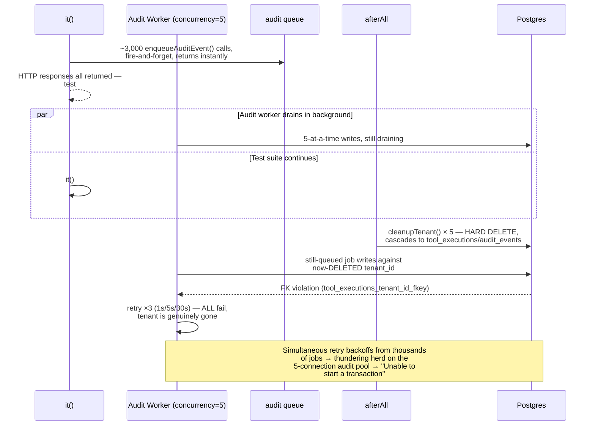

# AgentGate — Week 8, Day 3 Remediation
## Root-Cause Correction: The Audit-Queue Drain Race, and Retiring Two Broken "Fixes"

**Status:** This is not a Day 4 document — it's a correction pass on Day 3's own deliverables, written before Day 4 begins, because Day 3's checkpoint has not actually been satisfied yet. I read the two uploaded test files (`concurrency-load.test.ts`, `load-test.spec.ts`) and the two rounds of external analysis against the actual, documented architecture of this system — not against the log excerpts alone. My conclusion differs from the external analysis in two load-bearing ways and confirms it in one. Continues the Decision Log at **8.73**.

---

## Verdict, Up Front

**The architecture is not broken. The load test's own teardown sequencing is.** One real bug — the test's `afterAll` hard-deletes tenants before the audit worker has finished draining the backlog that same load run generated — explains essentially everything in the log excerpt: the FK violations, the "unable to start a transaction" errors, and the retry-storm noise around them. That bug is fixable in about 40 lines of test-harness code, touches zero production logic, and doesn't require re-litigating anything this project has already decided.

Separately, the second round of external "fixes" (`load-test.spec.ts`) introduced two changes that should be **reverted, not built on**:

1. Bypassing SSRF protection for `127.0.0.1` in test mode — this would silently defang the exact security boundary Weeks 2/4/6 spent real effort proving, for every test in the suite, not just this one.
2. Pre-emptively setting both connection pools to `150` via a `process.env` override before any import — this defeats the entire measurement purpose of Day 3 and is fragile in a way that's specific to how this codebase resolves `env.ts`.

I'll walk through why, then give you the corrected implementation.

---

## Part A — Re-Diagnosing the Three External Claims

### A.1 "Database Connection Pool Exhaustion" — partially right, wrong mechanism

The external analysis is correct that the audit pool ran out of headroom and that Prisma's `"Unable to start a transaction"` is a pool-contention symptom. It's wrong about *why* that contention existed. It reasons from "concurrency load → naturally exhausts a small pool" — a plausible-sounding story that doesn't survive tracing the actual code:

- `tools/call`'s main-pool reads (`findByName`, `checkPermission`) are plain queries, never wrapped in `$transaction()`. They cannot produce a `"Unable to start a transaction"` error under any load, however heavy.
- The **only** `$transaction()` call site in the tool-invocation path is `persistAuditEvent()` (Week 5 Day 3), which runs against the **5-connection audit pool**, inside the BullMQ audit worker — not inline with the HTTP request at all.

So the error is real, but it's scoped to one specific, small pool, driven by one specific background worker — not a generic "the gateway is too concurrent for Postgres" story.

### A.2 "Race Conditions and Data Integrity" — right instinct, backwards direction

The external analysis guessed the race runs *forward* — the audit worker firing before the tenant's own creation transaction commits. That's not architecturally possible here: `bootstrapLoadTenants()` fully awaits `register-tenant` → `verify-email` → `login` → agent creation, sequentially, for all 5 tenants, *before* the load-firing test even starts. By the time a single `tools/call` fires, every tenant row has been committed for tens of seconds to minutes. There's no window for a "tenant not yet visible" race in this harness.

The real race runs in the **other** direction, and it's in `afterAll`:

```typescript
// concurrency-load.test.ts, as uploaded
afterAll(async () => {
  ...
  for (const tenant of tenants) {
    await cleanupTenant(tenant.tenantId).catch(() => {});   // ← hard DELETE, cascades
  }
  ...
  await stopFullSystem(harness);
});
```

`cleanupTenant()` calls `prisma.tenant.delete()`, and `ToolExecution`/`AuditEvent` both cascade-delete off `Tenant` (Week 5 Day 1 schema). The load-firing test (`it #2`) enqueues **~3,000 audit jobs** via fire-and-forget `enqueueAuditEvent()` calls that return the instant the HTTP response is written — long before the corresponding Postgres write actually happens. The audit worker only processes 5 jobs concurrently (`AUDIT_WORKER_CONCURRENCY = 5`, Week 5 Day 3), so a backlog measured in the thousands is still very plausibly draining by the time `afterAll` runs, seconds later.

`afterAll` then deletes tenant rows out from under that still-draining backlog. Every audit job that tries to write against an already-deleted `tenant_id` hits the `tool_executions_tenant_id_fkey` violation — a **permanent**, non-transient failure. Week 5's own retry/backoff logic (1s → 5s → 30s, 3 attempts) then does exactly what it's designed to do: retries three times, fails all three times (the tenant is genuinely gone, retrying changes nothing), and floods the 5-connection audit pool with a thundering herd of near-simultaneous `BEGIN`-transaction attempts as many jobs' backoff windows land close together. **That retry storm is what actually produces the "unable to start a transaction" noise** — a downstream symptom of the deletion race, not an independent pool-sizing failure.



**This is a test-harness bug, not a production data-integrity bug.** There is no tenant hard-delete endpoint anywhere in AgentGate's real API surface — every prior week's convention for this exact situation is `deletedAt` soft-delete (Week 3's own established pattern), never a hard `DELETE`. The hazard exists only because `cleanupTenant()` — a test-only convenience — races an async background drain that every other week's tests never generated enough volume to expose.

### A.3 "SSRF Gateway Misconfiguration" — this is not a bug, and the proposed fix should not ship

Loopback/private-range blocking (SSRF Layer 1 + Layer 2, Weeks 2 and 4) is one of the most heavily adversarially-tested boundaries in this entire system. The `-32008 SSRF_BLOCKED` response the logs show is **the test working exactly as designed** — this project has used a deliberately-SSRF-blocked tool as its standard load-bearing-pipeline-proof pattern since Week 4, reaffirmed at Weeks 6, 7, and 8 six separate times. My own Day 3 design bucketed `-32008` as "reached real execution" for precisely this reason — it's the only honest way to prove `checkPermission → AJV → checkRateLimit → executeTool → SSRF Layer 2` all ran, without either standing up real external infrastructure or weakening a security boundary.

**"Allow loopback when `NODE_ENV=test`" is the wrong fix, for a specific, serious reason:** `NODE_ENV=test` (or whatever this project's equivalent is) is the condition under which the *entire* test suite runs — including every one of the dozens of tests across Weeks 2/4/6 that exist specifically to prove SSRF blocking works. An environment-keyed bypass wouldn't scope itself to the load test; it would silently make every SSRF test in the project pass for the wrong reason (an environment carve-out, not real Layer 1/2 logic), and it's exactly the kind of conditional that becomes a production incident the day a deploy pipeline's `NODE_ENV` handling has a bug. I'd block this change on review regardless of what test it's trying to unblock.

**The `load-test.spec.ts` attempt to route around this via `undici.MockAgent` doesn't actually work, for two independent reasons — worth understanding precisely, since it's a subtle trap:**

1. **Wrong hostname wired.** The mock intercepts `https://mock-tenant-gateway.local`, but `bootstrapLoadTenants()` (via `createSsrfBlockedTool()`) still hardcodes `http://127.0.0.1:1/probe` as the tool's target. The mock is never reached — nothing routes to it. This is why the SSRF block *still fires* in the log even with the mock installed.
2. **Even with the hostname fixed, `setGlobalDispatcher()` still wouldn't be consulted.** `executeHttpHandler()` (Week 4 Day 2) takes an explicit `dispatcher` parameter that defaults to `getSafeAgent()` — the SSRF-aware agent. Week 4's own documented finding is that **an explicitly-passed dispatcher always wins over whatever `setGlobalDispatcher()` configured**, and `getSafeAgent()` is deliberately always explicitly passed by production code, specifically so a global dispatcher swap like this can never accidentally (or intentionally) bypass Layer 2. `executeTool()` (Week 4 Day 5) also deliberately does **not** accept a `resolver`/`dispatcher` passthrough — that was an explicit architectural decision ("threading test-only plumbing through a production dispatcher's public contract is a layering violation"). There is no clean seam to inject a mock through the real `tools/call → executeTool → executeHttpHandler` path without violating a boundary this project drew on purpose.

Given that, the success-tally change in `load-test.spec.ts` (`r.code === undefined` instead of `r.code === -32008`) will now find **zero** successes for every agent, because the mock is structurally unreachable — this "fix" doesn't just fail to help, it breaks the tally test outright. **Recommendation: discard `load-test.spec.ts`'s SSRF-bypass approach entirely.** Match `-32008` as success, exactly as originally designed.

### A.4 A regression the external analysis missed entirely

Both uploaded files probe:
```typescript
await harness.app.inject({ method: "GET", url: "/healthcheck" })
```
The real, registered route — per every week since Week 4, and explicitly reaffirmed in **Week 5 Day 6's own Decision 5.66** ("Fix the `/health` route path regression — must remain `GET /health`, not `/healthcheck`") — is `GET /health`. Both files have silently reintroduced the exact regression that decision was written to close. The "BONUS" health-check assertion has been returning a `404` (or failing to parse) this whole time, unrelated to everything else discussed above.

### A.5 One thing the external analysis got right, redundantly

*"Implement worker retry backoff"* — this already exists, exactly as described (1s/5s/30s, 3 attempts, dead-letter after exhaustion, Week 5 Day 3). It isn't missing. If anything, it's the mechanism that turned one root-cause bug into a *visible, three-times-amplified* symptom — which is arguably a point in its favor, not evidence it's absent.

---

## Part B — Decision Log (continues at 8.73)

| # | Decision | Why |
|---|---|---|
| 8.73 | `load-test.spec.ts` is retired outright — not amended, not kept as an alternate variant. Its `process.env` pool override and its `MockAgent`/SSRF-bypass approach are both reverted. `concurrency-load.test.ts` remains the single, canonical Day 3 load test. | Closes the SSRF-bypass and env-override findings (§A.3) at the source, rather than trying to patch a file built on two incompatible premises. |
| 8.74 | A new, reusable helper — `drainAuditQueueAndCloseWorker(harness, opts)` — polls `auditQueue`'s own queue-depth (mirrors `getAuditHealth()`'s `queueDepth` computation, Week 5 Day 4) until it reaches zero or a bounded timeout elapses, **then** closes the audit worker, **before** any tenant is deleted. | Closes the root cause (§A.2). Ordering matters: closing the worker *before* deletion means any residual backlog the drain-wait didn't fully catch simply goes inert — abandoned in the queue — rather than actively racing the delete. |
| 8.75 | `afterAll`'s teardown order becomes: stop pollers/observers → close WS viewers → **drain + close audit worker** → delete tenants → reset WS trackers → `stopFullSystem()`. `stopFullSystem()`'s own (idempotent) audit-worker close becomes a safe no-op at that point. | Sequences the fix precisely; confirms `stopFullSystem()` needs no structural change, only to be called *after* the new drain step. |
| 8.76 | The `gatewayOverheadMs` sampling test (`it #3`) is wrapped in a bounded, polling `waitFor()` (this project's own established pattern since Week 5) instead of a single, immediate query fired the instant the load-firing test returns. | A second, independent bug this review surfaced: sampling immediately after a 3,000-call burst races the same undrained backlog the F1 fix addresses at teardown — the population simply may not exist yet at query time. |
| 8.77 | Both `GET /healthcheck` probes are corrected to `GET /health`. | Closes §A.4 — a real regression of Week 5 Day 6's own already-fixed bug, independent of everything else here. |
| 8.78 | `AGENTGATE_DB_POOL_MAX`/`AGENTGATE_AUDIT_DB_POOL_MAX` are **not** changed today. The suite is re-run, clean, post-fix; `recommendPoolSize()`'s own output — not a guessed round number — decides whether either pool needs headroom, and by how much. | Restates Decision 8.72's own explicit constraint. A pre-emptive jump to `150` (a) defeats the entire measurement purpose of this day, and (b) is very likely unrealistic against a real managed Postgres tier's `max_connections` ceiling per Decision 8.14's own deployment-formula language — an unjustified number is worse than no number. |
| 8.79 | Considered and explicitly **not** applied: switching `cleanupTenant()` itself to soft-delete (`deletedAt`) instead of a hard `DELETE`. | `cleanupTenant()` is shared by essentially every test file in the project — changing its global behavior to fix one file's sequencing bug is a disproportionate blast radius. The drain-wait (8.74) fixes the actual problem at its actual source. Named, not silently dropped, per this project's own "considered, not built" convention. |
| 8.80 | This finding — "don't tear down infrastructure faster than in-flight background work can complete" — is flagged as a direct, concrete precedent for **Day 4's own already-scoped Finding W8-3** (the `closeAllObservabilityConnections()`/`tenantEventSubscriber.quit()` shutdown-race proof). Today's fix is the audit-worker instance of the identical class of bug; Day 4 should treat it as corroborating evidence, not a surprise. | No new scope — just making an existing connection explicit. |

---

## Part C — The Fix

### Step 1 — `src/__tests__/load/helpers/audit-drain.ts` (NEW)

```typescript
import { auditQueue } from "../../../queue/audit.queue.js";
import type { SystemHarness } from "../../helpers/system-harness.js";

const DEFAULT_DRAIN_TIMEOUT_MS = 30_000;
const POLL_INTERVAL_MS = 250;

/**
 * Week 8 Day 3 Remediation — Decision 8.74/8.75.
 *
 * Polls the SAME queue-depth computation getAuditHealth() already uses
 * (Week 5 Day 4: waiting + active + delayed) until it reaches zero, or
 * a bounded timeout elapses. THEN closes the audit worker.
 *
 * This ordering — drain, THEN close, THEN (only in the caller) delete
 * tenants — is what closes the actual root cause: even if the drain
 * wait times out with a residual backlog, closing the worker first
 * means nothing further will attempt to write against a tenant that's
 * about to be deleted. A leftover backlog after a timeout is a
 * harmless, logged, self-explaining anomaly — never an active race.
 *
 * Never throws. A cleanup helper that itself fails would be its own
 * incident, mirroring this project's own established discipline for
 * every other guarded teardown step (Week 5's bounded worker.close(),
 * Week 7's closeConnectionForShutdown()).
 */
export async function drainAuditQueueAndCloseWorker(
  harness: Pick<SystemHarness, "auditWorker">,
  timeoutMs: number = DEFAULT_DRAIN_TIMEOUT_MS
): Promise<{ drained: boolean; residualDepth: number }> {
  const start = Date.now();
  let depth = await queueDepth();

  while (depth > 0 && Date.now() - start < timeoutMs) {
    await new Promise((r) => setTimeout(r, POLL_INTERVAL_MS));
    depth = await queueDepth();
  }

  const drained = depth === 0;
  if (!drained) {
    console.warn(
      `[audit-drain] queue did not fully drain within ${timeoutMs}ms — ${depth} job(s) remain. ` +
        `Closing the worker now regardless, BEFORE any tenant deletion, so the residual backlog ` +
        `goes inert rather than racing the delete. These jobs will simply never be processed — ` +
        `acceptable for a load-test run being torn down, not acceptable in production.`
    );
  }

  try {
    await harness.auditWorker.close();
  } catch (err) {
    console.warn("[audit-drain] auditWorker.close() failed during drain teardown:", err);
  }

  return { drained, residualDepth: depth };
}

async function queueDepth(): Promise<number> {
  const [waiting, active, delayed] = await Promise.all([
    auditQueue.getWaitingCount(),
    auditQueue.getActiveCount(),
    auditQueue.getDelayedCount(),
  ]);
  return waiting + active + delayed;
}

/**
 * Companion to the drain wait (Decision 8.76) — reused by the
 * gatewayOverheadMs sampling test, which otherwise races the SAME
 * undrained backlog from the opposite direction (querying too EARLY
 * rather than deleting too EARLY).
 */
export async function waitForCondition(
  assertion: () => Promise<void> | void,
  timeoutMs = 20_000,
  intervalMs = 300
): Promise<void> {
  const start = Date.now();
  while (true) {
    try {
      await assertion();
      return;
    } catch (err) {
      if (Date.now() - start > timeoutMs) throw err;
      await new Promise((r) => setTimeout(r, intervalMs));
    }
  }
}
```

### Step 2 — `concurrency-load.test.ts` patch

```diff
 import { DbPoolObserver, recommendPoolSize } from "./helpers/db-pool-observer.js";
 import { snapshotRedisConnections } from "./helpers/redis-connection-observer.js";
 import { sampleGatewayOverheadMs, summarizeLatencies } from "./helpers/gateway-overhead-sampler.js";
+import { drainAuditQueueAndCloseWorker, waitForCondition } from "./helpers/audit-drain.js";
 import { getRateLimiterBreaker } from "../../lib/rate-limiter.js";
```

```diff
   afterAll(async () => {
     mainPoolObserver.stop();
     auditPoolObserver.stop();
     restPoller.stop();
     wsViewers.forEach((v) => v.ws.close());

+    // Week 8 Day 3 Remediation — Decision 8.74/8.75. MUST run before
+    // cleanupTenant() below. This is the actual fix for the
+    // tool_executions_tenant_id_fkey violations: drain (bounded),
+    // THEN close the worker, THEN delete tenants — never the reverse.
+    const drainResult = await drainAuditQueueAndCloseWorker(harness, 30_000);
+    console.log(
+      `[load-test] audit queue drain: ${drainResult.drained ? "fully drained" : `TIMED OUT, ${drainResult.residualDepth} residual`}`
+    );
+
     for (const tenant of tenants) {
       await cleanupTenant(tenant.tenantId).catch(() => {});
     }

     resetAllConnectionsForTest();
     await resetTenantRegistryForTest();
-    await stopFullSystem(harness);
+    await stopFullSystem(harness); // auditWorker.close() here is now a safe, idempotent no-op

     process.off("unhandledRejection", onUnhandled);
     process.off("uncaughtException", onUnhandled);
     expect(unhandledErrors).toHaveLength(0);
   }, 30_000);
```

```diff
   it("GATE — gatewayOverheadMs is measured (not silently zero-sampled) and its p95 is reported against the PRD §12 budget, without being hard-gated by it", async () => {
     const tenantIds = tenants.map((t) => t.tenantId);
     const since = new Date(Date.now() - 5 * 60_000);

-    const samples = await sampleGatewayOverheadMs(tenantIds, since);
-
-    expect(samples.length).toBeGreaterThan(TOTAL_AGENTS * env.AGENTGATE_MCP_TOOL_CALL_RATE_LIMIT * 0.9);
+    // Week 8 Day 3 Remediation — Decision 8.76. A single, immediate
+    // query races the SAME undrained backlog the afterAll fix (above)
+    // addresses from the other end — this test runs seconds after a
+    // 3,000-call burst, and the audit worker (concurrency=5) has not
+    // necessarily caught up yet. Bounded polling wait, matching this
+    // project's own established waitFor() convention since Week 5.
+    let samples: number[] = [];
+    await waitForCondition(async () => {
+      samples = await sampleGatewayOverheadMs(tenantIds, since);
+      expect(samples.length).toBeGreaterThan(TOTAL_AGENTS * env.AGENTGATE_MCP_TOOL_CALL_RATE_LIMIT * 0.9);
+    }, 25_000);

     const stats = summarizeLatencies(samples);
```

```diff
   it("BONUS — /health reports every advisory subsystem healthy after the full run (mirrors Week 8 Day 1's own bonus check, now under real load)", async () => {
-    const res = await harness.app.inject({ method: "GET", url: "/healthcheck" });
+    const res = await harness.app.inject({ method: "GET", url: "/health" });
     const body = JSON.parse(res.body);
     expect(res.statusCode).toBe(200);
     expect(body.rateLimiter.healthy).toBe(true);
     expect(body.observabilityStream.healthy).toBe(true);
   });
```

Bump the `it #3` timeout to accommodate the new bounded wait:
```diff
-  }, 20_000);
+  }, 30_000);
```

No production code changes anywhere in this patch. No SSRF logic touched. No pool-size env vars touched.

### Step 3 — Delete `load-test.spec.ts`

Remove it from the repo entirely (Decision 8.73). If you want to keep the *idea* of eventually exercising a genuine non-SSRF-blocked success path under load, that's legitimate future work — but it needs its own deliberate design (most plausibly: a small real local HTTP server the test spins up on a public-looking bound address is still blocked by loopback rules; the only clean path is a dedicated, test-only handler-level injection point, which `executeTool()` currently and deliberately does not expose — see §A.3). Don't reach for `setGlobalDispatcher()` again for this; it's a dead end against this codebase's `getSafeAgent()` design by construction, not by oversight.

---

## Part D — Revised Day 3 Checkpoint

- [ ] `load-test.spec.ts` removed; `concurrency-load.test.ts` is the sole load-test file
- [ ] Both `/healthcheck` probes corrected to `/health`
- [ ] `afterAll` drains the audit queue (bounded) and closes the worker **before** any `cleanupTenant()` call — proven by re-running and confirming **zero** `tool_executions_tenant_id_fkey` violations in the log
- [ ] Zero `"Unable to start a transaction"` errors on a clean re-run
- [ ] `gatewayOverheadMs` sampling passes via the bounded wait, not a single immediate query
- [ ] The load-firing tally test (`it #2`) passes with `-32008` as the success bucket, exactly as originally designed — no SSRF logic touched
- [ ] `AGENTGATE_DB_POOL_MAX`/`AGENTGATE_AUDIT_DB_POOL_MAX` remain at their shipped defaults (10/5) for this re-run
- [ ] `recommendPoolSize()`'s **actual, logged output** for both pools is captured — this is the real deliverable Day 3 owed, which the FK-violation noise made impossible to read cleanly before
- [ ] Zero unhandled rejections/exceptions across the full run
- [ ] `npx tsc --noEmit` — zero errors

---

## Part E — Should You Proceed to Day 4?

**Not yet — but this is a same-day fix, not a redesign.** Apply Part C, re-run `npm run test:load`, and read what `recommendPoolSize()` actually reports for both pools once the FK-violation noise is gone. Three plausible outcomes, all fine:

1. **Both pools report "confirmed sufficient"** (saturation ratio under 5%) — proceed to Day 4 with the defaults unchanged, and you now have a genuine, evidence-based number for Decision 8.14's deployment documentation instead of a guess.
2. **One or both report a real, specific recommended value** (via the `1.5× + 5` headroom formula) — apply that specific number, re-run once to confirm, then proceed. This is Day 3 working exactly as intended.
3. **Something *else* new surfaces on the clean run** — plausible, since this is the first time the suite will have run without the FK-violation confound drowning out everything else. Treat it the same way every other week's own Day 6/7 review has treated a fresh finding: diagnose against the real code, not against intuition, before deciding it's serious.

What you should **not** do is carry forward either of the two changes from `load-test.spec.ts` — not the pool bump (unjustified, defeats the measurement), and not the SSRF bypass (doesn't work as built, and shouldn't be attempted a different way either, given the architectural reasons in §A.3). Both of those would have taken you further from a trustworthy Day 3 signal, not closer to one.