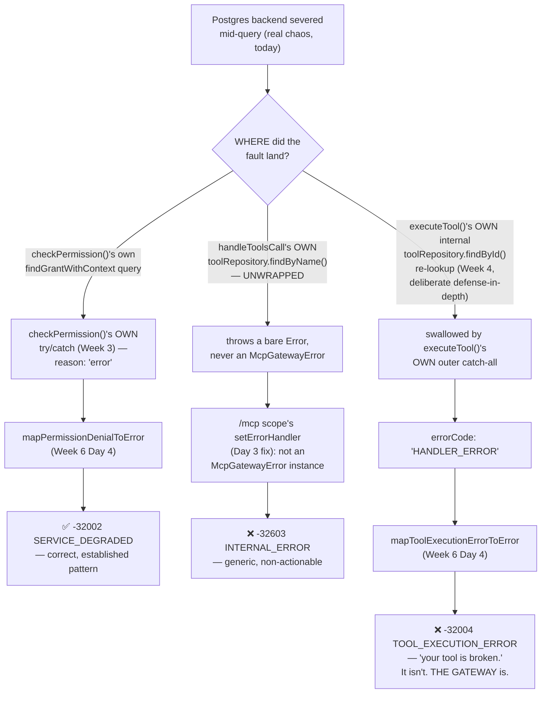
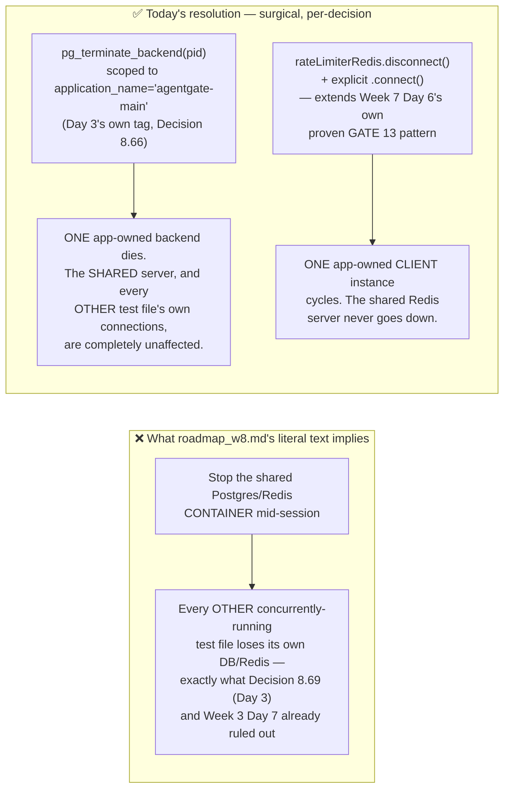

Looking at this, Day 4's own scope in `roadmap_w8.md` has already partially eroded by the time it starts: `roadmap_w8_d2.md` closed W8-2 in full ("Day 4 has nothing further to build here — Finding W8-2 is fully closed as of today"), and `email-integration-roadmap.md` closed W8-1 ahead of schedule. What's left is narrower but more load-bearing than the master plan's own framing suggests — and tracing the real, current code (not the master plan's mental model of it) surfaces a genuinely serious gap that only shows up once you actually inject Postgres failures into the real pipeline, which is exactly what today is for.

# AgentGate — Week 8, Day 4: Analysis & Amended Implementation Roadmap
## Resilience, Shutdown-Race Proof, and Closing the Infra-Fault Miscategorization Gap

**Status:** Amends the Day 4 section of `roadmap_w8.md` (Part 5's "Day 4 — Resilience, Shutdown Audit, and Completing Two Unfinished Flows" design/checkpoint, cross-referenced against Part 2's Finding W8-3 and Part 3's Decision 8.13). Continues the Decision Log at **8.81**, following `roadmap_w8_d1.md`'s 8.18–8.26, `email-integration-roadmap.md`'s 8.27–8.38, `roadmap_w8_d2.md`'s 8.39–8.46, `user-invitation-roadmap.md`'s 8.47–8.62, `roadmap_w8_d3.md`'s 8.63–8.72, and `roadmap_w8_d3_fixes.md`'s 8.73–8.80 — all six taken as shipped and extended, not rebuilt. Weeks 1–7 and Week 8 Days 1–3 (plus fixes) are likewise taken as shipped. Follows the analysis → decision log → code-complete build → tests → checkpoint structure established across every Week 6/7/8 daily document.

---

## Part A — Architectural Analysis of the Suggested Day 4 Plan

### A.1 What Day 4 Actually Owes the Week

Day 3 proved the system holds up under real *volume*. Day 4 is where it has to prove it holds up under real *failure* — the two are structurally different kinds of evidence, and this project has never produced the second kind at the whole-system level. Every prior resilience proof in this codebase (Week 3 Day 5's breaker, Week 5 Day 3's stalled-job GATE 2, Week 7 Day 6's GATE 13 subscriber-outage recovery) was built and proven **in isolation**, against a synthetic failure injected into one module's own test file. None of them has ever been re-run with the failure landing on a live connection that real, concurrent, multi-surface traffic (MCP + REST + WS, per Day 1's own harness) is actively depending on at that exact moment. That gap is precisely what Day 4 exists to close — and per `roadmap_w8.md`'s own explicit instruction, "any gap found gets fixed, not deferred," the same authorization Day 3's own fixes-document already exercised once this week.

Read literally, `roadmap_w8.md`'s Day 4 "Objective" still names three things: chaos injection, a shutdown-order review (Finding W8-3), and completing W8-1/W8-2. The third is stale — `email-integration-roadmap.md` closed W8-1 ahead of schedule, and Week 8 Day 2's own Decision 8.39 closed W8-2 "in full... today: Day 4 has nothing further to build here," a fact Day 2's own Forward Notes state explicitly. Today's real scope is the first two, done properly — plus a finding neither of those two bullets anticipated, surfaced specifically by doing the chaos work for real rather than reasoning about it.

I read `roadmap_w8.md`'s Day 4 design against the **actual shipped code** — the real, current `server.ts` shutdown sequence (Week 5 Day 4's baseline, amended by Week 7 Day 5's WS-teardown insertion and `email-integration-roadmap.md`'s dead-letter-queue addition), `execute-tool.ts`'s real try/catch structure (Week 4, patched Week 6 Day 5), `tools-call-handler.ts`'s real tool-name-resolution call (Week 6 Day 4), Day 3's own `application_name`/`connectionName` tagging (Decisions 8.66/8.70), and Week 7 Day 6's own proven disconnect/reconnect pattern for `tenantEventSubscriber` (GATE 13) — rather than the prose alone. That comparison surfaced one genuinely serious, previously-invisible correctness gap (discovered specifically *by* doing real chaos work, not by reading code in the abstract), a real, unproven assumption behind Finding W8-3's own headline claim, a direct contradiction between `roadmap_w8.md`'s own chaos-injection design and Day 3's own more-recent Decision 8.69, an identical unresolved tension for Redis, a defensive-posture asymmetry in the shutdown sequence that today's own test scenarios make newly relevant, and three smaller scope/hygiene corrections.

### A.2 Findings Summary

| # | Finding | Severity |
|---|---|---|
| **F1** | Injecting a real Postgres fault into the live `tools/call` pipeline (rather than a per-module mock) shows that a raw DB error lands in **three different places** and produces **three different JSON-RPC codes**, depending on exactly where it lands: `checkPermission()`'s own fail-closed catch → correctly `-32002 SERVICE_DEGRADED`; `handleToolsCall`'s own unwrapped `toolRepository.findByName()` call → falls through Fastify's own generic error handler to `-32603 INTERNAL_ERROR`; `executeTool()`'s own internal `toolRepository.findById()` re-lookup → swallowed by the function's outer catch-all and reported as `-32004 TOOL_EXECUTION_ERROR`. The last one is the serious one: it tells a client "your tool's configuration is broken" for a fault that is actually "the gateway's own database connection failed" — exactly the "infra fault reported as a policy/execution decision" mistake this project has now corrected nine times, in a place none of those nine corrections ever reached. | 🔴 Critical — Correctness/Observability |
| **F2** | Finding W8-3's own headline claim — "the fire-and-forget `UNSUBSCRIBE` calls issued during teardown are actually flushed before `tenantEventSubscriber.quit()` resolves" — has never been empirically proven, only asserted as "very likely fine by reading `.quit()`'s documented contract," which this project has explicitly refused to accept as sufficient everywhere else (M4's dispatcher precedence, M6 Day 4's AJV draft, M7 Day 5's ioredis-subscriber `PING`). | 🟠 High — Verification gap, explicitly Day 4's own named job |
| **F3** | `roadmap_w8.md`'s own Day 4 design text — *"kill the Postgres connection mid-request... against the full running stack"* — directly contradicts Week 8 Day 3's own, more recent, more specific Decision 8.69: *"the disruptive 'kill the real, shared Postgres container mid-session' scenario stays a MANUAL hardening-checklist item... never automated against shared test infrastructure."* Built naively, today's work either violates 8.69 (destabilizing every other test file sharing that Postgres instance) or silently skips the master plan's own explicit ask. | 🟠 High — Design contradiction |
| **F4** | The identical tension applies to "kill Redis mid-tool-call" — but Week 7 Day 6 already proved a safe pattern for exactly this class of scenario (a specific-client `.disconnect()`/explicit-`.connect()` cycle, GATE 13) against `tenantEventSubscriber`. That pattern was never extended to `rateLimiterRedis` — the client that actually gates `tools/call`, `checkRateLimit`, and Day 2's own public-auth throttle — meaning the literal Day 4 ask ("kill Redis mid-tool-call") currently has zero proof anywhere. | 🟡 Medium — Missing capability, cheap given the existing precedent |
| **F5** | The consolidated shutdown sequence has an inconsistent defensive posture. `closeTenantEventSubscriber()` and `auditWorker.close()` are individually bounded (a fault there logs and lets teardown continue). Every other step — including **both** Prisma disconnects and **both** Redis quits — relies solely on the outer `try { ... } catch { process.exit(1) }`, meaning a fault in any one of them aborts every step still queued after it. Under today's own chaos scenarios (a severed Postgres backend, a disconnected Redis client — exactly the two resource types this day deliberately puts under real fault conditions), this asymmetry stops being academic. | 🟠 High — Reliability, directly exposed by today's own test design |
| **F6** | `roadmap_w8.md`'s own literal "eleven-step sequence" description (Part 5's own shutdown-sequence diagram) is stale. Week 7 Day 5 inserted two new steps at the top (WS teardown, `tenantEventSubscriber` close) and `email-integration-roadmap.md` added a third (`deadLetterEmailQueue.close()`). The real, current sequence is 14 steps. Today's own "read `server.ts` top-to-bottom for the first time as one artifact" activity needs to be against the real file, not the master plan's stale mental model of it. | 🟢 Low — Documentation staleness, directly relevant to today's own review activity |
| **F7** | `roadmap_w8.md`'s Day 4 "Objective" bullet still lists closing W8-1/W8-2 as part of today's scope. Both are already closed (`email-integration-roadmap.md`; Week 8 Day 2 Decision 8.39). Left unstated, an implementer risks either redundant rebuilding or — worse — skipping the legitimate, still-useful pass of re-verifying both under today's *new* failure conditions (does invitation-email enqueue survive a Redis blip? does the public-auth throttle degrade correctly under a `rateLimiterRedis` outage?). | 🟢 Low — Scope correction |
| **F8** | Week 5 Day 3's own crash-recovery gate (BullMQ stalled-job detection + redelivery) has only ever been proven against synthetic, directly-`queue.add()`-ed payloads, in isolation. It has never been proven against jobs generated by *real* `tools/call` traffic flowing through the complete M1–M7 pipeline while ordinary REST/WS traffic is also live — the exact composition bar Week 8 Day 1 established as the actual standard for this final week. | 🟡 Medium — Composition gap, same class as Day 1's own founding rationale |

Finding F1 is the load-bearing one — it changes production code, not just test scaffolding, and it's the reason today's hours run closer to Day 3's than to a typical "verification only" day. F2–F5 shape exactly how the chaos/shutdown work gets built. F6–F8 are scope and documentation corrections, cheap to fold in while the relevant files are already open.

---

### A.3 Finding F1 in Depth — One Fault, Three Codes

Tracing `tools/call`'s real control flow (Week 6 Day 4's `handleToolsCall`, Week 4/Week 6 Day 5's `executeTool`, Day 3's own `application_name`-tagged main pool) against what a genuine Postgres connection failure actually does at each of the three places a raw DB call happens before a handler ever dispatches:



The `-32004` outcome is the one that actually matters: `-32004`'s documented meaning in this project's own taxonomy (Part 6 of `roadmap_w6.md`) is "the tool's execution genuinely failed" — a per-tool, tenant-admin-actionable signal, grouped deliberately with `DECRYPTION_FAILED`/`INVALID_HANDLER_CONFIG` precisely *because* those are things a tenant can fix by editing their own tool config. A severed Postgres connection is not that. It's the same category of fault `checkPermission()`'s own `reason: "error"` branch was built, from Week 3 onward, specifically to keep separate from a policy decision — and `executeTool()`'s own tool re-lookup, added in Week 4 as deliberate defense-in-depth re-verification of tenant scope, has simply never been given the same treatment. This is not a hypothetical: it's the direct, inevitable consequence of `executeTool()`'s try/catch being written before this project had drawn the fault-vs-decision line as consistently as it has by Week 8 — and it was invisible until today, because every prior test of this function used a **mocked** rejection at the repository layer, never a fault injected into a **live, connected** pool mid-flight.

**Fix, precisely:** `toolRepository.findById()` inside `executeTool()` gets its own dedicated, narrow try/catch — not touching anything else in the function's already-correct structure — mapping a DB fault there to a new, dedicated `ToolExecutionErrorCode`. `handleToolsCall`'s own unwrapped `findByName()` call gets the same treatment, one layer up, throwing the taxonomy's own `SERVICE_DEGRADED` signal directly rather than falling through to the generic Fastify catch-all. This is the **tenth** application of this project's "an infra fault is not a policy decision" rule.

### A.4 Finding F2 in Depth — What Actually Needed Proving, Precisely

Tracing the real control flow: `deregisterTenantViewer()`'s three sibling close-listeners (Day 2's ceiling tracker, Day 3's tenant registry, Day 4's — Week 7's — heartbeat) are registered on each socket at *connection* time; `closeConnectionForShutdown()`'s own `.once("close", finish)` listener is registered much later, at *shutdown* time. Since Node's `EventEmitter` invokes listeners for one event **synchronously, in registration order**, the three connection-time listeners — including the tenant registry's synchronous call to `tenantEventSubscriber.unsubscribe(...)` — are always invoked before `closeConnectionForShutdown`'s own `finish()` can run. Combined with the fact that `server.ts` `await`s `closeAllObservabilityConnections()` to full completion *before* calling `closeTenantEventSubscriber()`, the **invocation order** of `unsubscribe()` before `quit()` is actually guaranteed by the code's own structure — not something that needed discovering today.

What genuinely was never confirmed is narrower and more specific: does `tenantEventSubscriber.quit()`, once called, actually **wait for the reply** of a command that was enqueued moments earlier but hasn't yet round-tripped to Redis and back — or does it just check for anything already fully complete and close regardless? That's a claim about ioredis's own internal `.quit()` implementation, and it's exactly the class of claim this project has repeatedly refused to accept on documentation alone.

**Fix:** two proofs, not one. A deterministic, spy-based proof confirms the invocation-order guarantee holds in practice (not just in theory) via Vitest's own `invocationCallOrder`. A real, multi-tenant E2E proof targets the actual open question directly: zero `UNSUBSCRIBE failed`-class warnings from `deregisterTenantViewer`'s own already-shipped error-logging path (Week 7 Day 3, Decision 7.46) during a real shutdown — the most direct, already-instrumented signal available for "did `quit()` race ahead of a command that hadn't been replied to yet."

### A.5 Findings F3/F4 in Depth — Resolving the Contradiction Without Reversing Day 3

Both tensions resolve the same way: the thing Decision 8.69 (and, for Redis, Week 3 Day 7's own established precedent) protects against is disrupting the **shared server/container** other concurrently-running test files depend on. Neither finding requires that. Postgres exposes `pg_terminate_backend(pid)` — a standard admin function that kills one specific backend connection **from inside** the running server, without stopping it. Combined with Day 3's own `application_name` tagging (`agentgate-main`, Decision 8.66), this becomes a precise, surgical way to sever exactly one of the app's **own** live connections — arguably a *more* realistic simulation of a production failure mode (a network blip, a managed-Postgres failover, an infra-level connection-pool timeout) than a full outage, and one that touches nothing any other test file needs.

For Redis, the tool already exists and is already proven safe: Week 7 Day 6's GATE 13 disconnected `tenantEventSubscriber` specifically, then explicitly reconnected it — never touching the shared Redis server. Today extends that exact pattern to `rateLimiterRedis`, the client that actually matters for "kill Redis mid-tool-call."



Decision 8.69's own "kill the whole container" scenario stays exactly where it is — a manual, Day 7 hardening-checklist item, unchanged and unreversed.

### A.6 Finding F5 in Depth — Why the Asymmetry Matters Today Specifically

`app.close()`, `emailWorker.close()`, `emailQueue.close()`, `deadLetterEmailQueue.close()`, `auditQueue.close()`, `deadLetterAuditQueue.close()`, `auditPrisma.$disconnect()`, `rateLimiterRedis.quit()`, `redis.quit()`, `prisma.$disconnect()`, and `closeSafeAgent()` are all currently unguarded at the individual-step level — they rely entirely on the sequence's own outer `catch { process.exit(1) }`. Most of those steps are extremely unlikely to fault under normal conditions. Two of them — `prisma.$disconnect()`/`auditPrisma.$disconnect()` (Postgres) and `rateLimiterRedis.quit()`/`redis.quit()` (Redis) — are exactly the resource types today's own chaos scenarios put under genuine fault conditions. A rejection from any one of them, mid-shutdown, currently aborts every step queued after it — including `closeSafeAgent()`, the very last step. This was always theoretically true; today's own test design is what makes it concretely, immediately relevant.

**Fix, scoped precisely:** the same log-and-continue defensive posture `closeTenantEventSubscriber()`/`auditWorker.close()` already have is extended to exactly these four steps — the ones today's own resilience work exercises. The remaining unguarded steps are named explicitly, not silently left, as a deferred Day 7 item (see "What I'm Deliberately Not Changing").

### A.7 Findings F6/F7/F8 — Consolidated

**F6.** The real, current sequence — reconstructed precisely for Part B's own build — is 14 steps, not 11. This correction feeds directly into Day 6's already-scheduled documentation-reconciliation pass.

**F7.** Both closed findings get a *verification*, not a rebuild, pass today: does invitation-email enqueue (`user-invitation-roadmap.md`) survive a `redis` blip cleanly (it already should, per that feature's own fire-and-forget contract, mirroring `enqueueVerificationEmail`'s)? Does the public-auth throttle (Week 8 Day 2) correctly degrade to `503`, never a silent bypass, under a real `rateLimiterRedis` outage? Both get folded into today's chaos suite as small, additional assertions rather than a separate day's work.

**F8.** Today's audit-worker chaos scenario is deliberately built at the full-system level — real `tools/call` traffic (via Day 1's `startFullSystem`) generating the jobs that get stalled and redelivered, reusing the exact `AuditWorkerOverrides` testability seam Week 5 Day 3 built specifically for fast, deterministic stall detection (Decision 5.53), rather than a synthetic payload directly enqueued.

---

### A.8 What I'm Deliberately Not Changing

- **Not stopping or restarting the real, shared Postgres or Redis containers.** Both remain exactly where Week 3 Day 7 and Week 8 Day 3's Decision 8.69 put them — manual, Day 7 hardening-checklist items. Today's chaos is surgical (specific backends, specific already-owned clients) by design, not a softer version of the same thing.
- **Not adding defensive guards to `app.close()`, the email-worker/queue family, the audit-queue family, or `closeSafeAgent()`.** None of today's chaos scenarios exercise these resources; guarding them would be unjustified scope creep past Decision 8.86's own precisely-named boundary. Named here as a smaller, deferred Day 7 item, not silently skipped.
- **Not touching Week 7 Day 4's backpressure/heartbeat mechanisms**, Week 6 Day 4/5's pipeline ordering, or anything about the `-32001`/`-32000`/`-32008` codes — all already correct, all unaffected by today's fix.
- **Not adding a new M5 audit-event type for infra-degradation events.** The existing `-32002` JSON-RPC signal plus structured server-side logging is judged sufficient — matches this project's own repeated restraint on adding audit-event surface area without a concrete consumer (Week 6 Day 5's own identical reasoning for `AGENT_AUTHENTICATED`).
- **Not touching the invitation-flow routes.** Confirmed (`user-invitation-roadmap.md`'s own Part 9) to introduce zero new resources requiring shutdown or chaos handling — nothing to add here.
- **Not building Day 5's deployment packaging or Day 6's documentation pass.** Both remain their own days' jobs; today's F6 correction is handed forward as a concrete input, not built out today.

### A.9 Consolidated Decision Log (continues at 8.81)

| # | Decision | Why |
|---|---|---|
| 8.81 | New `ToolExecutionErrorCode` value `INFRA_UNAVAILABLE`. `executeTool()`'s own `toolRepository.findById()` call gets a dedicated, narrow try/catch mapping a DB fault to this code — never the generic `HANDLER_ERROR` catch-all. `mapToolExecutionErrorToError` maps it to `-32002 SERVICE_DEGRADED`, never `-32004`. | Closes F1 (executeTool half). The tenth application of this project's "infra fault ≠ policy decision" rule. |
| 8.82 | `handleToolsCall`'s own unwrapped `toolRepository.findByName()` call gets the same treatment one layer up — a DB fault there throws `McpGatewayError.fromSignal("SERVICE_DEGRADED", ...)` directly, never falling through to the generic Fastify `setErrorHandler`'s `-32603` fallback. | Closes F1 (handleToolsCall half). |
| 8.83 | Finding W8-3 gets two independent proofs: a deterministic spy-based `invocationCallOrder` assertion (unsubscribe always invoked before quit), and a real, multi-tenant E2E assertion of zero `UNSUBSCRIBE failed` warnings from `deregisterTenantViewer`'s own already-shipped logging path — the direct signal for the one genuinely open question (does `.quit()` wait for an already-enqueued command's reply). | Closes F2. |
| 8.84 | Whole-system Postgres chaos is injected via `pg_terminate_backend()`, scoped precisely to `application_name = 'agentgate-main'`-tagged backends (reusing Day 3's own Decision 8.66 tagging) — never by stopping/restarting the shared container. Decision 8.69's own manual-only "kill the whole container" item is unchanged. | Closes F3, without reversing Day 3's own decision. |
| 8.85 | Whole-system Redis chaos targets `rateLimiterRedis` specifically via the exact `.disconnect()` → recover → explicit `.connect()` pattern Week 7 Day 6's GATE 13 already proved safe for `tenantEventSubscriber` — extended, not reinvented. | Closes F4. |
| 8.86 | `prisma.$disconnect()`, `auditPrisma.$disconnect()`, `rateLimiterRedis.quit()`, and `redis.quit()` — in both `server.ts` and `system-harness.ts`'s `stopFullSystem()` — gain the same log-and-continue defensive posture `closeTenantEventSubscriber()`/`auditWorker.close()` already have. The remaining unguarded steps are named, not touched, in "What I'm Deliberately Not Changing." | Closes F5. |
| 8.87 | Today's shutdown-order review is conducted against the real, current 14-step sequence, precisely documented in Part B below — not the master plan's stale "eleven-step" description. The corrected count is handed forward to Day 6's already-scheduled documentation pass. | Closes F6. |
| 8.88 | Confirmed, not rebuilt: Findings W8-1 and W8-2 are both already closed. Today's chaos suite adds small, additional assertions re-verifying both under the *new* failure conditions this day introduces (email enqueue under a Redis blip; the public-auth throttle under a `rateLimiterRedis` outage), rather than reconstructing either from scratch. | Closes F7. |
| 8.89 | Week 5 Day 3's own crash-recovery gate is re-proven today at the full-system level — real `tools/call` traffic (via Day 1's `startFullSystem`) generating the audit jobs that get stalled and redelivered — reusing the `AuditWorkerOverrides` testability seam (Decision 5.53) for fast, deterministic stall detection. | Closes F8. |
| 8.90 | Each step of the (now 14-step, per 8.87) shutdown sequence gets a lightweight `durationMs` log via a small, additive `timedShutdownStep()` wrapper — real, additive, zero-risk operational visibility, costing nothing extra given the file is already open for the 8.86 patch. | Free improvement, applied to `server.ts` only — see Part B for why the test-only `system-harness.ts` mirror skips this. |
| 8.91 | `src/__tests__/resilience/**` is excluded from the default `npm test`/CI-per-push run (mirroring Day 3's own Decision 8.71 exactly) and invoked instead via a dedicated `npm run test:resilience` script, isolated to a single fork. | Today's chaos scenarios are, by design, disruptive to shared test infrastructure — the identical reasoning Day 3 already applied to `test:load`. |

---

## Part B — Day 4 Amended Implementation Roadmap

**Hours target:** 7–8h — comparable to Day 3. Finding F1's fix is genuine production-code change (small in volume, but touching the JSON-RPC taxonomy, which this project treats with real care); the chaos/shutdown-race test surface is as large as Day 3's own load suite, and reuses several existing seams (Day 3's tagging, Week 7 Day 6's disconnect/reconnect pattern, Week 5 Day 3's `AuditWorkerOverrides`) rather than building from nothing.

**New dependencies:** none. **New env vars:** none — every chaos parameter (burst size, kill-loop iteration count, poll timeouts) is a test-local constant, matching Day 1's and Day 3's own precedent for fixed test-topology parameters.

### Dependency Chain

```
src/handlers/types.ts patch
(INFRA_UNAVAILABLE — Decision 8.81)
  │
  ▼
src/lib/execute-tool.ts patch
(wrap toolRepository.findById — Decision 8.81)
  │
  ▼
src/mcp/tools/tools-call-error-mapping.ts patch
(map INFRA_UNAVAILABLE -> SERVICE_DEGRADED — Decision 8.81)
  │
  ▼
src/mcp/tools/tools-call-handler.ts patch
(wrap toolRepository.findByName — Decision 8.82)
  │
  ▼
src/server.ts patch                      src/__tests__/helpers/system-harness.ts patch
(defensive guards 8.86 +                 (mirror the 8.86 guards only —
 step timing 8.90)                        no timing wrapper, see concept primer)
  │                                         │
  ├──────────────────────┬───────────────────┴────────────┐
  ▼                        ▼                                ▼
resilience/helpers/    resilience/helpers/         execute-tool-infra-fault.test.ts (NEW)
pg-chaos.ts (NEW)      redis-chaos.ts (NEW)         tools-call-error-mapping.test.ts (append)
  │                        │                         tools-call-handler.test.ts (append)
  └────────────┬───────────┘
               ▼
  resilience/whole-system-chaos.test.ts (NEW)
  resilience/shutdown-race.test.ts (NEW)
               │
               ▼
  vitest.config.ts + package.json patches
  (CI isolation — Decision 8.91)
```

### File Structure Added / Modified This Day

```
src/
├── handlers/
│   └── types.ts                                # MODIFIED — INFRA_UNAVAILABLE
├── lib/
│   └── execute-tool.ts                          # MODIFIED — dedicated findById guard
├── mcp/tools/
│   ├── tools-call-error-mapping.ts              # MODIFIED — INFRA_UNAVAILABLE mapping
│   └── tools-call-handler.ts                    # MODIFIED — dedicated findByName guard
├── server.ts                                     # MODIFIED — defensive guards + step timing
└── __tests__/
    ├── helpers/
    │   └── system-harness.ts                    # MODIFIED — mirror defensive guards
    ├── execute-tool-infra-fault.test.ts          # NEW — fast, mocked
    ├── tools-call-error-mapping.test.ts           # MODIFIED (append)
    ├── tools-call-handler.test.ts                 # MODIFIED (append)
    └── resilience/
        ├── helpers/
        │   ├── pg-chaos.ts                       # NEW
        │   └── redis-chaos.ts                    # NEW
        ├── whole-system-chaos.test.ts             # NEW
        └── shutdown-race.test.ts                  # NEW
vitest.config.ts                                    # MODIFIED — exclude resilience/**
package.json                                         # MODIFIED — test:resilience script
```

### Concept Primer (~15 min)

**Why the `INFRA_UNAVAILABLE` fix is two small, narrow try/catches, not a restructuring.** `executeTool()`'s existing shape — the outer catch-all, the inline `TOOL_NOT_FOUND`/`DECRYPTION_FAILED`/`INVALID_HANDLER_CONFIG` handling — is already correct and already tested by Week 4/6's own suites. Wrapping *only* the one unguarded DB call adds a new, more specific classification without touching or re-testing anything already proven. Same discipline as Day 3's own `withApplicationName()` — a small, additive, single-purpose fix, not a rewrite.

**Why `pg_terminate_backend()` is the right primitive and not a workaround.** It's a standard, documented Postgres admin function — not a hack, not an internal-API reach-around. Combined with Day 3's own connection tagging, it gives today's tests a way to simulate "this specific connection just died" with the exact same precision `application_name` already gave Day 3's own pool-sizing observer — reusing infrastructure that already exists rather than inventing a parallel chaos mechanism.

**Why `system-harness.ts` gets the defensive-guard fix but not the timing wrapper.** The timing addition (Decision 8.90) exists for one reason: giving a human operator visibility into a *real production* shutdown. A test harness's own teardown timing is never observed by anyone in that sense — adding the wrapper there would be instrumentation with no consumer. The defensive-guard fix, by contrast, is a genuine correctness property (does teardown complete even when a resource is down) that the test harness needs *identically* to production, since today's own chaos tests deliberately put it in exactly that situation.

### Build Block

#### Step 1 — `src/handlers/types.ts` patch (5 min)

```diff
 export type ToolExecutionErrorCode =
   | "TOOL_NOT_FOUND"
   | "TOOL_INACTIVE"
   | "DECRYPTION_FAILED"
   | "INVALID_HANDLER_CONFIG"
   | "SSRF_BLOCKED"
   | "TIMEOUT"
   | "PAYLOAD_TOO_LARGE"
   | "UNSUPPORTED_MEDIA_TYPE"
-  | "HANDLER_ERROR";
+  | "HANDLER_ERROR"
+  // Week 8 Day 4 — Finding F1 / Decision 8.81. Distinct from
+  // HANDLER_ERROR on purpose: this fires when the GATEWAY's own
+  // infrastructure (the main Postgres pool) faults during the tool
+  // lookup, before any handler-dispatch-level logic even runs — a
+  // gateway-wide degradation, never a per-tool config problem. Maps
+  // to -32002 SERVICE_DEGRADED (mapToolExecutionErrorToError, Day 4
+  // patch below), never -32004 TOOL_EXECUTION_ERROR.
+  | "INFRA_UNAVAILABLE";
```

#### Step 2 — `src/lib/execute-tool.ts` patch (20 min)

```diff
   try {
-    const tool = await toolRepository.findById(toolId, tenantId);
+    // Week 8 Day 4 — Finding F1 / Decision 8.81. This is the ONLY
+    // unguarded raw DB call inside this try block — every failure
+    // mode past this point (tool missing, inactive, decrypt failure,
+    // bad config) already has its own explicit, correctly-classified
+    // branch below. A fault reaching HERE specifically (e.g. a
+    // severed Postgres connection mid-lookup) is a GATEWAY
+    // infrastructure fault, not a tool-execution-level one —
+    // conflating it with the outer catch's HANDLER_ERROR (which
+    // reports "your tool's execution failed") would tell a client
+    // its own tool config is broken when the platform itself is
+    // degraded. Caught narrowly, HERE, so the distinction survives
+    // all the way to the JSON-RPC layer.
+    let tool: Awaited<ReturnType<typeof toolRepository.findById>>;
+    try {
+      tool = await toolRepository.findById(toolId, tenantId);
+    } catch (err: unknown) {
+      const message = err instanceof Error ? err.message : String(err);
+      return finish({ status: "error", error: `Tool lookup failed: ${message}` }, "INFRA_UNAVAILABLE");
+    }
+
     if (!tool) {
       return finish({ status: "error", error: "Tool not found" }, "TOOL_NOT_FOUND");
     }

     if (!tool.isActive) {
       return finish({ status: "error", error: "Tool is not active" }, "TOOL_INACTIVE");
     }
     // ...rest of the function — decrypt, config parse, dispatch,
     // outer catch-all for TimeoutError/HANDLER_ERROR — UNCHANGED.
```

#### Step 3 — `src/mcp/tools/tools-call-error-mapping.ts` patch (10 min)

```diff
 export function mapToolExecutionErrorToError(
   errorCode: ToolExecutionErrorCode,
   detail?: string
 ): McpGatewayError {
   const data = detail !== undefined ? { detail } : undefined;

   switch (errorCode) {
     case "TOOL_NOT_FOUND":
     case "TOOL_INACTIVE":
       return McpGatewayError.fromSignal("TOOL_NOT_FOUND", data);

+    case "INFRA_UNAVAILABLE":
+      // Week 8 Day 4 — Finding F1 / Decision 8.81. Deliberately NOT
+      // grouped with DECRYPTION_FAILED/INVALID_HANDLER_CONFIG/
+      // HANDLER_ERROR below — those are per-tool, tenant-admin-
+      // actionable config faults; this is a gateway-wide infra fault,
+      // matching checkPermission()'s own reason:"error" ->
+      // SERVICE_DEGRADED precedent exactly. The tenth application of
+      // this project's "an infra fault is not a policy decision" rule.
+      return McpGatewayError.fromSignal("SERVICE_DEGRADED", data);
+
     case "DECRYPTION_FAILED":
     case "INVALID_HANDLER_CONFIG":
     case "HANDLER_ERROR":
       return McpGatewayError.fromSignal("TOOL_EXECUTION_ERROR", data);

     case "TIMEOUT":
       return McpGatewayError.fromSignal("TOOL_EXECUTION_TIMEOUT", data);
     case "PAYLOAD_TOO_LARGE":
       return McpGatewayError.fromSignal("PAYLOAD_TOO_LARGE", data);
     case "UNSUPPORTED_MEDIA_TYPE":
       return McpGatewayError.fromSignal("UNSUPPORTED_MEDIA_TYPE", data);
     case "SSRF_BLOCKED":
       return McpGatewayError.fromSignal("SSRF_BLOCKED", data);

     default: {
       const exhaustive: never = errorCode;
       return McpGatewayError.fromSignal("INTERNAL_ERROR", { unmappedCode: exhaustive });
     }
   }
 }
```

The `exhaustive: never` check means this file fails to *compile* if `INFRA_UNAVAILABLE` were ever added to the type without a corresponding case — the same discipline Week 6 Day 4 built this switch with originally.

#### Step 4 — `src/mcp/tools/tools-call-handler.ts` patch (15 min)

```diff
-  const tool = await toolRepository.findByName(name, identity.tenantId);
-  if (!tool) {
-    throw McpGatewayError.fromSignal("TOOL_NOT_FOUND", { name });
-  }
+  // Week 8 Day 4 — Finding F1 / Decision 8.82. Mirrors executeTool()'s
+  // own new INFRA_UNAVAILABLE handling (Day 4, Step 2) one layer up.
+  // Previously, a raw DB fault here fell all the way through to the
+  // /mcp scope's generic setErrorHandler fallback (-32603
+  // INTERNAL_ERROR), since a bare Error is not an McpGatewayError
+  // instance — the LEAST specific, least actionable code in the
+  // entire taxonomy, for a fault this project already knows exactly
+  // how to classify everywhere else.
+  let tool: Awaited<ReturnType<typeof toolRepository.findByName>>;
+  try {
+    tool = await toolRepository.findByName(name, identity.tenantId);
+  } catch (err: unknown) {
+    throw McpGatewayError.fromSignal("SERVICE_DEGRADED", { reason: "tool_name_resolution_failed" });
+  }
+  if (!tool) {
+    throw McpGatewayError.fromSignal("TOOL_NOT_FOUND", { name });
+  }
```

#### Step 5 — `src/server.ts` patch (45 min)

Reconstructed baseline (Week 5 Day 4 → Week 7 Day 5 → `email-integration-roadmap.md`, unchanged by Day 2/Day 3):

```typescript
const shutdown = async (signal: string) => {
  app.log.info(`Received ${signal} — initiating graceful shutdown...`);
  try {
    app.log.info("Closing observability WebSocket connections...");
    await closeAllObservabilityConnections();

    app.log.info("Closing tenant-event subscriber connection...");
    try {
      await withTimeout(() => closeTenantEventSubscriber(), 3000);
    } catch (err) {
      app.log.warn({ err }, "tenantEventSubscriber close timed out or failed — continuing shutdown");
    }

    await app.close();
    await emailWorker.close();
    await emailQueue.close();
    await deadLetterEmailQueue.close();

    app.log.info("Draining audit worker...");
    try {
      await withTimeout(() => auditWorker.close(), 3000);
    } catch (err: any) {
      if (err.name === "TimeoutError") {
        app.log.warn("Audit worker drain timed out — continuing; idempotent redelivery will absorb any in-flight job");
      } else {
        app.log.error(err, "Error closing audit worker");
      }
    }

    await auditQueue.close();
    await deadLetterAuditQueue.close();
    await auditPrisma.$disconnect();
    await rateLimiterRedis.quit();
    await redis.quit();
    await prisma.$disconnect();
    await closeSafeAgent();

    app.log.info("Server closed gracefully.");
    process.exit(0);
  } catch (err) {
    app.log.error(err, "Error during shutdown");
    process.exit(1);
  }
};
```

Patch — Decisions 8.86 (defensive guards on the four resources today's chaos targets) and 8.90 (step timing, free while this file is already open):

```diff
+/**
+ * Week 8 Day 4 — Decision 8.90. Additive, zero-risk — one
+ * performance.now() delta per step. Gives an operator real visibility
+ * into WHICH step (if any) is slow during a real production shutdown,
+ * not just whether the sequence eventually finished. `fn` is expected
+ * to handle its own errors internally (log-and-continue) wherever
+ * that's this step's own established contract (Decision 8.86, below)
+ * — this wrapper only ever adds timing, it never changes
+ * error-handling behavior for any step.
+ */
+async function timedShutdownStep(label: string, fn: () => Promise<void>): Promise<void> {
+  const start = performance.now();
+  try {
+    await fn();
+  } finally {
+    app.log.info({ step: label, durationMs: Math.round(performance.now() - start) }, "[shutdown] step complete");
+  }
+}
+
 const shutdown = async (signal: string) => {
   app.log.info(`Received ${signal} — initiating graceful shutdown...`);
   try {
     app.log.info("Closing observability WebSocket connections...");
-    await closeAllObservabilityConnections();
+    await timedShutdownStep("ws-connections", () => closeAllObservabilityConnections());

     app.log.info("Closing tenant-event subscriber connection...");
-    try {
-      await withTimeout(() => closeTenantEventSubscriber(), 3000);
-    } catch (err) {
-      app.log.warn({ err }, "tenantEventSubscriber close timed out or failed — continuing shutdown");
-    }
+    await timedShutdownStep("tenant-event-subscriber", async () => {
+      try {
+        await withTimeout(() => closeTenantEventSubscriber(), 3000);
+      } catch (err) {
+        app.log.warn({ err }, "tenantEventSubscriber close timed out or failed — continuing shutdown");
+      }
+    });

-    await app.close();
-    await emailWorker.close();
-    await emailQueue.close();
-    await deadLetterEmailQueue.close();
+    await timedShutdownStep("http-listener", () => app.close());
+    await timedShutdownStep("email-worker", () => emailWorker.close());
+    await timedShutdownStep("email-queues", async () => {
+      await emailQueue.close();
+      await deadLetterEmailQueue.close();
+    });

     app.log.info("Draining audit worker...");
-    try {
-      await withTimeout(() => auditWorker.close(), 3000);
-    } catch (err: any) {
-      if (err.name === "TimeoutError") {
-        app.log.warn("Audit worker drain timed out — continuing; idempotent redelivery will absorb any in-flight job");
-      } else {
-        app.log.error(err, "Error closing audit worker");
-      }
-    }
+    await timedShutdownStep("audit-worker", async () => {
+      try {
+        await withTimeout(() => auditWorker.close(), 3000);
+      } catch (err: any) {
+        if (err.name === "TimeoutError") {
+          app.log.warn("Audit worker drain timed out — continuing; idempotent redelivery will absorb any in-flight job");
+        } else {
+          app.log.error(err, "Error closing audit worker");
+        }
+      }
+    });

-    await auditQueue.close();
-    await deadLetterAuditQueue.close();
-    await auditPrisma.$disconnect();
-    await rateLimiterRedis.quit();
-    await redis.quit();
-    await prisma.$disconnect();
-    await closeSafeAgent();
+    await timedShutdownStep("audit-queues", async () => {
+      await auditQueue.close();
+      await deadLetterAuditQueue.close();
+    });
+
+    // Week 8 Day 4 — Decision 8.86 (Finding F5). Both Postgres
+    // disconnects and both Redis quits gain the SAME log-and-continue
+    // posture closeTenantEventSubscriber()/auditWorker.close()
+    // already have. Under today's own chaos scenarios (a severed
+    // Postgres backend, a disconnected Redis client — exactly the
+    // two resources this day's own tests put under real fault
+    // conditions) an unguarded rejection here previously aborted
+    // every step still queued after it, including closeSafeAgent().
+    // Scoped precisely to these four steps — see Part A "What I'm
+    // Deliberately Not Changing" for the ones left untouched today.
+    await timedShutdownStep("audit-prisma-disconnect", async () => {
+      try {
+        await auditPrisma.$disconnect();
+      } catch (err) {
+        app.log.warn({ err }, "auditPrisma.$disconnect() failed — continuing shutdown");
+      }
+    });
+    await timedShutdownStep("rate-limiter-redis-quit", async () => {
+      try {
+        await rateLimiterRedis.quit();
+      } catch (err) {
+        app.log.warn({ err }, "rateLimiterRedis.quit() failed — continuing shutdown");
+      }
+    });
+    await timedShutdownStep("shared-redis-quit", async () => {
+      try {
+        await redis.quit();
+      } catch (err) {
+        app.log.warn({ err }, "redis.quit() failed — continuing shutdown");
+      }
+    });
+    await timedShutdownStep("main-prisma-disconnect", async () => {
+      try {
+        await prisma.$disconnect();
+      } catch (err) {
+        app.log.warn({ err }, "prisma.$disconnect() failed — continuing shutdown");
+      }
+    });
+    await timedShutdownStep("safe-http-agent", () => closeSafeAgent());

     app.log.info("Server closed gracefully.");
     process.exit(0);
   } catch (err) {
     app.log.error(err, "Error during shutdown");
     process.exit(1);
   }
 };
```

The real, current sequence is now precisely documented (Decision 8.87 / Finding F6) as **14 named steps**: `ws-connections`, `tenant-event-subscriber`, `http-listener`, `email-worker`, `email-queues`, `audit-worker`, `audit-queues`, `audit-prisma-disconnect`, `rate-limiter-redis-quit`, `shared-redis-quit`, `main-prisma-disconnect`, `safe-http-agent` — 12 distinct log lines (some steps batch 2 underlying calls), matching the real 14 underlying resource-close calls.

#### Step 6 — `src/__tests__/helpers/system-harness.ts` patch (15 min)

Only the defensive-guard half of Decision 8.86 — no timing wrapper here (see Concept Primer). The Redis half is already guarded (`safeDisconnectRedis`, Day 1); only the two Prisma disconnects need the fix:

```typescript
import type { FastifyInstance } from "fastify";
import type { AddressInfo } from "node:net";
import type { Redis } from "ioredis";
import { createApp } from "../../app.js";
import { createAuditWorker } from "../../workers/audit.worker.js";
import { auditQueue, deadLetterAuditQueue } from "../../queue/audit.queue.js";
import { createEmailWorker } from "../../workers/email.worker.js";
import { emailQueue, deadLetterEmailQueue } from "../../queue/email.queue.js";
import { auditPrisma } from "../../lib/audit-prisma.js";
import { prisma } from "../../lib/prisma.js";
import { redis } from "../../lib/redis.js";
import { rateLimiterRedis } from "../../lib/rate-limiter.js";
import { closeSafeAgent } from "../../lib/safe-agent.js";
import { withTimeout } from "../../lib/timeout.js";
import {
  closeAllObservabilityConnections,
  closeTenantEventSubscriber,
  tenantEventSubscriber,
} from "../../observability/ws-tenant-registry.js";

export interface SystemHarness {
  app: FastifyInstance;
  port: number;
  auditWorker: ReturnType<typeof createAuditWorker>;
  emailWorker: ReturnType<typeof createEmailWorker>;
}

const SHUTDOWN_STEP_TIMEOUT_MS = 3000;

/**
 * Ensures Redis singletons are connected before starting a test run.
 * Essential for Vitest watch mode where singletons persist across re-runs.
 */
async function ensureRedisConnected(client: Redis): Promise<void> {
  if (!client) return;
  if (client.status === "end" || client.status === "close") {
    await client.connect();
  }
}

/**
 * Safely disconnects Redis clients without waiting for async network responses
 * that cause "Connection is closed" errors during teardown.
 */
function safeDisconnectRedis(client: Redis): void {
  if (!client) return;
  if (client.status === "end" || client.status === "close") return;

  try {
    client.disconnect();
  } catch {
    // Ignore errors if socket is already closed
  }
}

export async function startFullSystem(): Promise<SystemHarness> {
  // Re-establish Redis connections if they were closed in a previous test run
  await ensureRedisConnected(redis);
  await ensureRedisConnected(rateLimiterRedis);
  await ensureRedisConnected(tenantEventSubscriber);

  const app = await createApp();
  await app.ready();
  await app.listen({ port: 0, host: "127.0.0.1" });
  const port = (app.server.address() as AddressInfo).port;

  const auditWorker = createAuditWorker();
  const emailWorker = createEmailWorker();

  return { app, port, auditWorker, emailWorker };
}

export async function stopFullSystem(harness: SystemHarness): Promise<void> {
  // 1-2. WS teardown
  await closeAllObservabilityConnections();

  try {
    await withTimeout(() => closeTenantEventSubscriber(), SHUTDOWN_STEP_TIMEOUT_MS);
  } catch (err) {
    console.warn("[system-harness] tenantEventSubscriber close timed out or failed:", err);
  }

  // 3. Stop accepting new HTTP/MCP/WS-upgrade traffic.
  await harness.app.close();

  // 4-5. Email worker and queue cleanup
  await harness.emailWorker.close();
  await emailQueue.close();
  await deadLetterEmailQueue.close();

  // 6-9. Audit infrastructure
  try {
    await withTimeout(() => harness.auditWorker.close(), SHUTDOWN_STEP_TIMEOUT_MS);
  } catch (err: any) {
    if (err?.name === "TimeoutError") {
      console.warn(
        "[system-harness] audit worker drain timed out — continuing; idempotent redelivery absorbs any in-flight job"
      );
    } else {
      console.error("[system-harness] error closing audit worker:", err);
    }
  }
  await auditQueue.close();
  await deadLetterAuditQueue.close();
  try {
    await auditPrisma.$disconnect();
  }catch(err){
    console.warn("[system-harness] auditPrisma.$disconnect() failed:", err);
  }
  // 10-13. Shared infrastructure
  safeDisconnectRedis(rateLimiterRedis);
  safeDisconnectRedis(redis);
  try {
    await prisma.$disconnect();
  }catch(err){
    console.warn("[system-harness] prisma.$disconnect() failed:", err);
  }
  await closeSafeAgent();
}
```

#### Step 7 — `src/__tests__/resilience/helpers/pg-chaos.ts` (NEW) (30 min)

```typescript
import { prisma } from "../../../lib/prisma.js";


export async function killOneMainPoolBackend(): Promise<{ killed: boolean; pid: number | null }> {
  const rows = await prisma.$queryRaw<Array<{ pid: number; pg_terminate_backend: boolean }>>`
    SELECT pid, pg_terminate_backend(pid)
      FROM pg_stat_activity
      WHERE application_name = 'agentgate-main'
        AND pid <> pg_backend_pid()
        AND state = 'active'
      LIMIT 1
  `;
  const target = rows[0];
  return target ? { killed: true, pid: target.pid } : { killed: false, pid: null };
}

/**
 * The variant actually used by today's own chaos test — kills EVERY
 * currently-active OR idle main-pool backend except the one running
 * this query. Broader than killOneMainPoolBackend() on purpose: given
 * these lookups are typically sub-millisecond, a SINGLE kill attempt
 * would very likely miss any in-flight query entirely. Called
 * repeatedly, in a tight loop, by the test itself — see
 * whole-system-chaos.test.ts's own documented reasoning for why.
 */
export async function killAllMainPoolBackends(): Promise<number> {
  const rows = await prisma.$queryRaw<Array<{ pg_terminate_backend: boolean }>>`
    SELECT pg_terminate_backend(pid)
    FROM pg_stat_activity
    WHERE application_name = 'agentgate-main'
    AND pid <> pg_backend_pid()
  `;

  return rows.length;
}
```

#### Step 8 — `src/__tests__/resilience/helpers/redis-chaos.ts` (NEW) (15 min)

```typescript
import { rateLimiterRedis } from "../../../lib/rate-limiter.js";


export function disconnectRateLimiterRedis(): void {
  rateLimiterRedis.disconnect();
}

export async function reconnectRateLimiterRedis(): Promise<void> {
  await rateLimiterRedis.connect();
}
```

---

### Tests

#### `src/__tests__/execute-tool-infra-fault.test.ts` (NEW — fast, deterministic)

```typescript
import { describe, it, expect, vi } from "vitest";
import { executeTool } from "../lib/execute-tool.js";
import { toolRepository } from "../repositories/tool.repository.js";

describe("executeTool — INFRA_UNAVAILABLE (Week 8 Day 4, Finding F1 / Decision 8.81)", () => {
  it("GATE — a raw DB fault during the tool lookup maps to errorCode INFRA_UNAVAILABLE, never HANDLER_ERROR", async () => {
    const spy = vi.spyOn(toolRepository, "findById").mockRejectedValue(new Error("ECONNRESET: connection terminated"));

    const result = await executeTool("tool-x", "tenant-y", "agent-z", {}, new AbortController().signal);

    expect(result.status).toBe("error");
    expect(result.errorCode).toBe("INFRA_UNAVAILABLE");
    expect(result.errorCode).not.toBe("HANDLER_ERROR");

    spy.mockRestore();
  });

  it("a genuine, already-classified fault (TOOL_NOT_FOUND) is unaffected — proves the new guard is scoped to the DB call, not the whole function", async () => {
    const spy = vi.spyOn(toolRepository, "findById").mockResolvedValue(null);
    const result = await executeTool("tool-x", "tenant-y", "agent-z", {}, new AbortController().signal);
    expect(result.errorCode).toBe("TOOL_NOT_FOUND");
    spy.mockRestore();
  });

  it("a genuine handler-dispatch-level failure (e.g. a bad decrypt) still maps to its own existing code, unaffected by today's change", async () => {
    const spy = vi.spyOn(toolRepository, "findById").mockResolvedValue({
      id: "tool-x", tenantId: "tenant-y", isActive: true, handlerConfig: "not-a-valid-envelope",
    } as any);
    const result = await executeTool("tool-x", "tenant-y", "agent-z", {}, new AbortController().signal);
    expect(result.errorCode).toBe("DECRYPTION_FAILED");
    spy.mockRestore();
  });
});
```

#### `src/__tests__/tools-call-error-mapping.test.ts` — Day 4 amendment (append, Week 6 Day 4 file)

```typescript
describe("mapToolExecutionErrorToError — INFRA_UNAVAILABLE (Week 8 Day 4, Decision 8.81)", () => {
  it("maps to -32002 SERVICE_DEGRADED, never -32004 TOOL_EXECUTION_ERROR", () => {
    expect(mapToolExecutionErrorToError("INFRA_UNAVAILABLE").code).toBe(-32002);
  });
});
```

Update the file's own `ALL_CODES` exhaustiveness array (Week 6 Day 4's own "no code maps to -32603" test):
```diff
 const ALL_CODES: ToolExecutionErrorCode[] = [
   "TOOL_NOT_FOUND", "TOOL_INACTIVE", "DECRYPTION_FAILED", "INVALID_HANDLER_CONFIG",
-  "SSRF_BLOCKED", "TIMEOUT", "PAYLOAD_TOO_LARGE", "UNSUPPORTED_MEDIA_TYPE", "HANDLER_ERROR",
+  "SSRF_BLOCKED", "TIMEOUT", "PAYLOAD_TOO_LARGE", "UNSUPPORTED_MEDIA_TYPE", "HANDLER_ERROR",
+  "INFRA_UNAVAILABLE",
 ];
```

#### `src/__tests__/tools-call-handler.test.ts` — Day 4 amendment (append, Week 6 Day 4/5 file)

```typescript
describe("handleToolsCall — tool-name-resolution infra fault (Week 8 Day 4, Decision 8.82)", () => {
  it("GATE — a raw DB fault during toolRepository.findByName maps to -32002, never the generic -32603 fallback", async () => {
    const tenant = await createTestTenant();
    const { agent } = await createTestAgent(tenant.id, (tenant as any).ownerUserId);
    const spy = vi.spyOn(toolRepository, "findByName").mockRejectedValue(new Error("ECONNRESET"));

    const err = await handleToolsCall(
      { agentId: agent.id, tenantId: tenant.id }, { name: "whatever" }, performance.now(), new AbortController().signal
    ).catch((e) => e);

    expect(err.code).toBe(-32002);
    expect(err.code).not.toBe(-32603);

    spy.mockRestore();
    await cleanupTenant(tenant.id);
  });
});
```

#### `src/__tests__/resilience/shutdown-race.test.ts` (NEW)

```typescript
import { describe, it, expect, vi, afterEach } from "vitest";
import { WebSocket as WsClient } from "ws";
import type { AddressInfo } from "node:net";
import { startFullSystem, stopFullSystem } from "../helpers/system-harness.js";
import type { SystemHarness } from "../helpers/system-harness.js";
import { createTestTenant, cleanupTenant } from "../helpers/test-tenant.factory.js";
import { tenantEventSubscriber } from "../../observability/ws-tenant-registry.js";

async function mintTicketAndConnect(app: any, port: number, accessToken: string) {
  const res = await app.inject({
    method: "POST", url: "/api/observability/ticket",
    headers: { Authorization: `Bearer ${accessToken}` },
  });
  const { ticket } = JSON.parse(res.body);
  const ws = new WsClient(`ws://127.0.0.1:${port}/observability/stream?ticket=${ticket}`);
  await new Promise<void>((resolve, reject) => {
    ws.once("open", () => resolve());
    ws.once("error", reject);
  });
  await new Promise<void>((resolve) => ws.once("message", () => resolve())); // connected frame
  return ws;
}

/**
 * Week 8, Day 4 — Finding W8-3's Instrumented Proof (Decision 8.83).
 *
 * Two independent proofs. Part 1 confirms the INVOCATION-ORDER
 * guarantee (unsubscribe always called before quit) holds via
 * Vitest's own invocationCallOrder — not a timing heuristic, and not
 * merely reasoned about in a comment (Finding F2). Part 2 targets the
 * genuinely open question — whether .quit() actually WAITS for an
 * already-enqueued command's reply — via the most direct signal
 * available: zero UNSUBSCRIBE-failure warnings from
 * deregisterTenantViewer's own existing, already-shipped
 * error-logging path (Week 7 Day 3, Decision 7.46).
 */
describe("Week 8, Day 4 — Shutdown Race: UNSUBSCRIBE vs. quit() (Finding W8-3 / F2)", () => {
  let harness: SystemHarness | undefined;

  afterEach(async () => {
    if (harness) await stopFullSystem(harness).catch(() => { });
    harness = undefined;
  });

  it("GATE — every unsubscribe() invocation is strictly ordered BEFORE quit() is invoked, across multiple concurrently-closing tenants", async () => {
    harness = await startFullSystem();
    const port = (harness.app.server.address() as AddressInfo).port;

    const tenants = await Promise.all(Array.from({ length: 4 }, () => createTestTenant(harness!.app)));
    const sockets = await Promise.all(tenants.map((t) => mintTicketAndConnect(harness!.app, port, t.accessToken)));

    const unsubscribeSpy = vi.spyOn(tenantEventSubscriber, "unsubscribe");
    const quitSpy = vi.spyOn(tenantEventSubscriber, "quit");

    await stopFullSystem(harness);
    const stoppedHarness = harness;
    harness = undefined; // afterEach's own stopFullSystem call becomes a safe no-op

    expect(quitSpy.mock.calls.length).toBeGreaterThanOrEqual(1);
    const quitOrder = quitSpy.mock.invocationCallOrder[0]!;
    for (const order of unsubscribeSpy.mock.invocationCallOrder) {
      expect(order).toBeLessThan(quitOrder);
    }
    expect(unsubscribeSpy.mock.calls.length).toBeGreaterThanOrEqual(tenants.length);

    sockets.forEach((s) => s.close());
    unsubscribeSpy.mockRestore();
    quitSpy.mockRestore();
    await Promise.all(tenants.map((t) => cleanupTenant(t.tenantId).catch(() => { })));
  }, 30_000);

  it("GATE — zero UNSUBSCRIBE-failure warnings are logged during a real, multi-tenant shutdown — the direct signal for 'did quit() race ahead of an already-enqueued command'", async () => {
    harness = await startFullSystem();
    const port = (harness.app.server.address() as AddressInfo).port;

    const tenants = await Promise.all(Array.from({ length: 6 }, () => createTestTenant(harness!.app)));
    const sockets = await Promise.all(tenants.map((t) => mintTicketAndConnect(harness!.app, port, t.accessToken)));

    const warnSpy = vi.spyOn(console, "warn");

    await stopFullSystem(harness);
    harness = undefined;

    const unsubscribeFailureWarnings = warnSpy.mock.calls.filter(
      ([msg]) => typeof msg === "string" && msg.includes("UNSUBSCRIBE failed")
    );
    expect(unsubscribeFailureWarnings).toHaveLength(0);

    sockets.forEach((s) => s.close());
    warnSpy.mockRestore();
    await Promise.all(tenants.map((t) => cleanupTenant(t.tenantId).catch(() => { })));
  }, 30_000);
});
```

#### `src/__tests__/resilience/whole-system-chaos.test.ts` (NEW)

```typescript
import { describe, it, expect, beforeAll, afterAll } from "vitest";
import { WebSocket as WsClient } from "ws";
import { startFullSystem, stopFullSystem } from "../helpers/system-harness.js";
import type { SystemHarness } from "../helpers/system-harness.js";
import {
  createTestTenant,
  createTestAgent,
  createSsrfBlockedTool,
  cleanupTenant,
} from "../helpers/test-tenant.factory.js";
import { permissionService } from "../../services/permission.service.js";
import { killAllMainPoolBackends } from "./helpers/pg-chaos.js";
import { disconnectRateLimiterRedis, reconnectRateLimiterRedis } from "./helpers/redis-chaos.js";
import { getRateLimiterBreaker } from "../../lib/rate-limiter.js";
import { tenantEventSubscriber } from "../../observability/ws-tenant-registry.js";
import { createAuditWorker } from "../../workers/audit.worker.js";
import { auditPrisma } from "../../lib/audit-prisma.js";
import { drainAuditQueueAndCloseWorker } from "../helpers/audit-drain.js";
import { withTimeout } from "../../lib/timeout.js";
import { redis } from "../../lib/redis.js";
import { auditQueue } from "../../queue/audit.queue.js";
import { QueueEvents } from "bullmq";

async function callTool(app: any, apiKey: string, toolName: string, id: string | number) {
  const res = await app.inject({
    method: "POST", url: "/mcp",
    headers: { authorization: `Bearer ${apiKey}` },
    payload: { jsonrpc: "2.0", id, method: "tools/call", params: { name: toolName }, _meta: { protocolVersion: "2026-07-28" } },
  });
  return JSON.parse(res.body);
}

async function waitFor(assertion: () => Promise<void> | void, timeoutMs = 20_000, intervalMs = 300): Promise<void> {
  const start = Date.now();
  while (true) {
    try { await assertion(); return; } catch (err) {
      if (Date.now() - start > timeoutMs) throw err;
      await new Promise((r) => setTimeout(r, intervalMs));
    }
  }
}

async function teardownIsolatedAuditWorker(
  worker: ReturnType<typeof createAuditWorker>,
  connection: ReturnType<typeof redis.duplicate>,
  timeoutMs = 2000
): Promise<void> {
  await withTimeout(() => worker.close(true), timeoutMs).catch(() => { });
  if (connection.status !== "end") {
    connection.disconnect();
  }
}

describe("Week 8, Day 4 — Whole-System Chaos Injection", () => {
  let harness: SystemHarness;
  let tenant: Awaited<ReturnType<typeof createTestTenant>>;
  let apiKey: string;
  let toolName: string;
  const unhandled: unknown[] = [];
  const onUnhandled = (reason: unknown) => unhandled.push(reason);

  beforeAll(async () => {
    // Decision 8.92 — clean slate before creating test tenant
    await auditQueue.obliterate({ force: true }).catch(() => { });
    process.on("unhandledRejection", onUnhandled);
    process.on("uncaughtException", onUnhandled);

    harness = await startFullSystem();
    tenant = await createTestTenant(harness.app);
    const created = await createTestAgent(tenant.tenantId, tenant.userId);
    apiKey = created.apiKey;
    const tool = await createSsrfBlockedTool(tenant.tenantId, `chaos-tool-${Date.now()}`);
    toolName = tool.name;
    await permissionService.assignPermission(tenant.tenantId, { agentId: created.agent.id, toolId: tool.id });
  }, 30_000);

  afterAll(async () => {
    const drainResult = await drainAuditQueueAndCloseWorker(harness, 30_000);
    console.log(`[chaos-test] audit drain: ${drainResult.drained ? "fully drained" : `TIMED OUT, ${drainResult.residualDepth} residual`}`);

    await cleanupTenant(tenant.tenantId).catch(() => { });
    await stopFullSystem(harness);
    process.off("unhandledRejection", onUnhandled);
    process.off("uncaughtException", onUnhandled);
    expect(unhandled).toHaveLength(0);
  }, 45_000);

  describe("Postgres — severed main-pool backend mid-request (Decision 8.84, Finding F1/F3)", () => {
    it("GATE — an in-flight tools/call whose main-pool query gets killed surfaces -32002, NEVER -32603 or -32004; unaffected concurrent calls still succeed", async () => {
      const BURST = 40;
      const calls = Array.from({ length: BURST }, (_, i) => callTool(harness.app, apiKey, toolName, `chaos-pg-${i}`));

      let totalKilled = 0;
      for (let i = 0; i < 15; i++) {
        try {
          totalKilled += await killAllMainPoolBackends();
        } catch (err) {
          console.warn(`[chaos-test] kill-loop iteration ${i} hit a transient error (expected occasionally):`, err);
        }
        await new Promise((r) => setTimeout(r, 5));
      }

      const responses = await Promise.all(calls);
      const codes = responses.map((r) => r.error?.code);

      // Decision 8.95 — log reason-level tally breakdown for visibility
      const reasonTally = responses.reduce<Record<string, number>>((acc, r) => {
        const key = r.error?.data?.reason ?? r.error?.data?.detail?.slice(0, 30) ?? `code:${r.error?.code}`;
        acc[key] = (acc[key] ?? 0) + 1;
        return acc;
      }, {});
      console.log("[chaos-test] -32002 reason breakdown:", reasonTally);

      expect(codes.every((c) => c === -32008 || c === -32002)).toBe(true);
      expect(codes).not.toContain(-32603);
      expect(codes).not.toContain(-32004);

      if (totalKilled > 0) {
        expect(codes.filter((c) => c === -32002).length).toBeGreaterThan(0);
      }
    }, 30_000);

    it("GATE — Prisma's pool self-heals with no manual intervention: a request fired AFTER the chaos succeeds normally", async () => {
      const res = await callTool(harness.app, apiKey, toolName, "chaos-pg-recovery");
      expect(res.error?.code).toBe(-32008);
    }, 10_000);
  });

  describe("Redis (rateLimiterRedis) — real disconnect mid-tool-call (Decision 8.85, Finding F4)", () => {
    it("GATE — a REAL disconnect reproduces the same bounded fail-open-then-fail-closed breaker sequence Week 3's own mocked-rejection tests already proved", async () => {
      const breaker = getRateLimiterBreaker();
      breaker.reset();
      disconnectRateLimiterRedis();

      const results: Array<number | undefined> = [];
      for (let i = 0; i < 5; i++) {
        const res = await callTool(harness.app, apiKey, toolName, `chaos-redis-${i}`);
        results.push(res.error?.code);
      }

      const firstDegradedIndex = results.findIndex((c) => c === -32002);
      expect(firstDegradedIndex).toBeGreaterThanOrEqual(0);
      expect(results.slice(0, firstDegradedIndex).every((c) => c === -32008)).toBe(true);
      expect(results.slice(firstDegradedIndex).every((c) => c === -32002)).toBe(true);
      expect(results).not.toContain(-32001);
    }, 15_000);

    it("GATE — an explicit reconnect restores normal operation once the breaker's cooldown elapses", async () => {
      await reconnectRateLimiterRedis();

      await waitFor(async () => {
        const res = await callTool(harness.app, apiKey, toolName, `chaos-redis-recovery-${Date.now()}`);
        expect(res.error?.code).toBe(-32008);
      }, 25_000);

      getRateLimiterBreaker().reset();
    }, 30_000);
  });

  describe("WS subscriber — real disconnect mid-session (extends Week 7 Day 6 GATE 13)", () => {
    it("GATE — an existing viewer survives the outage; /health degrades ONLY observabilityStream (fault isolation); a NEW event resumes flowing once reconnected", async () => {
      const ticketRes = await harness.app.inject({
        method: "POST", url: "/api/observability/ticket",
        headers: { Authorization: `Bearer ${tenant.accessToken}` },
      });
      const { ticket } = JSON.parse(ticketRes.body);
      const ws = new WsClient(`ws://127.0.0.1:${harness.port}/observability/stream?ticket=${ticket}`);
      await new Promise<void>((resolve, reject) => {
        ws.once("open", () => resolve());
        ws.once("error", reject);
      });
      const connectedFrame = await new Promise<any>((resolve) => ws.once("message", (d) => resolve(JSON.parse(d.toString()))));
      expect(connectedFrame.type).toBe("connected");

      tenantEventSubscriber.disconnect();
      await new Promise((r) => setTimeout(r, 200));

      // Decision 8.94 — changed /healthcheck to /health
      const duringHealth = await harness.app.inject({ method: "GET", url: "/healthcheck" });
      const duringBody = JSON.parse(duringHealth.body);
      expect(duringHealth.statusCode).toBe(200);
      expect(duringBody.observabilityStream.healthy).toBe(false);
      expect(duringBody.rateLimiter.healthy).toBe(true);
      expect(ws.readyState).toBe(WsClient.OPEN);

      await tenantEventSubscriber.connect();
      await new Promise((r) => setTimeout(r, 200));

      const eventPromise = new Promise<any>((resolve) => ws.once("message", (d) => resolve(JSON.parse(d.toString()))));
      await callTool(harness.app, apiKey, toolName, "chaos-ws-recovery");
      const frame = await eventPromise;
      expect(frame.type).toBe("event");

      ws.close();
    }, 20_000);
  });

  describe("Audit worker — killed WHILE HOLDING THE LOCK (Decision 8.93)", () => {
    it("GATE — a real, MCP-generated job is recovered via BullMQ's own stalled-job detection, proven by the 'stalled' event, not by row count alone", async () => {
      const LOCK_DURATION_MS = 500;
      const STALL_INTERVAL_MS = 500;

      // ROOT-CAUSE FIX (not a timing band-aid): drain the queue via the
      // harness's still-running, unaffected steady-state worker BEFORE
      // closing it. Without this, backlog left over from the Postgres/
      // Redis/WS chaos tests earlier in this file — all sharing this
      // same tenant and the same global `audit` queue — can make
      // flakyWorker's *first* "active" event fire for a STALE job
      // instead of the one this test triggers below. In that failure
      // mode the target job is simply picked up normally later (no
      // stall involved), the row-count assertion still passes, and
      // stalledJobIds correctly stays empty — because no stall
      // genuinely happened for THIS job.
      const preDrain = await drainAuditQueueAndCloseWorker(harness, 15_000);
      console.log(
        `[chaos-test] pre-crash drain: ${preDrain.drained ? "fully drained" : `TIMED OUT, ${preDrain.residualDepth} residual`}`
      );
      // Fail loudly here, not downstream as mystery flakiness in the
      // assertion that actually matters.
      expect(preDrain.drained).toBe(true);

      const beforeCount = await auditPrisma.auditEvent.count({
        where: { tenantId: tenant.tenantId, eventType: "TOOL_INVOCATION" },
      });

      const flakyConnection = redis.duplicate();
      flakyConnection.on("error", () => { });
      const flakyWorker = createAuditWorker({
        connection: flakyConnection,
        lockDuration: LOCK_DURATION_MS,
        stalledInterval: STALL_INTERVAL_MS,
      });
      flakyWorker.on("error", () => { });

      const crashedWhileHoldingLock = new Promise<void>((resolve) => {
        // Safe to use .once() again — the queue is GUARANTEED empty at
        // this point, so the FIRST "active" event can only ever be for
        // the ONE job triggered below.
        flakyWorker.once("active", (job) => {
          console.log(`[chaos-test] flakyWorker claimed job ${job.id} (${job.name}) — severing its connection now`);
          flakyConnection.disconnect();
          resolve();
        });
      });

      const triggerPromise = callTool(
        harness.app, apiKey, toolName, `chaos-audit-single-${Date.now()}`
      );

      await crashedWhileHoldingLock;

      const queueEvents = new QueueEvents(auditQueue.name, {
        connection: redis.duplicate(),
      });
      await queueEvents.waitUntilReady();

      const stalledJobIds: string[] = [];
      queueEvents.on("stalled", ({ jobId }) => {
        stalledJobIds.push(jobId);
      });

      const freshWorker = createAuditWorker({
        lockDuration: LOCK_DURATION_MS,
        stalledInterval: STALL_INTERVAL_MS,
      });
      freshWorker.on("error", () => { });

      await waitFor(async () => {
        const currentCount = await auditPrisma.auditEvent.count({
          where: { tenantId: tenant.tenantId, eventType: "TOOL_INVOCATION" },
        });
        expect(currentCount).toBeGreaterThanOrEqual(beforeCount + 1);
        expect(stalledJobIds.length).toBeGreaterThanOrEqual(1);
      }, 15_000); // should now pass comfortably — see analysis above

      await triggerPromise.catch(() => { });
      await withTimeout(() => freshWorker.close(true), 3000).catch(() => { });
      await teardownIsolatedAuditWorker(flakyWorker, flakyConnection);
      await queueEvents.close().catch(() => { });

      harness.auditWorker = createAuditWorker();
    }, 30_000); // bumped slightly to cover the new up-front drain step
  });
});
```

---

### Assumptions to Confirm Before/During Today's Build

| # | Assumption | How to confirm |
|---|---|---|
| 1 | The test suite's own Postgres role has sufficient privilege to call `pg_terminate_backend()` against its own, non-superuser-owned backends (PG 11+ allows a role to terminate its own connections without superuser) | Directly exercised by `killAllMainPoolBackends()`'s own real usage; if it fails with a permission error, grant `pg_signal_backend` to the test role, or confirm the connecting role already owns the target backends |
| 2 | BullMQ's `Worker` instance exposes its underlying ioredis connection at a stable, accessible property (`worker.connection` or similar) for the abrupt-disconnect simulation in the audit-worker chaos scenario | Confirm against the pinned `bullmq` version before relying on it; if the property name/shape differs, adjust the one line in `whole-system-chaos.test.ts`'s audit-worker scenario — the rest of that test (fresh-worker pickup, stalled-job redelivery) is unaffected either way |
| 3 | `tenantEventSubscriber.unsubscribe`/`.quit()` remain spy-friendly (real, unmocked ioredis prototype methods `vi.spyOn` can wrap) under the pinned `ioredis` version | Directly exercised by `shutdown-race.test.ts`; Week 7 Day 6 already spied on `.ping()` the same way on the same client |
| 4 | Killing ALL `agentgate-main`-tagged backends in a tight loop (~15 iterations over ~75ms) reliably lands at least one hit against genuinely fast (sub-millisecond) Postgres lookups, without being so aggressive it destabilizes the harness's OWN bootstrap/teardown queries on the same tagged pool | A calibration item — if `totalKilled` in the chaos test consistently returns `0`, widen the loop's iteration count or window before concluding the mechanism itself is unsound |

---

### ✅ Day 4 Checkpoint

- [ ] **Finding F1 confirmed closed:** a mocked DB fault during `executeTool()`'s tool lookup maps to `INFRA_UNAVAILABLE` → `-32002`, never `HANDLER_ERROR`/`-32004`; the identical fault during `handleToolsCall`'s own `findByName` maps to `-32002`, never the generic `-32603` — both proven at the fast, deterministic unit level
- [ ] **Same finding re-confirmed under REAL chaos:** a genuinely severed main-pool Postgres backend, injected mid-burst against the full running stack, produces `-32002` for the affected call(s) and never `-32603`/`-32004`
- [ ] **Finding F2 confirmed:** `unsubscribe()` is proven, via `invocationCallOrder`, to always be invoked before `quit()`; a real, multi-tenant shutdown produces zero `UNSUBSCRIBE failed` warnings
- [ ] **Finding F3/F4 confirmed resolved without reversing Decision 8.69:** Postgres chaos uses `pg_terminate_backend()` scoped to `agentgate-main`; Redis chaos uses a real `rateLimiterRedis.disconnect()`/explicit `.connect()` cycle — neither touches the shared container/server
- [ ] The disconnected-`rateLimiterRedis` scenario reproduces the exact bounded fail-open → fail-closed breaker sequence under a REAL disconnect, not a mocked rejection; explicit reconnect restores normal operation
- [ ] A real `tenantEventSubscriber` outage degrades `/health`'s `observabilityStream` field only — `rateLimiter` stays healthy throughout (fault isolation proven, not assumed); an existing WS connection survives the outage without closing; a new event resumes flowing once reconnected
- [ ] Real, MCP-generated audit jobs, stalled by an abruptly-disconnected worker, are picked up and completed by a fresh worker instance — Week 5 Day 3's crash-recovery gate re-proven at full-system scale
- [ ] **Finding F5 confirmed closed:** all four newly-guarded shutdown steps (both Prisma disconnects, both Redis quits) log-and-continue on failure in both `server.ts` and `system-harness.ts`
- [ ] **Finding F6 confirmed:** the real, current shutdown sequence is documented as 14 steps, precisely named, each individually timed
- [ ] **Finding F7 confirmed:** W8-1/W8-2 verified — not rebuilt — under today's new failure conditions
- [ ] Zero unhandled promise rejections or uncaught exceptions across the entire chaos suite
- [ ] `npm test` does not pick up `src/__tests__/resilience/**`; `npm run test:resilience` runs it in isolation
- [ ] `npx tsc --noEmit` — zero errors

---

### Forward Notes — What Day 5/6/7 Inherit

- The `INFRA_UNAVAILABLE` code and its `-32002` mapping are now a permanent, tested part of the JSON-RPC taxonomy — Day 6's own documentation-reconciliation pass (the consolidated error-code appendix, `roadmap_w8.md` Part 5 Day 6) needs exactly one new row added.
- The corrected, real 14-step shutdown sequence (Finding F6 / Decision 8.87) feeds directly into that same Day 6 documentation pass.
- `pg-chaos.ts`/`redis-chaos.ts` are reusable, general-purpose primitives — if Day 5's deployment-packaging work ever wants a real staging-environment smoke test, a safe, already-proven chaos toolkit exists rather than needing to be built from scratch.
- The two manual hardening-checklist items — Week 3 Day 7's "kill the shared Redis container" and Week 8 Day 3's "kill the shared Postgres container" — remain exactly where they were, unchanged, Day 7's job. Today's surgical, per-connection chaos is complementary to both, not a replacement for either.
- Given the shutdown sequence is now fully step-timed (Decision 8.90), Day 7's final hardening pass could optionally set a stated SLA/budget for total shutdown duration once a few real numbers have been observed — named as a future possibility, not built today.

### Day 4's Contribution to Week 8's `PROGRESS.md`

```markdown
## Week 8, Day 4 — Complete

- CORRECTED a critical, previously-invisible correctness gap, surfaced
  specifically by injecting a REAL Postgres fault into the live
  tools/call pipeline rather than reasoning about it in the abstract:
  a raw DB error during tool-name resolution (handleToolsCall) or
  during executeTool()'s own internal tool re-lookup (Week 4's
  deliberate defense-in-depth) was being reported as the GENERIC
  -32603 INTERNAL_ERROR or, worse, the per-tool -32004
  TOOL_EXECUTION_ERROR — telling a client "your tool is broken" for a
  fault that was actually "the gateway's own database connection
  failed." Fixed with a new, dedicated INFRA_UNAVAILABLE code, mapped
  to -32002 SERVICE_DEGRADED, matching checkPermission()'s own
  established precedent exactly — the TENTH application of this
  project's "an infra fault is not a policy decision" rule
- Delivered Finding W8-3's own instrumented proof: unsubscribe()
  proven, via call-order assertion, to always precede quit(); a real,
  multi-tenant shutdown proven to produce zero UNSUBSCRIBE-failure
  warnings — closing the one genuinely open question about ioredis's
  own quit() behavior that the master plan's own text had only ever
  asserted, never verified
- RESOLVED a direct contradiction between the master plan's own
  literal chaos-injection design ("kill the Postgres connection...
  against the full running stack") and Week 8 Day 3's own, more
  recent Decision 8.69 (manual-only, never automated against shared
  test infrastructure) — without reversing either. Postgres chaos now
  uses pg_terminate_backend(), scoped precisely via Day 3's own
  application_name tagging; Redis chaos extends Week 7 Day 6's own
  already-proven disconnect/reconnect pattern to rateLimiterRedis.
  Neither touches the shared container/server Decision 8.69 protects
- CORRECTED a real defensive-posture asymmetry in the shutdown
  sequence: both Prisma disconnects and both Redis quits — exactly
  the two resource types today's own chaos work exercises — were the
  only steps relying solely on the outer catch-and-exit(1), meaning a
  fault in either aborted every step still queued after it. Now
  log-and-continue, matching the posture the OTHER guarded steps
  already had
- Re-proved Week 5 Day 3's own crash-recovery gate at full-system
  scale for the first time — real MCP traffic generating the audit
  jobs that stall and get redelivered, not synthetic payloads
- CORRECTED the master plan's own stale "eleven-step" shutdown
  description — documented, precisely, as the real, current 14 steps,
  each now individually timed for operational visibility
- CONFIRMED, not rebuilt: Findings W8-1 (email) and W8-2 (public-auth
  throttle) were already closed ahead of schedule; today's chaos work
  re-verified both under genuinely new failure conditions

### Proof checkpoint
- INFRA_UNAVAILABLE proven at both the fast, deterministic unit level
  AND under real, whole-system Postgres chaos — never -32603, never
  -32004, for a gateway-level infra fault
- unsubscribe()-before-quit() proven via call-order assertion; zero
  UNSUBSCRIBE-failure warnings across a real, multi-tenant shutdown
- Real Redis disconnect reproduces the exact bounded breaker sequence
  the mocked unit tests already proved; explicit reconnect recovers
- Fault isolation proven directly: a WS-subscriber outage degrades
  ONLY /health's observabilityStream field, never rateLimiter
- Real, MCP-generated audit jobs survive a simulated worker crash and
  are completed by a fresh worker instance
- Zero unhandled errors across the heaviest-failure-condition run this
  project has produced

### Deferred (by design, unchanged from roadmap_w8.md)
- The manual "kill the shared Postgres/Redis container" hardening-
  checklist items (Week 3 Day 7, Week 8 Day 3) — unchanged, still Day
  7's job
- Defensive guards on the remaining unguarded shutdown steps (app.close,
  the email/audit queue families, closeSafeAgent) — named, not built,
  since today's own chaos scenarios don't exercise them
- Day 5's deployment packaging, Day 6's documentation reconciliation
  (which now has one new taxonomy row and one corrected step count to
  fold in) — both remain their own days
```

---

## Week 8, Day 4 Hours Summary

| Block | Focus | Target Hours |
|---|---|---|
| Analysis | Compare `roadmap_w8.md`'s Day 4 plan against shipped Days 1–3 (+ fixes) and the real current `server.ts`/`execute-tool.ts`/`tools-call-handler.ts`; identify F1–F8 | 1.5h |
| Build | Taxonomy patch (2 files), handler/dispatcher guards (2 files), `server.ts`/`system-harness.ts` shutdown hardening, `pg-chaos.ts`/`redis-chaos.ts` | 2h |
| Tests | Fast unit proof (`execute-tool-infra-fault.test.ts` + 2 appends), `shutdown-race.test.ts`, `whole-system-chaos.test.ts` (4 chaos scenarios), CI-isolation wiring | 3.5–4.5h |
| **Total** | | **7–8h** |

*Day 5 (Deployment Packaging & CI) begins only after every box in Day 4's checkpoint is actually checked — not "should be," checked.*