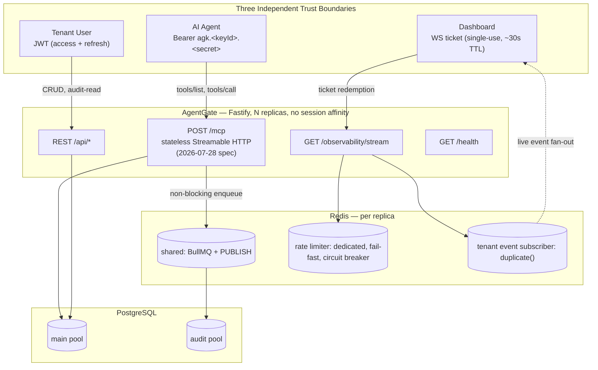
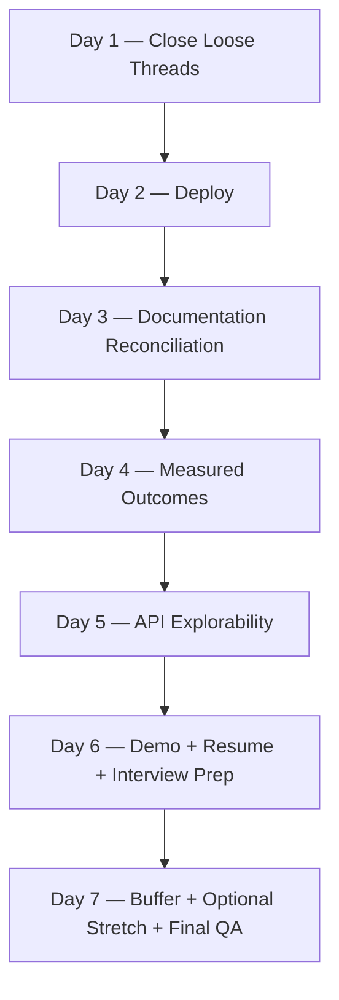

# AgentGate — Week 9: Ship, Prove, Present
## Closing Week 8, Then Making the Last Eight Weeks Count

**Status:** Picks up immediately after Week 8 Day 4 (whole-system chaos suite, shutdown-race proof, `INFRA_UNAVAILABLE` fix — all shipped, per your own confirmation). Covers the remaining Week 8 scope (`roadmap_w8.md` Part 5, Days 5–7) plus a second track your engineering roadmap never had a reason to include: making the system deployable, provable, and legible to someone who reads it for four minutes, not eight weeks.

**How this differs from the quick suggestion you got earlier:** that pass was scoped for "whatever time you can grab this week." You now have the whole week free, so this version goes one layer deeper — it closes several small, already-*named*, already-*scoped* items your own Day 3/Day 4 docs explicitly deferred ("Day 7's job," "not silently dropped") and then never came back to in anything shown to me. None of them are new design. All of them are the kind of thing a careful reviewer running your own chaos suite would notice if left open.

**How to read this:** Parts 1–3 are the analysis you asked for. Part 4 onward is the roadmap. If you want to skip straight to "what do I do Monday," go to Part 6.

---

## Part 1 — Where Things Actually Stand

| Milestone | Status |
|---|---|
| Weeks 1–7 (M1–M7) | Shipped, checkpoint-proven |
| Week 8 Day 1 — Full-system E2E harness | ✅ Shipped |
| Week 8 Day 2 — Cross-surface adversarial matrix + public-auth throttle | ✅ Shipped |
| Week 8 Day 3 — Load test, pool/connection instrumentation | ✅ Shipped (post-fix) |
| Week 8 Day 4 — Whole-system chaos, shutdown-race proof, `INFRA_UNAVAILABLE` | ✅ Shipped |
| Week 8 Day 5 — Deployment packaging & CI | ⬜ Not started |
| Week 8 Day 6 — Documentation reconciliation | ⬜ Not started |
| Week 8 Day 7 — Buffer + optional RLS + Go-Live Gate | ⬜ Not started |
| Career-facing surfacing work | ⬜ Never scoped anywhere in the engineering roadmap |

The honest read: you're not a week of engineering away from done. You're a week of *finishing and surfacing* away from done. That's a materially easier week, and it's worth saying out loud before diving in.

---

## Part 2 — Gap Register

### Category A — Correctness & Resilience (close before you call it done)

| # | Gap | Sev | Effort | Note |
|---|---|---|---|---|
| A1 | `HLD.md` §1–3 still documents the retired two-channel SSE transport (Session Map, heartbeat/idle timers) | 🔴 | S | Directly contradicts the shipped Week 6 stateless design. If a technical reviewer opens the docs before the code, this reads as abandoned, not evolved. |
| A2 | `PRD.md` §4/§6 still calls SSE "the standard MCP HTTP transport" | 🔴 | S | Same problem, second file. |
| A3 | Shutdown-sequence defensive-guard coverage is asymmetric. Decision 8.86 guarded four steps (both Prisma disconnects, both Redis quits) under real Week 8 Day 4 chaos, but `app.close()`, the email-queue family, and `closeSafeAgent()` were explicitly left unguarded and deferred — in your own words, "Day 7's job." | 🟠 | S | Mechanical — same log-and-continue pattern, four more call sites, no new design. |
| A4 | Postgres pool sizes (`AGENTGATE_DB_POOL_MAX=10`, `AGENTGATE_AUDIT_DB_POOL_MAX=5`) are still the original Week 3/5 *reasoned* defaults, never the *measured* values Day 3's own `recommendPoolSize()` helper was purpose-built to produce. | 🟠 | S | You built the instrumentation specifically so this wouldn't ship as a guess. Run it once clean, read the number, apply or confirm it. |
| A5 | The production config-safety boot guard (Decision 8.10) isn't built yet, and needs to enumerate every secret-shaped var introduced *after* the decision was first written — `AGENTGATE_SENDGRID_API_KEY`, `AGENTGATE_INVITATION_TOKEN_SECRET`, and anything else from Weeks 7–8. `email-integration-roadmap.md` itself flags the SendGrid key as "one more variable for it to check once built." | 🔴 | S | A guard that only checks the four vars that existed in Week 3 isn't the guard you designed — it's a subset of it. |
| A6 | The `/health` vs `/healthcheck` route-name typo has now recurred at least three times across the project's history — fixed once (Week 5 Day 6, Decision 5.66), reintroduced in Week 8 Day 3's load test, and there's still at least one lingering `/healthcheck` reference visible in the Week 8 Day 4 chaos suite even next to a comment claiming it was fixed. | 🟡 | S | Three recurrences of the same literal string across different files is a pattern worth a final grep sweep across the *whole* repo, not the one file it was last caught in. If cheap, a one-line CI grep assertion turns this into a build failure instead of a future chaos-test flake. |
| A7 | The two manual hardening-checklist items — "kill Redis mid-session" (Week 3 Day 7) and "kill Postgres mid-session" (Week 8 Day 3, Decision 8.69) — have been on the list since they were written, deliberately never automated, and as far as anything in the record shows, never actually executed by hand. | 🟡 | S | Automated chaos (`pg_terminate_backend`, targeted `.disconnect()`) already proves the *application-level* fault handling. These two prove the same thing at the *infrastructure* level — a managed Postgres/Redis blip is the more realistic real-world failure mode. ~20 minutes, and it produces a genuinely good interview answer either way it goes. |
| A8 | PRD §5.5 explicitly specifies "Rate limit headers returned on every tool invocation response." This shipped for *denials* (`remaining` is present in the `-32001`/`-32002` error data) but never for *successes* — `ToolsCallResult`'s `_meta` carries `gatewayOverheadMs` and nothing about the agent's remaining budget. | 🟢 | S | `RateLimitResult.remaining` is already computed on every single call. Surfacing it in `result._meta` next to `gatewayOverheadMs` is the same mechanism, same call site — this closes a literal, still-open line from your own PRD, not new scope. |
| A9 | Verification tokens (email + invitation) have no expiry column — a token, once minted, is valid forever. | 🟡 | M | Already named and explicitly deferred, twice, in `email-integration-roadmap.md` and `user-invitation-roadmap.md` — for good reason, since it needs a migration plus route changes, not a one-file fix. Optional this week; a legitimate "known and deferred" item either way. |
| A10 | Your own project notes flag a divergence: `schema-validator.ts` was noted as using `strict: true` against a documented project-wide default of `strict: false` — called out as a "potential silent bug." The Week 6 Day 4 AJV fix addressed a *different* validator's draft mismatch (the `tools/call` cache), not this one. | 🟡 | S | Two-minute grep to confirm whether this is still live, and if so, whether it's intentional. If it's genuinely divergent and unexplained, it's exactly the kind of thing that silently rejects a legal schema at tool-creation time with no obvious symptom until a tenant reports it. |

### Category B — Deployment & Ops (already fully designed in `roadmap_w8.md` Part 5 Day 5 — just needs executing)

- Multi-stage Docker build, non-root user, `HEALTHCHECK`
- Compose topology + migration-on-boot (`prisma migrate deploy` as entrypoint)
- CI: typecheck → lint → Day 1 harness → image build
- `npm audit`, triaged to zero high/critical
- Actual deploy, actual live URL

### Category C — Documentation & API Surface (mix of Day 6 scope + net-new)

| # | Gap | Sev | Effort |
|---|---|---|---|
| C1 | No consolidated error-code appendix — two *complete, correct* taxonomies (JSON-RPC `-32700`–`-32012`, WS close codes `1000`–`4006`) sit scattered across eight weeks of daily docs, never assembled in one place. | 🟡 | S |
| C2 | No OpenAPI/Swagger surface, despite near-universal `schema:` blocks on your Fastify routes already doing 90% of the work. | 🟠 | S–M |
| C3 | No Postman collection. | 🟢 | S |
| C4 | README's actual current depth vs. Summerizer's own bar is unverified. | 🟡 | S |
| C5 | No "Measured Outcomes" section — Week 8 Day 3's own load test already produces exactly the numbers Summerizer's README turns into a results table. Right now they live in one `console.log` run and nowhere else. | 🟠 | S |

### Category D — Presentation & Career (net-new — the actual differentiator this week)

- No live URL
- No demo artifact
- No resume bullets drafted
- No interview-prep distillation of the decision log
- Repo hygiene unconfirmed (license, CI badge, topics, pin)

---

## Part 3 — What I'm Deliberately Not Recommending

Don't add new tool handler types, workflow chaining, OAuth/Enterprise-Managed Auth, system-wide RLS, a real Prometheus/metrics stack, a global per-agent concurrency ceiling, an API versioning scheme, or an HA database topology. Your own roadmap has refused every one of these, every time it came up, for eight straight weeks — Decision 8.17 restates the posture as recently as this week. Reversing that discipline in the one week you're trying to look *most* disciplined would be a strange note to end on, and none of it is what's actually standing between you and "ready to put on a resume."

That list of considered-and-deferred items is itself an asset — Part 9 turns it into interview material instead of treating it as unfinished business.

**One exception:** OpenAPI/Swagger. Additive, reversible, generates off code you've already written, touches zero business logic.

**One optional stretch, only if genuinely ahead of schedule:** audit-path RLS (Decision 8.15) — already designed with a one-flag rollback specifically so a late discovery never becomes a launch delay.

---

## Part 4 — Corrected Architecture Diagram (drop-in for `HLD.md` §1)

The existing "Boundary Responsibility Summary" table in `HLD.md` §1 is still content-accurate — only the transport row needs the SSE→stateless correction. Don't rewrite what isn't wrong.

---

## Part 5 — Key Decisions for Week 9

| # | Decision | Why |
|---|---|---|
| D1 | This week ships zero new tenant-facing capability. | Matches Decision 8.17's own restated posture — the gap isn't features, it's proof and visibility. |
| D2 | The one exception is OpenAPI/Swagger, generated from existing schemas. | Additive, reversible, zero business-logic risk. |
| D3 | Pool sizes get *applied* from Day 3's measurement, not re-guessed. | Turns "we picked 10 and 5" into "we measured, and confirmed/revised" — a materially better answer for the same amount of work. |
| D4 | The two manual chaos checklist items get executed this week, not left as a permanent TODO. | Two ~10-minute tests you've been carrying since Week 3. |
| D5 | Verification-token expiry (A9) stays optional stretch, not core. | Named, scoped, and explicitly deferred twice already — respecting that is more consistent with the project's own discipline than rushing it under deadline pressure. |
| D6 | Documentation reconciliation happens *before* the demo recording, not after. | A demo showing a system whose own architecture doc describes a different transport is a bad first impression if anyone checks. |

---

## Part 6 — Day-by-Day Roadmap

**Flexibility note, same as every prior week:** the checkpoints matter, not the calendar boxes. If a day finishes early, pull forward; if one runs long, the buffer is Day 7, not a reason to cut a checkpoint short.

### Day 1 — Close the Loose Threads

**Objective:** before anything gets deployed, make sure what's about to go live is the fully-hardened system your own roadmap already designed — not a system with five small, already-identified loose ends still open.

**Tasks:**
- Extend Decision 8.86's log-and-continue defensive posture to the four remaining shutdown steps (A3): `app.close()`, the email-worker/queue family, `closeSafeAgent()`. Copy the shape already proven on the audit/Postgres/Redis steps — don't redesign it.
- Grep sweep for every `/healthcheck` reference across routes, tests, and docs (A6). Fix it permanently. If cheap, add a one-line CI check so a fourth recurrence fails the build instead of surfacing in a chaos test three months from now.
- Confirm whether `schema-validator.ts`'s `strict` setting still diverges from the project-wide `false` default (A10). If it does and it's unexplained, fix it; if it's intentional, add a one-line comment saying so — either way, stop it from being silently ambiguous.
- Run `npm run test:resilience` and `npm run test:load` clean, once more, end to end. Read `recommendPoolSize()`'s real, logged output for both pools (A4). Apply the recommendation if one exists; if both report "confirmed sufficient," write that down — it's now measured, not assumed.
- Walk `env.ts` top to bottom and build the complete list of secret-shaped variables the config-safety guard needs to check (A5) — this is the "what" list; the guard itself gets built Day 2.
- Execute the two manual hardening-checklist items by hand (A7): briefly stop/restart the local Postgres container, then the Redis container, while the app is running or mid-load-test. Confirm no crash either time, confirm normal operation resumes without a manual restart. Write down what you actually observed in two or three sentences — this becomes Day 6 interview material.

**Proof checkpoint:** zero open items from the "deferred to Day 7" lists in your own Week 8 Day 3/4 docs; pool sizes are measured; both manual chaos scenarios executed and documented in your own words.

### Day 2 — Deploy

**Objective:** get a real, public URL that answers `GET /health` with a `200`.

**Tasks:**
- Build the production config-safety boot guard using Day 1's variable list — the process refuses to start in production if any secret-shaped var matches its documented placeholder or falls under a minimum length/entropy threshold.
- Multi-stage Dockerfile: builder stage compiles, runtime stage is lean (`dist/` + prod deps only), non-root user, `HEALTHCHECK` pointed at `/health`, `.dockerignore` excludes source/tests/dev tooling.
- Docker Compose for local parity: platform + Postgres + Redis as sibling services, named volumes, `prisma migrate deploy` as an entrypoint step before the server process starts.
- `npm audit`, triage anything high/critical to zero before deploying.
- Minimal CI: typecheck → lint → the Day 1 full-system harness (against ephemeral Postgres/Redis service containers) on every push; image build on PRs; build-and-push tagged by commit SHA on merges to main.
- Deploy to Railway or Render — whichever gives the less painful free/hobby tier for a demo workload that doesn't need to survive real traffic. Set every env var for real; never leave a placeholder in production (the guard from step one should refuse to boot if you do — that's the point of it).
- Verify `GET /health` from outside your own network. Run the full core-flow curl walkthrough (register → verify → login → create agent → create tool → assign → invoke) against the live URL, not just `app.inject()`.

**Proof checkpoint:** clean-machine `docker compose up` works end to end; CI is green on a fresh push; the live URL responds; the full curl walkthrough succeeds against production, not just your test suite.

### Day 3 — Documentation Reconciliation

**Objective:** make the governing docs describe the system that exists, and put the two scattered taxonomies in one place.

**Tasks:**
- Rewrite `HLD.md` §1–§3: swap the SSE/Session-Map topology and lifecycle diagrams for the actual stateless Streamable HTTP design (auth-accelerator cache, the resolve → permission → AJV → rate-limit → execute → respond → audit pipeline) and fold in the Week 7 WS observability boundary. Use Part 4's diagram as the starting point.
- Correct `PRD.md` §4/§6: fix the "SSE is the standard MCP HTTP transport" line; clarify WebSocket is for dashboard observability only, never the agent transport.
- Assemble the consolidated error-code appendix (C1) in one place: the full JSON-RPC table (`-32700` through the Week 8 Day 4 `INFRA_UNAVAILABLE` → `-32002` addition) and the full WS close-code table (`1000`–`4006`), each row naming the internal signal that produces it.
- Rewrite `README.md` against the bar Summerizer's own README already clears: the Part 4 architecture diagram, working curl examples for every core flow with expected output, an "Engineering Decisions" table pulled from your own decision log (12–15 entries — see Part 9 for candidates), an env var reference table, and local + Docker setup instructions that get a stranger from clone to a working `curl` in under 30 minutes.
- Append the Week 8 Days 5–7 entries to `PROGRESS.md`, closing the loop on the documentation habit you've kept for eight straight weeks.

**Proof checkpoint:** someone with zero prior context can read HLD + PRD + README and describe the current architecture without hitting a contradiction; every error code either surface can emit has exactly one documented row.

### Day 4 — Prove It: Measured Outcomes

**Objective:** turn Week 8 Day 3's load-test output into the same kind of results table Summerizer already has.

**Tasks:**
- Re-run `npm run test:load` against the deployed configuration (or a staging-equivalent local run against production-shaped env vars), capturing the real numbers with intent to publish them.
- Build a "Measured Outcomes" section: `gatewayOverheadMs` p50/p95/p99 against the 300ms PRD budget; the exact rate-limit tallies at real concurrency (computed live from `AGENTGATE_MCP_TOOL_CALL_RATE_LIMIT`, not a hardcoded guess); Postgres pool peak/saturation for both pools; the Redis 5-connections-per-replica formula, confirmed against what the process actually opened; WS event delivery latency against the 200ms HLD target.
- Close the rate-limit-`remaining` gap (A8): surface `RateLimitResult.remaining` in `result._meta` on a successful `tools/call`, next to the already-shipped `gatewayOverheadMs`. Same call site, same mechanism.
- Optional, only if time genuinely allows: sketch a bare-bones `/metrics` endpoint that formats the numbers `getAuditHealth()`/`getRateLimiterHealth()`/`getObservabilityStreamHealth()` already compute, in Prometheus text exposition format. This is "restyle data you already have," not "build an observability stack" — worth doing only if it's quick; otherwise it stays a named, deferred idea for Part 9.

**Proof checkpoint:** a written, numbers-backed Measured Outcomes section exists in the README; the rate-limit-remaining gap is closed or explicitly, briefly noted as deferred.

### Day 5 — Make the API Explorable

**Objective:** let someone poke at the system without reading test files.

**Tasks:**
- Wire Swagger/OpenAPI generation off your existing Fastify `schema:` blocks. Treat any route missing a schema as a small backfill, not a redesign — you've been disciplined about schema coverage since Week 1, so this should mostly be "turn it on."
- Spot-check the generated spec against a handful of representative routes (an auth route, an MCP-adjacent route, an audit-read route) for accuracy — body shapes, response shapes, auth requirements. Expect a little cleanup on any route whose schema was written loosely.
- Export a Postman collection from the same source.
- Add a short, hand-written prose section (not generated) documenting the MCP JSON-RPC surface and the WS protocol — neither fits OpenAPI's request/response model, and pretending otherwise would just produce a misleading spec.

**Proof checkpoint:** a working Swagger UI renders against the live deployment; a Postman collection file exists in the repo; the MCP/WS surfaces are documented in prose next to the generated REST spec.

### Day 6 — Demo, Resume, Interview Prep

**Objective:** convert the week into artifacts a recruiter or interviewer will actually consume.

**Tasks:**
- Script (briefly, on paper first) and record a 2–3 minute walkthrough: register a tenant → create an agent and a tool → invoke it via the MCP gateway → watch the resulting event land live on the WS observability stream → trigger a permission denial and show it in the audit log. A tight scripted 3 minutes beats an unscripted 8.
- Draft resume bullets (Part 8 gives you a starting set — edit, don't adopt verbatim).
- Write an interview-prep doc: pull 6–8 STAR-shaped stories straight out of your own decision log (Part 9 gives you candidates), each with the real Day 4 numbers attached, so you're not reconstructing them live under pressure.
- Repo hygiene: LICENSE file, CI status badge in the README, GitHub topics, pin the repo on your profile.

**Proof checkpoint:** a shareable demo artifact exists; resume bullets are drafted; an interview-prep doc with real numbers exists; the repo looks intentional at a glance, not abandoned mid-thought.

### Day 7 — Buffer, Optional Stretch, Final QA

**Objective:** absorb overflow, optionally add the one legitimate stretch item, and review the whole week as a stranger would.

**Tasks:**
- Catch up anything from Days 1–6 that ran long — non-negotiable, same rule you've applied every week since Week 1.
- Optional stretch, only if genuinely ahead: apply the audit-path RLS from Decision 8.15 — a session-scoped tenant predicate wrapped around the already-`$transaction`-bound `persistAuditEvent()`, shipped with the one-flag rollback it was explicitly designed with. Skip without guilt if the week ran long; tenant isolation is already proven at the application layer across four independent surfaces, individually and under adversarial concurrent load — this would be defense-in-depth, not a correctness gap.
- Walk the Go-Live Gate table (Part 7 below) line by line against what's now actually true.
- Re-read the README as a stranger would. Re-click the live URL. Re-run the core curl walkthrough one more time.

**Proof checkpoint:** every row in the Go-Live Gate is checked; the live URL, the README, and the demo all agree with each other and with reality.

---

## Part 7 — The Go-Live Gate, Reproduced

| Requirement | Proven by | Status |
|---|---|---|
| MCP-compatible agent connects, lists tools, invokes end to end | Week 8 Day 1 harness | ✅ |
| p95 gateway overhead < 300ms | Week 8 Day 3 load test | ✅ measured — re-confirm with Day 4's re-run number |
| Tenant A's key cannot see/call Tenant B's anything | Week 8 Day 2, all four surfaces | ✅ |
| Permission denial + rate limiting fire correctly and are audited | Week 8 Days 1–2 | ✅ |
| Audit log captures every invocation with correct attribution | Week 8 Day 1 | ✅ |
| A real user can register, verify, and log in | `email-integration-roadmap.md` | ✅ |
| Public endpoints resist unauthenticated abuse | Week 8 Day 2 | ✅ |
| System survives real infra faults (Postgres/Redis/WS/audit worker) | Week 8 Day 4 | ✅ |
| Deployed, documented, reproducible from a clean machine | — | ⬜ This week, Days 2–3 |
| Governing documents match the running system | — | ⬜ This week, Day 3 |

Worth sitting with this table for a second: eight of ten rows are already checked. The remaining work is genuinely the last mile, not a second engineering push.

---

## Part 8 — Resume Bullets (Draft — edit before using)

- Designed and shipped a multi-tenant MCP (Model Context Protocol) gateway in TypeScript/Fastify with layered SSRF defense (string-level pre-filter at config time + DNS-resolution-time re-validation at call time); tenant isolation independently proven across REST, JSON-RPC, WebSocket, and audit-read surfaces via adversarial testing, individually and under concurrent cross-surface load.
- Migrated the protocol transport layer mid-project after an upstream MCP spec deprecation, replacing a stateful SSE/session model with stateless Streamable HTTP — diagnosed, redesigned, and re-verified within a single week with zero backward-incompatible gaps in the error taxonomy.
- Built a hybrid circuit-breaker pattern distinguishing infrastructure faults from policy decisions, applied consistently across ten independent subsystems (permission checks, rate limiting, audit writes, ticket auth, tool execution); every failure mode surfaces its own stable, documented error code instead of a generic catch-all.
- Load-tested the gateway at [N] concurrent agents / [N] req/min, measured p95 gateway overhead of [X]ms against a 300ms budget, and derived production Postgres/Redis connection-pool sizes from observed saturation under real concurrency rather than estimation.
- Built an idempotent, append-only audit pipeline (BullMQ, dual-table transactional writes, dead-letter queue, two independent secret-redaction passes) that survives simulated worker crashes and severed Postgres/Redis connections with zero data loss, proven via whole-system chaos injection against the live stack.
- Diagnosed and fixed a production-shaped concurrency bug (a test-teardown race between an async audit-queue drain and tenant deletion) by tracing the actual call graph rather than accepting two plausible-sounding but incorrect external diagnoses — one of which would have silently disabled SSRF protection had it been applied.

*Fill in the bracketed numbers from Day 4's real run before this goes anywhere.*

---

## Part 9 — Interview-Prep Seed List

Pull these into the Day 6 doc, each expanded to a short STAR shape (Situation/Task/Action/Result) with real numbers where you have them.

1. **The mid-project MCP transport pivot (Week 6).** The spec deprecated the transport you'd designed against, mid-build. Traced the actual current spec text rather than trusting a summary, redesigned from stateful SSE to stateless Streamable HTTP inside one week, and invented an auth-accelerator cache specifically to preserve the amortized-Argon2-cost property the old session model gave away for free.
2. **The audit-queue drain race.** Diagnosed a real teardown-ordering bug that two rounds of external "fixes" mischaracterized — one proposed a change that would have silently disabled SSRF protection for every test in the suite. Traced it to the actual root cause (a test racing its own async background drain) instead.
3. **The AJV draft mismatch.** Two schema validators in the same codebase were silently targeting different JSON Schema drafts. Found it by tracing which draft each validator actually used, not by trusting a stated default — before it caused a real incident.
4. **The "infra fault ≠ policy decision" rule.** Drawn independently across ten separate subsystems over eight weeks — a single architectural principle applied with discipline rather than solved once and forgotten.
5. **SSRF two-layer defense.** A string-level pre-filter at config-write time plus a DNS-resolution-time re-check at call time, specifically to close the DNS-rebinding gap a single check can't close on its own.
6. **The circuit breaker's precisely-stated imprecision.** Documented exactly which race conditions the design accepts (a fail-open window bounded by time, not call count; concurrent probes resolving last-writer-wins) instead of overclaiming a guarantee that doesn't actually exist.
7. **Whole-system chaos testing.** Killed a live Postgres backend and a live Redis connection mid-request against the *running* system, not mocks — and confirmed the same fault-vs-decision classification held under a real, not simulated, failure.
8. **Deliberate, named scope restraint.** The list of things considered and explicitly not built (global concurrency ceilings, full RLS, OAuth, workflow chaining) and the reasoning behind each deferral — a senior signal in its own right.

---

## Part 10 — Week 9 Checklist Summary

**Day 1**
- [ ] Shutdown-guard coverage extended to all remaining steps
- [ ] `/healthcheck` sweep complete, zero remaining references
- [ ] `schema-validator.ts` `strict` divergence confirmed/resolved
- [ ] Pool sizes measured and applied (or confirmed sufficient)
- [ ] Config-guard variable list complete
- [ ] Both manual chaos scenarios executed and documented

**Day 2**
- [ ] Config-safety boot guard built and tested against a placeholder value
- [ ] Docker build + compose topology working on a clean machine
- [ ] CI green on a fresh push
- [ ] `npm audit` triaged to zero high/critical
- [ ] Live URL deployed, `GET /health` verified externally
- [ ] Full curl walkthrough passes against production

**Day 3**
- [ ] `HLD.md` §1–3 rewritten
- [ ] `PRD.md` §4/§6 corrected
- [ ] Consolidated error-code appendix assembled
- [ ] README rewritten to Summerizer's bar
- [ ] `PROGRESS.md` updated

**Day 4**
- [ ] Load test re-run, real numbers captured
- [ ] Measured Outcomes section written
- [ ] Rate-limit `remaining` surfaced on success (or explicitly deferred)

**Day 5**
- [ ] Swagger UI live against the deployment
- [ ] Postman collection exported
- [ ] MCP/WS surfaces documented in prose

**Day 6**
- [ ] Demo recorded
- [ ] Resume bullets drafted
- [ ] Interview-prep doc written with real numbers
- [ ] Repo hygiene complete

**Day 7**
- [ ] Days 1–6 catch-up closed
- [ ] Optional RLS applied (or skipped without guilt)
- [ ] Go-Live Gate fully checked
- [ ] Final stranger's-eye QA pass complete