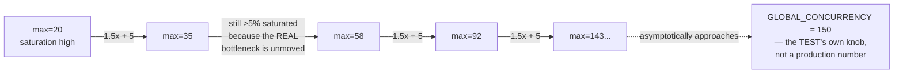
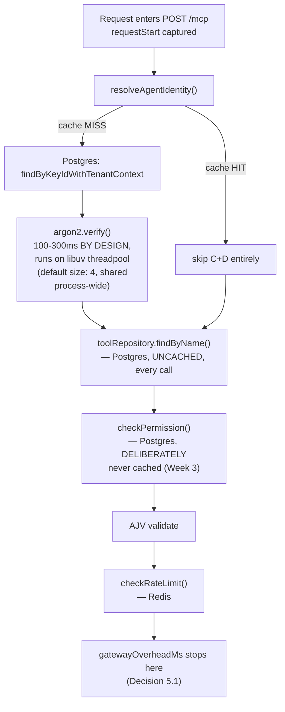

# Week 9, Day 1 Remediation
## Why the Pool-Size Recommendation Won't Converge, and What Actually Explains a 4,960ms p95

---

## Verdict, Up Front

Your instinct is right, and the "bump to 75" suggestion should be treated as a stopgap, not a fix. Two independent pieces of evidence in your own report already contradict the "just needs more connections" story:

1. **The math can't converge.** `recommendPoolSize()`'s heuristic (`1.5× + 5`) has no stopping condition other than "saturation drops under 5%." If the real bottleneck isn't pool *count*, growing the pool doesn't reduce saturation — it just admits more concurrently-stuck work. You'll chase this number until it approaches `GLOBAL_CONCURRENCY` (150), at which point you're not sizing for production, you're just matching a test-harness constant.
2. **The saturation number doesn't match the latency number.** Your main pool was reported "pinned at max" for only **9.3%** of samples — barely over Decision 8.72's own 5% "likely bottleneck" threshold — while `gatewayOverheadMs` p95 is **4,960ms**, sixteen times the 300ms budget. If pool exhaustion were the dominant driver of a multi-second p95, the pool would need to be maxed out far more than 9% of the time. This mismatch is itself the strongest evidence in the report that **the pool is not where the time is going.**

Growing the pool to 75 will very likely get the *saturation-ratio* test to go green. It will not, by itself, explain or necessarily fix the *latency* number — and it introduces a real, separate risk: a pool of 75 per replica directly threatens the deployment connection-budget formula your own Decision 8.14 established (`max_connections ≥ 5N + headroom`). At two replicas, that's 150 main-pool connections alone, before the audit pool, before Redis, before any managed Postgres tier's typical ceiling. That's not a hypothetical — it's the exact kind of unreasoned number this project has refused to ship everywhere else.

---

## Part A — Why the Heuristic Can Never Converge Here

The heuristic's only signal is *"was every connection in use."* It cannot distinguish two structurally different situations:

| Situation | What "pool maxed" means | Correct fix |
|---|---|---|
| **Supply-limited**: queries are fast (low single-digit ms), but there genuinely aren't enough connections for the real concurrent demand | The pool being full is the *cause* of delay | Grow the pool |
| **Service-time-limited**: each unit of work (each request) is slow for a reason that has nothing to do with Postgres connection count — the connection itself is acquired and released quickly, but the *request* still takes seconds | The pool looking "maxed" 9% of the time is a *symptom*, not the cause | Find and fix what's actually slow; pool size is close to irrelevant |

Your data — low saturation, catastrophic latency — is the second column, not the first. `roadmap_w8_d3.md` itself designed `recommendPoolSize()` as a one-shot heuristic requiring human judgment on each iteration ("re-run to confirm," not "apply repeatedly until convergence"). Watching it climb 20→35→58→92 without the underlying latency improving is the heuristic doing exactly what it was scoped to do: telling you it has run out of useful signal, and that a human needs to actually diagnose rather than keep feeding it a bigger number.

---

## Part B — Rereading Your Own Numbers More Carefully

| Signal | Value | What it rules in/out |
|---|---|---|
| `auditPoolRecommendation` | peak 5/5, 3.6% saturation — "confirmed sufficient" | **Rules out** the audit pipeline. Also structurally impossible as the cause: `gatewayOverheadMs` is captured *before* `executeTool()` is even called (Decision 5.1, Week 6 Day 5) — the audit write hasn't been enqueued yet at the moment this clock stops. |
| `mainPoolRecommendation` | peak at max for 9.3% of samples | Borderline over the 5% line, but nowhere near "pool starvation is why everything is 5 seconds slow." |
| `redisNamedClients: 3` | matches the expected 3-of-5 formula exactly | **Rules out** Redis/rate-limiter contention as the driver. |
| `gatewayOverheadMs p95: 4960ms` | 16.5× the 300ms budget | This is the one number that's actually alarming, and none of the other three explain it. |

One more methodological caveat worth naming honestly: `DbPoolObserver` polls `pg_stat_activity` **through the same pool it's measuring** (a deliberate, documented tradeoff in `db-pool-observer.ts`). Under severe contention, the poll itself can be delayed, which would bias the 9.3% figure *downward*, not upward. Even granting that the true number might be somewhat higher than reported, it would need to be off by an order of magnitude to plausibly explain a 16× latency overshoot on its own.

**Conclusion:** the request is spending most of its 4,960ms somewhere that does not hold a Postgres connection while it happens.

---

## Part C — Where the Time Is Actually Likely Going (Ranked)

1. **Argon2 / libuv threadpool contention (highest-probability suspect).** `argon2.verify()` was deliberately designed to cost 100–300ms (Week 2's own documented rationale) and is CPU-bound native work dispatched to Node's `libuv` threadpool — a pool whose default size is **4, process-wide, shared with every other native async operation in the process.** Every cold-cache identity resolution consumes one of those four slots for the full 100–300ms. This has zero footprint on `pg_stat_activity` (no Postgres connection is held during Argon2 execution), which is exactly why it wouldn't show up as pool saturation while still dominating wall-clock latency for the affected requests.

2. **`connectionTimeoutMillis` — flagged, never confirmed bounded.** Your own debugging notes already show this was touched once ("reduced test run duration significantly but left the raw `DriverAdapterError` count unchanged") — that result *ruled out* one theory but never confirmed what value this is actually set to today, or whether it's a reasoned bound versus Prisma v7's own unbounded default (`connectionTimeoutMillis: 0`). If it's still unbounded, any transient contention window queues indefinitely instead of failing fast — which can produce exactly the kind of localized, brief-but-severe latency spikes (invisible to a 200ms-interval saturation sample, very visible at p95) that your data shows.

3. **`checkPermission()`'s deliberate "always fresh, never cached" design (Week 3), stacked with continuous background REST-poller traffic.** Every one of the 3,250 calls issues a real, uncached authorization query — correct and intentional from a security standpoint, but it means the main pool is carrying that load for the *entire* run, not just during bursts. On top of that, `startBackgroundRestPoller` is firing `GET /api/agents` + `GET /api/tools` every 300ms per tenant (5 tenants) for the full ~45s window — real, by-design load (Day 3's own stated goal), but it means not all main-pool pressure in the observed 9.3% is attributable to the MCP burst specifically. Worth separating in any re-instrumented run.

4. **Unverified query plans.** Neither `findGrantWithContext` nor `findByName` has been confirmed, under this load's actual data shape, to be hitting its intended index (`@@index([tenantId])`, `@@unique([tenantId, name])`) rather than a sequential scan. Cheap to rule out, never actually checked.

5. **A methodological caveat, not a dismissal.** `app.inject()` doesn't do real socket I/O — all 150 "concurrent" requests are competing for one Node process's one event loop and one small threadpool, with none of the natural smoothing that comes from genuinely independent client connections. This means CPU-bound serialization (Argon2 above all) will look *worse* here than in real distributed traffic. That doesn't make the finding meaningless — production will still have concurrent Argon2 calls hitting the same fixed threadpool — but it changes how literally to read the absolute p95 number versus using it as a bottleneck-finding instrument.

---

## Part D — A Live, Independent Bug Sitting in This Exact File

Separate from all of the above: the "BONUS" health check in `concurrency-load.test.ts` still calls `GET /healthcheck`. This route hasn't existed since Week 5 Day 6 (Decision 5.66), was already flagged as a recurrence in Week 8 Day 3 (Decision 8.77) and again in Week 9 Day 1's own grep-sweep item (Decision 9.7) — and it's still here. That means either the sweep never ran against this file, or this copy predates it. Worth fixing on sight and re-running the sweep script against the *whole* repository rather than trusting it was caught the last time it was mentioned — this is the fourth documented recurrence of the identical typo, which is itself a signal that a one-time manual fix isn't sufficient and this genuinely needs the CI-gated check Week 9 Day 2 was supposed to wire in.

---

## Part E — Decision Log (continuing at 9.12)

| # | Decision | Why |
|---|---|---|
| 9.12 | `gatewayOverheadMs` is decomposed into phase-level sub-timings (identity resolution — split cache-hit vs. cache-miss — tool-name resolution, `checkPermission`, AJV validate, rate-limit check) before any further tuning decision is made. | Turns "the total is 4,960ms" into "phase X is 4,700ms of it," which is the only way to attribute root cause rather than guess. Matches this project's own standing "measure, don't assume" discipline (M4's dispatcher precedence, M6's AJV draft, M7's ioredis `PING`). |
| 9.13 | Argon2 verify duration is measured directly under load, correlated against `UV_THREADPOOL_SIZE`. A cheap, targeted experiment (temporarily raising `UV_THREADPOOL_SIZE`) either confirms or rules this out empirically rather than by inference. | Closes the highest-probability hypothesis with evidence, not conjecture. |
| 9.14 | `connectionTimeoutMillis` on both `prisma.ts` and `audit-prisma.ts` is confirmed as an explicit, reasoned, bounded value — not left at whatever the earlier debugging pass happened to leave it at. Once bounded, saturation produces a fast, explicit `-32002 SERVICE_DEGRADED` response — the same fault-vs-decision behavior this project has applied eleven times elsewhere — instead of silent multi-second queuing. | This is correct production behavior regardless of what the root cause turns out to be. |
| 9.15 | `EXPLAIN ANALYZE` is run against the real `findGrantWithContext` and `findByName` queries at representative data volume, to rule out (or confirm) a missing-index/query-plan contributor. | Cheap, never actually done. |
| 9.16 | The pool observer's reporting is split by traffic source (MCP burst vs. background REST poller) where feasible, so "main-pool pressure" isn't attributed entirely to the tools/call burst by default. | Prevents misattributing legitimate, by-design background load to the thing actually being measured. |
| 9.17 | The `/healthcheck` reference in `concurrency-load.test.ts` is fixed, and the grep-sweep script from Decision 9.7 is re-run against the full repository, not assumed still-clean. | Closes a confirmed, independent, easily-verified regression. |
| 9.18 | **No pool-size change ships until 9.12–9.15 produce an attributed root cause.** If Argon2/threadpool turns out to be dominant, the fix is `UV_THREADPOOL_SIZE` tuning (or reconsidering the auth-cache TTL/warm-up strategy), not `AGENTGATE_DB_POOL_MAX`. If genuine DB round-trip volume is dominant, the eventual pool number is derived via Little's Law (`connections ≈ throughput × measured per-query service time`, with headroom) — never via mechanically reapplying `1.5x + 5` — and is explicitly reconciled against Decision 8.14's `max_connections ≥ 5N + headroom` formula for your actual target replica count and Postgres tier. | Prevents shipping an unreasoned number that either doesn't fix the real problem or breaks in production for a different reason (connection-limit exhaustion at N>1 replicas). |

---

## Part F — Recommended Sequence

1. **Fix the `/healthcheck` line and re-run the sweep** (Decision 9.17) — five minutes, zero ambiguity, do it first so it stops muddying future runs.
2. **Add phase-level timing to `gatewayOverheadMs`'s computation** (Decision 9.12) — this is the single highest-leverage next step. Everything downstream depends on knowing *which* phase is actually slow.
3. **Re-run the load test once**, purely to capture the phase breakdown. Don't touch `AGENTGATE_DB_POOL_MAX` yet.
4. **Read the breakdown.** If cache-miss identity resolution (Argon2 path) dominates → go to (5a). If `checkPermission`/`findByName` dominate with connections held a long time → go to (5b). If neither clearly dominates → check `connectionTimeoutMillis` (5c) and query plans (5d) before concluding anything.
   - **5a.** Confirm/raise `UV_THREADPOOL_SIZE`, re-run, compare. This is a one-line, fully reversible experiment.
   - **5b.** `EXPLAIN ANALYZE` the two hot queries against representative data volume; confirm index usage.
   - **5c.** Set an explicit, reasoned `connectionTimeoutMillis` on both Prisma clients (e.g., low-single-digit seconds — the exact value depends on what you actually want a saturated pool to do: fail fast into `-32002`, or wait briefly). Re-run.
   - **5d.** Same as 5b.
5. **Only after a root cause is named with evidence**, decide whether `AGENTGATE_DB_POOL_MAX` needs to change at all. If it does, size it with Little's Law against the *measured* per-query time from step 4 — not against `GLOBAL_CONCURRENCY` — and check the resulting number against Decision 8.14's per-replica connection-budget formula for your real deployment target before treating it as final.
6. **Re-run clean, capture the new p95**, and only then decide whether it's genuinely under (or defensibly close to) the 300ms PRD §12 budget, or whether that budget itself needs to be revisited against what `.inject()`-based testing can honestly represent.

---

## Part G — What "Done" Looks Like

- `gatewayOverheadMs` p95 is understood by phase, not just reported as one opaque number.
- The dominant contributor is named with evidence (a specific measurement, not a heuristic's side effect).
- If `AGENTGATE_DB_POOL_MAX` changes, the new value is derived from measured service time and explicitly checked against the real per-replica connection budget — not chosen because it made a saturation percentage dip below 5%.
- `/healthcheck` is gone from this file, and the sweep has actually been re-run against the whole tree.
- The test suite being green stops being conflated with the 300ms target being met — right now it's green *because* the checkpoint was deliberately designed to measure, not gate, on that budget (`expect(stats.p95).toBeGreaterThanOrEqual(0)`), and that distinction is worth keeping visible until the real number is one you'd actually want to publish.