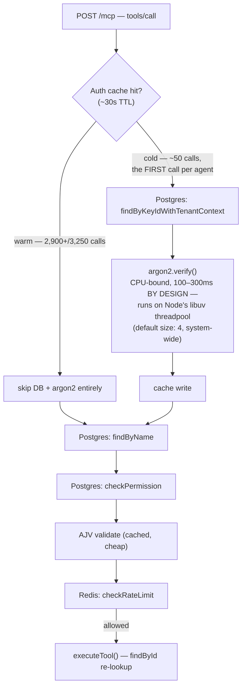

Good instinct to be suspicious of "just crank the pool to 95." Let me walk through what your own data is actually telling you, because I think the numbers point somewhere your test harness isn't currently looking.

## 1. The evidence you already have is the tell

Look at what `load-test-summary.json` actually reports, side by side:

| Signal | Value | What it implies |
|---|---|---|
| `gatewayOverheadMs` p50 | **7,179ms** | Every call, on average, is stalled for ~7 seconds *before it even reaches `executeTool()`* |
| `gatewayOverheadMs` p95 vs p50 | 7,342 vs 7,179 (a ~163ms spread) | An unusually **tight band** — not "some slow outliers," but "almost everything pays roughly the same tax" |
| Main pool saturation | pinned at max for **6.2%** of samples | The pool was *not* maxed out most of the time |
| Audit pool saturation | pinned at max for **5.4%** of samples | Same — barely over the 5% "sufficient" threshold |

That combination is the important part. **If Postgres connection exhaustion were actually causing 7-second stalls, the pool would be pinned at max for the majority of your sampling window — 60%, 80%, not 6%.** A pool that's rarely full and a pipeline that's stalled for seconds are contradictory *unless* the bottleneck is somewhere the pool can't see — i.e., requests aren't even reaching the point where they'd ask Postgres for a connection.

You already have a data point that disagrees with "needs more pool." Worth trusting that over the heuristic.

## 2. Where I think the 7 seconds are actually going

Your load harness (`bootstrapLoadTenants`) creates **50 brand-new agents** immediately before the timed burst fires. Every one of those agents' *first* MCP call is a cold hit on `resolveAgentIdentity()` — and a cold hit does something the warm path never does: a real `argon2.verify()` call.

That's deliberate, by design, from early in this project — Argon2 is a memory-hard KDF, intentionally slow (~100–300ms per call), and the whole reason the Week 6 auth-accelerator cache exists is to make sure that cost is paid *once per agent*, not once per call. The problem is what happens the very first time, at scale, all at once:



`gatewayOverheadMs` is measured from the top of that diagram up to just before `K`. So step `E` sits squarely inside your measured window.

Node's libuv threadpool defaults to **4 threads, for the entire process**, and it's shared by every native/CPU-bound async op (crypto, `fs`, DNS lookups, zlib). Your `runWithConcurrency` scheduler dispatches work off a flat array that's built agent-by-agent (agent 0's 65 calls, then agent 1's 65, etc.), but with `GLOBAL_CONCURRENCY = 150`, the first ~150 workers all grab from the front of that array roughly simultaneously — which means several agents' *first* calls (the only ones that need argon2) land within the same instant, all fighting over 4 threadpool slots.

Do the arithmetic: even a modest 20–30 of those 50 cold-start `argon2.verify()` calls queued 4-at-a-time, at ~150–250ms each, is easily 1–2 seconds of pure thread-queue wait — and that's before accounting for the fact that a saturated threadpool also delays the DNS/crypto-adjacent bookkeeping happening elsewhere in the same burst, and that a busy threadpool tends to back up the event loop's own scheduling under high concurrency. A tight 7-second band across nearly every sample is exactly the signature you'd expect from a shared, hard-capped resource getting hammered by a stampede — not from "the DB needs more slots."

**This also explains why bumping `AGENTGATE_DB_POOL_MAX` to 60 already didn't help.** You were turning a knob that wasn't the bottleneck.

## 3. Why "just raise it to 95" is the wrong move, not just an ugly one

Your instinct here is correct, for a concrete reason beyond "it feels like a lot":

- The `recommendPoolSize()` heuristic is a blunt `1.5× + 5` formula triggered by *any* saturation over 5% — it has no idea whether the underlying cause is "genuinely need more concurrent DB slots" or "requests are stalled somewhere else and only occasionally, briefly, all arrive at the pool door at once." It will recommend more connections for either case, which makes it useless as a diagnosis on its own — only as a symptom report.
- This is a **portfolio-scale, single-replica deployment**. A free/hobby-tier managed Postgres (Railway, Render, Neon, Supabase) typically caps `max_connections` somewhere in the 20–100 range *total*, often with a chunk reserved for the platform itself. Reserving 95 for the main pool alone, on top of 13 for audit, isn't just aesthetically uncomfortable — it may simply not fit in the tier you're going to deploy to, and even if it does, it's provisioning for a synthetic 150-way burst that will never occur in real usage of this project (nobody is going to spin up 50 brand-new agents simultaneously against a resume-demo deployment).
- Multi-tenant fairness angle, briefly: pool sizing should reflect *steady-state concurrent demand across tenants*, not the peak of an adversarial burst test — otherwise you're provisioning capacity for a scenario that, if it ever did happen for real, is exactly the kind of thing your rate limiter and connection ceilings are supposed to be *shedding load* against, not accommodating at full concurrency.

So: don't apply the 95/13 numbers. They're an artifact of measuring the wrong traffic shape, not a real capacity requirement.

## 4. One thing that has to happen before any of this is trustworthy

Your own `roadmap_w9_d1.md` amendment already reaches this conclusion independently (Decision 9.9): `resolveAgentIdentity()`'s raw Postgres call (`findByKeyIdWithTenantContext`) is still unguarded, and it's the one DB call in the identity-resolution path that Week 8 Day 4's `INFRA_UNAVAILABLE` fix never reached. Under real connection contention, a raw Prisma fault there throws all the way out to the generic `-32603` handler instead of degrading to `-32002`.

You're running Day 3's load test **before** that Day 1 fix has landed. That means some unknown fraction of today's cold-start calls — the exact ones already fighting for threadpool slots — may also be throwing raw, unclassified errors under pressure, which muddies the timing data further and risks silently corrupting the "unexpected code" gate the next time contention gets worse. Land that fix first; it's a prerequisite you already scoped for yourself, not new work I'm adding.

## 5. The actual path forward

**Step 0 — Prerequisite (already designed, just needs applying)**
Apply the `mcp-auth-resolver.ts` fix from your amendment doc (typed `infra_error` → `-32002`, never thrown raw). Confirm `tsc --noEmit` is clean and the fast unit tests for it pass. Don't trust any load number generated before this lands.

**Step 1 — Stop measuring two different things with one test**
Right now, one burst is being asked to answer two unrelated questions at once:
- *"Does the rate limiter correctly allow exactly N and deny the rest under adversarial concurrency?"* — this is what your current test does well, and it doesn't need a cache-warm population to be valid.
- *"What is steady-state `gatewayOverheadMs` under realistic, cache-warm traffic, measured against the PRD §12 300ms budget?"* — this needs an entirely different traffic shape: warm identities, moderate concurrency, no deliberate rate-limit breaching.

Conflating them is why the number in front of you doesn't mean what it looks like it means.

**Step 2 — Add a warm-up wave, structurally**
Before the timed burst fires, issue one low-concurrency call per agent (sequential, or capped at something small like 5-way concurrency) so every agent's identity is already cached by the time the real measurement window starts. Conceptually:

```
bootstrap 50 agents
  → warm-up pass: 1 call/agent, low concurrency, NOT timed, NOT sampled
  → *now* start the clock
  → fire the adversarial burst for rate-limit correctness (unchanged)
  → separately, fire a moderate, realistic-concurrency wave and sample
    gatewayOverheadMs from *that* population only
```

This is a load-harness change, not a production code change — it doesn't touch `resolveAgentIdentity()` or the pipeline at all. It just stops measuring a cold-start stampede and calling it "gateway overhead."

**Step 3 — Re-run and interpret**
- If `gatewayOverheadMs` drops from seconds to tens-of-milliseconds once cache-warm, the threadpool-contention theory is confirmed, and you're done — no pool change needed. This is the number that goes in your README's Measured Outcomes section.
- If it's still meaningfully elevated (hundreds of ms, not seconds) even warm, then Postgres pool sizing genuinely deserves a second look — but size it against *that* number's real concurrent demand, not the burst's.

**Step 4 — Right-size against reality, not the heuristic**
If a pool increase is still warranted after Step 3, pick a number based on (a) what the warm, realistic-concurrency scenario actually needs, and (b) your real deployment tier's `max_connections` ceiling — not `recommendPoolSize()`'s raw output from the burst. For this project's actual traffic profile, I'd expect the honest answer to land back close to the original Week 3/5 reasoned defaults (10 main / 5 audit) or modestly above, not 95/13.

**Step 5 — Optional, low priority**
`DbPoolObserver` samples `pg_stat_activity` every 200ms using the *same* pool it's monitoring — a small, already-documented, self-inflicted load. It's unlikely to be a major contributor here, but if you want a cleaner signal later, widening the sample interval to ~500ms–1s is a cheap, zero-risk tweak.

## 6. What this is worth, beyond just fixing the test

This is a legitimately good "root-cause vs. surface-level fix" story for your interview-prep doc: a load test that superficially "passed" while reporting a number 20x over budget, traced past an easy-but-wrong fix (bump the pool) to the actual mechanism (a deliberately-slow, by-design security primitive colliding with Node's default thread-pool size under a synthetic cold-start stampede) — using the test's *own* saturation data as the disconfirming evidence for the wrong hypothesis before ever touching a debugger.

Want me to write out the actual harness changes for the warm-up wave and the split-scenario test structure next?


______________________________________________


**Cloudflare Quick Tunnel (`cloudflared`)** is the optimal choice for your scenario.

It exposes your local mock server through a temporary, legitimate public domain without uploading mock logic to external services, modifying application code, or running into strict free-tier rate limits during load testing. The SSRF engine will resolve a valid public IP address, allowing the payload to execute normally.

---

**Step-by-Step Implementation Guide**

**Step 1: Install the `cloudflared` CLI**
Install the Cloudflare Tunnel CLI on your machine or CI/CD runner.

* **macOS (Homebrew):**
```bash
brew install cloudflared

```


* **Linux (Debian/Ubuntu):**
```bash
curl -L --output cloudflared.deb https://github.com/cloudflare/cloudflared/releases/latest/download/cloudflared-linux-amd64.deb
sudo dpkg -i cloudflared.deb

```


* **Windows (PowerShell):**
```powershell
winget install Cloudflare.cloudflared

```


---

**Step 2: Start Your Local Mock Server**
Start your MCP mock server locally on its designated port (for example, port `8080`):

```bash
npm run start:mock-server

```

---

**Step 3: Launch the Tunnel**
In a separate terminal window, start a quick tunnel pointing to your mock server's port:

```bash
cloudflared tunnel --url http://localhost:8080

```

`cloudflared` will generate a public URL in the logs that looks like this:
`[https://random-words-here.trycloudflare.com](https://random-words-here.trycloudflare.com)`

---

**Step 4: Update Your Load Test Target URL**
In `concurrency-load.test.ts` (or your test configuration file), replace `[http://127.0.0.1:8080](http://127.0.0.1:8080)` with the generated Cloudflare URL.

```typescript
// Replace this:
// const MCP_SERVER_URL = "http://127.0.0.1:8080/mcp";

// With your Cloudflare Tunnel URL:
const MCP_SERVER_URL = "https://random-words-here.trycloudflare.com/mcp";

```

---

**Step 5: Run Your Load Test**
Execute your test suite (`concurrency-load.test.ts`).

* **What happens now:** The SSRF validator resolves `random-words-here.trycloudflare.com` to Cloudflare's public IP block (which is valid and non-loopback), passes validation, and routes requests back to your local mock server.

---

**Optional: Programmatic Automation Script**
If you want to automate this in your npm scripts without manually copying the tunnel URL every time, create a helper script (e.g., `run-load-test.sh`):

```bash
#!/bin/bash

# 1. Start cloudflared in the background and log output
cloudflared tunnel --url http://localhost:8080 > cloudflared.log 2>&1 &
TUNNEL_PID=$!

# 2. Wait for the public URL to generate
echo "Waiting for tunnel URL..."
sleep 3
TUNNEL_URL=$(grep -o 'https://[a-zA-Z0-9-]*\.trycloudflare\.com' cloudflared.log | head -n 1)

echo "Tunnel established at: $TUNNEL_URL"

# 3. Pass the dynamic URL to your test runner via env variable
TARGET_MCP_URL="$TUNNEL_URL/mcp" npx vitest concurrency-load.test.ts

# 4. Cleanup background tunnel process on finish
kill $TUNNEL_PID
rm cloudflared.log

```